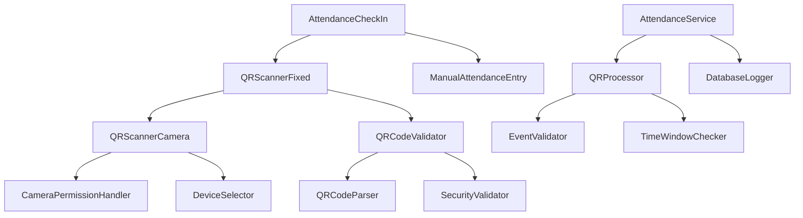
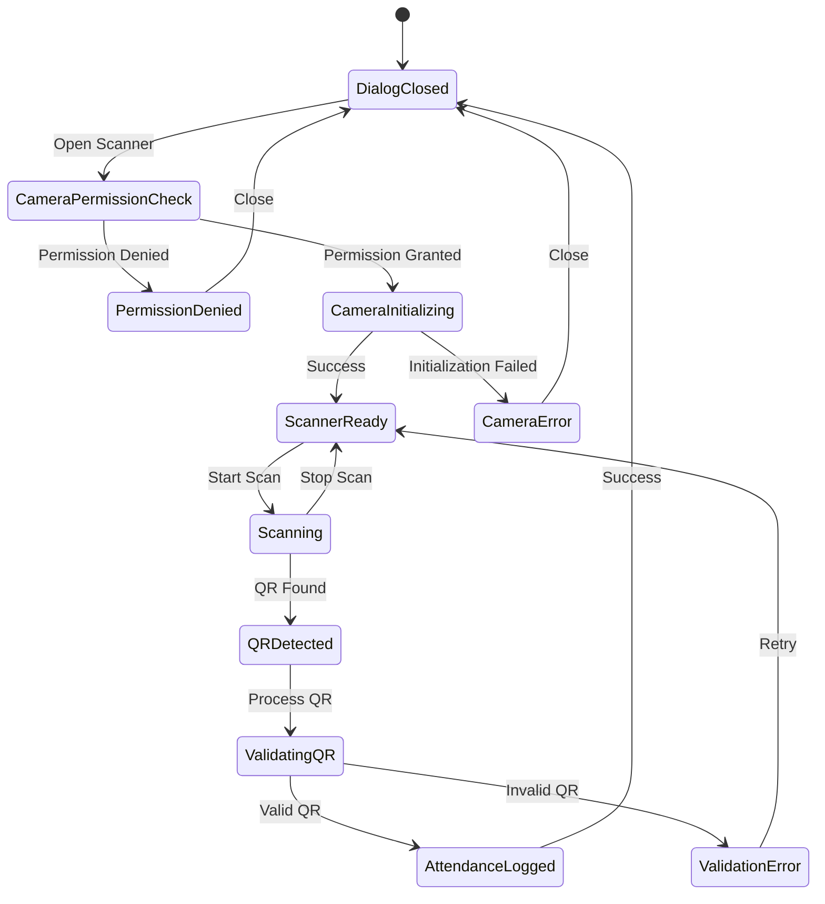
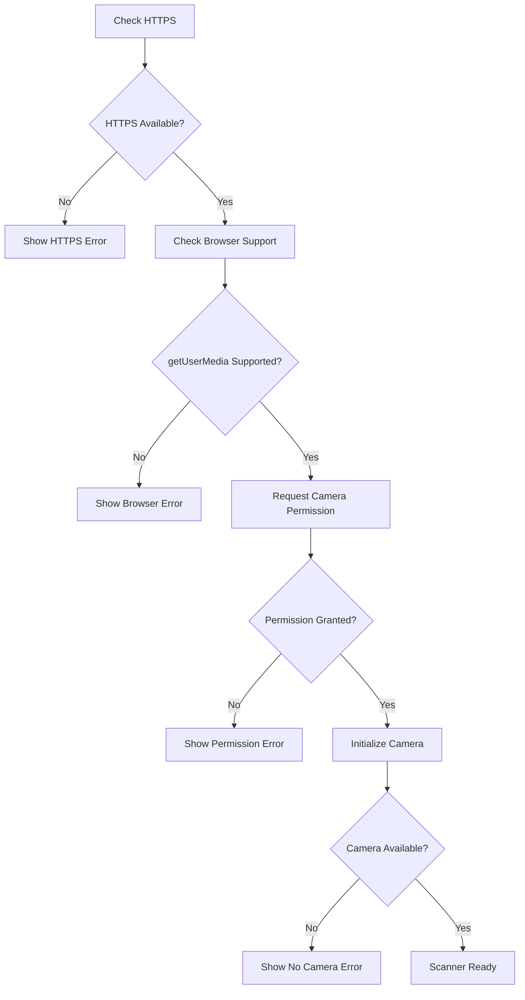
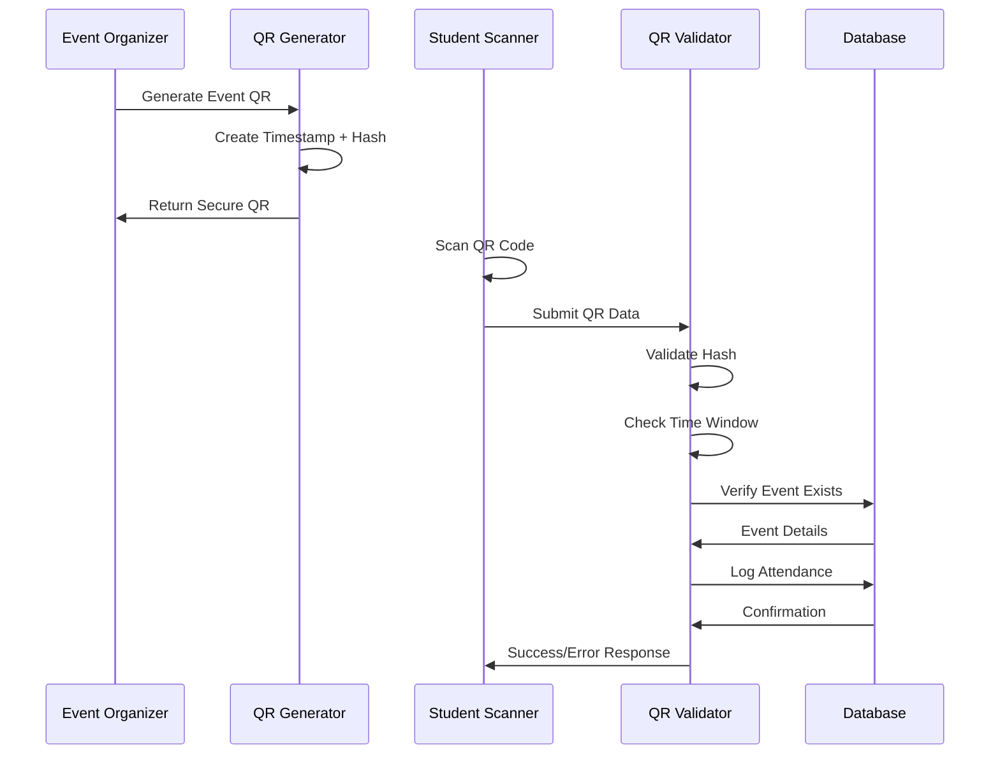
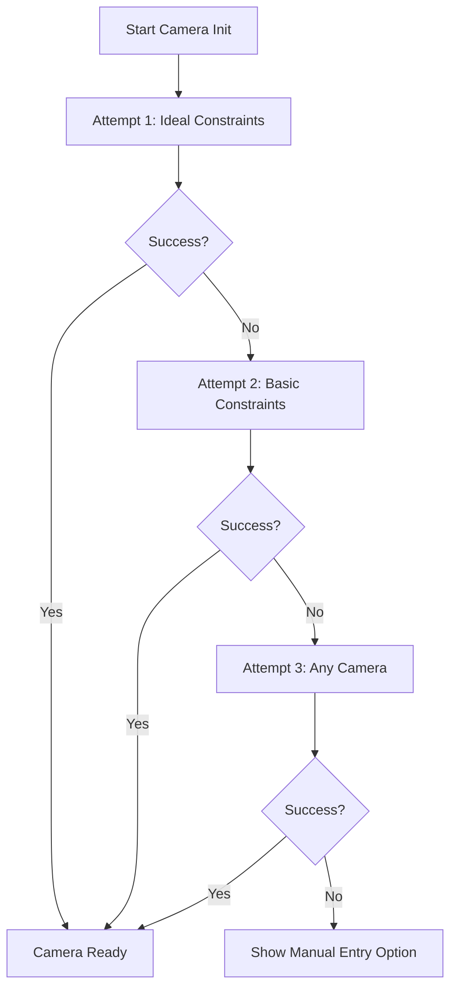

# QR Scanner Error Fix and Event Check-in System

## Overview

This design addresses critical issues in the campus-connect QR scanner system and implements a robust end-to-end event check-in workflow. The current implementation faces two primary issues:

1. **React defaultProps Warning**: The `react-qr-scanner` library uses deprecated defaultProps causing React warnings
2. **getUserMedia Error**: QR scanner fails with "At least one of audio and video must be requested" due to malformed constraints

The solution involves implementing a modern QR scanning architecture using the more reliable `@yudiel/react-qr-scanner` library and creating a comprehensive event check-in system.

## Architecture

### Component Hierarchy



### State Management Flow



## QR Scanner Fix Implementation

### Core Issues Resolution

#### Issue 1: React defaultProps Warning

The `react-qr-scanner` library uses deprecated defaultProps. Solution:
- Migrate to `@yudiel/react-qr-scanner` which is actively maintained
- Implement proper TypeScript props with default values
- Remove dependency on deprecated react-qr-scanner

#### Issue 2: getUserMedia Constraints Error

Current constraint format is invalid. Fix:
- Ensure video constraints are properly structured
- Add proper error handling for camera access
- Implement fallback mechanisms for different browsers

### Enhanced QR Scanner Component

```typescript
interface QRScannerFixedProps {
  isOpen: boolean;
  onClose: () => void;
  onScanSuccess: (result: QRCodeValidationResult) => void;
  title?: string;
  description?: string;
  preferredCamera?: 'environment' | 'user';
}

interface CameraConstraints {
  video: {
    facingMode: { ideal: string };
    width: { ideal: number };
    height: { ideal: number };
    deviceId?: { exact: string };
  };
}
```

### Camera Permission Handler



## Event Check-in System Design

### Check-in Methods

| Method | User Type | Description | Security Level |
|--------|-----------|-------------|----------------|
| QR Self-Scan | Student | Student scans event QR | High (Encrypted QR) |
| Staff-Assisted | Admin | Staff scans for student | High (Admin verification) |
| Manual Entry | Admin | Manual attendance log | Medium (Admin only) |

### QR Code Security Model



### Data Models

#### QR Code Structure
```typescript
interface SecureQRCodeData {
  eventId: string;
  timestamp: string;
  hash: string; // SHA256(eventId + timestamp + secret)
  metadata: {
    eventTitle: string;
    clubName: string;
    location: string;
    validFrom: string;
    validUntil: string;
  };
}
```

#### Attendance Log
```typescript
interface AttendanceRecord {
  id: string;
  eventId: string;
  profileId: string;
  method: 'self-scan' | 'staff-scan' | 'manual';
  timestamp: string;
  scannedBy?: string; // For staff-assisted scans
  ipAddress?: string;
  userAgent?: string;
}
```

## Implementation Strategy

### Phase 1: QR Scanner Fix (Immediate)

1. **Replace QR Scanner Library**
   - Remove `react-qr-scanner` dependency
   - Implement `@yudiel/react-qr-scanner` with proper constraints
   - Add comprehensive error handling

2. **Camera Permission Management**
   - Implement HTTPS check
   - Add browser compatibility detection
   - Create permission request flow with user guidance

3. **Error Recovery System**
   - Multiple camera initialization attempts
   - Graceful degradation for older browsers
   - Clear error messages with actionable steps

### Phase 2: Enhanced Check-in System

1. **Multi-Modal Check-in**
   - QR scanning interface
   - Manual search and selection
   - Bulk import capabilities

2. **Real-time Validation**
   - Instant QR code verification
   - Duplicate check prevention
   - Time window enforcement

3. **Attendance Analytics**
   - Real-time attendance tracking
   - Export capabilities
   - Attendance reports

### Phase 3: Progressive Enhancement

1. **Offline Support**
   - Cache recent attendees
   - Sync when online
   - Offline QR validation

2. **Advanced Security**
   - Device fingerprinting
   - Location verification
   - Fraud detection

## Testing Strategy

### Unit Tests

| Component | Test Cases |
|-----------|------------|
| QRScanner | Camera initialization, Permission handling, QR detection |
| QRValidator | Hash validation, Time window checks, Event verification |
| AttendanceService | Duplicate prevention, Role validation, Database operations |

### Integration Tests

1. **End-to-End Check-in Flow**
   - Generate QR → Scan → Validate → Log → Confirm
   - Error scenarios and recovery
   - Multiple user roles and permissions

2. **Camera Permission Scenarios**
   - HTTPS/HTTP environments
   - Different browsers and devices
   - Permission denied/granted flows

3. **Security Validation**
   - Invalid QR codes
   - Expired QR codes
   - Replay attacks

### User Acceptance Testing

| Scenario | Expected Outcome |
|----------|------------------|
| Student scans valid QR | Successful check-in logged |
| Admin manually logs attendance | Attendance recorded with admin reference |
| Duplicate scan attempt | Clear error message, no duplicate log |
| Expired QR code | Time window error, guidance provided |
| Camera permission denied | Clear instructions for enabling camera |

## Error Handling Matrix

| Error Type | User Message | Technical Action | Recovery Path |
|------------|--------------|------------------|---------------|
| Camera Permission Denied | "Camera access required. Please allow camera permissions in your browser." | Show permission guide | Manual entry option |
| No Camera Found | "No camera detected. Please connect a camera or use manual entry." | Detect available devices | Manual entry fallback |
| Invalid QR Code | "This QR code is not valid for this event." | Log validation failure | Retry scan option |
| Network Error | "Connection issue. Please check your internet and try again." | Retry with backoff | Offline mode if available |
| Duplicate Attendance | "You have already checked in to this event." | Prevent duplicate log | Show existing record |

## Performance Optimization

### Camera Initialization
- Lazy load camera components
- Cache device permissions
- Optimize video constraints for performance

### QR Processing
- Debounce QR detection to prevent multiple scans
- Optimize QR validation algorithms
- Cache validation results

### Network Efficiency
- Batch attendance logs when possible
- Implement request deduplication
- Use optimistic UI updates

## Security Considerations

### QR Code Security
- Time-limited QR codes (1-2 hour validity window)
- Cryptographic hash verification
- Prevent replay attacks with timestamp validation

### Data Protection
- Minimal data collection
- Secure transmission (HTTPS only)
- Audit trails for administrative actions

### Access Control
- Role-based check-in permissions
- Event-specific access validation
- Admin action logging

## Technical Implementation Details

### Fixed QR Scanner Component Structure

```
QRScannerFixed/
├── index.tsx (Main component)
├── CameraHandler.tsx (Camera initialization)
├── PermissionManager.tsx (Permission handling)
├── DeviceSelector.tsx (Camera selection)
└── ErrorBoundary.tsx (Error recovery)
```

### Key Implementation Changes

#### Camera Constraints Fix
```typescript
// BEFORE (Broken)
constraints: {
  facingMode: 'environment'
}

// AFTER (Fixed)
constraints: {
  video: {
    facingMode: { ideal: 'environment' },
    width: { ideal: 1280 },
    height: { ideal: 720 }
  }
}
```

#### Library Migration
```typescript
// BEFORE: react-qr-scanner (deprecated defaultProps)
import QrReader from 'react-qr-scanner';

// AFTER: @yudiel/react-qr-scanner (modern)
import { Scanner } from '@yudiel/react-qr-scanner';
```

### Database Schema Updates

#### Attendance Logs Enhancement
```sql
ALTER TABLE attendance_logs ADD COLUMN scan_metadata JSONB;
ALTER TABLE attendance_logs ADD COLUMN device_info TEXT;
ALTER TABLE attendance_logs ADD COLUMN location_data JSONB;
CREATE INDEX idx_attendance_event_profile ON attendance_logs(event_id, profile_id);
```

#### QR Code Validation Log
```sql
CREATE TABLE qr_validation_logs (
  id UUID PRIMARY KEY DEFAULT gen_random_uuid(),
  qr_data_hash TEXT NOT NULL,
  validation_result BOOLEAN NOT NULL,
  error_message TEXT,
  scanner_id UUID REFERENCES auth.users(id),
  timestamp TIMESTAMPTZ DEFAULT NOW(),
  ip_address INET,
  user_agent TEXT
);
```

### API Integration Points

#### QR Validation Endpoint
```typescript
interface QRValidationRequest {
  qrData: string;
  eventId: string;
  scannerId: string;
  deviceInfo?: DeviceMetadata;
}

interface QRValidationResponse {
  isValid: boolean;
  attendanceLogged?: boolean;
  error?: string;
  eventDetails?: EventMetadata;
}
```

#### Attendance Logging Service
```typescript
class AttendanceService {
  async processQRScan(request: QRValidationRequest): Promise<QRValidationResponse>
  async logManualAttendance(eventId: string, profileId: string, adminId: string): Promise<boolean>
  async getAttendanceStats(eventId: string): Promise<AttendanceStats>
  async validateDuplicateAttendance(eventId: string, profileId: string): Promise<boolean>
}
```

### Error Recovery Mechanisms

#### Camera Initialization Retry Logic


#### Fallback Chain for QR Detection
1. **Primary**: @yudiel/react-qr-scanner
2. **Secondary**: html5-qrcode (if primary fails)
3. **Tertiary**: Manual QR code entry
4. **Final**: Manual attendance logging

### Performance Monitoring

#### Metrics to Track
- Camera initialization success rate
- QR detection accuracy
- Scan-to-attendance time
- Error frequency by browser/device
- Network request latency

#### Error Logging Structure
```typescript
interface ErrorLog {
  errorType: 'camera' | 'qr_validation' | 'network' | 'permission';
  errorMessage: string;
  userAgent: string;
  deviceType: 'mobile' | 'desktop' | 'tablet';
  timestamp: string;
  userId?: string;
  eventId?: string;
  stackTrace?: string;
}
```

### Accessibility Enhancements

#### Screen Reader Support
- ARIA labels for camera states
- Keyboard navigation for manual entry
- High contrast mode detection
- Voice feedback for scan results

#### Mobile Optimization
- Touch-friendly interface
- Responsive camera viewport
- Haptic feedback on successful scan
- Orientation change handling

### Progressive Web App Integration

#### Offline Capabilities
```typescript
interface OfflineAttendanceCache {
  pendingAttendance: AttendanceRecord[];
  lastSyncTimestamp: string;
  eventMetadata: Map<string, EventDetails>;
}
```

#### Service Worker Updates
```typescript
// Cache QR validation logic for offline use
self.addEventListener('fetch', (event) => {
  if (event.request.url.includes('/api/validate-qr')) {
    event.respondWith(handleOfflineQRValidation(event.request));
  }
});
```