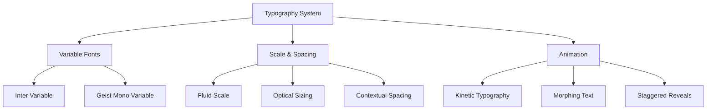
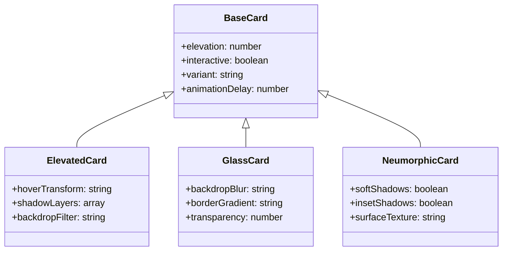
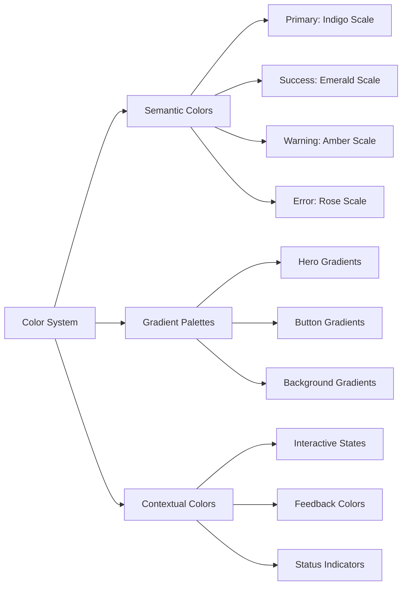
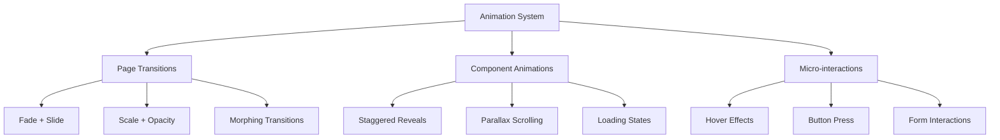
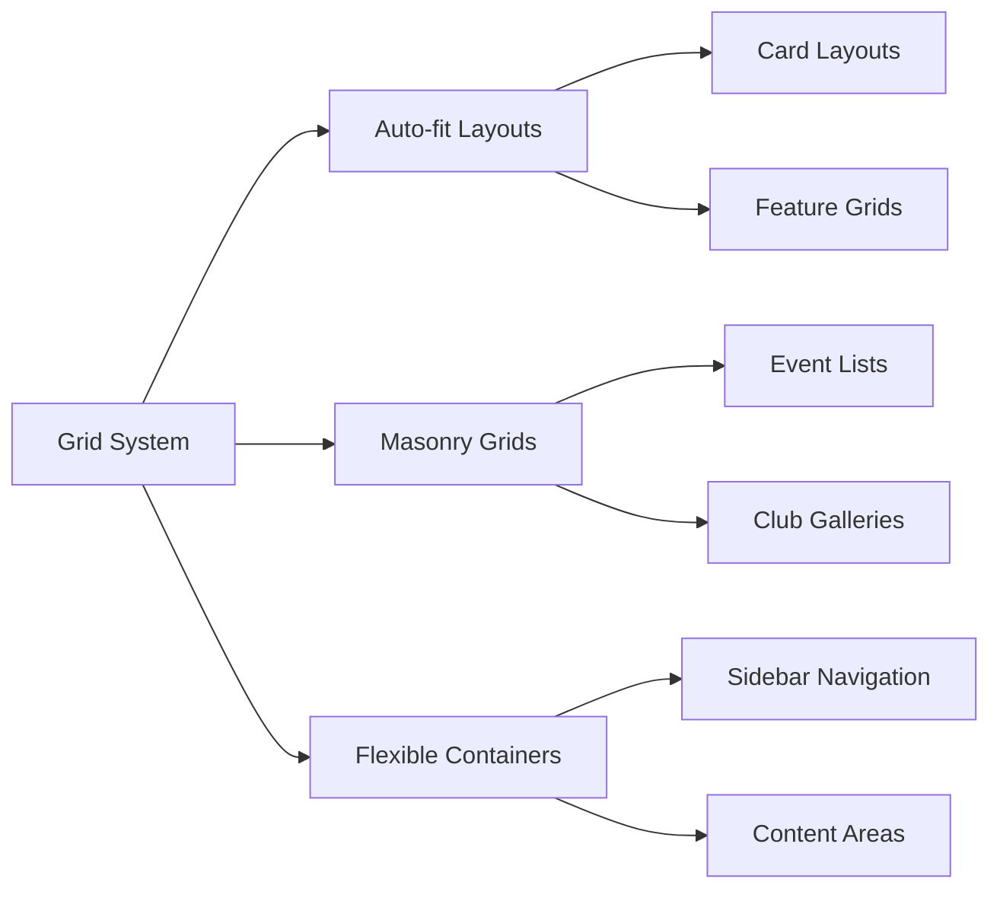

# Campus Connect UI Redesign: Modern, Elegant & Beautiful

## Overview

This design document outlines a comprehensive UI redesign for the Campus Connect application, transforming it into a modern, elegant, and visually stunning platform. The redesign focuses on contemporary typography, subtle animations, and enhanced user experience while maintaining the existing React + Tailwind CSS architecture.

## Technology Stack & Dependencies

### Current Foundation
- **Framework**: React 18.3.1 with TypeScript
- **Styling**: Tailwind CSS 3.4.17 + ShadCN UI components
- **Animation**: tailwindcss-animate plugin
- **Typography**: Inter (body) + Plus Jakarta Sans (headings)

### Enhanced Dependencies
- **Variable Fonts**: Inter Variable, Geist Variable for improved flexibility
- **Animation Libraries**: Framer Motion for advanced animations
- **Icons**: Lucide React with additional animated variants
- **Typography Tools**: CSS Container Queries for responsive typography

## Modern Typography System

### Typography Hierarchy Redesign

### Enhanced Font Configuration

**Primary Typography Stack:**
- **Display/Headers**: Geist Variable (weights: 300-900, axes: weight, width)
- **Body Text**: Inter Variable (weights: 300-700, axes: weight, slant)
- **Code/Monospace**: Geist Mono Variable for technical content

**Typography Features:**
- Fluid scaling using `clamp()` functions
- Optical sizing for improved readability
- Variable font axes for dynamic weight adjustments
- Enhanced letter-spacing for different contexts

### Typography Scale

| Element | Mobile | Tablet | Desktop | Properties |
|---------|--------|--------|---------|------------|
| H1 Display | 2.5rem | 3.5rem | 4.5rem | font-weight: 300-400, letter-spacing: -0.04em |
| H2 Title | 2rem | 2.75rem | 3.25rem | font-weight: 400-500, letter-spacing: -0.03em |
| H3 Heading | 1.5rem | 1.875rem | 2.25rem | font-weight: 500-600, letter-spacing: -0.02em |
| Body Large | 1.125rem | 1.25rem | 1.375rem | font-weight: 400, line-height: 1.6 |
| Body Regular | 1rem | 1rem | 1.125rem | font-weight: 400, line-height: 1.5 |
| Caption | 0.875rem | 0.875rem | 0.875rem | font-weight: 500, letter-spacing: 0.02em |

## Component Architecture Redesign

### Elevated Card System

### Enhanced Button Variants

**New Button Styles:**
- **Magnetic**: Subtle magnetic hover effect with transform
- **Glassmorphic**: Semi-transparent with backdrop blur
- **Neumorphic**: Soft shadows with pressed states
- **Gradient**: Dynamic gradient backgrounds with hover shifts
- **Floating**: Elevated appearance with dynamic shadows

### Modern Form Components

**Enhanced Input Fields:**
- Floating labels with smooth transitions
- Focus states with color-changing borders
- Micro-interactions for validation feedback
- Progressive disclosure for complex forms

## Visual Design Language

### Color System Enhancement

### Enhanced Color Variables

**Primary Brand Colors:**
- `--primary-50` to `--primary-950`: Extended indigo scale
- `--gradient-primary`: Dynamic brand gradient
- `--surface-glass`: Semi-transparent surface color
- `--shadow-colored`: Colored shadow variants

**Interactive States:**
- Hover: 10% opacity overlay
- Focus: Ring with brand color + offset
- Active: Slight scale transformation + darker shade
- Disabled: 40% opacity + grayscale filter

### Spatial System

**Enhanced Spacing Scale:**
- Base unit: 0.25rem (4px)
- Fluid spacing using container queries
- Contextual spacing for different UI densities
- Responsive gap systems for layouts

## Animation & Micro-interactions

### Animation Framework

### Key Animation Patterns

**Page Transitions:**
- Enter: `opacity: 0 → 1` + `translateY: 20px → 0` (300ms ease-out)
- Exit: `opacity: 1 → 0` + `scale: 1 → 0.98` (200ms ease-in)

**Component Reveals:**
- Staggered animation for lists (50ms delay between items)
- Intersection Observer for scroll-triggered animations
- Reduced motion respect for accessibility

**Interactive Feedback:**
- Button press: Scale down to 0.98 (100ms)
- Card hover: Lift effect with shadow increase
- Form focus: Border width increase + color transition

### Advanced Animation Features

**Kinetic Typography:**
- Letter-by-letter reveals for headings
- Word morphing for dynamic content
- Reading progress indicators

**Scroll Animations:**
- Parallax backgrounds for hero sections
- Progressive reveal of sections
- Sticky navigation with blur effect

## Layout & Navigation Enhancements

### Responsive Grid System

### Enhanced Navigation

**Primary Navigation:**
- Glass morphism sidebar with backdrop blur
- Animated navigation icons with state changes
- Breadcrumb system with hover previews
- Mobile: Bottom tab bar with haptic feedback

**Secondary Navigation:**
- Floating action buttons for quick actions
- Context menus with smooth animations
- Progressive disclosure for complex menus

### Dashboard Layout Improvements

**Enhanced Dashboard Structure:**
- Modular widget system with drag-and-drop
- Adaptive layouts based on content density
- Smart spacing that responds to screen size
- Contextual toolbars that appear on interaction

## Feature-Specific Design Patterns

### Event Management Interface

**Event Cards:**
- Glass morphism with event-specific gradients
- Animated countdown timers
- Interactive attendance visualizations
- Smooth state transitions for different event phases

**Event Creation Flow:**
- Multi-step form with progress indication
- Real-time preview of event appearance
- Smart field suggestions with autocomplete
- Drag-and-drop file uploads with preview

### Club Management Design

**Club Directory:**
- Masonry layout for club cards
- Filter system with animated transitions
- Search with live results and highlighting
- Social proof indicators with smooth updates

**Membership Interface:**
- Visual member hierarchy with org charts
- Role assignment with drag-and-drop
- Activity feeds with real-time updates
- Communication tools with typing indicators

### Admin Panel Modernization

**Data Visualization:**
- Interactive charts with hover details
- Real-time analytics with smooth updates
- Customizable dashboard widgets
- Export functions with progress feedback

**System Management:**
- Clean settings interface with grouped options
- Bulk actions with selection animations
- Confirmation dialogs with clear visual hierarchy
- Activity logs with timeline visualization

## Accessibility & Performance

### Accessibility Enhancements

**Motion & Animation:**
- Respect `prefers-reduced-motion` setting
- Provide static alternatives for animations
- Ensure keyboard navigation works with animations
- Maintain focus indicators during transitions

**Visual Accessibility:**
- High contrast mode support
- Scalable typography that works at 200% zoom
- Clear focus indicators with high contrast
- Alternative text for decorative animations

### Performance Optimizations

**Animation Performance:**
- Hardware acceleration for transforms
- Debounced scroll event listeners
- Intersection Observer for efficiency
- CSS containment for isolated animations

**Loading Strategies:**
- Progressive enhancement approach
- Skeleton screens with branded styling
- Optimistic UI updates
- Smart preloading of interactive elements

## Implementation Strategy

### Phase 1: Foundation (Typography & Colors)
1. Implement variable font loading
2. Update color system with new variables
3. Create base typography components
4. Establish animation foundations

### Phase 2: Core Components
1. Redesign button variants
2. Enhance form components
3. Create new card systems
4. Implement basic animations

### Phase 3: Advanced Features
1. Add complex animations
2. Implement kinetic typography
3. Create custom scroll effects
4. Enhance micro-interactions

### Phase 4: Feature Integration
1. Apply design system to feature components
2. Create specialized animations for each feature
3. Optimize performance
4. Conduct accessibility testing

## Testing Strategy

### Visual Testing
- Chromatic for component visual regression
- Cross-browser testing for animation support
- Device testing for responsive behavior
- Performance testing for animation impact

### User Experience Testing
- A/B testing for animation preferences
- Usability testing for micro-interactions
- Accessibility testing with screen readers
- Performance impact analysis

### Implementation Guidelines

**Component Development:**
- Use CSS-in-JS for complex animations
- Implement proper loading states
- Ensure graceful degradation
- Follow progressive enhancement principles

**Animation Best Practices:**
- 60fps target for all animations
- Meaningful motion that guides user attention
- Consistent easing curves across the application
- Respectful of user preferences and device capabilities