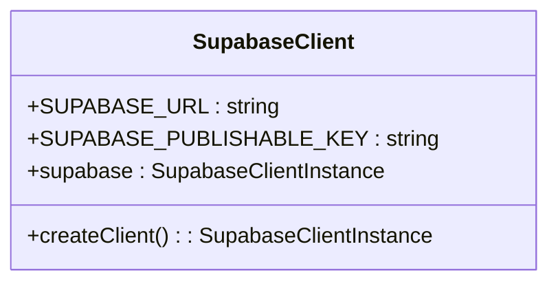
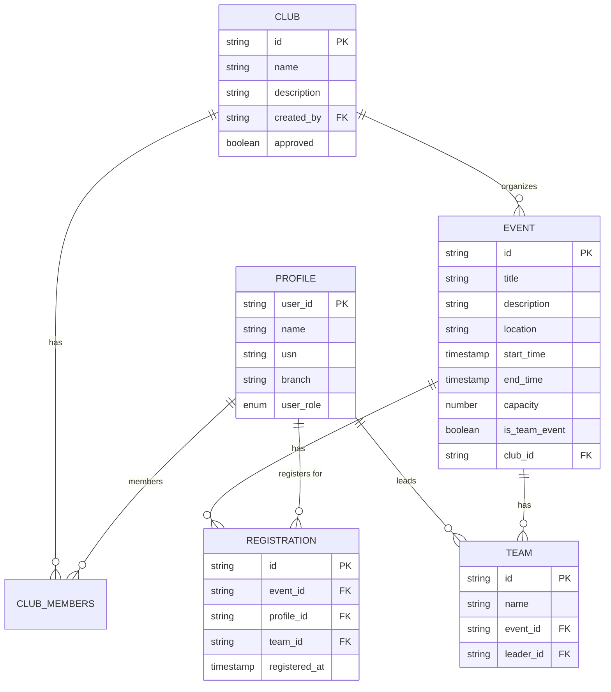
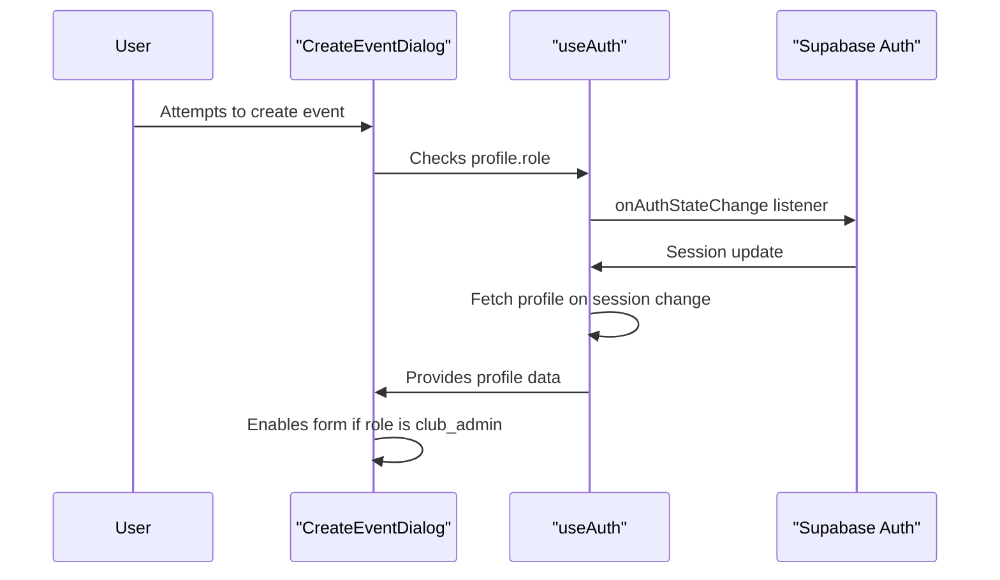
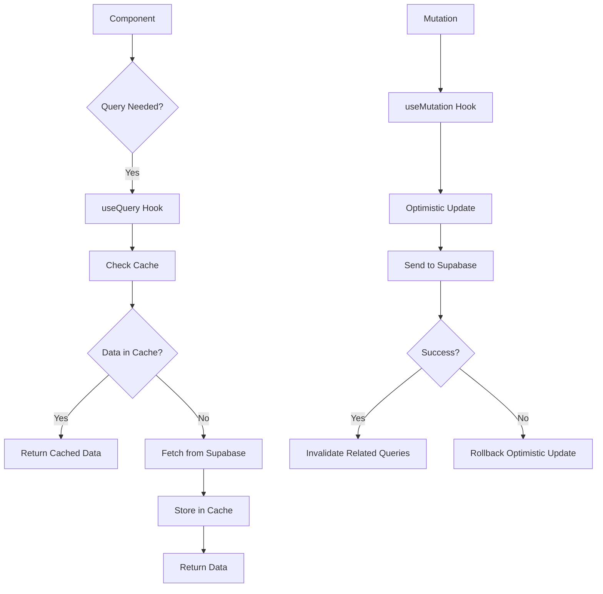

# API Integration Layer

<cite>
**Referenced Files in This Document**   
- [client.ts](file://src/integrations/supabase/client.ts)
- [types.ts](file://src/integrations/supabase/types.ts)
- [useAuth.tsx](file://src/hooks/useAuth.tsx)
- [CreateEventDialog.tsx](file://src/components/Events/CreateEventDialog.tsx)
- [Admin.tsx](file://src/pages/Admin.tsx)
- [Clubs.tsx](file://src/pages/Clubs.tsx)
- [20250908005627_511ef022-3222-4458-b7de-e0063ed13e63.sql](file://supabase/migrations/20250908005627_511ef022-3222-4458-b7de-e0063ed13e63.sql)
- [20250909010718_5336955c-8e01-4c24-9b07-3f5a1082d666.sql](file://supabase/migrations/20250909010718_5336955c-8e01-4c24-9b07-3f5a1082d666.sql)
</cite>

## Table of Contents
1. [Supabase Client Configuration](#supabase-client-configuration)
2. [Type Definitions and Database Schema](#type-definitions-and-database-schema)
3. [Authentication and Session Management](#authentication-and-session-management)
4. [Data Access Patterns](#data-access-patterns)
5. [Real-time Subscriptions and React Query Integration](#real-time-subscriptions-and-react-query-integration)
6. [Row Level Security Policies](#row-level-security-policies)
7. [Error Handling and Debugging](#error-handling-and-debugging)
8. [Rate Limiting and Performance Considerations](#rate-limiting-and-performance-considerations)

## Supabase Client Configuration

The Supabase integration layer is configured through the `client.ts` file, which establishes a singleton instance of the Supabase client with type safety and persistent session management. The configuration includes the Supabase URL and publishable key, which are used to initialize the client for secure communication with the backend.

The client is instantiated using the `createClient` function from `@supabase/supabase-js`, with the `Database` type imported from `types.ts` to ensure type-safe database operations. The configuration includes authentication settings that enable session persistence via `localStorage`, automatic session refresh, and token management.



**Diagram sources**
- [client.ts](file://src/integrations/supabase/client.ts#L1-L16)

**Section sources**
- [client.ts](file://src/integrations/supabase/client.ts#L1-L16)

## Type Definitions and Database Schema

The `types.ts` file defines TypeScript interfaces that map directly to the database schema, providing type safety for all database operations. These interfaces represent core entities in the application: Profile, Event, Club, Registration, and Team. Each interface includes `Row`, `Insert`, and `Update` types that define the structure of data for reading, creating, and modifying records.

The database schema includes relationships between tables, such as a Club having multiple Events, a Profile belonging to multiple Clubs via `club_members`, and an Event having multiple Registrations. Enum types are defined for fields like `user_role`, `club_member_role`, and `attendance_method`, ensuring data consistency across the application.



**Diagram sources**
- [types.ts](file://src/integrations/supabase/types.ts#L0-L513)

**Section sources**
- [types.ts](file://src/integrations/supabase/types.ts#L0-L513)

## Authentication and Session Management

Authentication is handled through Supabase Auth, with the `useAuth` hook providing a context-based interface for managing user sessions. The hook exposes methods for signing in, signing up, and signing out, along with state variables for the current user, session, and profile.

The authentication flow integrates with the database by automatically creating a `profiles` record when a new user signs up, using the `auth.signUp` method with custom user data. Session state is synchronized with the component tree through a Supabase auth state listener, which updates the context whenever the authentication state changes.



**Diagram sources**
- [useAuth.tsx](file://src/hooks/useAuth.tsx#L0-L197)
- [CreateEventDialog.tsx](file://src/components/Events/CreateEventDialog.tsx#L0-L262)

**Section sources**
- [useAuth.tsx](file://src/hooks/useAuth.tsx#L0-L197)

## Data Access Patterns

Data access follows a pattern of using the singleton `supabase` client instance to perform CRUD operations on database tables. The client is imported from `@/integrations/supabase/client` and used directly in components and hooks to query and mutate data.

CRUD operations are performed using the Supabase client's `from()` and `select()`, `insert()`, `update()`, and `delete()` methods. For example, creating a new event involves inserting a record into the `events` table with the appropriate fields, including `club_id`, `title`, `description`, and time information.

Relationships between tables are handled through foreign key constraints and JOIN queries. For example, fetching a club's members involves querying the `club_members` table with a relationship to the `profiles` table to get user details.

**Section sources**
- [CreateEventDialog.tsx](file://src/components/Events/CreateEventDialog.tsx#L0-L262)
- [Clubs.tsx](file://src/pages/Clubs.tsx#L0-L32)
- [Admin.tsx](file://src/pages/Admin.tsx#L77-L120)

## Real-time Subscriptions and React Query Integration

The application leverages Supabase's real-time capabilities through the `supabase` client's subscription features, enabling live updates for collaborative features like event registration and attendance tracking. Real-time subscriptions are established using the `on()` method on database channels, which listen for INSERT, UPDATE, or DELETE events.

React Query is used to manage server state, providing caching, background updates, and automatic refetching. Queries are defined using the `useQuery` hook, while mutations for data changes use the `useMutation` hook. Cache invalidation is configured to reflect data relationships, ensuring that when an event is created, related queries for events or club activities are automatically refreshed.



**Section sources**
- [tasks.md](file://tasks.md#L255-L273)
- [CreateEventDialog.tsx](file://src/components/Events/CreateEventDialog.tsx#L0-L262)

## Row Level Security Policies

Row Level Security (RLS) is implemented in the database to enforce data access controls at the database level. Policies are defined in SQL migrations and apply to all tables, ensuring that users can only access data they are authorized to see.

For example, the `profiles` table has policies that allow users to view all profiles but only update their own, while college admins can update any profile. The `clubs` table allows users to view approved clubs or their own unapproved clubs, and only club admins or the creator can manage club details.

```sql
-- Example RLS policy from migration
CREATE POLICY "Users can view approved clubs" ON public.clubs FOR SELECT USING (approved = true OR created_by = auth.uid());
```

**Diagram sources**
- [20250908005627_511ef022-3222-4458-b7de-e0063ed13e63.sql](file://supabase/migrations/20250908005627_511ef022-3222-4458-b7de-e0063ed13e63.sql#L90-L157)

**Section sources**
- [20250908005627_511ef022-3222-4458-b7de-e0063ed13e63.sql](file://supabase/migrations/20250908005627_511ef022-3222-4458-b7de-e0063ed13e63.sql#L90-L157)
- [20250909010718_5336955c-8e01-4c24-9b07-3f5a1082d666.sql](file://supabase/migrations/20250909010718_5336955c-8e01-4c24-9b07-3f5a1082d666.sql#L0-L46)

## Error Handling and Debugging

Error handling is implemented at multiple levels, with Supabase API calls wrapped in try-catch blocks and errors propagated to the user through toast notifications. The `useToast` hook is used to display user-friendly error messages for operations like sign-in, event creation, and data fetching.

Debugging strategies include logging errors to the console during development and using Supabase's dashboard to monitor API usage and query performance. Network requests can be inspected in the browser's developer tools to examine request/response payloads and authentication headers.

**Section sources**
- [useAuth.tsx](file://src/hooks/useAuth.tsx#L87-L144)
- [CreateEventDialog.tsx](file://src/components/Events/CreateEventDialog.tsx#L0-L262)

## Rate Limiting and Performance Considerations

The application relies on Supabase's built-in rate limiting for API calls, which protects against abuse and ensures fair usage. Client-side optimizations include batching related database operations and using React Query's caching to minimize redundant network requests.

Performance is further enhanced by indexing database columns used in frequent queries, such as `club_id` in the `events` table and `profile_id` in the `registrations` table. Real-time subscriptions are scoped to specific channels to reduce unnecessary data transfer.

**Section sources**
- [tasks.md](file://tasks.md#L426-L451)
- [package.json](file://package.json#L35-L77)