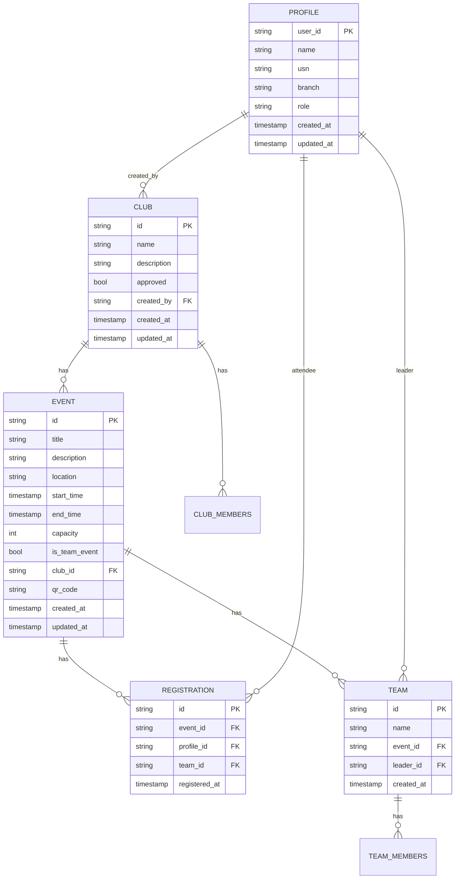

# Database Schema & TypeScript Definitions

<cite>
**Referenced Files in This Document**   
- [types.ts](file://src/integrations/supabase/types.ts)
- [useAuth.tsx](file://src/hooks/useAuth.tsx)
- [EventDetailsDialog.tsx](file://src/components/Events/EventDetailsDialog.tsx)
- [Events.tsx](file://src/pages/Events.tsx)
- [CreateEventDialog.tsx](file://src/components/Events/CreateEventDialog.tsx)
- [TeamCreationDialog.tsx](file://src/components/Events/TeamCreationDialog.tsx)
- [client.ts](file://src/integrations/supabase/client.ts)
</cite>

## Table of Contents
1. [Introduction](#introduction)
2. [Core Data Models](#core-data-models)
3. [Entity Relationships](#entity-relationships)
4. [Type Safety and Supabase Integration](#type-safety-and-supabase-integration)
5. [Data Access Patterns](#data-access-patterns)
6. [Validation and Business Logic](#validation-and-business-logic)
7. [Consumption in React Components](#consumption-in-react-components)
8. [Schema Synchronization](#schema-synchronization)
9. [Extending Types for Future Features](#extending-types-for-future-features)
10. [Conclusion](#conclusion)

## Introduction

The campus-connect application leverages Supabase as its backend database and uses strongly-typed TypeScript interfaces to ensure data consistency and type safety across the frontend. This document details the core data models defined in `types.ts`, their relationships, constraints, and usage patterns throughout the application. The schema supports key entities such as Profile, Event, Club, Registration, and Team, enabling robust student engagement features including event registration, club management, and team-based participation.

**Section sources**
- [types.ts](file://src/integrations/supabase/types.ts#L1-L513)

## Core Data Models

The primary data entities are defined within the `Database["public"]["Tables"]` interface in `types.ts`. Each table includes `Row`, `Insert`, and `Update` types to enforce correct data shapes during reads, inserts, and updates.

### Profile
Represents a user's extended information beyond Supabase Auth. Key fields:
- `user_id`: Foreign key to Supabase auth.users (Primary Key)
- `name`, `usn`, `branch`: Personal details
- `role`: Enum of `student | club_admin | college_admin`
- `created_at`, `updated_at`: Timestamps

Used for role-based access control and personalization.

### Club
Represents student organizations:
- `id`: UUID (Primary Key)
- `name`, `description`: Club details
- `approved`: Boolean indicating admin approval
- `created_by`: References `profiles.user_id`
- `created_at`, `updated_at`: Lifecycle tracking

### Event
Defines campus events:
- `id`: UUID (Primary Key)
- `title`, `description`, `location`: Event metadata
- `start_time`, `end_time`: DateTime strings
- `capacity`: Maximum attendees
- `is_team_event`: Flag for team-based registration
- `club_id`: References `clubs.id`
- `qr_code`: For attendance verification

### Registration
Tracks user sign-ups for events:
- `event_id`: References `events.id`
- `profile_id`: References `profiles.user_id`
- `team_id`: Optional, for team events
- `registered_at`: Timestamp
- Composite primary key via unique constraint on `(event_id, profile_id)`

### Team
Supports team-based event participation:
- `id`: UUID (Primary Key)
- `name`: Team name
- `event_id`: References `events.id`
- `leader_id`: References `profiles.user_id`
- `created_at`: Creation timestamp

**Section sources**
- [types.ts](file://src/integrations/supabase/types.ts#L100-L450)

## Entity Relationships

The data model enforces referential integrity through foreign key constraints, reflected in the TypeScript types.



**Diagram sources**
- [types.ts](file://src/integrations/supabase/types.ts#L100-L450)

## Type Safety and Supabase Integration

The `types.ts` file enables full type safety when querying Supabase via the generated client. The `supabase` client is instantiated with the `Database` type, ensuring all operations are checked against the schema.

```typescript
export const supabase = createClient<Database>(SUPABASE_URL, SUPABASE_PUBLISHABLE_KEY, { ... });
```

This ensures:
- Select queries return correctly typed `Row` objects
- Insert operations validate required fields and types
- Update operations only allow modifiable fields
- Enum values are restricted to defined literals (e.g., `user_role`)

For example, inserting a new event requires all mandatory fields (`title`, `location`, `start_time`, `end_time`, `capacity`, `club_id`) and rejects invalid `role` values.

**Section sources**
- [types.ts](file://src/integrations/supabase/types.ts#L1-L513)
- [client.ts](file://src/integrations/supabase/client.ts#L1-L17)

## Data Access Patterns

### Filtering Events by Club
Events are filtered using Supabase's query builder with type-safe column references:

```typescript
const { data, error } = await supabase
  .from('events')
  .select(`
    *,
    clubs ( name )
  `)
  .eq('club_id', selectedClubId);
```

The result is automatically typed as `Array<Tables<"events"> & { clubs: { name: string } }>`.

### Querying User Roles
User roles are retrieved from the `profiles` table and used for conditional rendering:

```typescript
const { data: profile } = await supabase
  .from('profiles')
  .select('role')
  .eq('user_id', userId)
  .single();
```

Role checks power UI visibility (e.g., showing admin controls only to `club_admin` or `college_admin`).

**Section sources**
- [Events.tsx](file://src/pages/Events.tsx#L15-L32)
- [useAuth.tsx](file://src/hooks/useAuth.tsx#L5-L13)

## Validation and Business Logic

### Enum Constraints
The schema defines strict enums:
- `user_role`: `"student" | "club_admin" | "college_admin"`
- `club_member_role`: `"member" | "admin"`
- `attendance_method`: `"self-scan" | "staff-scan" | "manual"`

These prevent invalid state and are used in both database and UI validation.

### Business Rules
- Only `club_admin` users can create events
- A user can register for an event only once
- Team events require team creation before registration
- Attendance can be recorded via QR scan or manual entry

These rules are enforced through a combination of database constraints and application logic in React components.

**Section sources**
- [types.ts](file://src/integrations/supabase/types.ts#L480-L500)
- [CreateEventDialog.tsx](file://src/components/Events/CreateEventDialog.tsx#L31-L83)

## Consumption in React Components

TypeScript interfaces from `types.ts` are consumed directly in React components to validate fetched data and manage state.

### EventDetailsDialog
The `EventDetailsDialog` component uses a locally defined `Event` interface that mirrors the Supabase schema, including relationships:

```typescript
interface Event {
  id: string;
  title: string;
  description: string | null;
  location: string;
  start_time: string;
  end_time: string;
  capacity: number;
  is_team_event: boolean;
  club_id: string;
  clubs: { name: string };
  registrations: Array<{ id: string; profile_id: string }>;
}
```

This ensures the component receives correctly shaped data from queries.

### Registration Status Check
Components check registration status using typed data:

```typescript
const isRegistered = event.registrations.some(reg => reg.profile_id === profile?.user_id);
```

The `registrations` field is properly typed as an array of objects with `profile_id`, enabling safe property access.

**Section sources**
- [EventDetailsDialog.tsx](file://src/components/Events/EventDetailsDialog.tsx#L10-L27)
- [Events.tsx](file://src/pages/Events.tsx#L0-L36)

## Schema Synchronization

The TypeScript types in `types.ts` are automatically generated and must stay in sync with the Supabase database schema defined in SQL migration files.

### Migration Files
Located in `supabase/migrations/`, these files define the actual database structure:
- `20250908005627_*.sql`: Initial schema setup
- `20250909010718_*.sql`: Additions or modifications
- `20250909010744_*.sql`: Further refinements

After any schema change, `types.ts` must be regenerated to reflect updates. This ensures type safety remains accurate and prevents runtime errors due to schema-type mismatches.

**Section sources**
- [types.ts](file://src/integrations/supabase/types.ts#L1-L513)

## Extending Types for Future Features

To extend the schema:
1. **Modify SQL migrations**: Add new tables/columns in `supabase/migrations/`
2. **Regenerate types**: Use Supabase CLI to update `types.ts`
3. **Update components**: Adjust React components to consume new fields
4. **Add validation**: Implement UI and backend validation as needed

Example: Adding `event_category` would involve:
- Altering the `events` table with a new `category` column
- Regenerating `types.ts` to include the field
- Updating `CreateEventDialog` and `EventDetailsDialog` to handle the new property

This workflow ensures end-to-end type safety from database to UI.

## Conclusion

The campus-connect application maintains a robust, type-safe data layer through tight integration between Supabase and TypeScript. The `types.ts` file serves as the single source of truth for database schema, enabling safe queries, preventing invalid operations, and reducing bugs. By aligning database migrations with TypeScript definitions and consuming these types directly in React components, the application ensures data integrity and developer productivity. Future extensions should follow the established pattern of schema-first development with automatic type generation to preserve these benefits.