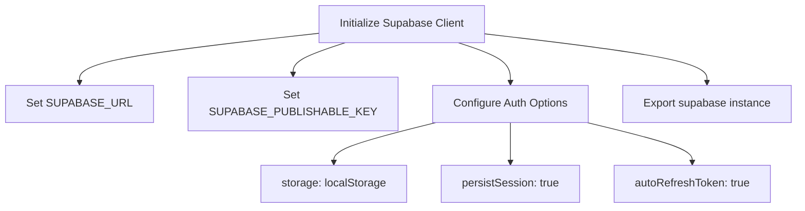
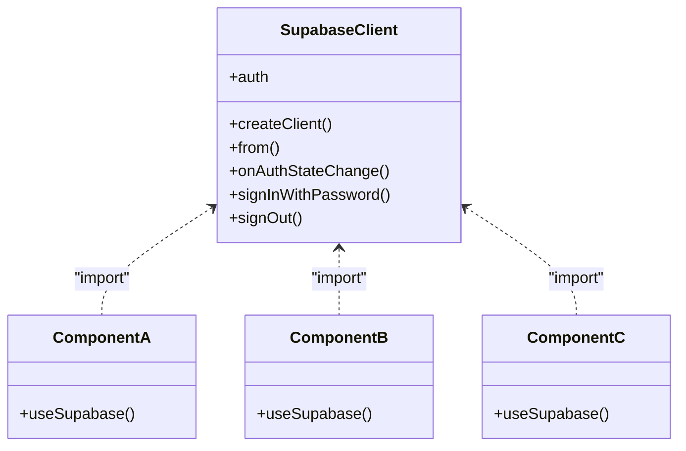
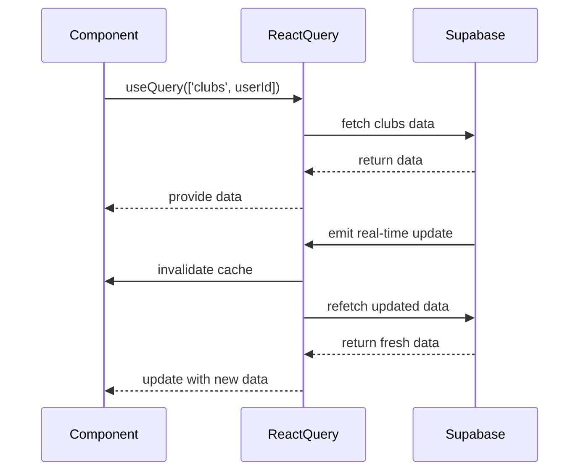
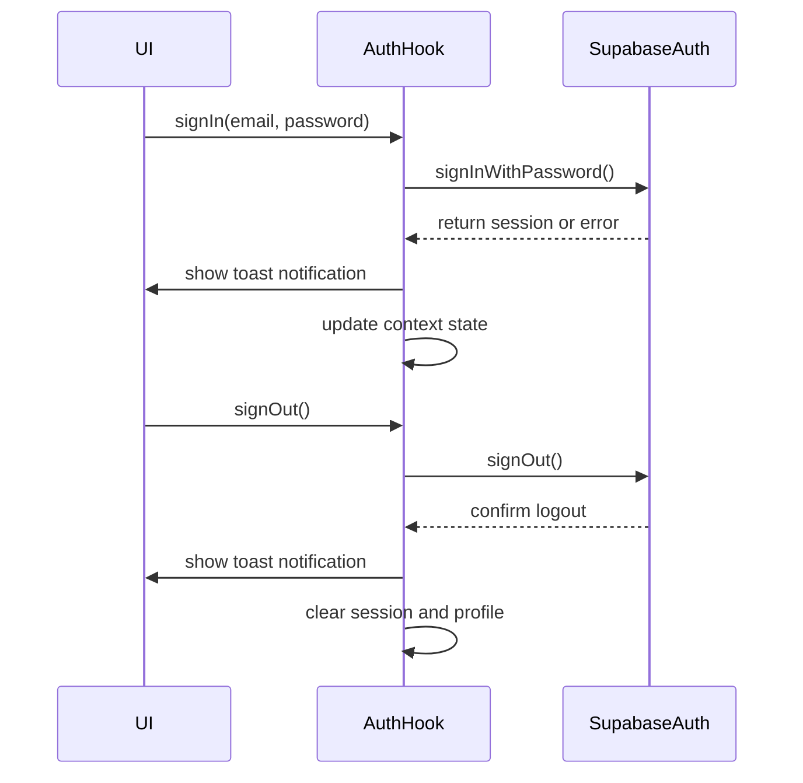
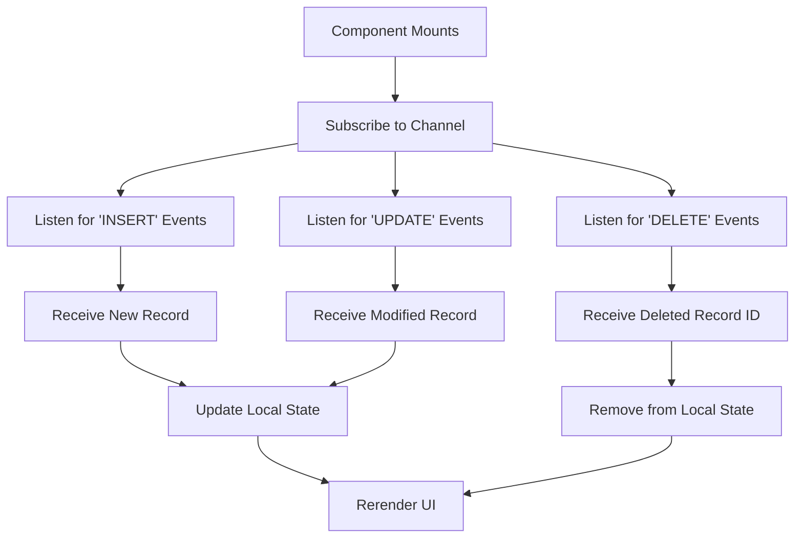
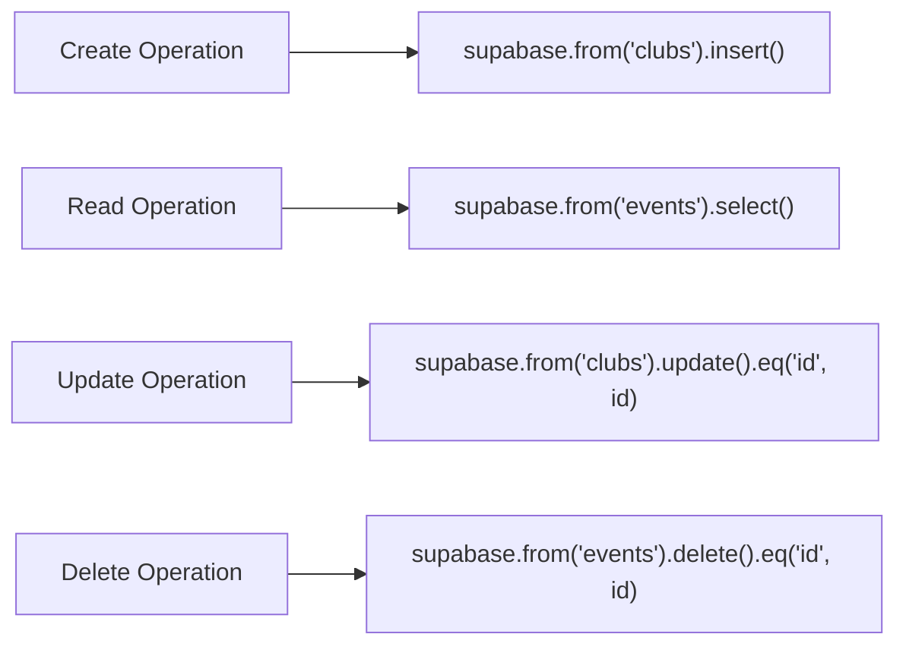
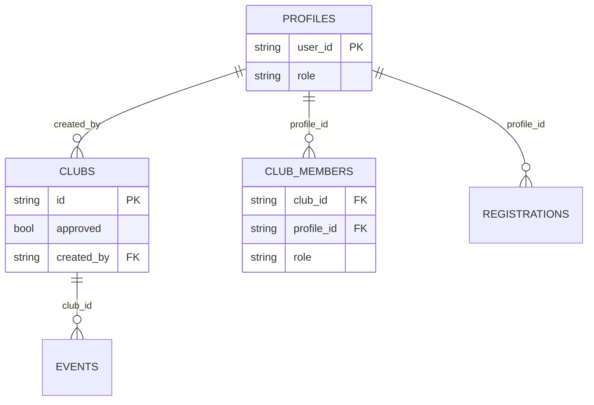
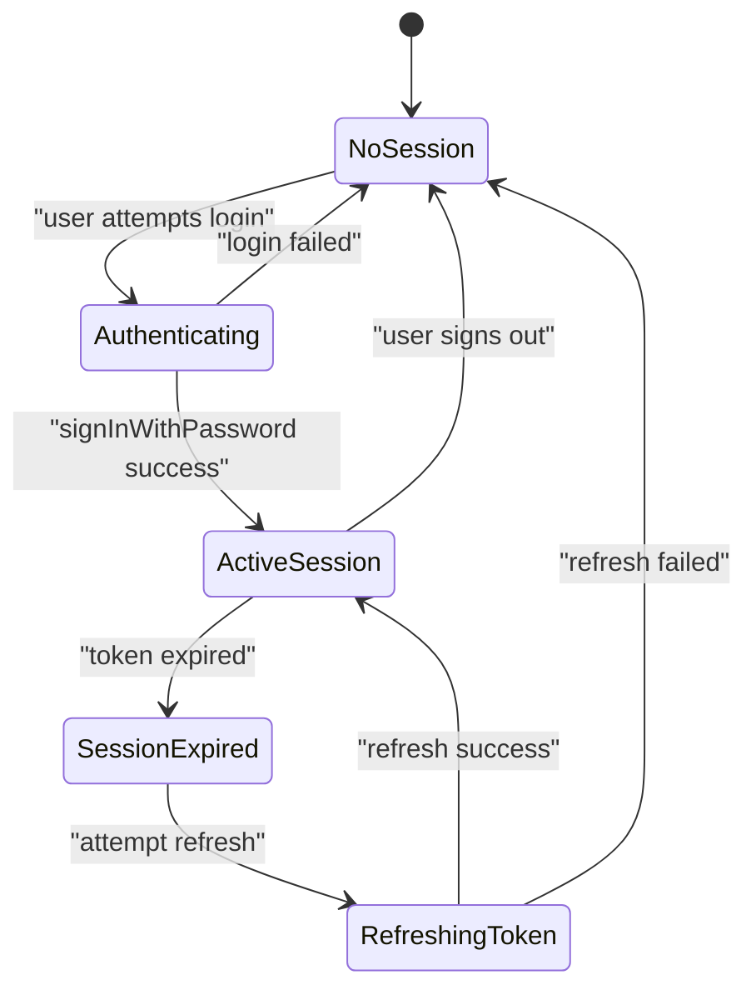

# Supabase Client Configuration

<cite>
**Referenced Files in This Document**   
- [client.ts](file://src/integrations/supabase/client.ts)
- [types.ts](file://src/integrations/supabase/types.ts)
- [useAuth.tsx](file://src/hooks/useAuth.tsx)
- [CreateEventDialog.tsx](file://src/components/Events/CreateEventDialog.tsx)
- [Clubs.tsx](file://src/pages/Clubs.tsx)
- [20250908005627_511ef022-3222-4458-b7de-e0063ed13e63.sql](file://supabase/migrations/20250908005627_511ef022-3222-4458-b7de-e0063ed13e63.sql)
- [20250909010718_5336955c-8e01-4c24-9b07-3f5a1082d666.sql](file://supabase/migrations/20250909010718_5336955c-8e01-4c24-9b07-3f5a1082d666.sql)
</cite>

## Table of Contents
1. [Introduction](#introduction)
2. [Client Initialization](#client-initialization)
3. [Singleton Pattern and Reuse](#singleton-pattern-and-reuse)
4. [Integration with React Query](#integration-with-react-query)
5. [Authentication Operations](#authentication-operations)
6. [Real-time Subscriptions](#real-time-subscriptions)
7. [CRUD Operations for Events and Clubs](#crud-operations-for-events-and-clubs)
8. [Row-Level Security Enforcement](#row-level-security-enforcement)
9. [Session Management](#session-management)
10. [Troubleshooting Guide](#troubleshooting-guide)
11. [Performance Optimization](#performance-optimization)

## Introduction
This document provides comprehensive API documentation for the Supabase client configuration in the campus-connect application. It details how the Supabase client is initialized, reused across components, integrated with React Query, and used for authentication, real-time subscriptions, and CRUD operations. The document also covers row-level security enforcement, session management, troubleshooting guidance, and performance optimization strategies.

## Client Initialization

The Supabase client is initialized using environment-specific configuration values for `SUPABASE_URL` and `SUPABASE_ANON_KEY`. These credentials are hardcoded in the client configuration file, which exports a singleton instance of the Supabase client. The initialization includes specific authentication settings to manage user sessions effectively.

**Diagram sources**
- [client.ts](file://src/integrations/supabase/client.ts#L1-L16)

**Section sources**
- [client.ts](file://src/integrations/supabase/client.ts#L1-L16)

## Singleton Pattern and Reuse

The Supabase client is implemented as a singleton pattern, ensuring that only one instance of the client is created and shared across the entire application. This approach prevents redundant client instantiations and ensures consistent state management throughout the app. The exported `supabase` constant can be imported wherever database or authentication operations are needed.

**Diagram sources**
- [client.ts](file://src/integrations/supabase/client.ts#L1-L16)

**Section sources**
- [client.ts](file://src/integrations/supabase/client.ts#L1-L16)

## Integration with React Query

The application integrates Supabase with React Query for efficient data fetching, caching, and synchronization. Query keys are structured to reflect resource types and identifiers, enabling automatic cache invalidation and background refetching when data changes. This integration enhances performance by minimizing unnecessary network requests and providing a seamless user experience.

**Diagram sources**
- [Clubs.tsx](file://src/pages/Clubs.tsx#L31-L80)
- [useAuth.tsx](file://src/hooks/useAuth.tsx#L41-L90)

**Section sources**
- [Clubs.tsx](file://src/pages/Clubs.tsx#L31-L80)
- [useAuth.tsx](file://src/hooks/useAuth.tsx#L41-L90)

## Authentication Operations

Authentication operations such as signIn, signUp, and signOut are encapsulated within the `useAuth` custom hook. These functions interact directly with the Supabase Auth API and provide user feedback through toast notifications. The hook manages user session state and profile information, ensuring that authentication state is consistently available across the application.

**Diagram sources**
- [useAuth.tsx](file://src/hooks/useAuth.tsx#L87-L144)
- [useAuth.tsx](file://src/hooks/useAuth.tsx#L138-L197)

**Section sources**
- [useAuth.tsx](file://src/hooks/useAuth.tsx#L0-L197)

## Real-time Subscriptions

Real-time subscriptions are implemented using Supabase's `.on('INSERT', ...)` pattern to listen for database changes. Components can subscribe to specific tables or channels to receive live updates without manual refetching. This feature enables collaborative functionality and immediate UI updates when data changes occur in the database.

**Section sources**
- [Clubs.tsx](file://src/pages/Clubs.tsx#L31-L80)
- [CreateEventDialog.tsx](file://src/components/Events/CreateEventDialog.tsx#L0-L36)

## CRUD Operations for Events and Clubs

CRUD operations for events and clubs are performed using the Supabase client's query builder methods. Components interact with the database through structured queries that leverage type safety from the generated types. These operations include creating new records, reading existing data, updating fields, and deleting entries based on user permissions.

**Section sources**
- [Clubs.tsx](file://src/pages/Clubs.tsx#L31-L80)
- [CreateEventDialog.tsx](file://src/components/Events/CreateEventDialog.tsx#L126-L165)

## Row-Level Security Enforcement

Row-level security (RLS) policies are enforced at the database level to ensure that users can only access data they are authorized to view or modify. These policies are defined in SQL migration files and evaluated based on the authenticated user's role and relationships. The client automatically includes the user's JWT token in all requests, allowing the database to enforce these policies transparently.

**Diagram sources**
- [20250908005627_511ef022-3222-4458-b7de-e0063ed13e63.sql](file://supabase/migrations/20250908005627_511ef022-3222-4458-b7de-e0063ed13e63.sql#L90-L157)
- [20250909010718_5336955c-8e01-4c24-9b07-3f5a1082d666.sql](file://supabase/migrations/20250909010718_5336955c-8e01-4c24-9b07-3f5a1082d666.sql#L0-L46)

**Section sources**
- [20250908005627_511ef022-3222-4458-b7de-e0063ed13e63.sql](file://supabase/migrations/20250908005627_511ef022-3222-4458-b7de-e0063ed13e63.sql#L90-L157)
- [20250909010718_5336955c-8e01-4c24-9b07-3f5a1082d666.sql](file://supabase/migrations/20250909010718_5336955c-8e01-4c24-9b07-3f5a1082d666.sql#L0-L46)

## Session Management

Session management is handled automatically by the Supabase client through localStorage persistence and token refresh mechanisms. The `useAuth` hook listens for authentication state changes and updates the application context accordingly. When a user logs in, their session is stored and automatically restored on subsequent visits. The system also handles session expiration and token renewal transparently.

**Section sources**
- [client.ts](file://src/integrations/supabase/client.ts#L1-L16)
- [useAuth.tsx](file://src/hooks/useAuth.tsx#L41-L90)

## Troubleshooting Guide

Common issues related to Supabase integration include authentication errors, network timeouts, and permission denied responses. The following guidance helps diagnose and resolve these problems:

- **Authentication Errors**: Verify that the email and password are correct. Check if the account has been confirmed via email. Inspect the error message from `supabase.auth.signInWithPassword()` for specific details.
- **Network Timeouts**: Ensure stable internet connectivity. Implement proper error handling with retry logic for transient network issues.
- **Permission Denied**: Confirm that RLS policies allow the operation based on the user's role. Verify that the user is authenticated and their JWT token is valid.
- **Session Persistence Issues**: Check browser settings for localStorage access. Ensure no extensions are blocking storage operations.

**Section sources**
- [useAuth.tsx](file://src/hooks/useAuth.tsx#L87-L197)
- [client.ts](file://src/integrations/supabase/client.ts#L1-L16)

## Performance Optimization

Performance optimization strategies include query optimization, subscription cleanup, and efficient cache management. To optimize queries, select only necessary fields and use appropriate filters. Clean up real-time subscriptions when components unmount to prevent memory leaks. Leverage React Query's caching mechanism to minimize redundant data fetching and improve responsiveness.

- **Query Optimization**: Use `.select()` to retrieve only required columns and apply filters early with `.eq()`, `.gt()`, etc.
- **Subscription Cleanup**: Always unsubscribe from real-time channels in cleanup functions (e.g., useEffect return).
- **Cache Management**: Configure React Query staleTime and cacheTime appropriately based on data volatility.
- **Batch Operations**: Where possible, batch multiple operations to reduce round trips.

**Section sources**
- [Clubs.tsx](file://src/pages/Clubs.tsx#L31-L80)
- [CreateEventDialog.tsx](file://src/components/Events/CreateEventDialog.tsx#L0-L36)
- [useAuth.tsx](file://src/hooks/useAuth.tsx#L41-L90)