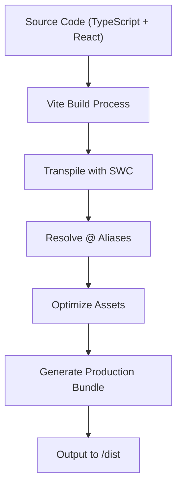
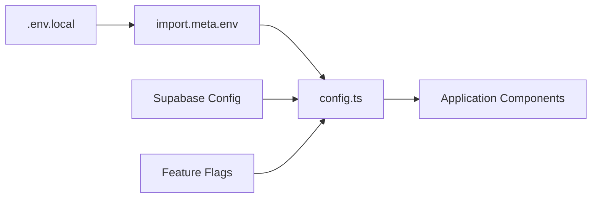
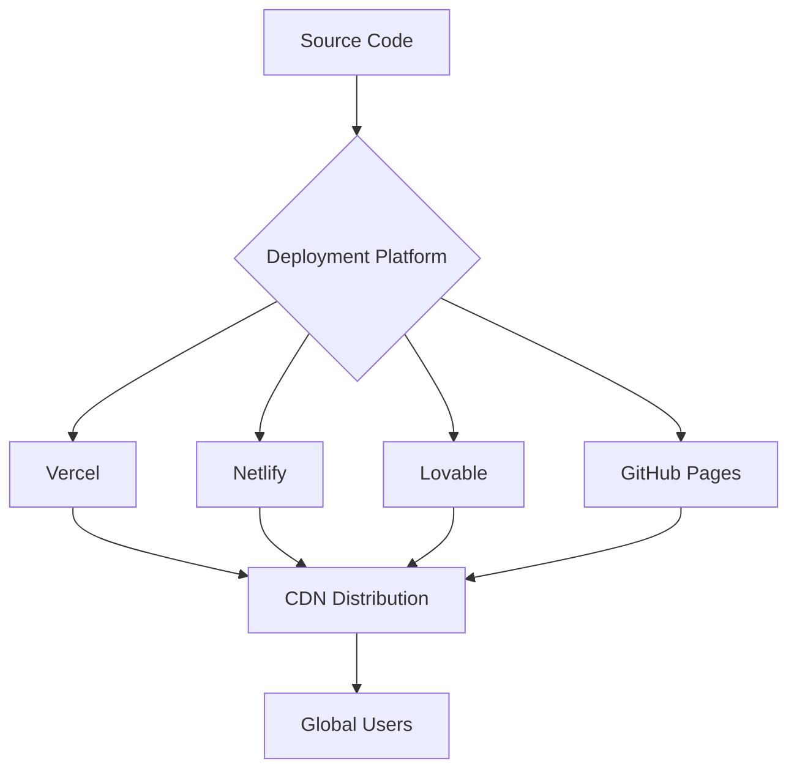
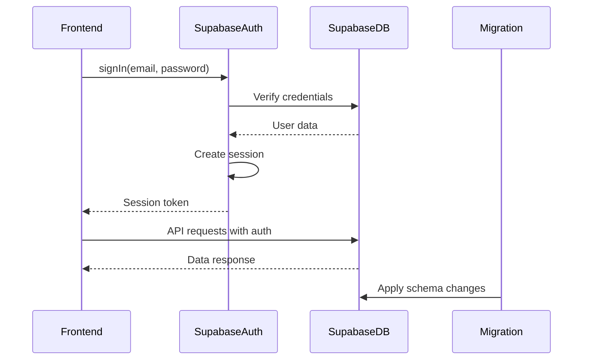
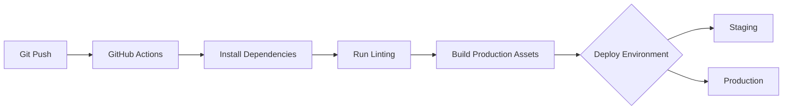
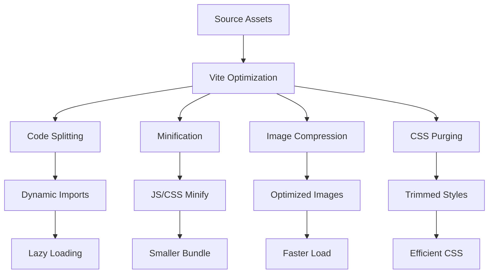

# Build & Deployment

<cite>
**Referenced Files in This Document**   
- [vite.config.ts](file://vite.config.ts)
- [supabase/config.toml](file://supabase/config.toml)
- [src/integrations/supabase/client.ts](file://src/integrations/supabase/client.ts)
- [src/lib/config.ts](file://src/lib/config.ts)
- [package.json](file://package.json)
- [README.md](file://README.md)
</cite>

## Table of Contents
1. [Introduction](#introduction)
2. [Build Process with Vite](#build-process-with-vite)
3. [Environment Variable Management](#environment-variable-management)
4. [Frontend Deployment Options](#frontend-deployment-options)
5. [Backend Deployment with Supabase](#backend-deployment-with-supabase)
6. [Continuous Integration Setup](#continuous-integration-setup)
7. [Production Migrations](#production-migrations)
8. [Performance Optimization](#performance-optimization)
9. [Troubleshooting Common Issues](#troubleshooting-common-issues)
10. [Conclusion](#conclusion)

## Introduction
This document provides comprehensive guidance for building and deploying the campus-connect application. It covers the complete build pipeline using Vite, environment configuration, frontend and backend deployment strategies, CI/CD integration, and performance optimization techniques. The application leverages modern tooling including Vite for frontend builds and Supabase for backend services.

## Build Process with Vite

The campus-connect application uses Vite as its build tool, configured through `vite.config.ts`. The build process is optimized for both development and production environments, leveraging React with TypeScript and SWC for faster compilation.

Key build configurations include:
- Server port set to 8080 with IPv6 support
- React plugin with SWC for fast transpilation
- Path alias `@` pointing to `/src` directory
- Development-only component tagging via `lovable-tagger`

The build is triggered using standard npm scripts defined in `package.json`:
- `npm run build` – Production build
- `npm run build:dev` – Development build with source maps
- `npm run dev` – Development server
- `npm run preview` – Local preview of production build



**Diagram sources**
- [vite.config.ts](file://vite.config.ts#L1-L18)
- [package.json](file://package.json#L5-L9)

**Section sources**
- [vite.config.ts](file://vite.config.ts#L1-L18)
- [package.json](file://package.json#L5-L9)

## Environment Variable Management

Environment variables are managed through Vite's built-in environment handling system. The application uses a centralized configuration file to expose environment variables safely to the frontend.

The configuration is defined in `src/lib/config.ts`, which imports environment variables using `import.meta.env`. This approach ensures type safety and default values for fallback behavior.

Required environment variables include:
- `VITE_SUPABASE_URL` – Supabase project URL
- `VITE_SUPABASE_ANON_KEY` – Supabase anonymous key
- `VITE_COLLEGE_ADMIN_EMAIL` – Admin contact email
- `VITE_COLLEGE_NAME` – Institution name
- `VITE_COLLEGE_CODE` – Unique college identifier
- Feature flags for conditional functionality

The configuration includes validation to ensure critical variables are present before runtime execution.



**Diagram sources**
- [src/lib/config.ts](file://src/lib/config.ts#L1-L36)
- [src/integrations/supabase/client.ts](file://src/integrations/supabase/client.ts#L1-L16)

**Section sources**
- [src/lib/config.ts](file://src/lib/config.ts#L1-L36)

## Frontend Deployment Options

The frontend can be deployed to various platforms that support static site hosting. The Vite build generates static assets in the `/dist` directory, which can be served by any web server.

Recommended deployment platforms:
- **Vercel**: Automatic CI/CD, preview deployments, custom domains
- **Netlify**: Git-triggered builds, split testing, edge functions
- **Lovable**: Integrated deployment with one-click publishing
- **GitHub Pages**: Free hosting with GitHub Actions integration

Deployment requires setting environment variables in the hosting platform's configuration interface. The build process automatically substitutes `VITE_` prefixed variables during bundling.

For custom domains, configure DNS settings and SSL certificates through the hosting provider's dashboard. All platforms support automated HTTPS and global CDN distribution.



**Diagram sources**
- [README.md](file://README.md#L60-L73)
- [package.json](file://package.json#L5-L9)

## Backend Deployment with Supabase

The backend is powered by Supabase, a Firebase alternative with PostgreSQL as the database engine. The project ID is configured in `supabase/config.toml`.

The Supabase client is initialized in `src/integrations/supabase/client.ts` with:
- Project URL from environment or hardcoded fallback
- Publishable (anon) key for authentication
- Session persistence via localStorage
- Automatic token refresh

Authentication is handled through Supabase Auth with email/password flow and session management. The client is typed using the generated `Database` type from Supabase schema.

Database migrations are stored in `supabase/migrations/` and should be applied in production using the Supabase CLI:
```bash
supabase db push
```

Real-time functionality is enabled by default through Supabase's WebSocket implementation.



**Diagram sources**
- [supabase/config.toml](file://supabase/config.toml#L1)
- [src/integrations/supabase/client.ts](file://src/integrations/supabase/client.ts#L1-L16)
- [supabase/migrations](file://supabase/migrations)

**Section sources**
- [supabase/config.toml](file://supabase/config.toml#L1)
- [src/integrations/supabase/client.ts](file://src/integrations/supabase/client.ts#L1-L16)

## Continuous Integration Setup

Continuous integration can be implemented using GitHub Actions, leveraging the existing npm scripts. A typical workflow includes:

1. Checkout code from repository
2. Install dependencies with `npm ci`
3. Run linting with `npm run lint`
4. Build application with `npm run build`
5. Deploy to staging/production environment

The build process is optimized for speed through Vite's pre-bundling and caching mechanisms. Development dependencies are excluded from production builds automatically.

For Lovable integration, changes pushed to the repository are automatically reflected in the Lovable environment, enabling collaborative development workflows.



**Section sources**
- [package.json](file://package.json#L5-L9)
- [README.md](file://README.md#L20-L35)

## Production Migrations

Database schema changes must be managed through Supabase migrations. The process for production migrations:

1. Generate migration locally:
```bash
supabase db diff -f <migration_name>
```

2. Review generated SQL in `supabase/migrations/`
3. Test migration locally with `supabase db reset`
4. Commit migration file to version control
5. Apply to production:
```bash
supabase db push --db-url $PROD_DATABASE_URL
```

All migrations are versioned and applied in chronological order. The system maintains a schema_migrations table to track applied migrations.

Rollback procedures should be tested in staging before production deployment. Always backup production data before major schema changes.

**Section sources**
- [supabase/migrations](file://supabase/migrations)
- [supabase/config.toml](file://supabase/config.toml#L1)

## Performance Optimization

The application implements several performance optimization techniques:

### Code Splitting
Vite automatically code-splits based on dynamic imports and route boundaries. The build analyzes module dependencies to create optimal chunking.

### Asset Optimization
- Images: Compressed during build process
- CSS: Purged and minified with Tailwind
- JavaScript: Minified with Terser
- Source maps: Generated only for development

### Caching Strategies
- Browser caching: Long-term caching with content hashing
- Supabase query caching: Utilizes PostgreSQL query planner
- Client-side caching: React Query for data caching
- CDN caching: Global edge network for static assets

### Bundle Analysis
Use Vite's build report to analyze bundle composition:
```bash
npm run build -- --report
```

This generates a visual representation of bundle sizes and dependencies, helping identify optimization opportunities.



**Section sources**
- [vite.config.ts](file://vite.config.ts#L1-L18)
- [tailwind.config.ts](file://tailwind.config.ts)
- [package.json](file://package.json#L6-L8)

## Troubleshooting Common Issues

### Build Failures
- **Missing environment variables**: Ensure all `VITE_` variables are defined
- **TypeScript errors**: Check `tsconfig.json` configuration
- **Dependency issues**: Run `npm ci` instead of `npm install`

### Deployment Issues
- **404 errors on refresh**: Configure server to serve index.html for all routes
- **CORS errors**: Verify Supabase project URL and API keys
- **Authentication failures**: Check JWT settings in Supabase dashboard

### Runtime Issues
- **Blank screen**: Check browser console for JavaScript errors
- **Slow performance**: Analyze bundle size and optimize images
- **Database connection errors**: Verify network policies in Supabase

### Migration Issues
- **Migration conflicts**: Ensure only one developer generates migrations
- **Schema drift**: Regularly sync local and production schemas
- **Data loss**: Always backup before destructive migrations

For persistent issues, consult the Supabase logs and browser developer tools for detailed error information.

**Section sources**
- [src/lib/config.ts](file://src/lib/config.ts#L1-L36)
- [src/integrations/supabase/client.ts](file://src/integrations/supabase/client.ts#L1-L16)
- [vite.config.ts](file://vite.config.ts#L1-L18)

## Conclusion
The campus-connect application is designed for efficient building and deployment using modern web development practices. By leveraging Vite for frontend builds and Supabase for backend services, the application achieves fast performance and scalable architecture. Proper environment management, continuous integration, and performance optimization ensure a reliable user experience. Following the deployment guidelines and troubleshooting procedures will help maintain a stable production environment.