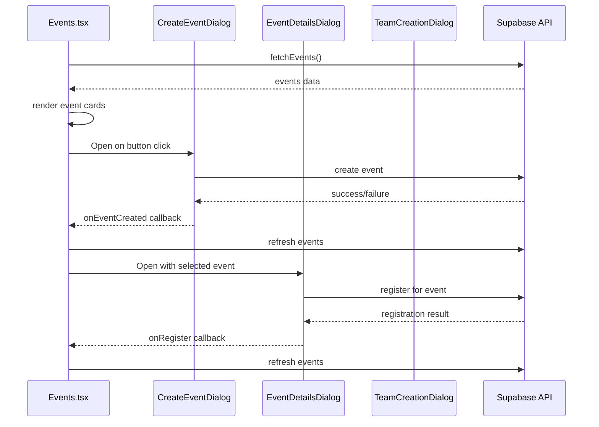

# Component Architecture

<cite>
**Referenced Files in This Document**   
- [App.tsx](file://src/App.tsx)
- [DashboardLayout.tsx](file://src/components/Layout/DashboardLayout.tsx)
- [button.tsx](file://src/components/ui/button.tsx)
- [useAuth.tsx](file://src/hooks/useAuth.tsx)
- [Index.tsx](file://src/pages/Index.tsx)
- [Events.tsx](file://src/pages/Events.tsx)
- [CreateEventDialog.tsx](file://src/components/Events/CreateEventDialog.tsx)
- [EventDetailsDialog.tsx](file://src/components/Events/EventDetailsDialog.tsx)
</cite>

## Table of Contents
1. [Introduction](#introduction)
2. [Project Structure](#project-structure)
3. [Core Components](#core-components)
4. [Architecture Overview](#architecture-overview)
5. [Detailed Component Analysis](#detailed-component-analysis)
6. [Dependency Analysis](#dependency-analysis)
7. [Performance Considerations](#performance-considerations)
8. [Conclusion](#conclusion)

## Introduction
This document provides a comprehensive overview of the component architecture of the campus-connect application. The system is built using React with a clear separation between layout components, feature components, and reusable UI primitives. The documentation details the role of key components such as DashboardLayout.tsx in managing navigation and role-based access, explains the integration of ShadCN UI components, and illustrates the component hierarchy from App.tsx through routing to page-level and dialog components. It also covers composition patterns, prop drilling avoidance strategies, styling integration with Tailwind, and performance optimizations.

## Project Structure

**Diagram sources**
- [App.tsx](file://src/App.tsx#L1-L38)
- [DashboardLayout.tsx](file://src/components/Layout/DashboardLayout.tsx#L1-L137)

**Section sources**
- [App.tsx](file://src/App.tsx#L1-L38)
- [DashboardLayout.tsx](file://src/components/Layout/DashboardLayout.tsx#L1-L137)

## Core Components

The campus-connect application follows a component-based architecture with three primary categories: layout components, feature components, and reusable UI primitives. Layout components like DashboardLayout.tsx provide structural consistency across pages, while feature components encapsulate specific functionality such as event management and club administration. Reusable UI primitives from ShadCN form the foundation of the visual design system, extended and composed to meet application-specific needs.

**Section sources**
- [DashboardLayout.tsx](file://src/components/Layout/DashboardLayout.tsx#L1-L137)
- [button.tsx](file://src/components/ui/button.tsx#L1-L47)

## Architecture Overview

**Diagram sources**
- [App.tsx](file://src/App.tsx#L1-L38)
- [DashboardLayout.tsx](file://src/components/Layout/DashboardLayout.tsx#L1-L137)

## Detailed Component Analysis

### Layout Component Analysis

#### DashboardLayout Analysis
The DashboardLayout component serves as the central layout container for authenticated routes, providing consistent navigation and role-based access control. It integrates authentication state from useAuth to dynamically render navigation options based on user roles, showing administrative features only to college_admin users.

**Diagram sources**
- [DashboardLayout.tsx](file://src/components/Layout/DashboardLayout.tsx#L1-L137)
- [useAuth.tsx](file://src/hooks/useAuth.tsx#L1-L197)

**Section sources**
- [DashboardLayout.tsx](file://src/components/Layout/DashboardLayout.tsx#L1-L137)
- [useAuth.tsx](file://src/hooks/useAuth.tsx#L1-L197)

### Feature Component Analysis

#### Events Module Analysis
The Events module demonstrates a comprehensive feature component implementation with multiple dialog components for creating and viewing event details. The Events.tsx page component manages state for event listings and dialog visibility, while delegating complex interactions to specialized dialog components.

**Diagram sources**
- [Events.tsx](file://src/pages/Events.tsx#L1-L273)
- [CreateEventDialog.tsx](file://src/components/Events/CreateEventDialog.tsx#L1-L262)
- [EventDetailsDialog.tsx](file://src/components/Events/EventDetailsDialog.tsx#L1-L183)

**Section sources**
- [Events.tsx](file://src/pages/Events.tsx#L1-L273)
- [CreateEventDialog.tsx](file://src/components/Events/CreateEventDialog.tsx#L1-L262)
- [EventDetailsDialog.tsx](file://src/components/Events/EventDetailsDialog.tsx#L1-L183)

### UI Component Analysis

#### ShadCN Component Integration
The application leverages ShadCN UI components as foundational building blocks, extending them with application-specific logic and styling. The component library in src/components/ui contains all base components that are imported and composed throughout the application.

**Diagram sources**
- [button.tsx](file://src/components/ui/button.tsx#L1-L47)
- [dialog.tsx](file://src/components/ui/dialog.tsx)

**Section sources**
- [button.tsx](file://src/components/ui/button.tsx#L1-L47)
- [Events.tsx](file://src/pages/Events.tsx#L1-L273)

## Dependency Analysis

**Diagram sources**
- [App.tsx](file://src/App.tsx#L1-L38)
- [useAuth.tsx](file://src/hooks/useAuth.tsx#L1-L197)
- [DashboardLayout.tsx](file://src/components/Layout/DashboardLayout.tsx#L1-L137)

**Section sources**
- [App.tsx](file://src/App.tsx#L1-L38)
- [useAuth.tsx](file://src/hooks/useAuth.tsx#L1-L197)
- [DashboardLayout.tsx](file://src/components/Layout/DashboardLayout.tsx#L1-L137)

## Performance Considerations

The application implements several performance optimization strategies:

1. **State Management**: Uses React Query for server state management, providing caching, background updates, and request deduplication
2. **Component Memoization**: While not explicitly shown, the architecture supports React.memo for expensive components
3. **Conditional Rendering**: DashboardLayout dynamically renders navigation based on user role, avoiding unnecessary DOM elements
4. **Deferred Loading**: Profile data is fetched after initial render using setTimeout to improve perceived performance
5. **Efficient Data Fetching**: Uses Promise.all for parallel data retrieval in Index.tsx
6. **Lazy Loading**: Could be implemented for dialog components to reduce initial bundle size

The component architecture minimizes prop drilling through context providers (AuthProvider) and direct imports, maintaining clean component interfaces while ensuring necessary data is available where needed.

**Section sources**
- [App.tsx](file://src/App.tsx#L1-L38)
- [useAuth.tsx](file://src/hooks/useAuth.tsx#L1-L197)
- [Index.tsx](file://src/pages/Index.tsx#L1-L276)

## Conclusion

The campus-connect application demonstrates a well-structured component architecture with clear separation of concerns. The layout component (DashboardLayout.tsx) provides consistent navigation and role-based access control across all authenticated routes. Feature components are organized by domain (Events, Clubs, Admin) with dedicated dialog components for complex interactions. The application effectively leverages ShadCN UI components as reusable primitives, extending and composing them for specific use cases. The routing structure starting from App.tsx provides a clear entry point, with proper authentication guarding and error handling. Performance considerations are addressed through efficient state management and data fetching patterns, creating a responsive user experience.