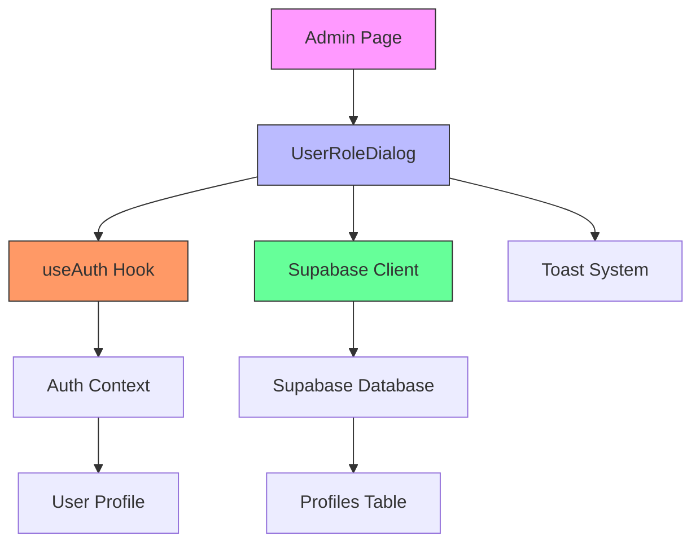
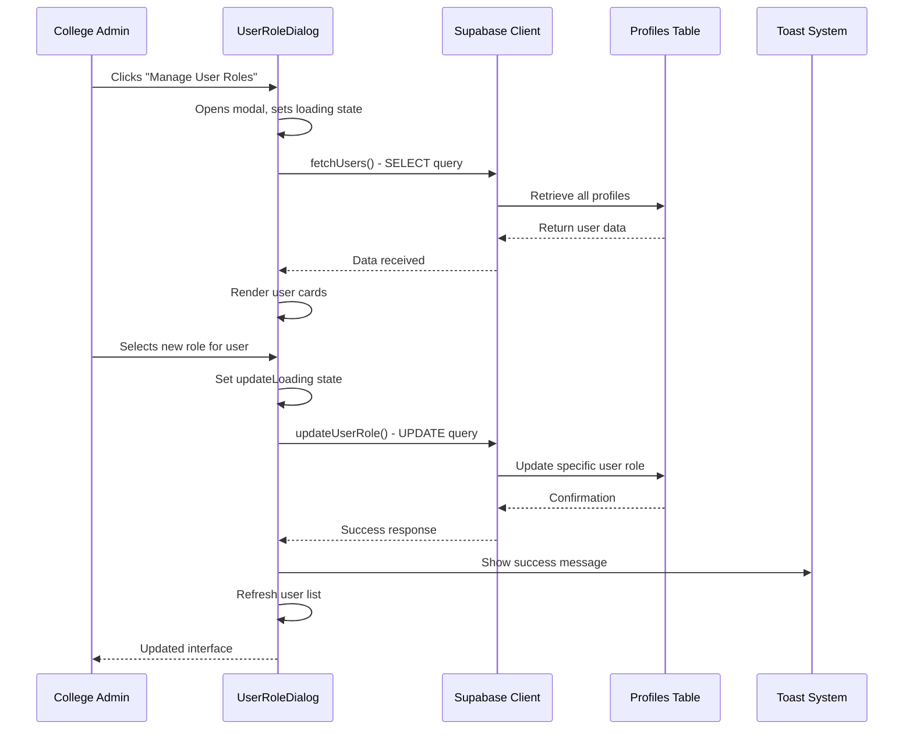
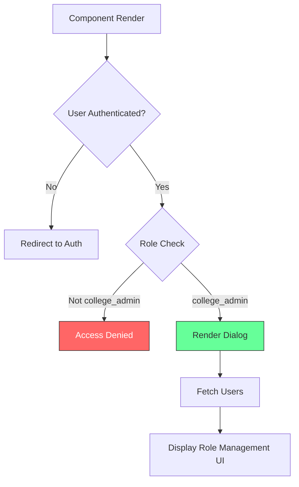
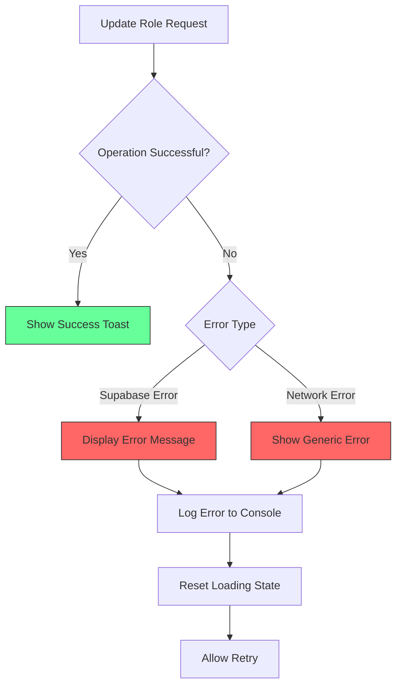
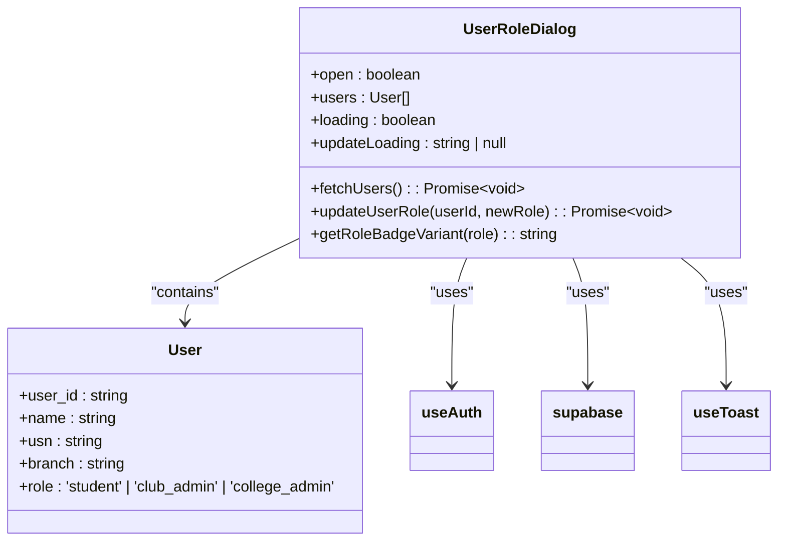
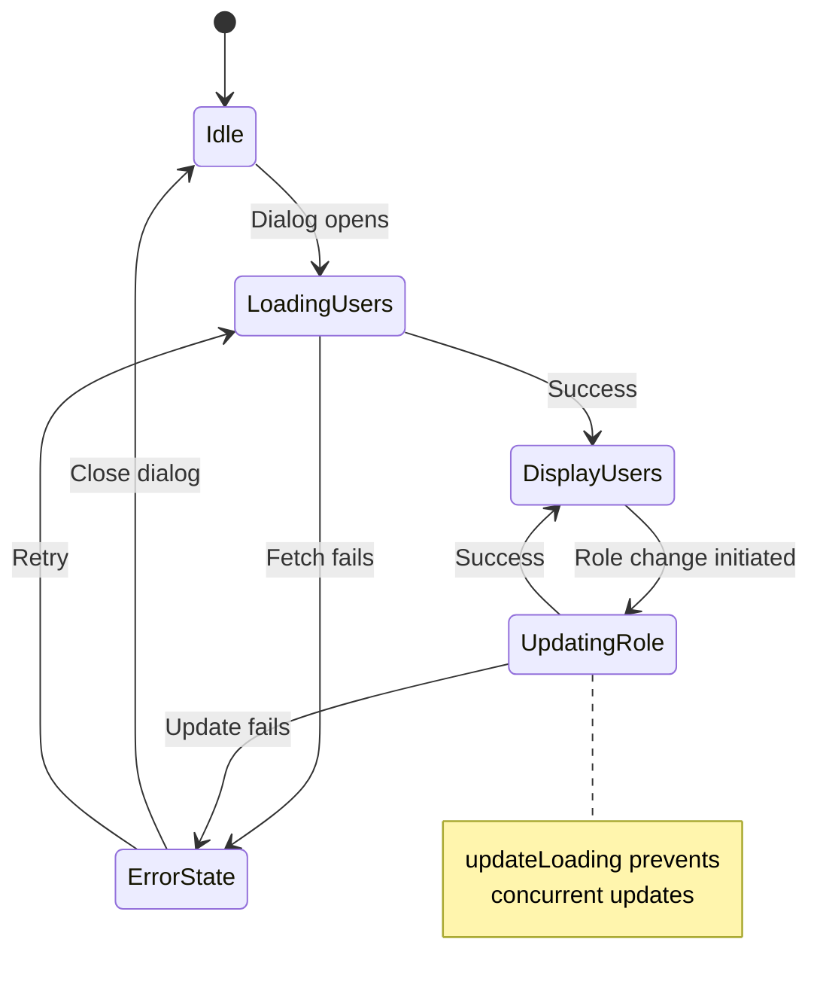

# Admin Panel Dialogs

<cite>
**Referenced Files in This Document**   
- [UserRoleDialog.tsx](file://src/components/Admin/UserRoleDialog.tsx)
- [Admin.tsx](file://src/pages/Admin.tsx)
- [useAuth.tsx](file://src/hooks/useAuth.tsx)
- [client.ts](file://src/integrations/supabase/client.ts)
- [admin-setup.ts](file://src/lib/admin-setup.ts)
</cite>

## Table of Contents
1. [Introduction](#introduction)
2. [Component Overview](#component-overview)
3. [Architecture and Integration](#architecture-and-integration)
4. [User Role Management Flow](#user-role-management-flow)
5. [Permission and Security Model](#permission-and-security-model)
6. [UI and User Experience](#ui-and-user-experience)
7. [Error Handling and Recovery](#error-handling-and-recovery)
8. [Data Flow and State Management](#data-flow-and-state-management)
9. [Security and Audit Considerations](#security-and-audit-considerations)
10. [Edge Cases and Concurrency](#edge-cases-and-concurrency)

## Introduction
The UserRoleDialog component is a critical administrative interface within the Campus Connect application, designed specifically for college administrators to manage user roles across the platform. This modal dialog enables centralized control over user permissions, allowing administrators to assign roles such as student, club admin, or college admin. The component integrates with Supabase for data persistence, leverages react-query patterns for state synchronization, and implements robust security checks to prevent unauthorized access. This documentation provides a comprehensive analysis of the component's functionality, architecture, and integration points.

## Component Overview

The UserRoleDialog is a React component that renders a modal interface accessible only to users with the college_admin role. It is triggered by a button in the Admin page header and displays a list of all users with their current roles and academic information. Administrators can modify user roles through a dropdown selection, with immediate visual feedback and toast notifications upon successful updates.

The component's primary responsibilities include:
- Fetching and displaying user profiles from the database
- Providing a role selection interface for each user
- Handling role update operations via Supabase
- Displaying loading states and error messages
- Enforcing role-based access control

**Section sources**
- [UserRoleDialog.tsx](file://src/components/Admin/UserRoleDialog.tsx#L1-L173)

## Architecture and Integration

**Diagram sources**
- [Admin.tsx](file://src/pages/Admin.tsx#L37-L80)
- [UserRoleDialog.tsx](file://src/components/Admin/UserRoleDialog.tsx#L20-L171)
- [useAuth.tsx](file://src/hooks/useAuth.tsx#L38-L84)
- [client.ts](file://src/integrations/supabase/client.ts#L1-L27)

The UserRoleDialog integrates with multiple system components through a well-defined architecture. It is embedded within the Admin page and rendered as a child component. The component relies on the useAuth hook for authentication state and user profile information, which is essential for access control. Data operations are performed through the Supabase client, which handles communication with the PostgreSQL database. The component also utilizes the toast system for user feedback, ensuring a responsive user experience.

## User Role Management Flow

**Diagram sources**
- [UserRoleDialog.tsx](file://src/components/Admin/UserRoleDialog.tsx#L50-L148)
- [client.ts](file://src/integrations/supabase/client.ts#L1-L27)

The user role management flow begins when a college administrator clicks the "Manage User Roles" button on the Admin page. The dialog opens and immediately fetches the complete list of users from the profiles table. Each user is displayed in a card format with their current role indicated by a colored badge. When an administrator selects a new role from the dropdown, the component initiates an update operation that modifies the user's role in the database. Upon successful update, the component refreshes the user list to reflect changes and displays a toast notification confirming the update.

## Permission and Security Model

The UserRoleDialog implements a multi-layered security model to ensure that only authorized users can access and modify role assignments. Access control is enforced through the useAuth hook, which provides the current user's profile and role information. The component contains a guard clause that returns null if the current user is not a college_admin, effectively preventing unauthorized access.

**Diagram sources**
- [UserRoleDialog.tsx](file://src/components/Admin/UserRoleDialog.tsx#L149-L155)
- [useAuth.tsx](file://src/hooks/useAuth.tsx#L38-L84)
- [admin-setup.ts](file://src/lib/admin-setup.ts#L104-L149)

The security model extends beyond simple role checking. The system includes administrative setup logic that automatically promotes users with predefined credentials to college_admin status, ensuring there is always at least one administrator in the system. This is particularly important during initial system setup or in cases where administrative accounts might be compromised.

**Section sources**
- [UserRoleDialog.tsx](file://src/components/Admin/UserRoleDialog.tsx#L149-L155)
- [useAuth.tsx](file://src/hooks/useAuth.tsx#L38-L84)
- [admin-setup.ts](file://src/lib/admin-setup.ts#L104-L149)

## UI and User Experience

The UserRoleDialog provides an intuitive user interface designed for efficient role management. The modal displays users in a scrollable list of cards, each containing the user's name, USN (University Seat Number), branch of study, and current role. Roles are visually distinguished by colored badges: college_admin appears in red (destructive), club_admin in gray (secondary), and student in outline style.

The role selection interface uses a dropdown menu that is disabled during update operations to prevent concurrent modifications. When an update is in progress, a loading spinner appears next to the dropdown, providing clear visual feedback. The entire dialog is responsive, with a maximum width of 700px and scrollable content areas to accommodate varying screen sizes.

Key UI elements include:
- **User Cards**: Display individual user information in a consistent format
- **Role Dropdowns**: Allow role selection with immediate action
- **Loading Indicators**: Provide feedback during data operations
- **Toast Notifications**: Confirm successful updates or display errors
- **Responsive Design**: Adapts to different screen sizes and orientations

**Section sources**
- [UserRoleDialog.tsx](file://src/components/Admin/UserRoleDialog.tsx#L100-L148)

## Error Handling and Recovery

The UserRoleDialog implements comprehensive error handling to ensure reliability and provide meaningful feedback to administrators. All database operations are wrapped in try-catch blocks to handle both network errors and Supabase-specific errors. When an error occurs during role updates, the component displays a destructive toast notification with the specific error message from Supabase.

**Diagram sources**
- [UserRoleDialog.tsx](file://src/components/Admin/UserRoleDialog.tsx#L85-L115)

The error recovery mechanism includes several key features:
- Automatic loading state reset after errors
- Detailed error messages from Supabase
- Generic fallback messages for network issues
- Console logging for debugging purposes
- Preservation of the user interface state to allow retry

Network interruptions are handled gracefully, with the component maintaining its state and allowing administrators to retry the operation once connectivity is restored. The finally blocks in asynchronous functions ensure that loading states are always reset, preventing the interface from becoming unresponsive.

**Section sources**
- [UserRoleDialog.tsx](file://src/components/Admin/UserRoleDialog.tsx#L85-L115)

## Data Flow and State Management

The UserRoleDialog manages state through React's useState and useEffect hooks, maintaining several key state variables:
- `open`: Controls the visibility of the modal
- `users`: Stores the list of user profiles
- `loading`: Indicates data fetching status
- `updateLoading`: Tracks individual role update operations

**Diagram sources**
- [UserRoleDialog.tsx](file://src/components/Admin/UserRoleDialog.tsx#L12-L18)
- [UserRoleDialog.tsx](file://src/components/Admin/UserRoleDialog.tsx#L20-L171)

Data flows through the component in a predictable pattern. When the dialog opens, the useEffect hook triggers the fetchUsers function, which retrieves user data from Supabase and updates the users state. Role updates are initiated by the Select component's onValueChange handler, which calls updateUserRole with the target user ID and new role. After a successful update, the component refreshes the user list by calling fetchUsers again, ensuring the interface reflects the current database state.

The component does not use react-query for data fetching and mutation, instead implementing its own data fetching logic with Supabase client methods. This approach provides fine-grained control over the data operations but requires manual cache management through explicit refresh calls.

**Section sources**
- [UserRoleDialog.tsx](file://src/components/Admin/UserRoleDialog.tsx#L20-L171)

## Security and Audit Considerations

While the UserRoleDialog provides essential administrative functionality, it has important security and audit implications. The component currently lacks explicit audit logging for role changes, which could be a concern for compliance and security monitoring. All role changes are directly written to the profiles table without intermediate logging or approval workflows.

The security model relies on Supabase's row-level security policies, which are not visible in the client-side code but are essential for preventing unauthorized access. The use of Supabase's update method with an eq constraint ensures that only the specified user's role is modified, preventing mass updates or data leakage.

Key security considerations include:
- Role changes are immediate and irreversible through the UI
- No secondary confirmation step for role promotions
- No built-in audit trail for role changes
- Reliance on Supabase authentication and authorization
- Direct database mutations without intermediate validation

Future enhancements could include:
- Adding confirmation dialogs for role promotions
- Implementing audit logging to track role changes
- Adding approval workflows for sensitive role changes
- Including timestamp information for role changes
- Providing role change history for users

**Section sources**
- [UserRoleDialog.tsx](file://src/components/Admin/UserRoleDialog.tsx#L85-L115)
- [client.ts](file://src/integrations/supabase/client.ts#L1-L27)

## Edge Cases and Concurrency

The UserRoleDialog handles several edge cases and potential concurrency issues:

**Diagram sources**
- [UserRoleDialog.tsx](file://src/components/Admin/UserRoleDialog.tsx#L20-L171)

The component addresses concurrency through the updateLoading state, which disables the role dropdown for a specific user during update operations. This prevents multiple simultaneous updates to the same user record. However, the component does not handle the case where two administrators might be using the dialog simultaneously, potentially leading to inconsistent views of user roles.

Other edge cases include:
- Empty user lists (handled by displaying nothing)
- Network timeouts during data operations
- Database constraint violations
- Authentication state changes during dialog use
- Large numbers of users affecting performance

The component gracefully handles loading states and errors, but could benefit from additional safeguards such as optimistic updates, conflict resolution, or real-time synchronization to handle concurrent administrative actions.

**Section sources**
- [UserRoleDialog.tsx](file://src/components/Admin/UserRoleDialog.tsx#L20-L171)