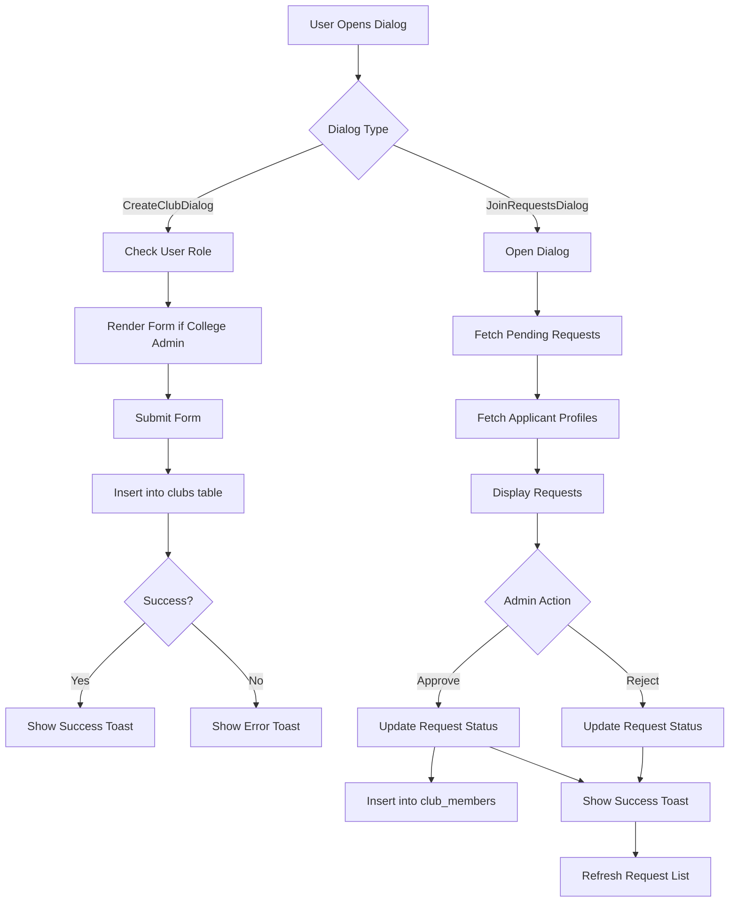
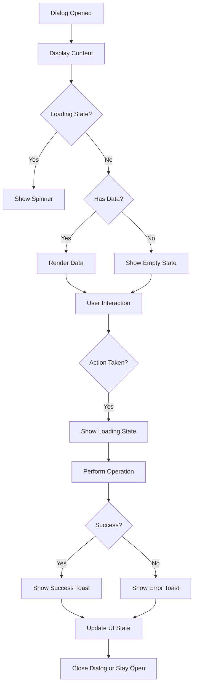

# Club Management Dialogs

<cite>
**Referenced Files in This Document**   
- [CreateClubDialog.tsx](file://src/components/Clubs/CreateClubDialog.tsx)
- [JoinRequestsDialog.tsx](file://src/components/Clubs/JoinRequestsDialog.tsx)
- [useAuth.tsx](file://src/hooks/useAuth.tsx)
- [client.ts](file://src/integrations/supabase/client.ts)
- [use-toast.ts](file://src/hooks/use-toast.ts)
- [dialog.tsx](file://src/components/ui/dialog.tsx)
- [20250909010744_baf630ed-00b1-48e7-add2-b4e5703f0a84.sql](file://supabase/migrations/20250909010744_baf630ed-00b1-48e7-add2-b4e5703f0a84.sql)
</cite>

## Table of Contents
1. [Introduction](#introduction)
2. [CreateClubDialog Component](#createclubdialog-component)
3. [JoinRequestsDialog Component](#joinrequestsdialog-component)
4. [Authentication and Role Management](#authentication-and-role-management)
5. [Supabase Integration and Data Flow](#supabase-integration-and-data-flow)
6. [UI and User Experience](#ui-and-user-experience)
7. [Error Handling and Validation](#error-handling-and-validation)
8. [Accessibility and Responsive Design](#accessibility-and-responsive-design)
9. [Conclusion](#conclusion)

## Introduction
This document provides a comprehensive analysis of the club management dialog components in the Campus Connect application: `CreateClubDialog` and `JoinRequestsDialog`. These components enable college administrators to create new clubs and manage membership requests, respectively. The documentation covers implementation details, data flow, authentication integration, and user experience considerations, with a focus on how these components interact with the Supabase backend and React's state management system.

## CreateClubDialog Component

The `CreateClubDialog` component enables college administrators to create new clubs by submitting a form with club name and description. The component is conditionally rendered based on user role, ensuring only college admins can access this functionality.

The dialog uses React state to manage form data and submission status, with `formData` tracking the name and description inputs. Upon form submission, the component inserts a new record into the `clubs` table in Supabase with the club details and automatically sets `approved: true` since college admin-created clubs are immediately active.

The component integrates with the toast notification system to provide user feedback on submission success or failure. Loading states are managed through the `loading` state variable, which disables the submit button and displays a spinner during the database operation.

**Section sources**
- [CreateClubDialog.tsx](file://src/components/Clubs/CreateClubDialog.tsx#L1-L125)

## JoinRequestsDialog Component

The `JoinRequestsDialog` component allows club administrators to review and manage pending membership requests for their clubs. It displays a list of requests with applicant information including name, USN, branch, and any message they included with their request.

The component fetches pending join requests from the `join_requests` table, filtering by the provided `clubId` and status 'pending'. It performs a two-step data retrieval process: first fetching the join requests, then retrieving the associated profile information for each applicant to enrich the display data.

When a club admin approves a request, the component updates the request status in the `join_requests` table and inserts a new record into the `club_members` table to grant membership. If a request is rejected, only the status update occurs. The component uses real-time data fetching to refresh the request list after any action.

The UI displays a badge with the pending request count when the club admin has outstanding requests to review. Empty states are handled with appropriate messaging and icons when no requests are pending.

**Section sources**
- [JoinRequestsDialog.tsx](file://src/components/Clubs/JoinRequestsDialog.tsx#L1-L228)

## Authentication and Role Management

Both dialog components rely on the `useAuth` hook to determine user roles and permissions. The `useAuth` context provides access to the current user and profile data, including the user's role which determines interface visibility and functionality.

In `CreateClubDialog`, access is restricted to users with the 'college_admin' role. The component returns null if the current user does not have this role, effectively hiding the create club functionality from other users.

For `JoinRequestsDialog`, access is controlled through Supabase Row Level Security (RLS) policies. The RLS policy "Club admins can view and manage join requests for their clubs" uses a subquery to verify that the current user is an admin of the club they're trying to manage requests for by checking the `club_members` table.

The authentication flow is initialized in the `AuthProvider` component, which sets up a listener for authentication state changes and automatically fetches the user's profile upon login. This ensures that role information is always up-to-date and available to components that need it.

**Section sources**
- [useAuth.tsx](file://src/hooks/useAuth.tsx#L1-L215)
- [JoinRequestsDialog.tsx](file://src/components/Clubs/JoinRequestsDialog.tsx#L1-L228)
- [CreateClubDialog.tsx](file://src/components/Clubs/CreateClubDialog.tsx#L1-L125)

## Supabase Integration and Data Flow

Both components integrate with Supabase through the centralized client instance, which is configured with the project's URL and publishable key. The client handles authentication, database operations, and real-time subscriptions.

The `CreateClubDialog` performs a direct insert operation on the `clubs` table. The operation includes error handling with specific feedback to the user via toast notifications. Success responses trigger a toast notification and reset the form state.

The `JoinRequestsDialog` implements a more complex data flow involving multiple database operations:
1. Fetching pending requests with a filtered select query
2. Retrieving profile data for applicants with a separate query
3. Updating request status with an update operation
4. Adding approved members to the `club_members` table with an insert operation

The component uses React's `useEffect` hook to trigger data fetching when the dialog opens, ensuring the administrator sees the most current request list. The `onRequestHandled` callback prop allows parent components to respond to request processing, such as updating request counts.

**Diagram sources**
- [CreateClubDialog.tsx](file://src/components/Clubs/CreateClubDialog.tsx#L1-L125)
- [JoinRequestsDialog.tsx](file://src/components/Clubs/JoinRequestsDialog.tsx#L1-L228)
- [client.ts](file://src/integrations/supabase/client.ts#L1-L16)

## UI and User Experience

Both dialog components use the Radix UI Dialog primitive wrapped with custom styling to ensure consistency with the application's design system. The dialogs are responsive, with maximum widths set for different screen sizes to ensure readability on mobile devices.

The `CreateClubDialog` features a simple form layout with labeled inputs for club name and description. The submit button displays a loading spinner during submission and is disabled while the operation is in progress to prevent duplicate submissions. The dialog can be dismissed by clicking outside, pressing escape, or clicking the cancel button.

The `JoinRequestsDialog` presents a card-based interface for each pending request, displaying applicant information in a structured format. Each request card includes approve and reject buttons with appropriate icons. Loading states are handled with a centered spinner, and empty states display a clock icon with explanatory text.

Toast notifications provide immediate feedback for all operations, with success messages in the default style and error messages in a destructive (red) variant. The notifications are managed by the global toast context, ensuring consistent behavior across the application.

**Diagram sources**
- [CreateClubDialog.tsx](file://src/components/Clubs/CreateClubDialog.tsx#L1-L125)
- [JoinRequestsDialog.tsx](file://src/components/Clubs/JoinRequestsDialog.tsx#L1-L228)
- [dialog.tsx](file://src/components/ui/dialog.tsx#L1-L95)

## Error Handling and Validation

Both components implement comprehensive error handling to provide users with meaningful feedback. All Supabase operations are wrapped in try-catch blocks, with specific error messages displayed via toast notifications.

The `CreateClubDialog` performs client-side validation through HTML5 form validation (the required attribute on the name field) and handles server-side errors from Supabase by displaying the error message in a destructive toast. Network errors and unexpected exceptions are caught and presented with a generic error message.

The `JoinRequestsDialog` handles errors at multiple levels:
- Database query errors during request fetching
- Update operation errors when changing request status
- Insert operation errors when adding new members
- Profile data retrieval issues

Each error type triggers an appropriate toast notification, allowing administrators to understand what went wrong. The component also includes specific error handling for unique constraint violations when creating join requests, though this logic is primarily implemented in the parent `Clubs` page.

Form validation is minimal in these dialogs since they rely on Supabase's database constraints and Row Level Security policies to enforce data integrity. The primary validation occurs at the role level, ensuring only authorized users can perform specific actions.

**Section sources**
- [CreateClubDialog.tsx](file://src/components/Clubs/CreateClubDialog.tsx#L1-L125)
- [JoinRequestsDialog.tsx](file://src/components/Clubs/JoinRequestsDialog.tsx#L1-L228)
- [use-toast.ts](file://src/hooks/use-toast.ts#L1-L186)

## Accessibility and Responsive Design

Both dialog components follow accessibility best practices by using semantic HTML elements and ARIA attributes provided by the Radix UI components. The dialogs are keyboard-navigable, with focus trapped within the dialog when open and restored to the trigger element when closed.

The `CreateClubDialog` uses proper label elements associated with form inputs through the htmlFor attribute, ensuring screen readers can correctly identify input purposes. The submit button includes a Plus icon with appropriate spacing, and all interactive elements have sufficient touch targets for mobile users.

The `JoinRequestsDialog` structures request information in a card layout that is easy to scan. Each request card uses heading elements appropriately, with the applicant's name as a CardTitle (h3 by default). Icons for approve and reject actions are accompanied by text labels, ensuring clarity for all users.

Responsive design is implemented through Tailwind CSS classes, with dialogs adapting to screen size. The `CreateClubDialog` has a maximum width of 425px on small screens, while the `JoinRequestsDialog` can expand to 600px. On smaller screens, the dialogs take up most of the viewport width while maintaining appropriate padding.

The components handle edge cases such as expired sessions by checking for the presence of a user object before performing operations. Loading states prevent user interaction during data operations, and empty states provide clear guidance when no data is available.

**Section sources**
- [CreateClubDialog.tsx](file://src/components/Clubs/CreateClubDialog.tsx#L1-L125)
- [JoinRequestsDialog.tsx](file://src/components/Clubs/JoinRequestsDialog.tsx#L1-L228)
- [dialog.tsx](file://src/components/ui/dialog.tsx#L1-L95)

## Conclusion

The `CreateClubDialog` and `JoinRequestsDialog` components provide essential functionality for club management in the Campus Connect application. By leveraging Supabase for data persistence and authentication, these components offer a secure and efficient interface for college administrators to create clubs and manage membership requests.

Key strengths of the implementation include role-based access control, comprehensive error handling with user-friendly feedback, and a clean, responsive UI that works across device sizes. The separation of concerns between the dialog components and the underlying data layer promotes maintainability and scalability.

Future enhancements could include additional form validation, support for club categories in the creation process, and batch operations for handling multiple join requests. The current implementation provides a solid foundation for club management with clear pathways for extension and improvement.