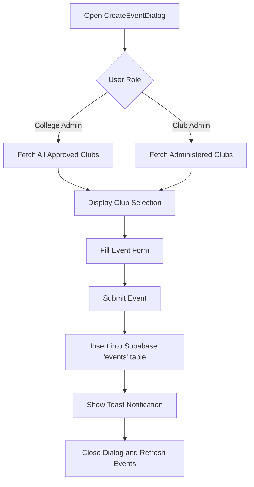
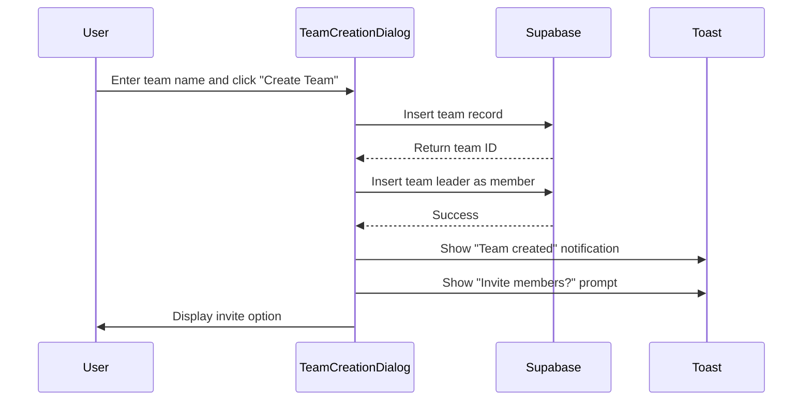
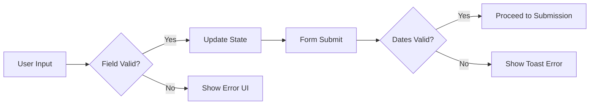
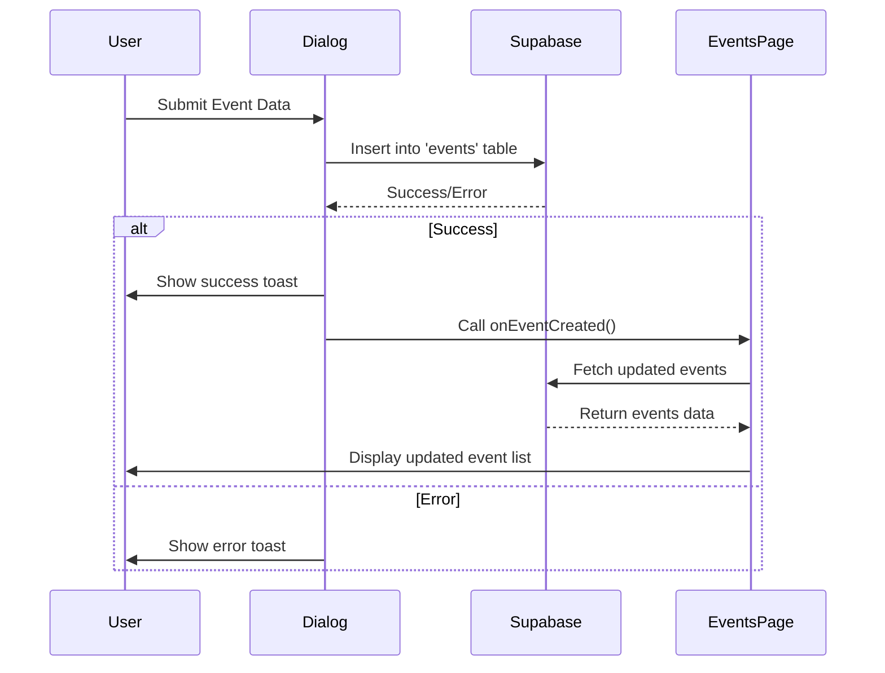
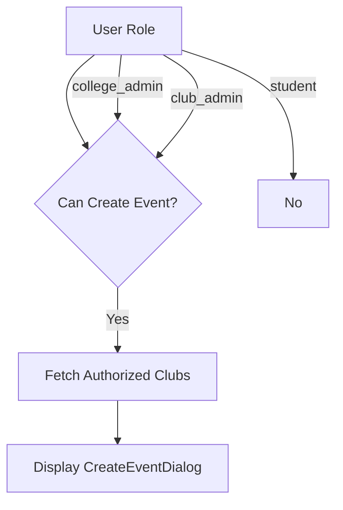
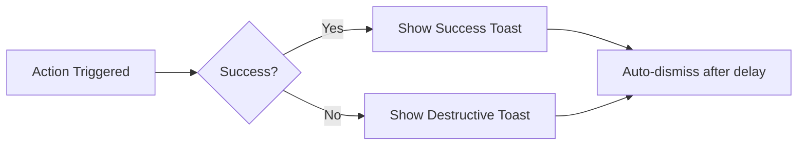
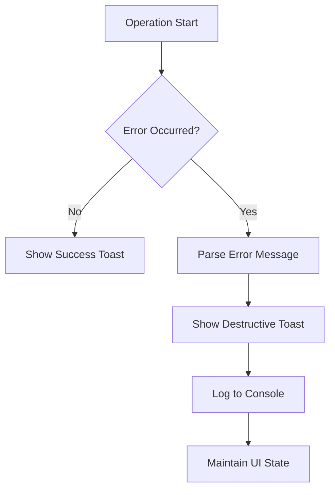

# Event Management Dialogs

<cite>
**Referenced Files in This Document**   
- [CreateEventDialog.tsx](file://src/components/Events/CreateEventDialog.tsx)
- [EventDetailsDialog.tsx](file://src/components/Events/EventDetailsDialog.tsx)
- [TeamCreationDialog.tsx](file://src/components/Events/TeamCreationDialog.tsx)
- [Events.tsx](file://src/pages/Events.tsx)
- [DashboardLayout.tsx](file://src/components/Layout/DashboardLayout.tsx)
- [useAuth.tsx](file://src/hooks/useAuth.tsx)
- [client.ts](file://src/integrations/supabase/client.ts)
- [use-toast.ts](file://src/hooks/use-toast.ts)
- [sonner.tsx](file://src/components/ui/sonner.tsx)
</cite>

## Table of Contents
1. [Introduction](#introduction)
2. [Component Overview](#component-overview)
3. [User Interaction Flow](#user-interaction-flow)
4. [Form Handling and Validation](#form-handling-and-validation)
5. [Supabase Integration and Data Flow](#supabase-integration-and-data-flow)
6. [Role-Based Access Control](#role-based-access-control)
7. [UI/UX and Accessibility](#uiux-and-accessibility)
8. [Error Handling and Edge Cases](#error-handling-and-edge-cases)
9. [Conclusion](#conclusion)

## Introduction

The event management dialog components in the campus-connect application provide a user-friendly interface for creating, viewing, and registering for campus events. These components—`CreateEventDialog`, `EventDetailsDialog`, and `TeamCreationDialog`—are integrated within the `DashboardLayout` and are triggered from the `Events` page. They leverage React Hook Form principles, Supabase for backend persistence, and `@tanstack/react-query` patterns for data synchronization. This document details their implementation, interaction flows, and integration with authentication and notification systems.

**Section sources**
- [Events.tsx](file://src/pages/Events.tsx#L0-L353)
- [DashboardLayout.tsx](file://src/components/Layout/DashboardLayout.tsx#L0-L163)

## Component Overview

### CreateEventDialog

The `CreateEventDialog` enables authorized users (club admins and college admins) to create new events. It displays a form with fields for event title, description, location, start and end times, capacity, and a toggle for team events. The dialog dynamically populates the club selection dropdown based on the user's role and club affiliations.



**Diagram sources**
- [CreateEventDialog.tsx](file://src/components/Events/CreateEventDialog.tsx#L0-L280)

### EventDetailsDialog

The `EventDetailsDialog` displays comprehensive information about a selected event, including title, description, location, time, and registration status. It allows users to register for individual events or initiate team creation for team-based events. The dialog shows real-time registration counts and disables registration when the event is full or already registered.

```mermaid
classDiagram
class EventDetailsDialog {
+event : Event | null
+isOpen : boolean
+onClose() : void
+onRegister() : void
+isRegistered : boolean
+isFull : boolean
+handleRegister() : Promise~void~
}
class Event {
+id : string
+title : string
+description : string | null
+location : string
+start_time : string
+end_time : string
+capacity : number
+is_team_event : boolean
+club_id : string
+clubs : { name : string }
+registrations : Array<{ id : string; profile_id : string }>
}
EventDetailsDialog --> Event : "displays"
```

**Diagram sources**
- [EventDetailsDialog.tsx](file://src/components/Events/EventDetailsDialog.tsx#L0-L183)

### TeamCreationDialog

The `TeamCreationDialog` facilitates team formation for team-based events. Users enter a team name and create a team, automatically becoming the team leader. After creation, users can invite members via the `TeamInviteDialog`. The dialog maintains state to allow seamless transition from team creation to member invitation.



**Diagram sources**
- [TeamCreationDialog.tsx](file://src/components/Events/TeamCreationDialog.tsx#L0-L165)

## User Interaction Flow

The event management dialogs are triggered from the `Events` page within the `DashboardLayout`. The flow begins when a user navigates to the Events page, where all available events are displayed in cards.

When a user clicks "Create Event", the `CreateEventDialog` opens if the user has the appropriate role (club admin or college admin). For event registration, clicking "Register" on an event card triggers either the `EventDetailsDialog` for individual events or the `TeamCreationDialog` for team events.

```mermaid
flowchart TD
A[Events Page] --> B{User Action}
B --> |Click "Create Event"| C[CreateEventDialog]
B --> |Click "Register"| D{Event Type}
D --> |Individual| E[EventDetailsDialog]
D --> |Team| F[TeamCreationDialog]
C --> G[Submit Form]
E --> H[Register Individually]
F --> I[Create Team and Register]
G --> J[Supabase Insert]
H --> J
I --> J
J --> K[Show Toast]
K --> L[Refresh Events]
```

**Diagram sources**
- [Events.tsx](file://src/pages/Events.tsx#L0-L353)
- [CreateEventDialog.tsx](file://src/components/Events/CreateEventDialog.tsx#L0-L280)
- [EventDetailsDialog.tsx](file://src/components/Events/EventDetailsDialog.tsx#L0-L183)
- [TeamCreationDialog.tsx](file://src/components/Events/TeamCreationDialog.tsx#L0-L165)

**Section sources**
- [Events.tsx](file://src/pages/Events.tsx#L0-L353)

## Form Handling and Validation

The dialog components implement controlled form handling using React state rather than React Hook Form or Zod in the current implementation. Each form field is bound to component state via `useState` and updated through `onChange` handlers.

### Field Requirements and Validation

- **Event Title**: Required, string input
- **Description**: Optional, textarea
- **Location**: Required, string input
- **Start/End Time**: Required, datetime-local inputs with client-side validation ensuring end time is after start time
- **Capacity**: Required, number input with minimum value of 1
- **Team Event**: Boolean toggle

The `CreateEventDialog` implements date validation to prevent events with end times before start times, displaying a destructive toast notification upon validation failure.



**Diagram sources**
- [CreateEventDialog.tsx](file://src/components/Events/CreateEventDialog.tsx#L0-L280)

**Section sources**
- [CreateEventDialog.tsx](file://src/components/Events/CreateEventDialog.tsx#L0-L280)

## Supabase Integration and Data Flow

The event management components interact directly with Supabase using the client instance imported from `@/integrations/supabase/client`. Data flow follows a direct mutation pattern without `@tanstack/react-query`, relying on manual cache invalidation through callback functions.

### Data Flow Sequence

1. User submits form data
2. Component calls Supabase `insert()` method with event data
3. On success, toast notification is displayed
4. Parent component callback (e.g., `onEventCreated`) is invoked to refresh data
5. Events page calls `fetchEvents()` to synchronize with database



**Diagram sources**
- [CreateEventDialog.tsx](file://src/components/Events/CreateEventDialog.tsx#L0-L280)
- [Events.tsx](file://src/pages/Events.tsx#L0-L353)

**Section sources**
- [CreateEventDialog.tsx](file://src/components/Events/CreateEventDialog.tsx#L0-L280)
- [EventDetailsDialog.tsx](file://src/components/Events/EventDetailsDialog.tsx#L0-L183)
- [TeamCreationDialog.tsx](file://src/components/Events/TeamCreationDialog.tsx#L0-L165)
- [client.ts](file://src/integrations/supabase/client.ts#L0-L16)

## Role-Based Access Control

Access to event management functionality is controlled through the `useAuth` hook, which provides user profile information including role. The system implements three roles: student, club_admin, and college_admin.

### Access Rules

- **Create Event**: Available to club_admin and college_admin roles
- **View All Events**: Available to all authenticated users
- **Register for Events**: Available to all users for non-full events
- **Manage Event Attendance**: Available to college_admin and club_admin (role-specific)

The `CreateEventDialog` restricts club selection based on user role:
- College admins can select any approved club
- Club admins can only select clubs they administer
- Regular students cannot access the dialog



**Diagram sources**
- [useAuth.tsx](file://src/hooks/useAuth.tsx#L0-L215)
- [CreateEventDialog.tsx](file://src/components/Events/CreateEventDialog.tsx#L0-L280)
- [Events.tsx](file://src/pages/Events.tsx#L0-L353)

**Section sources**
- [useAuth.tsx](file://src/hooks/useAuth.tsx#L0-L215)
- [CreateEventDialog.tsx](file://src/components/Events/CreateEventDialog.tsx#L0-L280)

## UI/UX and Accessibility

The dialog components prioritize user experience through clear visual feedback, loading states, and success notifications.

### Loading States

All dialogs implement loading states during form submission:
- `CreateEventDialog` disables submit button and shows spinner
- `EventDetailsDialog` disables register button during registration
- `TeamCreationDialog` shows "Creating..." state

### Toast Notifications

The application uses `sonner` for toast notifications, integrated through the `use-toast.ts` hook. Notifications provide immediate feedback for:
- Successful event creation
- Registration confirmation
- Error conditions (validation, network, permission)



**Diagram sources**
- [use-toast.ts](file://src/hooks/use-toast.ts#L0-L186)
- [sonner.tsx](file://src/components/ui/sonner.tsx#L0-L27)

### Accessibility Features

The components implement several accessibility features:
- Proper ARIA labels through UI component library
- Keyboard navigation support via Radix UI primitives
- Semantic HTML structure with appropriate heading levels
- Focus management within dialogs
- High contrast text and interactive elements

**Section sources**
- [CreateEventDialog.tsx](file://src/components/Events/CreateEventDialog.tsx#L0-L280)
- [EventDetailsDialog.tsx](file://src/components/Events/EventDetailsDialog.tsx#L0-L183)
- [TeamCreationDialog.tsx](file://src/components/Events/TeamCreationDialog.tsx#L0-L165)
- [use-toast.ts](file://src/hooks/use-toast.ts#L0-L186)

## Error Handling and Edge Cases

The event management system handles various edge cases and error conditions gracefully.

### Common Error Scenarios

- **Permission Errors**: Users without proper roles cannot access creation dialogs
- **Network Failures**: Supabase operations wrapped in try-catch blocks
- **Validation Rejection**: Client-side validation prevents invalid date ranges
- **Duplicate Registration**: System checks existing registrations before insertion
- **Team Creation Conflicts**: Unique constraints enforced at database level

### Error Handling Strategy

Each dialog implements a consistent error handling pattern:
1. Wrap Supabase operations in try-catch blocks
2. Display user-friendly error messages via toast notifications
3. Log technical details to console for debugging
4. Maintain UI state integrity after errors



**Diagram sources**
- [CreateEventDialog.tsx](file://src/components/Events/CreateEventDialog.tsx#L0-L280)
- [EventDetailsDialog.tsx](file://src/components/Events/EventDetailsDialog.tsx#L0-L183)
- [TeamCreationDialog.tsx](file://src/components/Events/TeamCreationDialog.tsx#L0-L165)

**Section sources**
- [CreateEventDialog.tsx](file://src/components/Events/CreateEventDialog.tsx#L0-L280)
- [EventDetailsDialog.tsx](file://src/components/Events/EventDetailsDialog.tsx#L0-L183)
- [TeamCreationDialog.tsx](file://src/components/Events/TeamCreationDialog.tsx#L0-L165)

## Conclusion

The event management dialog components in campus-connect provide a robust, user-friendly interface for event creation and registration. Through integration with Supabase, role-based access control, and thoughtful UI/UX design, these components enable efficient event management while handling various edge cases and error conditions. The current implementation uses direct Supabase calls with manual state management, providing a solid foundation that could be enhanced with React Hook Form, Zod validation, and @tanstack/react-query for improved data synchronization in future iterations.