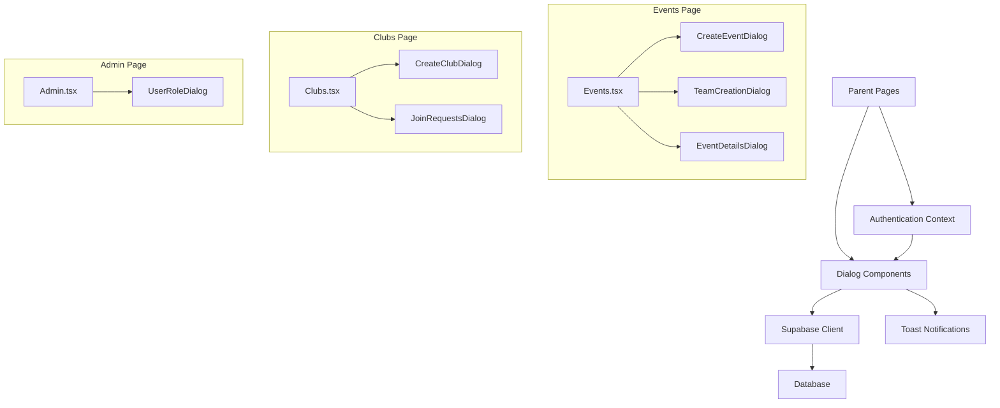
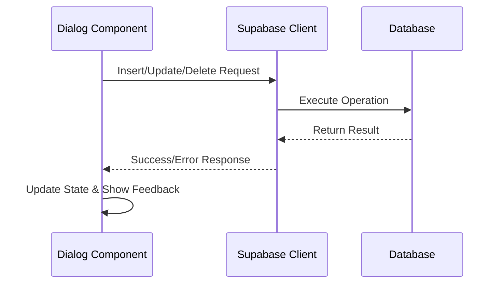

# Feature Components

<cite>
**Referenced Files in This Document**   
- [CreateEventDialog.tsx](file://src/components/Events/CreateEventDialog.tsx)
- [TeamCreationDialog.tsx](file://src/components/Events/TeamCreationDialog.tsx)
- [CreateClubDialog.tsx](file://src/components/Clubs/CreateClubDialog.tsx)
- [JoinRequestsDialog.tsx](file://src/components/Clubs/JoinRequestsDialog.tsx)
- [UserRoleDialog.tsx](file://src/components/Admin/UserRoleDialog.tsx)
- [Events.tsx](file://src/pages/Events.tsx)
- [Clubs.tsx](file://src/pages/Clubs.tsx)
- [Admin.tsx](file://src/pages/Admin.tsx)
- [client.ts](file://src/integrations/supabase/client.ts)
- [useAuth.tsx](file://src/hooks/useAuth.tsx)
</cite>

## Table of Contents
1. [Introduction](#introduction)
2. [Core Dialog Components Overview](#core-dialog-components-overview)
3. [Event Management Components](#event-management-components)
4. [Club Management Components](#club-management-components)
5. [Administrative Components](#administrative-components)
6. [Data Flow and Supabase Integration](#data-flow-and-supabase-integration)
7. [Form Handling and Validation](#form-handling-and-validation)
8. [Authentication and Authorization](#authentication-and-authorization)
9. [Error Handling and User Feedback](#error-handling-and-user-feedback)
10. [Accessibility and UX Considerations](#accessibility-and-ux-considerations)

## Introduction
This document details the dialog-driven feature components in the campus-connect application that encapsulate core functionality for event creation, team registration, club membership management, and user role administration. These components follow a consistent pattern of being triggered from parent pages (Events.tsx, Clubs.tsx, Admin.tsx) and interacting with Supabase via direct client calls for data persistence. The documentation covers component architecture, data flow, form handling, authentication context integration, error management, and user experience considerations.

## Core Dialog Components Overview
The application implements a modular dialog system for feature-specific operations, with each dialog component encapsulating a distinct business function. These components follow a consistent design pattern using the UI library's Dialog component and are conditionally rendered based on user roles and application state. The dialog components are triggered by user interactions on parent pages and manage their own state, form data, and Supabase interactions independently.

**Diagram sources**
- [Events.tsx](file://src/pages/Events.tsx)
- [Clubs.tsx](file://src/pages/Clubs.tsx)
- [Admin.tsx](file://src/pages/Admin.tsx)

## Event Management Components

### CreateEventDialog Component
The CreateEventDialog component enables authorized users to create new events for clubs. It is triggered from the Events page when a user with appropriate permissions clicks the "Create Event" button. The component fetches clubs based on the user's role (college_admin can create events for any approved club, while club_admin can only create events for clubs they administer) and provides a form for event details including title, description, location, time, capacity, and team event designation.

The dialog handles form submission by validating dates (ensuring end time is after start time) and inserting event data into the Supabase "events" table. Upon successful creation, it resets the form, closes the dialog, and triggers a callback to refresh the events list. The component manages loading states during API calls and provides user feedback through toast notifications.

**Section sources**
- [CreateEventDialog.tsx](file://src/components/Events/CreateEventDialog.tsx)
- [Events.tsx](file://src/pages/Events.tsx)

### TeamCreationDialog Component
The TeamCreationDialog component facilitates team creation for team-based events. It is triggered from the Events page when a user attempts to register for a team event. The component allows users to create a team with a specified name, automatically assigning them as the team leader. Upon team creation, it inserts a record into the "teams" table and adds the user as a team member in the "team_members" table.

The dialog implements a two-step process: first creating the team, then optionally opening a TeamInviteDialog to invite additional members. This sequential flow ensures data consistency and provides a guided user experience. The component manages the team creation state and provides appropriate feedback through toast notifications, including a suggestion to invite members after successful team creation.

**Section sources**
- [TeamCreationDialog.tsx](file://src/components/Events/TeamCreationDialog.tsx)
- [Events.tsx](file://src/pages/Events.tsx)

## Club Management Components

### CreateClubDialog Component
The CreateClubDialog component allows college administrators to create new clubs within the system. Access to this component is restricted to users with the "college_admin" role. When triggered from the Clubs page, it presents a form for club name and description. Upon submission, it inserts a new record into the "clubs" table with the created_by field set to the current user's ID and approved set to true (as clubs created by college admins are automatically approved).

The component implements role-based access control at the component level, returning null if the current user does not have college_admin privileges. This prevents unauthorized users from even seeing the create club option. The dialog provides immediate feedback through toast notifications upon successful club creation or error conditions.

**Section sources**
- [CreateClubDialog.tsx](file://src/components/Clubs/CreateClubDialog.tsx)
- [Clubs.tsx](file://src/pages/Clubs.tsx)

### JoinRequestsDialog Component
The JoinRequestsDialog component enables club administrators to manage membership requests for their clubs. It is triggered from the Clubs page via a button that displays the count of pending requests. When opened, the dialog fetches all pending join requests for the associated club, enriching the request data with applicant profile information (name, USN, branch).

The component displays each request in a card format with applicant details and a message (if provided), along with approve and reject buttons. When a request is processed, the component updates the request status in the "join_requests" table and, if approved, adds the applicant as a member in the "club_members" table. The dialog manages loading states during data fetching and provides real-time feedback through toast notifications.

**Section sources**
- [JoinRequestsDialog.tsx](file://src/components/Clubs/JoinRequestsDialog.tsx)
- [Clubs.tsx](file://src/pages/Clubs.tsx)

## Administrative Components

### UserRoleDialog Component
The UserRoleDialog component provides college administrators with the ability to manage user roles system-wide. Access is restricted to users with the "college_admin" role. The dialog displays a list of all users with their current roles indicated by color-coded badges and provides a select dropdown to change each user's role (student, club_admin, college_admin).

When a role change is initiated, the component updates the user's role in the "profiles" table and refreshes the user list to reflect the change. The interface shows a loading spinner during the update process to prevent multiple submissions. This component serves as a central tool for user management and permission assignment within the application.

**Section sources**
- [UserRoleDialog.tsx](file://src/components/Admin/UserRoleDialog.tsx)
- [Admin.tsx](file://src/pages/Admin.tsx)

## Data Flow and Supabase Integration
All dialog components interact directly with Supabase through the shared client instance, following a consistent pattern of data operations. The components import the Supabase client from "@/integrations/supabase/client" and use it to perform CRUD operations on the database.

**Diagram sources**
- [client.ts](file://src/integrations/supabase/client.ts)
- [CreateEventDialog.tsx](file://src/components/Events/CreateEventDialog.tsx)
- [JoinRequestsDialog.tsx](file://src/components/Clubs/JoinRequestsDialog.tsx)

The data flow follows a unidirectional pattern: user input in the dialog form is collected in component state, validated, and then sent to Supabase via the appropriate table operation (insert, update, select). Success or error responses are handled locally within the component, with appropriate user feedback provided through toast notifications and UI state updates.

## Form Handling and Validation
The dialog components implement form handling using controlled components with React state, rather than external form libraries like React Hook Form or Zod. Each form field is bound to a state variable, with onChange handlers that update the form data object. This approach provides fine-grained control over form state and enables real-time validation and feedback.

Form validation is implemented at multiple levels:
- HTML5 validation attributes (required, type, min, etc.)
- Client-side JavaScript validation (date comparisons in CreateEventDialog)
- Server-side validation through Supabase row-level security and constraints

The components provide immediate feedback for validation errors, either through inline messages or toast notifications. Loading states are managed during form submission to prevent duplicate submissions and provide visual feedback to users.

**Section sources**
- [CreateEventDialog.tsx](file://src/components/Events/CreateEventDialog.tsx)
- [CreateClubDialog.tsx](file://src/components/Clubs/CreateClubDialog.tsx)

## Authentication and Authorization
All dialog components integrate with the application's authentication context through the useAuth hook, which provides access to the current user, session, and profile data. This information is used for both data operations (setting created_by fields, checking permissions) and conditional rendering (showing/hiding components based on role).

Role-based access control is implemented at multiple levels:
- Component level (returning null for unauthorized users)
- UI level (conditionally rendering buttons and options)
- Data level (filtering queries based on user role and permissions)

The authorization model follows a hierarchy where college_admin has full system access, club_admin has administrative privileges for specific clubs, and regular users have limited access based on their memberships.

**Section sources**
- [useAuth.tsx](file://src/hooks/useAuth.tsx)
- [CreateEventDialog.tsx](file://src/components/Events/CreateEventDialog.tsx)
- [UserRoleDialog.tsx](file://src/components/Admin/UserRoleDialog.tsx)

## Error Handling and User Feedback
The dialog components implement comprehensive error handling to provide a resilient user experience. All Supabase operations are wrapped in try-catch blocks, with errors handled gracefully and communicated to users through toast notifications. Network failures, permission denials, and validation errors are all handled with appropriate error messages.

Success states are managed through positive feedback, including success toast notifications and automatic UI updates (form resets, list refreshes). The components maintain loading states during asynchronous operations to prevent user confusion and multiple submissions.

Toast notifications are used consistently across all components, with different variants (destructive for errors, default for successes) to convey the nature of the feedback. This consistent feedback system helps users understand the outcome of their actions and any necessary next steps.

**Section sources**
- [CreateEventDialog.tsx](file://src/components/Events/CreateEventDialog.tsx)
- [JoinRequestsDialog.tsx](file://src/components/Clubs/JoinRequestsDialog.tsx)
- [useAuth.tsx](file://src/hooks/useAuth.tsx)

## Accessibility and UX Considerations
The dialog components follow accessibility best practices by using semantic HTML elements, proper labeling, and keyboard navigation support. The UI library components (Dialog, Button, Input, etc.) are designed with accessibility in mind, providing screen reader support and keyboard interaction.

Loading states are clearly indicated through spinners and disabled buttons to prevent user confusion during asynchronous operations. Form fields include appropriate labels and placeholders to guide user input. Error messages are descriptive and actionable, helping users understand and correct issues.

The components are designed with responsive layouts that adapt to different screen sizes, ensuring usability on both desktop and mobile devices. Visual feedback is provided through color coding (badge variants for roles and statuses) and iconography to enhance user understanding of the interface.

**Section sources**
- [CreateEventDialog.tsx](file://src/components/Events/CreateEventDialog.tsx)
- [JoinRequestsDialog.tsx](file://src/components/Clubs/JoinRequestsDialog.tsx)
- [UserRoleDialog.tsx](file://src/components/Admin/UserRoleDialog.tsx)