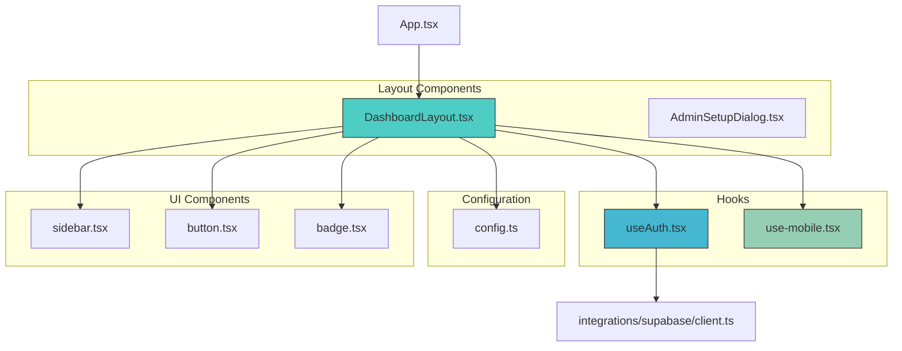
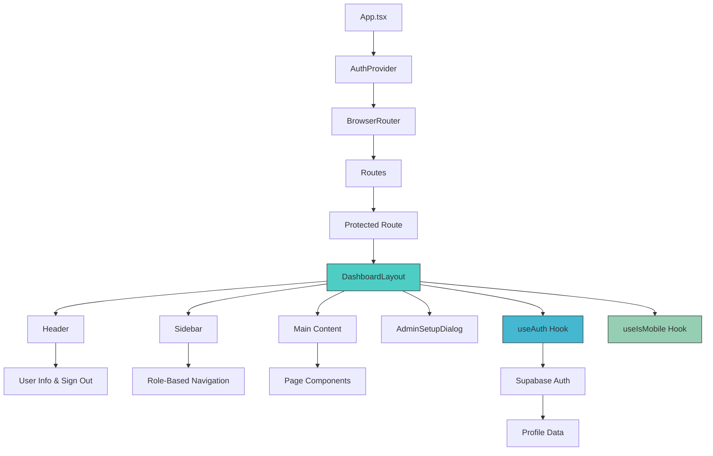
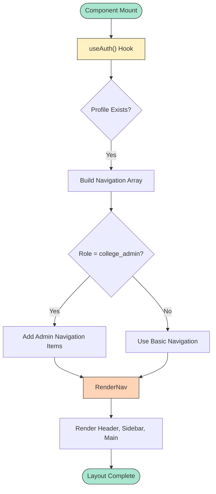
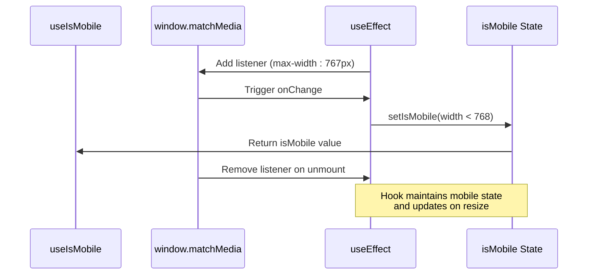
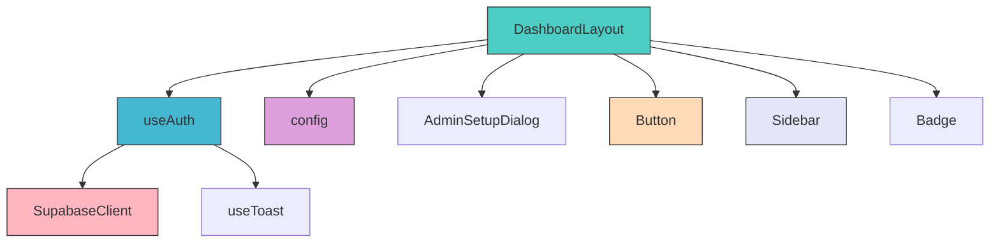

# Layout Components

<cite>
**Referenced Files in This Document**   
- [DashboardLayout.tsx](file://src/components/Layout/DashboardLayout.tsx)
- [App.tsx](file://src/App.tsx)
- [use-mobile.tsx](file://src/hooks/use-mobile.tsx)
- [useAuth.tsx](file://src/hooks/useAuth.tsx)
- [config.ts](file://src/lib/config.ts)
</cite>

## Table of Contents
1. [Introduction](#introduction)
2. [Project Structure](#project-structure)
3. [Core Components](#core-components)
4. [Architecture Overview](#architecture-overview)
5. [Detailed Component Analysis](#detailed-component-analysis)
6. [Dependency Analysis](#dependency-analysis)
7. [Performance Considerations](#performance-considerations)
8. [Troubleshooting Guide](#troubleshooting-guide)
9. [Conclusion](#conclusion)

## Introduction
The layout system in campus-connect is designed to provide a consistent, role-aware, and responsive user interface across all authenticated pages. At the heart of this system is the `DashboardLayout` component, which orchestrates navigation, role-based access control, and shared UI elements such as the header, sidebar, and footer. This document details how the layout components work together to deliver a seamless experience across device sizes and user roles, while integrating with Supabase for authentication and profile management.

## Project Structure
The layout components are organized under the `src/components/Layout` directory, with `DashboardLayout.tsx` serving as the primary structural wrapper for authenticated routes. The layout system leverages utility hooks from `src/hooks`, UI components from `src/components/ui`, and configuration from `src/lib/config`. Responsive behavior is managed via the `useIsMobile` hook, and authentication state is provided globally through the `AuthProvider`.

**Diagram sources**
- [DashboardLayout.tsx](file://src/components/Layout/DashboardLayout.tsx#L1-L163)
- [App.tsx](file://src/App.tsx#L1-L38)
- [use-mobile.tsx](file://src/hooks/use-mobile.tsx#L1-L19)
- [useAuth.tsx](file://src/hooks/useAuth.tsx#L1-L197)

**Section sources**
- [DashboardLayout.tsx](file://src/components/Layout/DashboardLayout.tsx#L1-L163)
- [App.tsx](file://src/App.tsx#L1-L38)

## Core Components
The `DashboardLayout` component is the central orchestrator of the application’s UI structure. It wraps all authenticated routes and provides a consistent interface with dynamic navigation based on user role. It integrates with `useAuth` to access user and profile data, conditionally rendering navigation items and UI elements. The layout includes a header with user information and sign-out functionality, a sidebar with role-specific navigation, and a main content area that renders child components.

The `use-mobile` hook enables responsive behavior by detecting screen size changes and adjusting the UI accordingly. While not directly used in `DashboardLayout`, it is available for future enhancements such as collapsible sidebar on mobile.

**Section sources**
- [DashboardLayout.tsx](file://src/components/Layout/DashboardLayout.tsx#L1-L163)
- [use-mobile.tsx](file://src/hooks/use-mobile.tsx#L1-L19)

## Architecture Overview
The layout architecture follows a wrapper pattern where `DashboardLayout` is used as a container for authenticated pages. The `App` component sets up routing and authentication context, ensuring that only authenticated users can access routes wrapped by `DashboardLayout`. The layout dynamically adapts based on user role, showing additional navigation items for administrators.

**Diagram sources**
- [App.tsx](file://src/App.tsx#L1-L38)
- [DashboardLayout.tsx](file://src/components/Layout/DashboardLayout.tsx#L1-L163)
- [useAuth.tsx](file://src/hooks/useAuth.tsx#L1-L197)

## Detailed Component Analysis

### DashboardLayout Analysis
The `DashboardLayout` component serves as the structural foundation for authenticated views. It receives `children` as a prop and renders them within a consistent UI shell that includes header, sidebar, and main content regions.

#### Role-Based Navigation
The navigation menu is dynamically constructed based on the user’s role, accessed via `useAuth`. Students see basic navigation, while college administrators see additional links to the Admin Panel and Users section. This is implemented using conditional array spreading in the `navigation` definition.

**Diagram sources**
- [DashboardLayout.tsx](file://src/components/Layout/DashboardLayout.tsx#L25-L45)

#### Header and User Interface
The header displays the application name, user role badge, and user information. The role badge uses conditional styling based on the user’s role, with distinct variants for college admins, club admins, and students. The sign-out button triggers the `signOut` function from `useAuth`, providing feedback via toast notifications.

**Section sources**
- [DashboardLayout.tsx](file://src/components/Layout/DashboardLayout.tsx#L50-L80)
- [useAuth.tsx](file://src/hooks/useAuth.tsx#L150-L170)

#### Admin Setup Integration
For non-student users, an "Admin Setup" button appears in the header, which opens the `AdminSetupDialog`. This dialog allows initial configuration of the admin environment and triggers a page reload upon completion to ensure role updates are reflected.

**Section sources**
- [DashboardLayout.tsx](file://src/components/Layout/DashboardLayout.tsx#L142-L163)
- [AdminSetupDialog.tsx](file://src/components/Admin/AdminSetupDialog.tsx#L1-L350)

### Responsive Design with use-mobile
The `useIsMobile` hook leverages `window.matchMedia` to detect screen size changes and determine if the current viewport is below the 768px breakpoint. Although not currently used in `DashboardLayout`, this hook is designed to support responsive adaptations such as collapsible sidebars or mobile navigation patterns.

**Diagram sources**
- [use-mobile.tsx](file://src/hooks/use-mobile.tsx#L1-L19)

**Section sources**
- [use-mobile.tsx](file://src/hooks/use-mobile.tsx#L1-L19)

## Dependency Analysis
The layout components depend on several key modules:

**Diagram sources**
- [DashboardLayout.tsx](file://src/components/Layout/DashboardLayout.tsx#L1-L163)
- [useAuth.tsx](file://src/hooks/useAuth.tsx#L1-L197)
- [config.ts](file://src/lib/config.ts#L1-L71)

**Section sources**
- [DashboardLayout.tsx](file://src/components/Layout/DashboardLayout.tsx#L1-L163)
- [useAuth.tsx](file://src/hooks/useAuth.tsx#L1-L197)
- [config.ts](file://src/lib/config.ts#L1-L71)

## Performance Considerations
The layout system incorporates several performance optimizations:

- **Lazy Profile Loading**: The `useAuth` hook defers profile fetching using `setTimeout(0)` to avoid blocking the initial render, improving perceived performance.
- **Efficient State Updates**: The `useIsMobile` hook only updates state when necessary, using a media query listener to minimize re-renders.
- **Conditional Rendering**: Navigation items are conditionally included based on role, reducing DOM complexity for non-admin users.
- **Toast Integration**: Notifications are handled via `useToast`, ensuring non-blocking user feedback.

While code splitting is not explicitly implemented for layout components, the modular structure supports future lazy loading of routes and components.

**Section sources**
- [useAuth.tsx](file://src/hooks/useAuth.tsx#L60-L80)
- [use-mobile.tsx](file://src/hooks/use-mobile.tsx#L1-L19)

## Troubleshooting Guide
Common issues and solutions related to layout components:

- **Navigation not updating after role change**: Trigger a page reload to refresh the profile data, as seen in the `AdminSetupDialog` completion handler.
- **Mobile detection not working**: Ensure the `useIsMobile` hook is used within a component that re-renders on window resize.
- **Profile data not loading**: Verify Supabase session persistence and check console for authentication errors.
- **Role badges not displaying correctly**: Confirm the `profile.role` value matches expected enum values ('student', 'club_admin', 'college_admin').

**Section sources**
- [DashboardLayout.tsx](file://src/components/Layout/DashboardLayout.tsx#L30-L45)
- [useAuth.tsx](file://src/hooks/useAuth.tsx#L60-L80)

## Conclusion
The layout system in campus-connect provides a robust, role-aware foundation for the application’s UI. By centralizing navigation, authentication integration, and responsive design patterns in `DashboardLayout`, the system ensures consistency and scalability across features. Future enhancements could include mobile-optimized layouts using the `useIsMobile` hook and further performance optimizations through code splitting and hydration timing improvements.