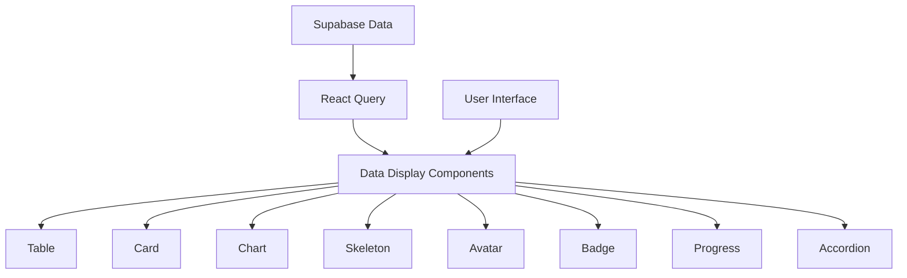
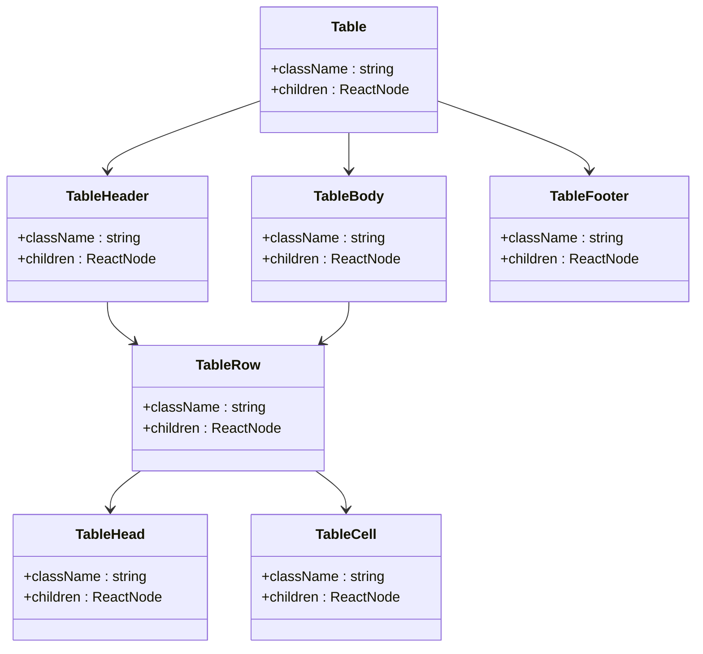
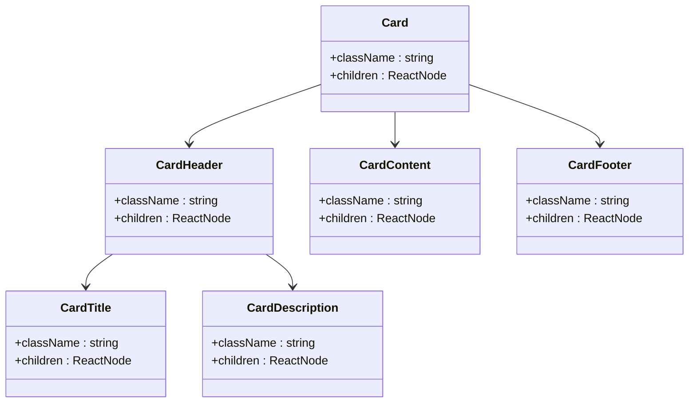
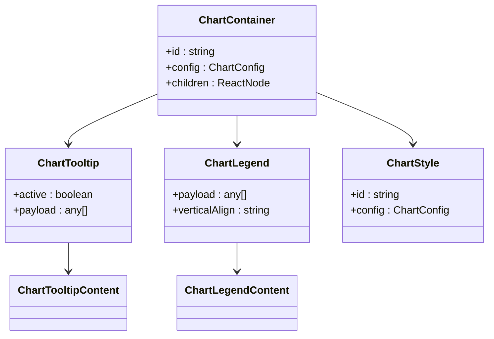
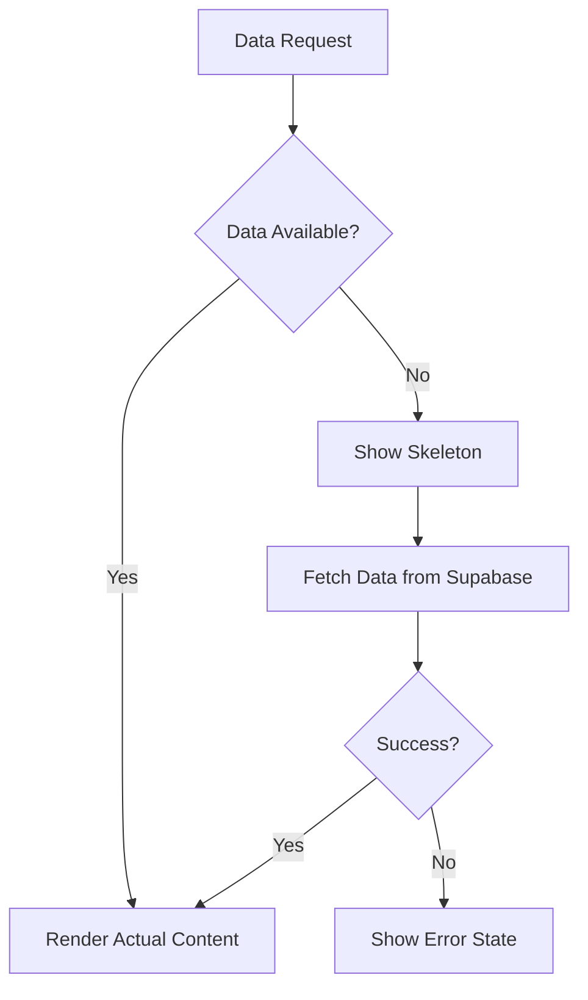
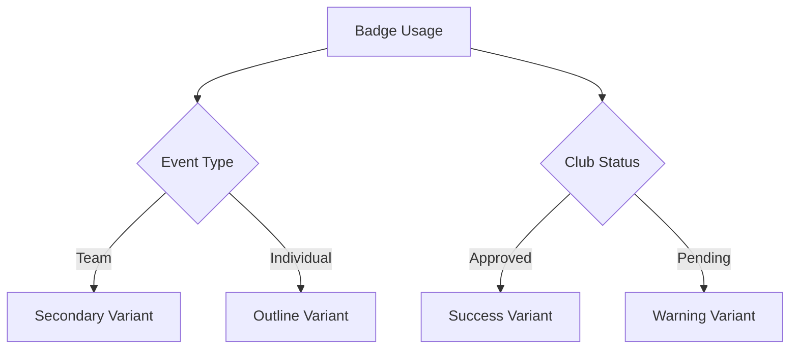
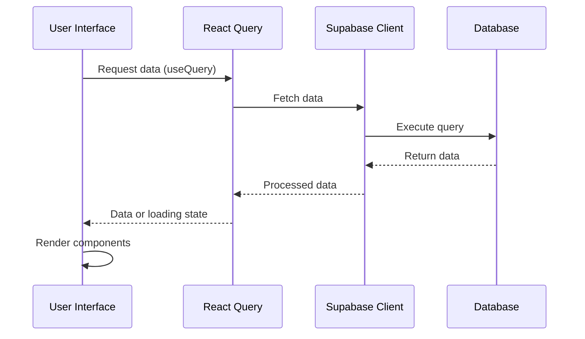

# Data Display Components

<cite>
**Referenced Files in This Document**   
- [table.tsx](file://src/components/ui/table.tsx)
- [card.tsx](file://src/components/ui/card.tsx)
- [chart.tsx](file://src/components/ui/chart.tsx)
- [skeleton.tsx](file://src/components/ui/skeleton.tsx)
- [avatar.tsx](file://src/components/ui/avatar.tsx)
- [badge.tsx](file://src/components/ui/badge.tsx)
- [progress.tsx](file://src/components/ui/progress.tsx)
- [accordion.tsx](file://src/components/ui/accordion.tsx)
- [Clubs.tsx](file://src/pages/Clubs.tsx)
- [Events.tsx](file://src/pages/Events.tsx)
- [Admin.tsx](file://src/pages/Admin.tsx)
- [client.ts](file://src/integrations/supabase/client.ts)
- [useAuth.tsx](file://src/hooks/useAuth.tsx)
</cite>

## Table of Contents
1. [Introduction](#introduction)
2. [Data Display Components Overview](#data-display-components-overview)
3. [Table Component](#table-component)
4. [Card Component](#card-component)
5. [Chart Component](#chart-component)
6. [Loading States with Skeleton](#loading-states-with-skeleton)
7. [Supporting Components](#supporting-components)
8. [Data Integration with Supabase](#data-integration-with-supabase)
9. [Performance Optimization](#performance-optimization)
10. [Accessibility Considerations](#accessibility-considerations)

## Introduction
This document provides comprehensive documentation for the data display components used in the Campus Connect application. It details how structured data from Supabase is rendered across key pages including Events.tsx, Clubs.tsx, and Admin.tsx. The documentation covers component implementation, data integration patterns, and user experience considerations for table, card, accordion, chart, avatar, badge, progress, and skeleton components.

## Data Display Components Overview
The application utilizes a comprehensive set of data display components to present information in an organized and user-friendly manner. These components work together to create consistent user interfaces across different pages while handling various data types and loading states.

**Diagram sources**
- [table.tsx](file://src/components/ui/table.tsx)
- [card.tsx](file://src/components/ui/card.tsx)
- [chart.tsx](file://src/components/ui/chart.tsx)
- [skeleton.tsx](file://src/components/ui/skeleton.tsx)

**Section sources**
- [Clubs.tsx](file://src/pages/Clubs.tsx)
- [Events.tsx](file://src/pages/Events.tsx)
- [Admin.tsx](file://src/pages/Admin.tsx)

## Table Component
The table component provides a structured way to display tabular data with support for sorting and responsive layouts. It is implemented using a collection of React components that work together to create accessible and styled tables.

**Diagram sources**
- [table.tsx](file://src/components/ui/table.tsx#L0-L72)

**Section sources**
- [table.tsx](file://src/components/ui/table.tsx#L0-L72)
- [Clubs.tsx](file://src/pages/Clubs.tsx)

## Card Component
The card component is used extensively throughout the application to display event and club listings with consistent styling and layout. It supports various content types including images, metadata, and action buttons.

**Diagram sources**
- [card.tsx](file://src/components/ui/card.tsx#L0-L43)

**Section sources**
- [card.tsx](file://src/components/ui/card.tsx#L0-L43)
- [Events.tsx](file://src/pages/Events.tsx#L193-L222)
- [Clubs.tsx](file://src/pages/Clubs.tsx)

## Chart Component
The chart component enables data visualization for dashboard statistics using client-side data aggregation. It integrates with Recharts to provide various chart types for displaying metrics and trends.

**Diagram sources**
- [chart.tsx](file://src/components/ui/chart.tsx#L0-L303)

**Section sources**
- [chart.tsx](file://src/components/ui/chart.tsx#L0-L303)
- [Admin.tsx](file://src/pages/Admin.tsx#L288-L313)
- [AttendanceDashboard.tsx](file://src/components/Events/AttendanceDashboard.tsx#L115-L158)

## Loading States with Skeleton
The skeleton component provides visual feedback during data loading by displaying placeholder elements that mimic the final content layout. This improves perceived performance and user experience.

**Diagram sources**
- [skeleton.tsx](file://src/components/ui/skeleton.tsx#L0-L7)

**Section sources**
- [skeleton.tsx](file://src/components/ui/skeleton.tsx#L0-L7)
- [Clubs.tsx](file://src/pages/Clubs.tsx#L30-L76)

## Supporting Components
Several supporting components enhance the data display functionality by providing additional visual elements and metadata indicators.

### Avatar Component
The avatar component displays user or organization images with fallback initials when images are not available.

### Badge Component
The badge component highlights status information such as event types (team vs individual) and approval statuses.

**Section sources**
- [badge.tsx](file://src/components/ui/badge.tsx)
- [Events.tsx](file://src/pages/Events.tsx#L193-L222)
- [EventDetailsDialog.tsx](file://src/components/Events/EventDetailsDialog.tsx#L88-L123)

### Progress Component
The progress component visualizes completion percentages and other quantitative metrics.

### Accordion Component
The accordion component manages content organization by allowing users to expand and collapse sections.

## Data Integration with Supabase
The application integrates with Supabase to fetch and display structured data across various pages. Data loading is managed through React Query for efficient state management and caching.

**Diagram sources**
- [client.ts](file://src/integrations/supabase/client.ts)
- [useAuth.tsx](file://src/hooks/useAuth.tsx)
- [Clubs.tsx](file://src/pages/Clubs.tsx#L30-L76)

**Section sources**
- [client.ts](file://src/integrations/supabase/client.ts)
- [useAuth.tsx](file://src/hooks/useAuth.tsx)
- [Clubs.tsx](file://src/pages/Clubs.tsx#L30-L76)
- [Events.tsx](file://src/pages/Events.tsx)

## Performance Optimization
The application implements several performance optimizations to ensure smooth rendering of data display components, especially when handling large datasets.

### Virtualization and Pagination
Large datasets are handled through pagination and virtualized rendering to minimize memory usage and improve scroll performance.

### Data Fetching Strategy
React Query is used to implement efficient data fetching with automatic caching, background updates, and request deduplication.

### Image Optimization
Images in card components are optimized through lazy loading and appropriate sizing to reduce initial page load time.

**Section sources**
- [Clubs.tsx](file://src/pages/Clubs.tsx)
- [Events.tsx](file://src/pages/Events.tsx)
- [Admin.tsx](file://src/pages/Admin.tsx)

## Accessibility Considerations
The data display components are designed with accessibility in mind to ensure usability for all users, including those using assistive technologies.

### Semantic HTML
Components use proper semantic HTML elements to provide meaningful structure to screen readers.

### Screen Reader Announcements
Dynamic content updates trigger appropriate screen reader announcements to inform users of changes.

### Keyboard Navigation
Interactive elements within components support keyboard navigation and focus management.

### Color Contrast
Text and background colors maintain sufficient contrast ratios to meet accessibility standards.

**Section sources**
- [table.tsx](file://src/components/ui/table.tsx)
- [card.tsx](file://src/components/ui/card.tsx)
- [chart.tsx](file://src/components/ui/chart.tsx)