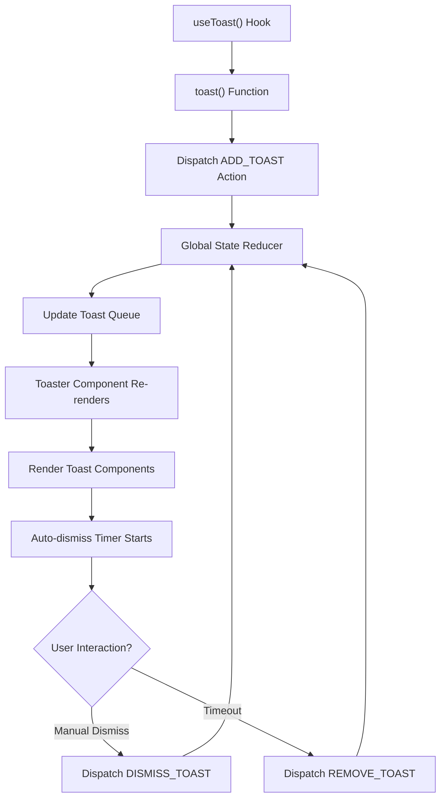
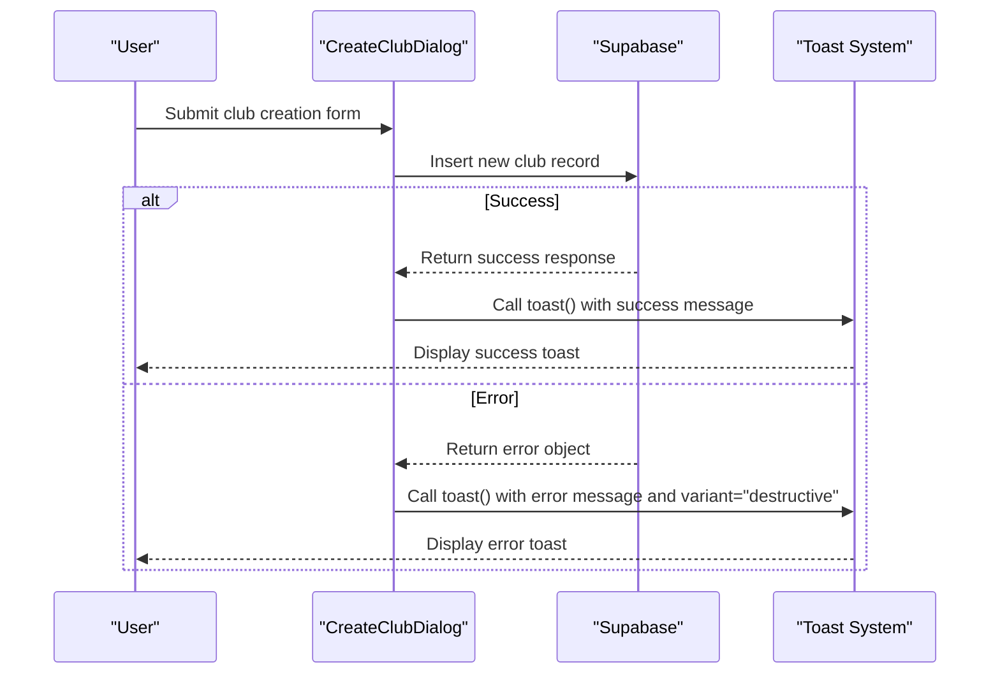
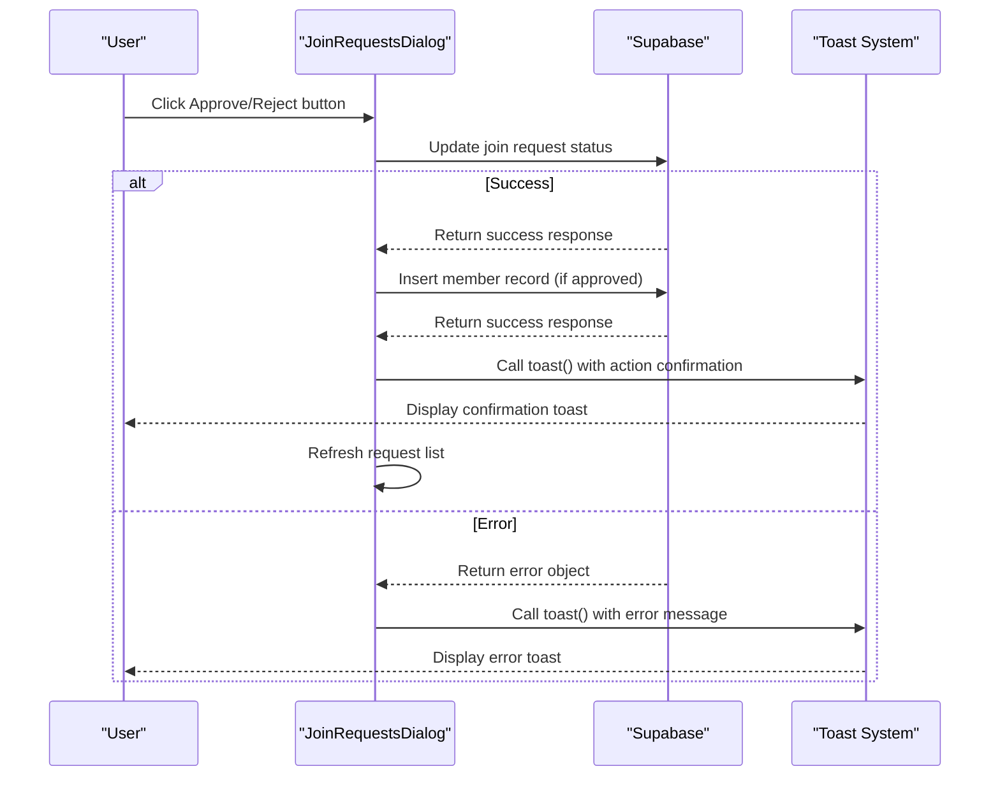
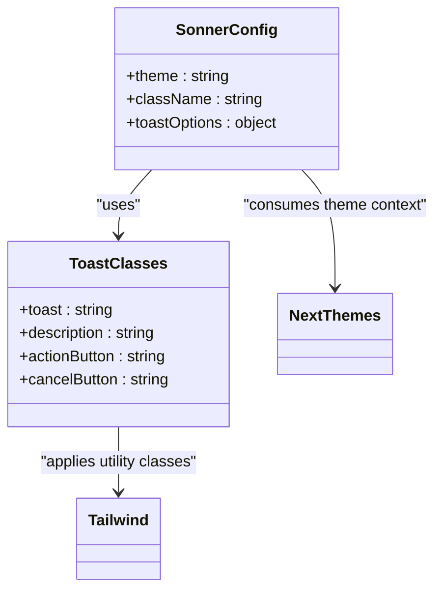
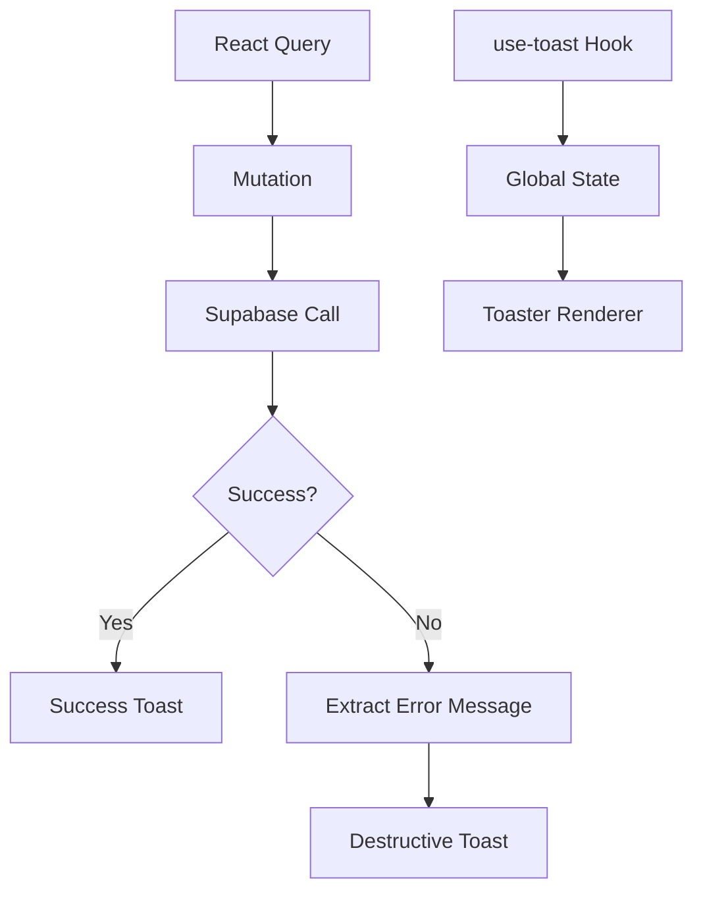

# Feedback Components

<cite>
**Referenced Files in This Document**   
- [toast.tsx](file://src/components/ui/toast.tsx)
- [toaster.tsx](file://src/components/ui/toaster.tsx)
- [use-toast.ts](file://src/hooks/use-toast.ts)
- [sonner.tsx](file://src/components/ui/sonner.tsx)
- [alert.tsx](file://src/components/ui/alert.tsx)
- [CreateClubDialog.tsx](file://src/components/Clubs/CreateClubDialog.tsx)
- [JoinRequestsDialog.tsx](file://src/components/Clubs/JoinRequestsDialog.tsx)
- [App.tsx](file://src/App.tsx)
</cite>

## Table of Contents
1. [Introduction](#introduction)
2. [Core Components Overview](#core-components-overview)
3. [Toast Notification System Architecture](#toast-notification-system-architecture)
4. [Component Integration and Usage](#component-integration-and-usage)
5. [Theming and Styling with Tailwind](#theming-and-styling-with-tailwind)
6. [Accessibility Features](#accessibility-features)
7. [Error Handling and React Query Integration](#error-handling-and-react-query-integration)
8. [User Interaction and Behavior](#user-interaction-and-behavior)
9. [Conclusion](#conclusion)

## Introduction
The feedback system in the Campus Connect application provides real-time user notifications through toast messages and alert components. These components deliver immediate visual feedback for user actions such as club creation, event registration, and role updates. The system is built on a combination of Sonner and Radix UI primitives, integrated with React Query for mutation feedback and Supabase for backend error handling. This document details the architecture, implementation, and usage patterns of the feedback components across the application.

## Core Components Overview

The feedback system consists of several interconnected components that work together to provide a consistent user experience:

- **toast**: Base component for individual notification messages
- **toaster**: Container that manages and renders toast notifications
- **use-toast**: Hook that provides toast creation and management functions
- **sonner**: Themed wrapper for the Sonner toast library
- **alert**: Persistent notification component for important information

These components are designed to support multiple variants (success, error, info) and integrate seamlessly with the application's UI framework.

**Section sources**
- [toast.tsx](file://src/components/ui/toast.tsx#L1-L111)
- [toaster.tsx](file://src/components/ui/toaster.tsx#L1-L24)
- [use-toast.ts](file://src/hooks/use-toast.ts#L1-L186)
- [sonner.tsx](file://src/components/ui/sonner.tsx#L1-L27)
- [alert.tsx](file://src/components/ui/alert.tsx#L1-L43)

## Toast Notification System Architecture

The toast notification system follows a centralized state management pattern using a reducer-based architecture. When a toast is triggered via the `use-toast` hook, it dispatches actions to a global state store that manages the toast queue.

**Diagram sources**
- [use-toast.ts](file://src/hooks/use-toast.ts#L1-L186)
- [toaster.tsx](file://src/components/ui/toaster.tsx#L1-L24)

The system enforces a toast limit of one notification at a time (`TOAST_LIMIT = 1`) and uses a long removal delay (`TOAST_REMOVE_DELAY = 1000000`) to prevent premature removal. Toasts are automatically dismissed when the user closes them, triggering the appropriate state updates.

**Section sources**
- [use-toast.ts](file://src/hooks/use-toast.ts#L1-L186)

## Component Integration and Usage

The feedback components are integrated into key application workflows, particularly in dialog components that handle user actions. Two primary examples demonstrate this integration:

### CreateClubDialog Integration
The `CreateClubDialog` component uses toast notifications to provide feedback during club creation. When a college administrator attempts to create a new club, the system displays success or error messages based on the Supabase database operation result.

**Diagram sources**
- [CreateClubDialog.tsx](file://src/components/Clubs/CreateClubDialog.tsx#L1-L125)
- [use-toast.ts](file://src/hooks/use-toast.ts#L1-L186)

### JoinRequestsDialog Integration
The `JoinRequestsDialog` component uses toast notifications to confirm approval or rejection of club membership requests. Each action (approve/reject) triggers a toast message that confirms the outcome of the operation.

**Diagram sources**
- [JoinRequestsDialog.tsx](file://src/components/Clubs/JoinRequestsDialog.tsx#L1-L228)
- [use-toast.ts](file://src/hooks/use-toast.ts#L1-L186)

## Theming and Styling with Tailwind

The feedback components are styled using Tailwind CSS and integrate with the application's theme system through Next Themes. The styling ensures consistency across all components and adapts to the user's preferred color scheme.

The `sonner.tsx` component configures the Sonner toast library with Tailwind classes that align with the application's design system:

**Diagram sources**
- [sonner.tsx](file://src/components/ui/sonner.tsx#L1-L27)
- [tailwind.config.ts](file://tailwind.config.ts#L1-L10)

The toast variants are defined using `class-variance-authority` (cva) to provide consistent styling for default and destructive variants, ensuring visual hierarchy and accessibility.

**Section sources**
- [toast.tsx](file://src/components/ui/toast.tsx#L1-L111)
- [sonner.tsx](file://src/components/ui/sonner.tsx#L1-L27)

## Accessibility Features

The feedback components incorporate several accessibility features to ensure they are usable by all users, including those using assistive technologies.

The toast system includes:
- **Live regions**: Automatically provided by Radix UI's toast primitive to announce notifications to screen readers
- **Focus management**: Toast actions are keyboard accessible and follow focus order
- **Semantic HTML**: Proper use of ARIA roles and attributes
- **Color contrast**: Sufficient contrast ratios for text and background colors

The `ToastClose` component includes proper focus ring styling and hover states, while the `ToastTitle` and `ToastDescription` components ensure proper heading hierarchy and text semantics.

**Section sources**
- [toast.tsx](file://src/components/ui/toast.tsx#L1-L111)

## Error Handling and React Query Integration

The feedback system is tightly integrated with Supabase error handling and React Query mutation feedback. When database operations fail, the error messages are propagated through the toast system to inform users of the issue.

In both `CreateClubDialog` and `JoinRequestsDialog`, Supabase client errors are caught and displayed using destructive variant toasts. The system extracts error messages from the Supabase response and presents them in a user-friendly format.

The App component wraps the entire application with both `Toaster` and `Sonner` components, ensuring that toast notifications are available globally across all routes and components.

**Diagram sources**
- [App.tsx](file://src/App.tsx#L1-L38)
- [CreateClubDialog.tsx](file://src/components/Clubs/CreateClubDialog.tsx#L1-L125)
- [JoinRequestsDialog.tsx](file://src/components/Clubs/JoinRequestsDialog.tsx#L1-L228)

**Section sources**
- [App.tsx](file://src/App.tsx#L1-L38)
- [use-toast.ts](file://src/hooks/use-toast.ts#L1-L186)

## User Interaction and Behavior

The toast system supports both automatic and manual dismissal behaviors:

- **Auto-dismiss**: Toasts remain visible until manually dismissed (due to high TOAST_REMOVE_DELAY)
- **Manual dismissal**: Users can close toasts by clicking the close button or swiping
- **Stacking behavior**: Only one toast is displayed at a time (TOAST_LIMIT = 1)
- **Action buttons**: Toasts can include action buttons for user interaction

The `ToastViewport` component controls the positioning and stacking order of toasts, placing them in the bottom-right corner on larger screens and at the top on mobile devices.

**Section sources**
- [toast.tsx](file://src/components/ui/toast.tsx#L1-L111)
- [toaster.tsx](file://src/components/ui/toaster.tsx#L1-L24)

## Conclusion

The feedback components in Campus Connect provide a robust, accessible, and visually consistent notification system that enhances the user experience. By integrating toast notifications with critical workflows like club creation and membership management, the system ensures users receive timely feedback about their actions. The architecture balances simplicity with functionality, using a global state reducer to manage toast lifecycle while maintaining clean integration points through the `use-toast` hook. With proper theming, accessibility features, and error handling integration, the feedback system effectively communicates application state changes to users across all scenarios.