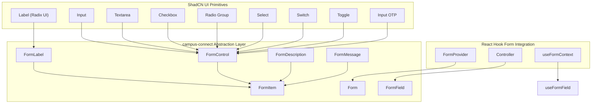
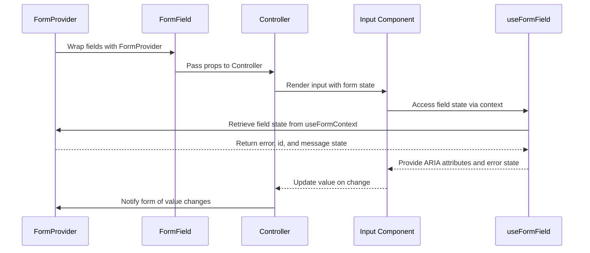
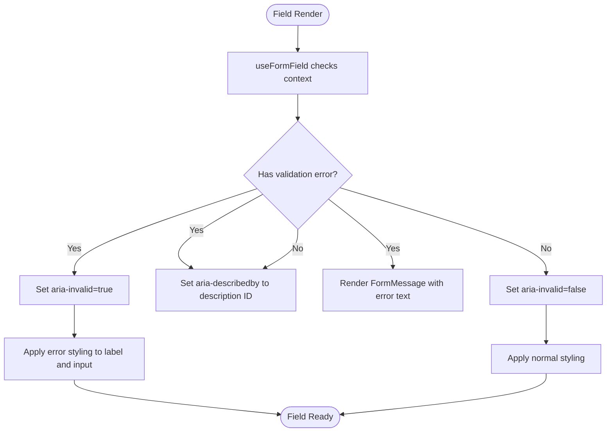
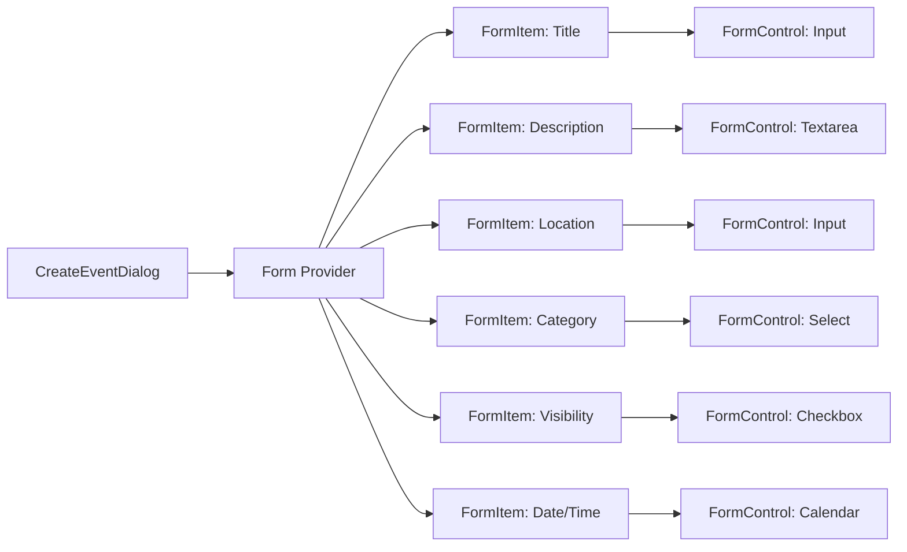

# Form Components

<cite>
**Referenced Files in This Document**   
- [form.tsx](file://src/components/ui/form.tsx)
- [input.tsx](file://src/components/ui/input.tsx)
- [textarea.tsx](file://src/components/ui/textarea.tsx)
- [checkbox.tsx](file://src/components/ui/checkbox.tsx)
- [radio-group.tsx](file://src/components/ui/radio-group.tsx)
- [select.tsx](file://src/components/ui/select.tsx)
- [label.tsx](file://src/components/ui/label.tsx)
- [switch.tsx](file://src/components/ui/switch.tsx)
- [toggle.tsx](file://src/components/ui/toggle.tsx)
- [input-otp.tsx](file://src/components/ui/input-otp.tsx)
- [Auth.tsx](file://src/pages/Auth.tsx)
- [CreateEventDialog.tsx](file://src/components/Events/CreateEventDialog.tsx)
- [utils.ts](file://src/lib/utils.ts)
</cite>

## Table of Contents
1. [Introduction](#introduction)
2. [Form Architecture Overview](#form-architecture-overview)
3. [Core Form Components](#core-form-components)
4. [Integration with React Hook Form](#integration-with-react-hook-form)
5. [Component Props and Accessibility](#component-props-and-accessibility)
6. [Validation and Error Handling](#validation-and-error-handling)
7. [Real-World Usage Examples](#real-world-usage-examples)
8. [Styling and Responsive Behavior](#styling-and-responsive-behavior)
9. [Performance Considerations](#performance-considerations)
10. [Conclusion](#conclusion)

## Introduction
The form components in campus-connect provide a robust, accessible, and reusable system for building user input interfaces. Built on top of ShadCN UI primitives and integrated with React Hook Form, these components streamline form creation across the application. This document details the implementation, usage, and best practices for form-related components including form, input, textarea, checkbox, radio group, select, label, switch, toggle, and input-otp.

## Form Architecture Overview

**Diagram sources**
- [form.tsx](file://src/components/ui/form.tsx#L1-L130)
- [label.tsx](file://src/components/ui/label.tsx#L1-L18)
- [input.tsx](file://src/components/ui/input.tsx#L1-L23)

## Core Form Components

### Input Components
The input components in campus-connect are built as wrappers around native HTML elements enhanced with Tailwind CSS styling and accessibility attributes. Each component is designed to work seamlessly within the form abstraction layer.

#### Text Input
The Input component provides a styled text input field with consistent focus states, disabled styling, and responsive behavior.

#### Textarea
The Textarea component supports multi-line input with minimum height constraints and consistent styling across devices.

#### Checkbox
The Checkbox component uses Radix UI's Checkbox primitive to provide accessible toggle functionality with visual feedback.

#### Radio Group
The RadioGroup and RadioGroupItem components implement mutually exclusive selection with proper keyboard navigation and ARIA roles.

#### Select
The Select component provides a fully accessible dropdown menu with scroll controls, grouping, and labeling capabilities.

#### Switch and Toggle
The Switch component offers a binary toggle with smooth animation, while the Toggle component supports on/off states within a button-like interface.

#### Input OTP
The Input OTP component facilitates one-time password entry with individual character fields and automatic focus management.

**Section sources**
- [input.tsx](file://src/components/ui/input.tsx#L1-L23)
- [textarea.tsx](file://src/components/ui/textarea.tsx#L1-L22)
- [checkbox.tsx](file://src/components/ui/checkbox.tsx#L1-L27)
- [radio-group.tsx](file://src/components/ui/radio-group.tsx#L1-L37)
- [select.tsx](file://src/components/ui/select.tsx#L1-L144)
- [switch.tsx](file://src/components/ui/switch.tsx#L1-L28)
- [toggle.tsx](file://src/components/ui/toggle.tsx#L1-L38)
- [input-otp.tsx](file://src/components/ui/input-otp.tsx)

## Integration with React Hook Form

**Diagram sources**
- [form.tsx](file://src/components/ui/form.tsx#L1-L130)
- [input.tsx](file://src/components/ui/input.tsx#L1-L23)

The form components integrate with React Hook Form through the `form.tsx` abstraction layer. The `Form` component is a wrapper around `FormProvider`, enabling access to form state throughout the component tree. The `FormField` component uses React Hook Form's `Controller` to connect UI components to form state, while `useFormField` provides contextual access to field-level state including errors, IDs, and message references.

## Component Props and Accessibility

### Accessibility Features
All form components include comprehensive accessibility attributes:
- Automatic ARIA labeling via `htmlFor` and `id` synchronization
- Dynamic `aria-invalid` and `aria-describedby` attributes based on validation state
- Proper focus management and keyboard navigation
- Screen reader support through descriptive messages and status announcements

### Prop Interfaces
Each component exposes a clear API that extends native HTML attributes while adding framework-specific functionality:
- **FormLabel**: Inherits `LabelPrimitive.Root` props with error state handling
- **FormControl**: Acts as a slot for controlled components with automatic ARIA binding
- **FormItem**: Provides spacing and context via `React.Context`
- **FormMessage**: Conditionally renders error messages with proper IDs

**Section sources**
- [form.tsx](file://src/components/ui/form.tsx#L1-L130)
- [label.tsx](file://src/components/ui/label.tsx#L1-L18)

## Validation and Error Handling

**Diagram sources**
- [form.tsx](file://src/components/ui/form.tsx#L45-L129)

Validation is handled through React Hook Form's validation engine, with visual and semantic feedback provided by the form component system. The `useFormField` hook retrieves field state including errors, which are then used to:
- Set `aria-invalid` on form controls
- Connect description and error messages via `aria-describedby`
- Style labels and inputs with error states
- Conditionally render error messages using `FormMessage`

Error messages are only displayed when a field has a validation error, ensuring clean presentation during normal operation.

## Real-World Usage Examples

### User Registration Form
The Auth.tsx page implements a registration form using the form component system for email, password, and confirmation fields. It demonstrates:
- Email validation with pattern matching
- Password strength requirements
- Confirm password matching validation
- Submit handling with loading states
- Error display for authentication failures

### Event Creation Form
The CreateEventDialog.tsx component showcases a complex form with:
- Text inputs for title and location
- Textarea for description
- Select dropdown for category selection
- Checkbox for public/private toggle
- Date and time pickers (built on form primitives)
- Dynamic field handling for team creation

**Section sources**
- [Auth.tsx](file://src/pages/Auth.tsx)
- [CreateEventDialog.tsx](file://src/components/Events/CreateEventDialog.tsx)

## Styling and Responsive Behavior

### Tailwind CSS Integration
All components use the `cn` utility from `utils.ts` to merge class names, enabling:
- Consistent base styling across components
- Theme-aware color application
- Responsive sizing with `md:text-sm` and similar utilities
- Focus ring management with `focus-visible`

### Mobile Considerations
Components are optimized for mobile input:
- Adequate touch target sizes (minimum 44px)
- Proper input types for mobile keyboards
- Responsive text sizing
- OTP input with mobile-friendly spacing
- Scrollable select menus with touch navigation

### Utility Functions
The `utils.ts` file provides the `cn` function that combines `clsx` and `tailwind-merge` to ensure class precedence and eliminate conflicts, critical for maintaining consistent styling when overriding component classes.

**Section sources**
- [utils.ts](file://src/lib/utils.ts)
- [input.tsx](file://src/components/ui/input.tsx#L1-L23)
- [form.tsx](file://src/components/ui/form.tsx#L1-L130)

## Performance Considerations

### Rendering Optimization
The form component system is designed with performance in mind:
- Context minimization through focused `FormFieldContext` and `FormItemContext`
- Memoization potential via React Hook Form's built-in optimization
- Lightweight component wrappers with minimal re-renders
- Efficient class merging with `tailwind-merge`

### Large Form Handling
For forms with dynamic fields such as team creation:
- Virtualization is not implemented but recommended for very large lists
- Field arrays are managed efficiently by React Hook Form
- Conditional rendering avoids unnecessary component mounts
- Batch updates minimize re-renders during form initialization

### Best Practices
- Use `shouldUnregister: false` for consistent field registration
- Leverage `resolver` for complex validation scenarios
- Implement loading states to prevent multiple submissions
- Use `disabled` attributes during submission to prevent race conditions

## Conclusion
The form component system in campus-connect provides a comprehensive solution for building accessible, maintainable, and performant forms. By combining ShadCN UI primitives with React Hook Form, the implementation offers a consistent developer experience while ensuring high-quality user interactions. The architecture supports both simple inputs and complex, dynamic forms, making it suitable for the diverse needs of the campus-connect application.