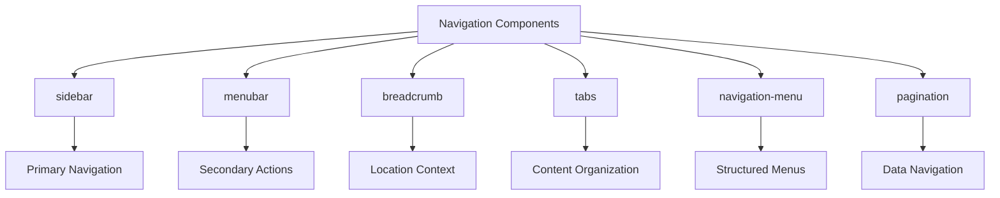
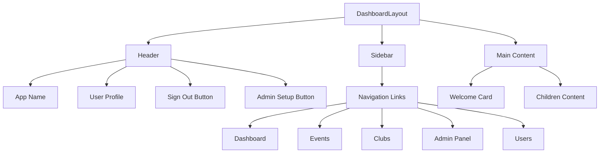
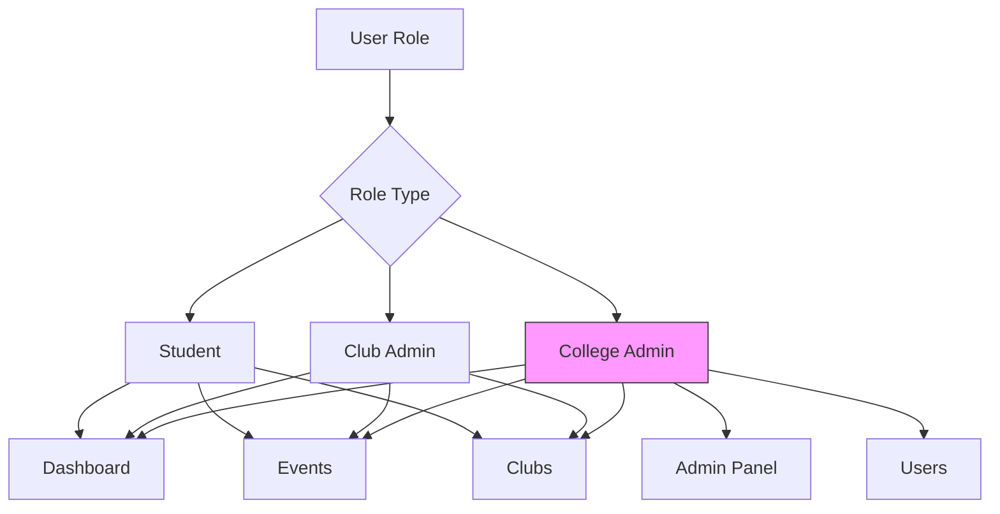
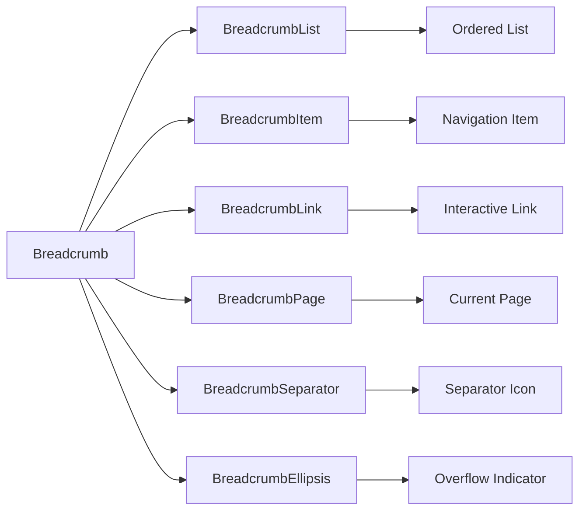
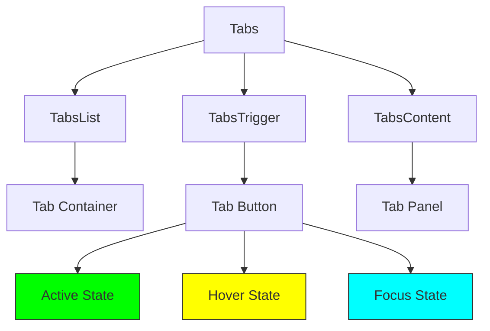
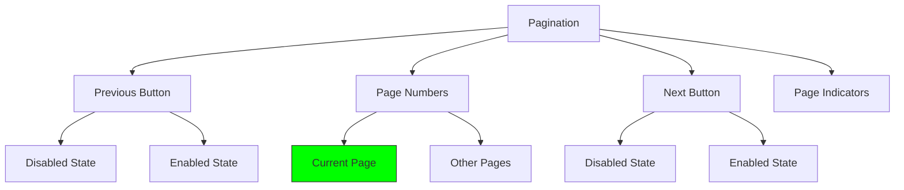
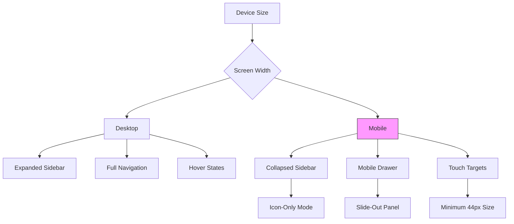
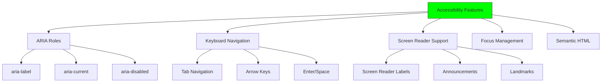
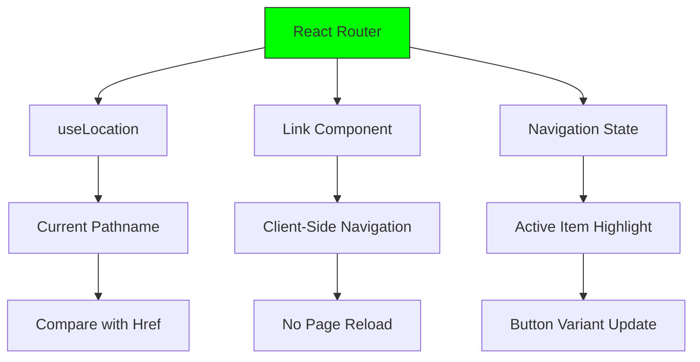

# Navigation Components

<cite>
**Referenced Files in This Document**   
- [DashboardLayout.tsx](file://src/components/Layout/DashboardLayout.tsx)
- [Admin.tsx](file://src/pages/Admin.tsx)
- [breadcrumb.tsx](file://src/components/ui/breadcrumb.tsx)
- [navigation-menu.tsx](file://src/components/ui/navigation-menu.tsx)
- [tabs.tsx](file://src/components/ui/tabs.tsx)
- [sidebar.tsx](file://src/components/ui/sidebar.tsx)
- [menubar.tsx](file://src/components/ui/menubar.tsx)
</cite>

## Table of Contents
1. [Introduction](#introduction)
2. [Core Navigation Components](#core-navigation-components)
3. [DashboardLayout Structure](#dashboardlayout-structure)
4. [Role-Based Access and Menubar](#role-based-access-and-menubar)
5. [Breadcrumb Implementation](#breadcrumb-implementation)
6. [Tabs for Feature Module Navigation](#tabs-for-feature-module-navigation)
7. [Pagination and Data Navigation](#pagination-and-data-navigation)
8. [Responsive Design and Mobile Behavior](#responsive-design-and-mobile-behavior)
9. [Accessibility Features](#accessibility-features)
10. [Integration with React Router](#integration-with-react-router)
11. [Conclusion](#conclusion)

## Introduction
This document provides a comprehensive analysis of the navigation components within the Campus Connect application. It details how navigation-menu, tabs, breadcrumb, sidebar, menubar, and pagination elements structure user navigation across the DashboardLayout and feature modules such as Events, Clubs, and Admin. The documentation covers integration with React Router for URL-driven navigation and active state management, role-based access control in navigation elements, responsive design considerations, and accessibility features including ARIA roles and keyboard navigation.

## Core Navigation Components

The application implements a suite of navigation components from the UI library to create a cohesive navigation experience. These components include sidebar for primary navigation, menubar for secondary actions, breadcrumb for location context, tabs for content organization, and navigation-menu for structured menus.

**Diagram sources**
- [sidebar.tsx](file://src/components/ui/sidebar.tsx)
- [menubar.tsx](file://src/components/ui/menubar.tsx)
- [breadcrumb.tsx](file://src/components/ui/breadcrumb.tsx)
- [tabs.tsx](file://src/components/ui/tabs.tsx)
- [navigation-menu.tsx](file://src/components/ui/navigation-menu.tsx)

**Section sources**
- [sidebar.tsx](file://src/components/ui/sidebar.tsx#L1-L638)
- [menubar.tsx](file://src/components/ui/menubar.tsx#L1-L208)

## DashboardLayout Structure

The DashboardLayout component serves as the central navigation container, organizing the sidebar, header, and main content areas. It implements role-based navigation by conditionally rendering menu items based on the user's profile role, providing different navigation options for students, club admins, and college admins.

**Diagram sources**
- [DashboardLayout.tsx](file://src/components/Layout/DashboardLayout.tsx#L1-L164)

**Section sources**
- [DashboardLayout.tsx](file://src/components/Layout/DashboardLayout.tsx#L1-L164)

## Role-Based Access and Menubar

The navigation system implements role-based access control through conditional rendering of menu items in the sidebar. The Admin Panel and Users sections are only visible to college administrators, while club admins and students have access to different subsets of functionality.

**Diagram sources**
- [DashboardLayout.tsx](file://src/components/Layout/DashboardLayout.tsx#L25-L35)
- [Admin.tsx](file://src/pages/Admin.tsx#L25-L45)

**Section sources**
- [DashboardLayout.tsx](file://src/components/Layout/DashboardLayout.tsx#L20-L45)
- [Admin.tsx](file://src/pages/Admin.tsx#L20-L50)

## Breadcrumb Implementation

The breadcrumb component provides hierarchical navigation context, allowing users to understand their current location within the application and navigate back to parent sections. Implemented using the Breadcrumb, BreadcrumbList, BreadcrumbItem, and BreadcrumbLink components, it follows accessibility best practices with proper ARIA labels.

**Diagram sources**
- [breadcrumb.tsx](file://src/components/ui/breadcrumb.tsx#L1-L91)

**Section sources**
- [breadcrumb.tsx](file://src/components/ui/breadcrumb.tsx#L1-L91)

## Tabs for Feature Module Navigation

The tabs component provides a way to organize content within feature modules, allowing users to switch between different views without leaving the current page. Implemented with Tabs, TabsList, TabsTrigger, and TabsContent components, it supports keyboard navigation and screen reader accessibility.

**Diagram sources**
- [tabs.tsx](file://src/components/ui/tabs.tsx#L1-L54)

**Section sources**
- [tabs.tsx](file://src/components/ui/tabs.tsx#L1-L54)

## Pagination and Data Navigation

While not explicitly shown in the provided code, the pagination component is available in the UI library and would be used for navigating through large datasets in feature modules like Events and Clubs. It provides controls for moving between pages of data with proper accessibility attributes.

**Diagram sources**
- [pagination.tsx](file://src/components/ui/pagination.tsx)

**Section sources**
- [pagination.tsx](file://src/components/ui/pagination.tsx)

## Responsive Design and Mobile Behavior

The navigation components implement responsive design principles to ensure usability across device sizes. The sidebar collapses into a mobile-friendly drawer on smaller screens, and touch targets are appropriately sized for mobile interaction.

**Diagram sources**
- [sidebar.tsx](file://src/components/ui/sidebar.tsx#L100-L150)
- [use-mobile.tsx](file://src/hooks/use-mobile.tsx)

**Section sources**
- [sidebar.tsx](file://src/components/ui/sidebar.tsx#L1-L638)
- [use-mobile.tsx](file://src/hooks/use-mobile.tsx)

## Accessibility Features

The navigation components implement comprehensive accessibility features including ARIA roles, keyboard navigation support, and screen reader compatibility. Each component follows WCAG guidelines to ensure accessibility for all users.

**Diagram sources**
- [sidebar.tsx](file://src/components/ui/sidebar.tsx#L200-L250)
- [menubar.tsx](file://src/components/ui/menubar.tsx#L100-L150)
- [breadcrumb.tsx](file://src/components/ui/breadcrumb.tsx#L50-L70)

**Section sources**
- [sidebar.tsx](file://src/components/ui/sidebar.tsx#L1-L638)
- [menubar.tsx](file://src/components/ui/menubar.tsx#L1-L208)
- [breadcrumb.tsx](file://src/components/ui/breadcrumb.tsx#L1-L91)

## Integration with React Router

The navigation components are integrated with React Router for URL-driven navigation and active state management. The useLocation hook is used to determine the current route and highlight the active navigation item in the sidebar.

**Diagram sources**
- [DashboardLayout.tsx](file://src/components/Layout/DashboardLayout.tsx#L10-L15)
- [DashboardLayout.tsx](file://src/components/Layout/DashboardLayout.tsx#L60-L80)

**Section sources**
- [DashboardLayout.tsx](file://src/components/Layout/DashboardLayout.tsx#L1-L164)

## Conclusion
The navigation system in the Campus Connect application provides a comprehensive, accessible, and responsive user interface for navigating between feature modules. By leveraging React Router for URL-driven navigation and implementing role-based access control, the system ensures that users have appropriate access to functionality based on their roles. The use of standardized UI components for sidebar, menubar, breadcrumb, tabs, and other navigation elements creates a consistent user experience across the application. The implementation follows accessibility best practices, ensuring usability for all users regardless of their interaction method.