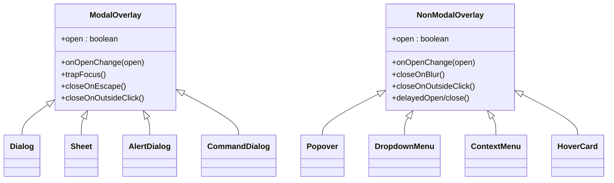
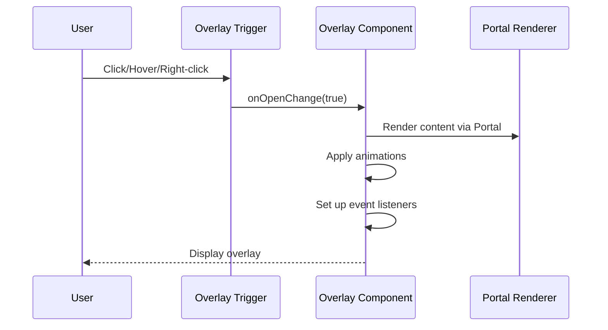
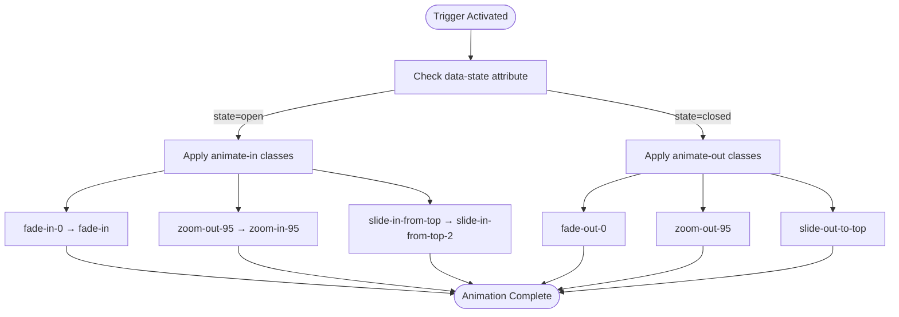
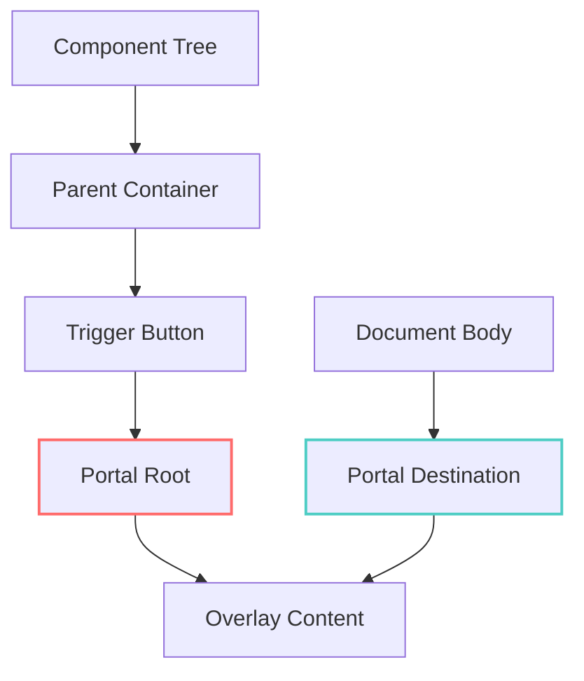
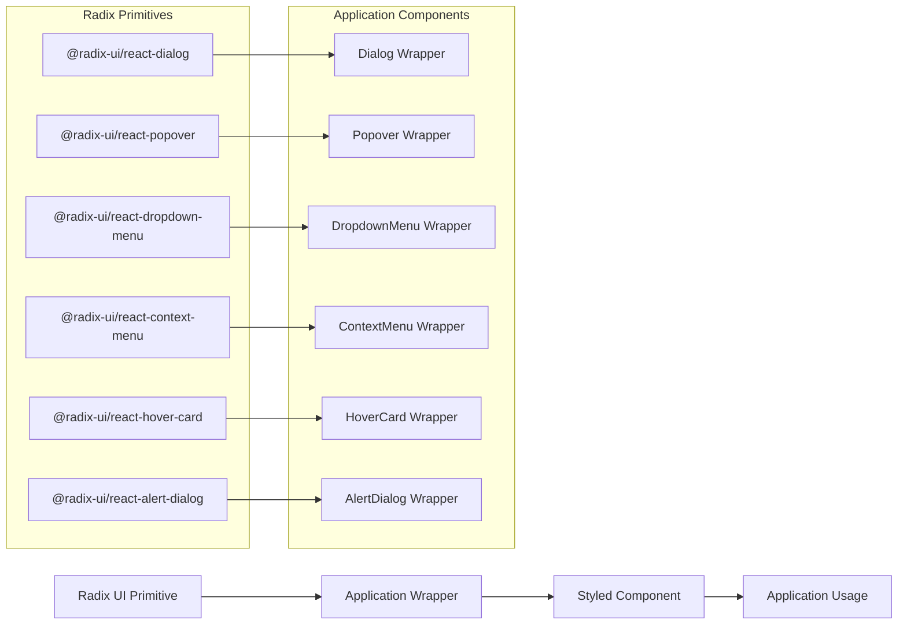
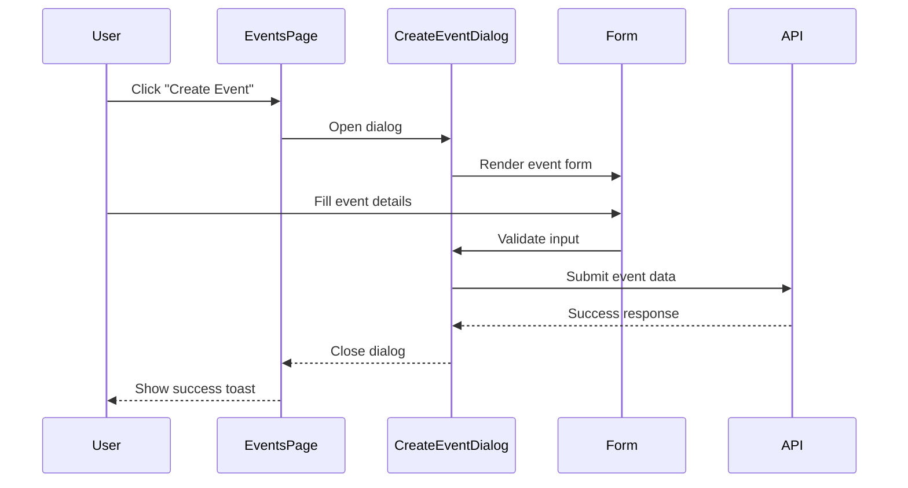
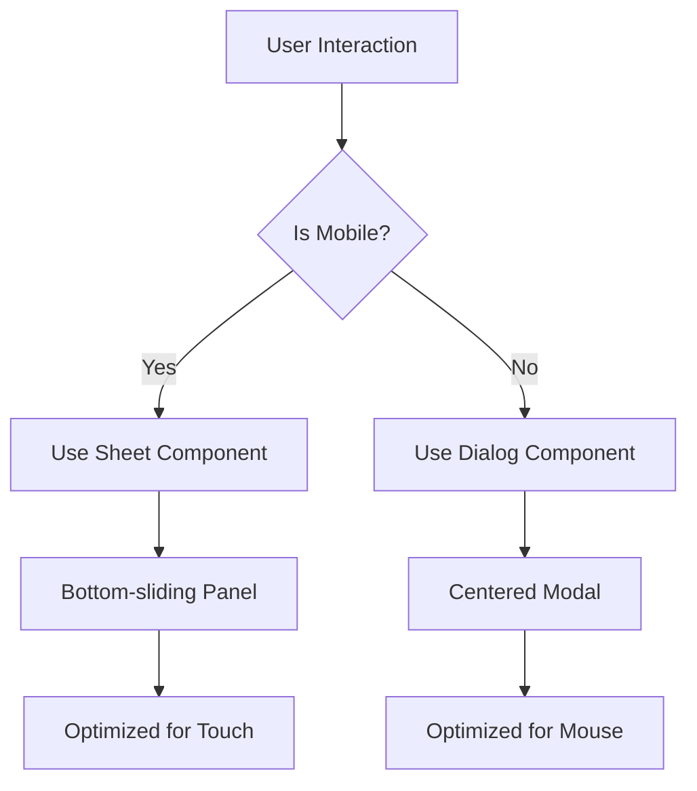

# Overlay Components

<cite>
**Referenced Files in This Document**   
- [dialog.tsx](file://src/components/ui/dialog.tsx)
- [sheet.tsx](file://src/components/ui/sheet.tsx)
- [popover.tsx](file://src/components/ui/popover.tsx)
- [alert-dialog.tsx](file://src/components/ui/alert-dialog.tsx)
- [command.tsx](file://src/components/ui/command.tsx)
- [dropdown-menu.tsx](file://src/components/ui/dropdown-menu.tsx)
- [context-menu.tsx](file://src/components/ui/context-menu.tsx)
- [hover-card.tsx](file://src/components/ui/hover-card.tsx)
- [CreateEventDialog.tsx](file://src/components/Events/CreateEventDialog.tsx)
- [UserRoleDialog.tsx](file://src/components/Admin/UserRoleDialog.tsx)
- [use-mobile.tsx](file://src/hooks/use-mobile.tsx)
</cite>

## Table of Contents
1. [Introduction](#introduction)
2. [Core Overlay Components](#core-overlay-components)
3. [Modal vs Non-Modal Behavior](#modal-vs-non-modal-behavior)
4. [Trigger Mechanisms and User Interaction](#trigger-mechanisms-and-user-interaction)
5. [Animation and Transition Patterns](#animation-and-transition-patterns)
6. [Portal Rendering and DOM Management](#portal-rendering-and-dom-management)
7. [Accessibility Features](#accessibility-features)
8. [Radix UI Integration](#radix-ui-integration)
9. [Styling with Tailwind CSS](#styling-with-tailwind-css)
10. [Component Usage in Events and Admin Modules](#component-usage-in-events-and-admin-modules)
11. [Z-Index and Layering Strategy](#z-index-and-layering-strategy)
12. [Keyboard Navigation](#keyboard-navigation)
13. [Mobile Responsiveness](#mobile-responsiveness)
14. [Conclusion](#conclusion)

## Introduction
Overlay components play a critical role in managing user interactions within the application, providing both modal and non-modal interfaces for tasks such as event creation, role assignment, navigation, and contextual actions. These components are built using Radix UI primitives and styled consistently with Tailwind CSS to ensure a cohesive user experience across all modules. This document details the implementation, behavior, and usage patterns of key overlay components including dialog, sheet, popover, alert-dialog, command, dropdown-menu, context-menu, and hover-card.

**Section sources**
- [dialog.tsx](file://src/components/ui/dialog.tsx#L1-L95)
- [sheet.tsx](file://src/components/ui/sheet.tsx#L1-L107)

## Core Overlay Components

The application utilizes a comprehensive suite of overlay components designed for different interaction patterns:

- **Dialog**: Modal dialog for focused tasks like form submission
- **Sheet**: Side-sliding panel, often used on mobile or for navigation
- **Popover**: Floating panel that appears on hover or click near an element
- **Alert Dialog**: Specialized dialog for confirmations and destructive actions
- **Command**: Command palette interface for quick navigation and actions
- **Dropdown Menu**: Contextual menu triggered from a button or action
- **Context Menu**: Right-click menu for contextual operations
- **Hover Card**: Informational tooltip displayed on hover

These components are implemented as reusable UI primitives in the `src/components/ui/` directory, ensuring consistent behavior and styling across the application.

**Section sources**
- [dialog.tsx](file://src/components/ui/dialog.tsx#L1-L95)
- [sheet.tsx](file://src/components/ui/sheet.tsx#L1-L107)
- [popover.tsx](file://src/components/ui/popover.tsx#L1-L29)
- [alert-dialog.tsx](file://src/components/ui/alert-dialog.tsx#L1-L104)
- [command.tsx](file://src/components/ui/command.tsx#L1-L132)
- [dropdown-menu.tsx](file://src/components/ui/dropdown-menu.tsx#L1-L179)
- [context-menu.tsx](file://src/components/ui/context-menu.tsx#L1-L178)
- [hover-card.tsx](file://src/components/ui/hover-card.tsx#L1-L27)

## Modal vs Non-Modal Behavior

Overlay components are categorized by their interaction model:

**Modal Components** (prevent interaction with underlying content):
- Dialog
- Sheet
- Alert Dialog
- Command Dialog

**Non-Modal Components** (allow background interaction):
- Popover
- Dropdown Menu
- Context Menu
- Hover Card

Modal components use focus trapping to maintain accessibility, while non-modal components typically close on blur or click outside. The distinction ensures appropriate user experience for different task types—modal for critical actions, non-modal for quick references.

**Diagram sources**
- [dialog.tsx](file://src/components/ui/dialog.tsx#L1-L95)
- [sheet.tsx](file://src/components/ui/sheet.tsx#L1-L107)
- [alert-dialog.tsx](file://src/components/ui/alert-dialog.tsx#L1-L104)
- [command.tsx](file://src/components/ui/command.tsx#L1-L132)
- [popover.tsx](file://src/components/ui/popover.tsx#L1-L29)
- [dropdown-menu.tsx](file://src/components/ui/dropdown-menu.tsx#L1-L179)
- [context-menu.tsx](file://src/components/ui/context-menu.tsx#L1-L178)
- [hover-card.tsx](file://src/components/ui/hover-card.tsx#L1-L27)

## Trigger Mechanisms and User Interaction

Overlay components are activated through various user interactions:

- **Click**: Primary trigger for dialogs, sheets, and menus
- **Right-click**: Context menu activation
- **Hover**: Hover card and some popover triggers
- **Keyboard shortcuts**: Command palette (typically Cmd+K/Ctrl+K)
- **Programmatic**: API calls from business logic

Each component exposes a `Trigger` element that initiates the overlay. For example, `DialogTrigger` wraps the button that opens a dialog, while `ContextMenuTrigger` wraps elements that should respond to right-clicks.

**Diagram sources**
- [dialog.tsx](file://src/components/ui/dialog.tsx#L1-L95)
- [context-menu.tsx](file://src/components/ui/context-menu.tsx#L1-L178)
- [hover-card.tsx](file://src/components/ui/hover-card.tsx#L1-L27)

## Animation and Transition Patterns

All overlay components implement consistent animation patterns using Radix UI's data-state attributes and Tailwind CSS transitions:

- **Fade**: opacity transitions (fade-in-0 to fade-in)
- **Scale**: transform scale (zoom-out-95 to zoom-in-95)
- **Slide**: positional transitions (slide-in-from-top, slide-in-from-left)
- **Duration**: 200ms for modals, 300-500ms for sheets

Animations are defined in className using data-state selectors like `data-[state=open]:animate-in` and `data-[state=closed]:animate-out`, ensuring smooth entry and exit transitions.

**Diagram sources**
- [dialog.tsx](file://src/components/ui/dialog.tsx#L1-L95)
- [sheet.tsx](file://src/components/ui/sheet.tsx#L1-L107)
- [popover.tsx](file://src/components/ui/popover.tsx#L1-L29)

## Portal Rendering and DOM Management

All overlay components use portal rendering to escape the parent DOM hierarchy and prevent clipping or z-index conflicts:

- Implemented via Radix UI's `Portal` components (`DialogPortal`, `PopoverPortal`, etc.)
- Renders overlay content at the end of the document body
- Prevents overflow clipping from parent containers
- Ensures proper stacking context

The portal pattern is essential for overlays that need to appear above navigation bars, modals, or other fixed elements regardless of their position in the component tree.

**Diagram sources**
- [dialog.tsx](file://src/components/ui/dialog.tsx#L1-L95)
- [sheet.tsx](file://src/components/ui/sheet.tsx#L1-L107)
- [popover.tsx](file://src/components/ui/popover.tsx#L1-L29)

## Accessibility Features

Overlay components implement comprehensive accessibility features:

- **Focus Trapping**: Modal components trap focus within the overlay
- **Keyboard Navigation**: Arrow keys, Enter, Escape, and Tab navigation
- **Screen Reader Support**: Proper ARIA labels and roles
- **SR-Only Elements**: Hidden text for screen readers (e.g., "Close" button)
- **Reduced Motion**: Respects user preferences via `prefers-reduced-motion`

Focus management is handled by Radix UI primitives, with overlays automatically returning focus to the triggering element when closed.

**Section sources**
- [dialog.tsx](file://src/components/ui/dialog.tsx#L1-L95)
- [sheet.tsx](file://src/components/ui/sheet.tsx#L1-L107)
- [alert-dialog.tsx](file://src/components/ui/alert-dialog.tsx#L1-L104)

## Radix UI Integration

All overlay components are built on Radix UI primitives, leveraging their unstyled, accessible foundation:

- **Radix Primitives Used**:
  - `@radix-ui/react-dialog`
  - `@radix-ui/react-popover`
  - `@radix-ui/react-dropdown-menu`
  - `@radix-ui/react-context-menu`
  - `@radix-ui/react-hover-card`
  - `@radix-ui/react-alert-dialog`
  - `@radix-ui/react-sheet` (via dialog primitive)

The application wraps these primitives with custom styling and default props while preserving their accessibility and behavior guarantees.

**Diagram sources**
- [package-lock.json](file://package-lock.json#L1583-L1618)
- [package-lock.json](file://package-lock.json#L1649-L1687)
- [package-lock.json](file://package-lock.json#L1851-L1886)

## Styling with Tailwind CSS

All overlay components use Tailwind CSS for consistent styling:

- **Consistent Classes**:
  - `z-50`: Standard z-index for overlays
  - `bg-popover`: Background color
  - `text-popover-foreground`: Text color
  - `shadow-md`: Standard shadow
  - `rounded-md`: Border radius
  - `border`: Border styling

- **Theming**: Variables like `bg-background`, `text-foreground` connect to the application's design system
- **Responsive**: Mobile adaptations using `sm:` breakpoints
- **Dark Mode**: Automatic support via Tailwind's dark variant

The `cn()` utility combines Radix UI default classes with application-specific styling for a cohesive look.

**Section sources**
- [dialog.tsx](file://src/components/ui/dialog.tsx#L1-L95)
- [sheet.tsx](file://src/components/ui/sheet.tsx#L1-L107)
- [popover.tsx](file://src/components/ui/popover.tsx#L1-L29)

## Component Usage in Events and Admin Modules

### Events Module
- **CreateEventDialog**: Modal dialog for event creation, composed with form components
- **EventDetailsDialog**: Displays comprehensive event information
- **TeamCreationDialog**: Facilitates team formation for events

**Diagram sources**
- [CreateEventDialog.tsx](file://src/components/Events/CreateEventDialog.tsx#L1-L100)

### Admin Module
- **UserRoleDialog**: Modal interface for assigning roles to users
- Utilizes table components to display user lists
- Implements form validation for role selection

The dialogs integrate with Supabase for real-time data synchronization and permission management.

**Section sources**
- [UserRoleDialog.tsx](file://src/components/Admin/UserRoleDialog.tsx#L1-L80)

## Z-Index and Layering Strategy

The application implements a consistent z-index hierarchy:

- `z-50`: Base level for most overlays (dialogs, popovers, menus)
- `z-40`: Secondary overlays or tooltips
- `z-60`: Higher priority overlays (command palette, critical alerts)
- `z-999`: Toast notifications (highest priority)

This strategy prevents overlay conflicts and ensures proper stacking order during complex interactions.

**Section sources**
- [dialog.tsx](file://src/components/ui/dialog.tsx#L1-L95)
- [sheet.tsx](file://src/components/ui/sheet.tsx#L1-L107)
- [command.tsx](file://src/components/ui/command.tsx#L1-L132)

## Keyboard Navigation

All overlay components support comprehensive keyboard navigation:

- **Tab/Shift+Tab**: Navigate between focusable elements
- **Enter/Space**: Activate selected items
- **Escape**: Close the overlay
- **Arrow Keys**: Navigate menu items
- **Ctrl+K/Cmd+K**: Open command palette
- **A-Z**: Typeahead navigation in command palette

The navigation patterns follow WAI-ARIA authoring practices for consistent user experience.

**Section sources**
- [dropdown-menu.tsx](file://src/components/ui/dropdown-menu.tsx#L1-L179)
- [command.tsx](file://src/components/ui/command.tsx#L1-L132)
- [context-menu.tsx](file://src/components/ui/context-menu.tsx#L1-L178)

## Mobile Responsiveness

The application adapts overlay behavior for mobile devices:

- **Sheet Replacement**: On small screens, dialogs often convert to sheets (bottom-sliding panels)
- **Touch Optimization**: Larger tap targets and swipe gestures
- **Full-Screen Adaptation**: Some overlays use full-screen layouts on mobile
- **Mobile Detection**: Hook `use-mobile.tsx` determines device type

**Diagram sources**
- [use-mobile.tsx](file://src/hooks/use-mobile.tsx#L1-L10)
- [sheet.tsx](file://src/components/ui/sheet.tsx#L1-L107)

## Conclusion
The overlay component system provides a robust foundation for user interactions across the application. By leveraging Radix UI primitives and Tailwind CSS, the implementation ensures accessibility, consistency, and responsiveness. The components are strategically used in critical workflows such as event creation and role management, with thoughtful consideration for both desktop and mobile experiences. The architecture supports easy composition with forms, tables, and other UI elements, making it a flexible solution for various interaction patterns.