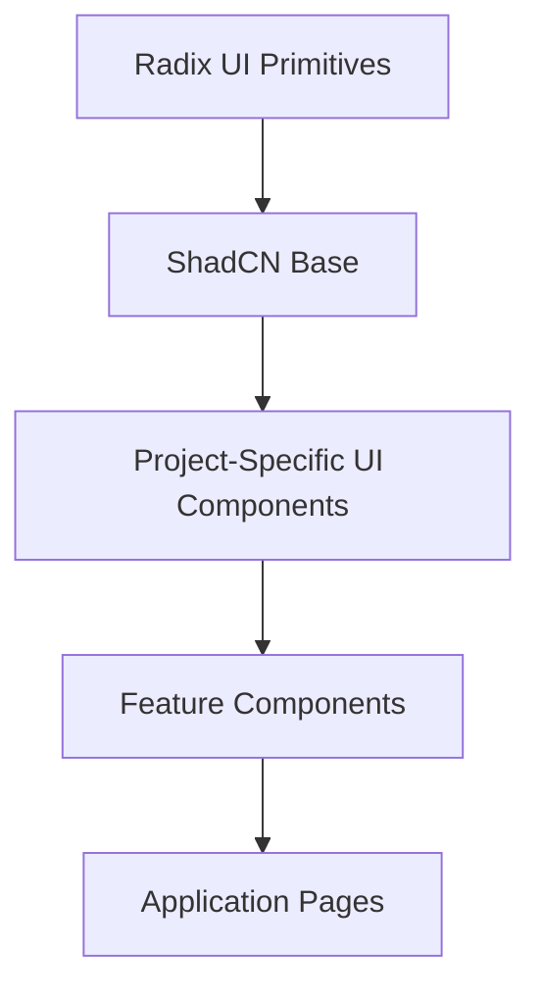
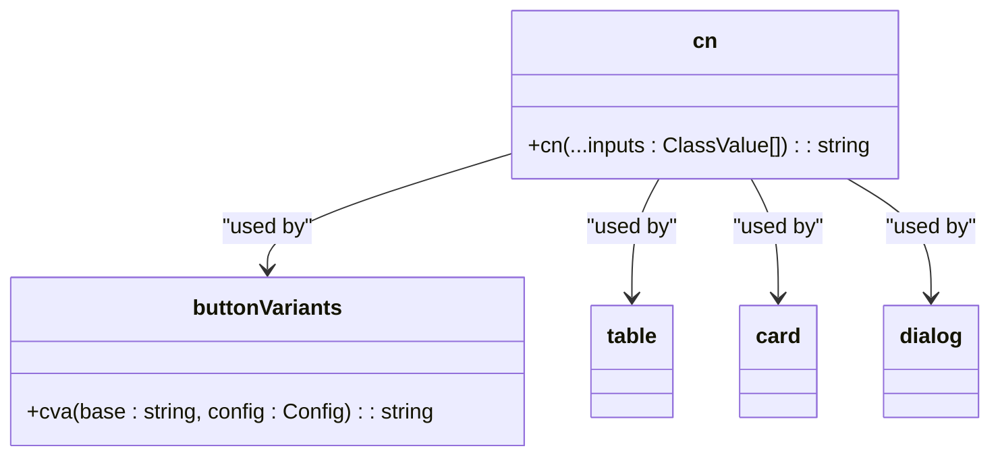
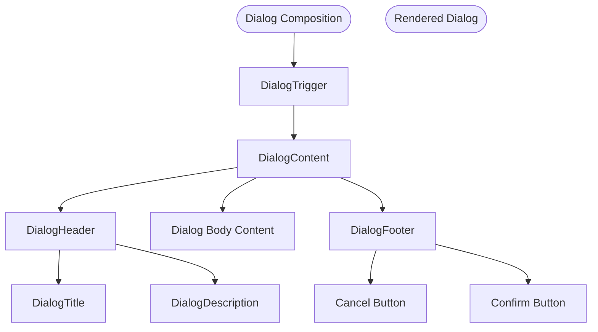
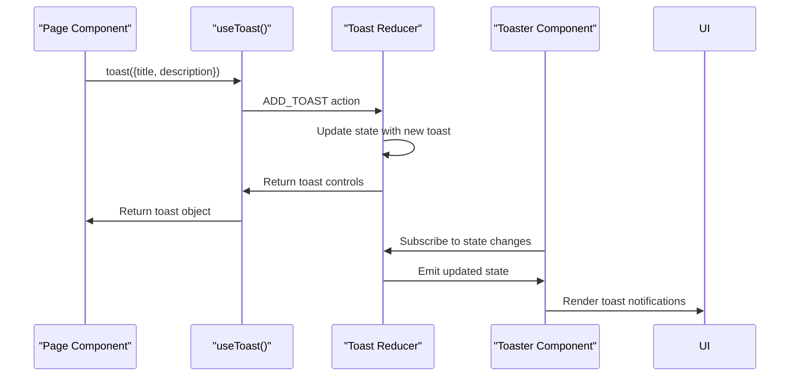

# UI Components

<cite>
**Referenced Files in This Document**  
- [button.tsx](file://src/components/ui/button.tsx)
- [dialog.tsx](file://src/components/ui/dialog.tsx)
- [form.tsx](file://src/components/ui/form.tsx)
- [table.tsx](file://src/components/ui/table.tsx)
- [card.tsx](file://src/components/ui/card.tsx)
- [toast.tsx](file://src/components/ui/toast.tsx)
- [toaster.tsx](file://src/components/ui/toaster.tsx)
- [use-toast.ts](file://src/hooks/use-toast.ts)
- [utils.ts](file://src/lib/utils.ts)
- [CreateEventDialog.tsx](file://src/components/Events/CreateEventDialog.tsx)
- [JoinRequestsDialog.tsx](file://src/components/Clubs/JoinRequestsDialog.tsx)
</cite>

## Table of Contents
1. [Introduction](#introduction)
2. [Core Component Architecture](#core-component-architecture)
3. [Styling and Utility Integration](#styling-and-utility-integration)
4. [Component Composition Patterns](#component-composition-patterns)
5. [Accessibility and ARIA Implementation](#accessibility-and-aria-implementation)
6. [Toast Notification System](#toast-notification-system)
7. [Usage Examples from Application Pages](#usage-examples-from-application-pages)
8. [Customization and Theme Integration](#customization-and-theme-integration)
9. [Performance Considerations](#performance-considerations)
10. [Conclusion](#conclusion)

## Introduction
The campus-connect application utilizes a robust system of reusable UI components built on ShadCN UI primitives. These components provide a consistent, accessible, and theme-aware interface across the application. This documentation details the architecture, implementation, and usage patterns of key components including button, dialog, form, table, card, and toast, with emphasis on their integration with Tailwind CSS, utility functions, and accessibility standards.

## Core Component Architecture

The UI component system follows an atomic design pattern, with base components in the `src/components/ui` directory serving as building blocks for higher-level features. Each component is implemented as a React forwardRef component to ensure proper ref forwarding and accessibility.

The architecture leverages Radix UI primitives for accessible, unstyled base behaviors, which are then enhanced with project-specific styling and logic. This separation ensures that interactive behaviors meet WCAG standards while allowing full visual customization.

**Diagram sources**
- [button.tsx](file://src/components/ui/button.tsx#L1-L47)
- [dialog.tsx](file://src/components/ui/dialog.tsx#L1-L95)

**Section sources**
- [button.tsx](file://src/components/ui/button.tsx#L1-L47)
- [dialog.tsx](file://src/components/ui/dialog.tsx#L1-L95)

## Styling and Utility Integration

All components utilize the `cn` utility function from `utils.ts` for conditional class composition. This function combines `clsx` and `tailwind-merge` to resolve Tailwind CSS class conflicts and enable dynamic styling.

The `button.tsx` component demonstrates the use of `cva` (Class Variance Authority) to define variant-based styling for different button types (default, destructive, outline, etc.) and sizes. Similar pattern is used across form, card, and toast components.

**Diagram sources**
- [utils.ts](file://src/lib/utils.ts#L1-L7)
- [button.tsx](file://src/components/ui/button.tsx#L8-L35)

**Section sources**
- [utils.ts](file://src/lib/utils.ts#L1-L7)
- [button.tsx](file://src/components/ui/button.tsx#L1-L47)

## Component Composition Patterns

Components are designed for composability, allowing complex interfaces to be built from atomic elements. The dialog system exemplifies this pattern, where `Dialog`, `DialogTrigger`, `DialogContent`, `DialogHeader`, `DialogTitle`, and `DialogDescription` can be combined freely.

Form components use React Hook Form integration through `FormField`, `FormItem`, `FormLabel`, `FormControl`, `FormDescription`, and `FormMessage`, enabling type-safe form handling with consistent styling and error presentation.

**Diagram sources**
- [dialog.tsx](file://src/components/ui/dialog.tsx#L1-L95)
- [form.tsx](file://src/components/ui/form.tsx#L1-L129)

**Section sources**
- [dialog.tsx](file://src/components/ui/dialog.tsx#L1-L95)
- [form.tsx](file://src/components/ui/form.tsx#L1-L129)

## Accessibility and ARIA Implementation

All components implement comprehensive accessibility features. The dialog component includes proper ARIA attributes such as `aria-describedby`, `aria-invalid`, and screen reader-only text elements (e.g., "Close" span with `sr-only` class).

Keyboard navigation is fully supported, with focus management in dialogs and proper tab ordering. The table component includes appropriate semantic HTML structure with `thead`, `tbody`, `tfoot`, `th`, and `td` elements, ensuring screen reader compatibility.

The form system automatically connects labels to inputs via generated IDs and provides ARIA attributes for error states, enhancing accessibility for users of assistive technologies.

**Section sources**
- [dialog.tsx](file://src/components/ui/dialog.tsx#L50-L95)
- [form.tsx](file://src/components/ui/form.tsx#L50-L129)
- [table.tsx](file://src/components/ui/table.tsx#L1-L72)

## Toast Notification System

The toast system provides a centralized notification mechanism with the `use-toast` hook and `Toaster` component. The system maintains an in-memory state of active toasts and provides methods to add, update, and dismiss notifications.

The `use-toast.ts` hook implements a custom reducer pattern with listener subscription, allowing multiple components to access and update the toast state without prop drilling.

**Diagram sources**
- [use-toast.ts](file://src/hooks/use-toast.ts#L1-L186)
- [toaster.tsx](file://src/components/ui/toaster.tsx#L1-L24)

**Section sources**
- [use-toast.ts](file://src/hooks/use-toast.ts#L1-L186)
- [toaster.tsx](file://src/components/ui/toaster.tsx#L1-L24)

## Usage Examples from Application Pages

The component system is utilized across various features in the application. The event management system uses `CreateEventDialog.tsx` which composes the dialog, form, button, and input components to create a cohesive event creation interface.

Similarly, the club management feature employs `JoinRequestsDialog.tsx` to display and manage club membership requests, using the table component for request listing and dialog components for action confirmation.

These implementations demonstrate how atomic components can be combined to create complex, interactive interfaces while maintaining consistency in styling and behavior.

**Section sources**
- [CreateEventDialog.tsx](file://src/components/Events/CreateEventDialog.tsx)
- [JoinRequestsDialog.tsx](file://src/components/Clubs/JoinRequestsDialog.tsx)

## Customization and Theme Integration

Components are designed to integrate seamlessly with the application's theme system through Tailwind CSS. The `buttonVariants` and `toastVariants` use semantic color names (primary, destructive, secondary) that map to theme variables, allowing global theme changes to propagate across all components.

Customization is supported through component props that accept className overrides, enabling local styling adjustments without breaking the overall design system. The `asChild` prop in the Button component allows wrapping other components with button behavior while preserving their visual appearance.

**Section sources**
- [button.tsx](file://src/components/ui/button.tsx#L37-L47)
- [toast.tsx](file://src/components/ui/toast.tsx#L25-L45)

## Performance Considerations

The component system is optimized for performance, with memoization and efficient re-rendering patterns. The toast system limits the number of simultaneous toasts (TOAST_LIMIT = 1) to prevent UI clutter and performance degradation.

For large data displays, the table component is designed to work with virtualized rendering solutions, though this would require additional integration. The current implementation efficiently handles moderate-sized datasets with proper CSS overflow management.

The use of `React.forwardRef` and `Slot` pattern minimizes unnecessary re-renders and DOM nodes, contributing to overall application performance.

**Section sources**
- [table.tsx](file://src/components/ui/table.tsx#L1-L72)
- [use-toast.ts](file://src/hooks/use-toast.ts#L1-L186)

## Conclusion

The UI component system in campus-connect provides a robust, accessible, and maintainable foundation for the application's user interface. By building on ShadCN UI primitives and extending them with project-specific logic, the system achieves consistency in styling, behavior, and accessibility across all features. The thoughtful composition patterns, comprehensive theming support, and performance-conscious implementation make these components highly reusable and scalable for future development.