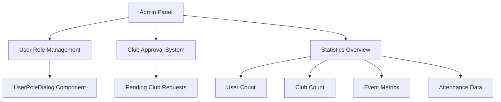
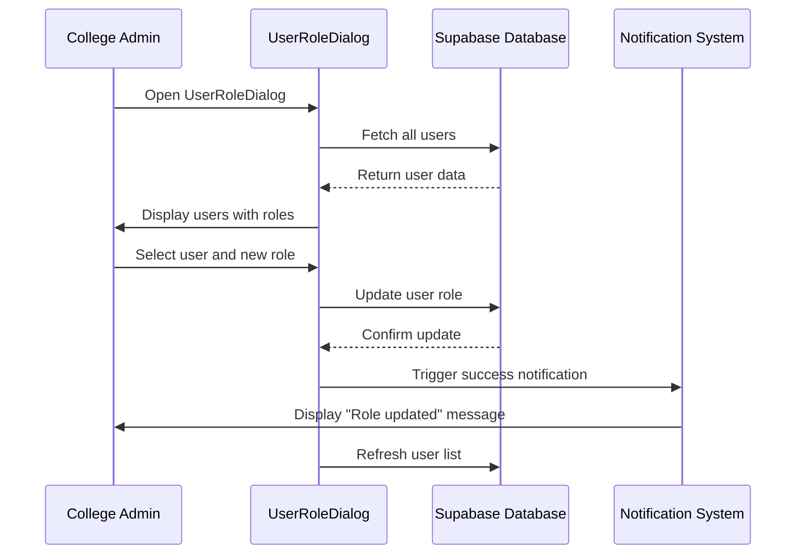
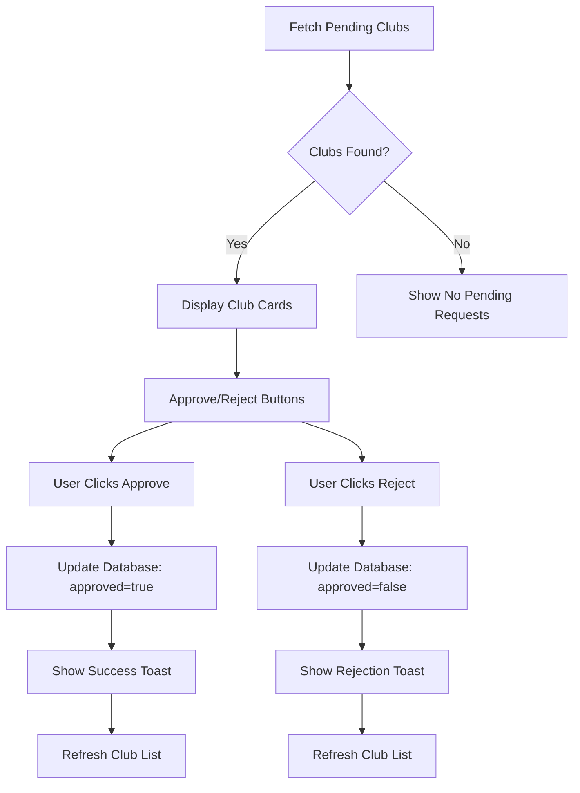
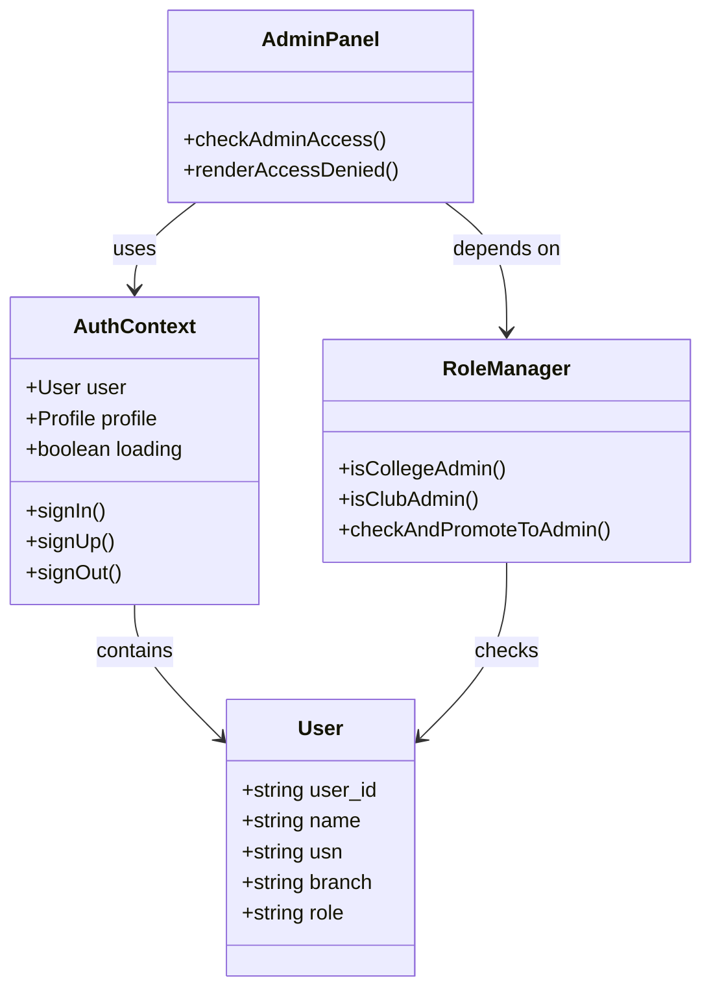
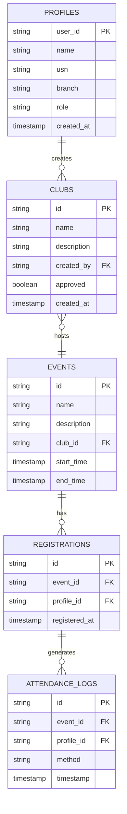

# Admin Panel

<cite>
**Referenced Files in This Document**   
- [Admin.tsx](file://src/pages/Admin.tsx)
- [UserRoleDialog.tsx](file://src/components/Admin/UserRoleDialog.tsx)
- [useAuth.tsx](file://src/hooks/useAuth.tsx)
- [admin-setup.ts](file://src/lib/admin-setup.ts)
- [config.ts](file://src/lib/config.ts)
</cite>

## Table of Contents
1. [Introduction](#introduction)
2. [Core Functionality](#core-functionality)
3. [User Role Management](#user-role-management)
4. [Club Approval System](#club-approval-system)
5. [Role-Based Access Control](#role-based-access-control)
6. [Data Display and Statistics](#data-display-and-statistics)
7. [Security Considerations](#security-considerations)
8. [Audit Logging and Monitoring](#audit-logging-and-monitoring)
9. [Extensibility and Future Features](#extensibility-and-future-features)
10. [Conclusion](#conclusion)

## Introduction

The Admin Panel provides college administrators with comprehensive control over the Campus Connect platform. This feature enables management of user roles, approval of club creation requests, and oversight of platform statistics. The system implements a robust role-based access control mechanism to ensure that only authorized personnel can access administrative functions. The panel serves as the central hub for maintaining platform integrity, managing user permissions, and ensuring proper governance of student organizations.

**Section sources**
- [Admin.tsx](file://src/pages/Admin.tsx#L1-L314)
- [UserRoleDialog.tsx](file://src/components/Admin/UserRoleDialog.tsx#L1-L174)

## Core Functionality

The Admin Panel offers two primary administrative functions: user role management and club approval processing. College administrators can modify user permissions through the UserRoleDialog component and review pending club requests on the main Admin page. The interface displays key statistics including total users, active clubs, ongoing events, and attendance metrics. These overview statistics provide administrators with immediate insight into platform usage and activity levels. The panel is accessible only to users with the 'college_admin' role, ensuring that sensitive administrative functions are properly restricted.

**Diagram sources**
- [Admin.tsx](file://src/pages/Admin.tsx#L1-L314)
- [UserRoleDialog.tsx](file://src/components/Admin/UserRoleDialog.tsx#L1-L174)

**Section sources**
- [Admin.tsx](file://src/pages/Admin.tsx#L1-L314)

## User Role Management

The UserRoleDialog component enables college administrators to modify user roles within the system. This dialog displays a list of all users with their current roles, names, USNs, and branches. Administrators can change a user's role to 'student', 'club_admin', or 'college_admin' through a selection interface. Each role change triggers an update to the user's profile in the Supabase database. The interface provides visual feedback through badges that indicate the current role, with different colors representing different privilege levels. Role updates are accompanied by toast notifications to confirm successful changes or report errors.

**Diagram sources**
- [UserRoleDialog.tsx](file://src/components/Admin/UserRoleDialog.tsx#L1-L174)
- [admin-setup.ts](file://src/lib/admin-setup.ts#L1-L150)

**Section sources**
- [UserRoleDialog.tsx](file://src/components/Admin/UserRoleDialog.tsx#L1-L174)

## Club Approval System

The Admin page displays pending club requests in a card-based interface, allowing administrators to approve or reject club creation requests. Each pending club is presented with its name, description, creator information, and request date. The approval interface includes dedicated buttons for approving or rejecting each club, with loading states to prevent duplicate submissions. When an administrator approves a club, the system updates the club's 'approved' status in the database to 'true', making it active and visible to all users. Rejected clubs remain in the database with 'approved' set to 'false' and can be reviewed or potentially resubmitted.

**Diagram sources**
- [Admin.tsx](file://src/pages/Admin.tsx#L1-L314)

**Section sources**
- [Admin.tsx](file://src/pages/Admin.tsx#L1-L314)

## Role-Based Access Control

The system implements a hierarchical role-based access control system with three distinct roles: 'student', 'club_admin', and 'college_admin'. Access to the Admin Panel is restricted to users with the 'college_admin' role through conditional rendering in the Admin component. The useAuth hook provides the current user's profile and role information, which is used to determine access permissions. The admin-setup module contains functions to verify and promote users to college administrator status based on predefined credentials. This access control system is enforced at both the application level and through Supabase's Row Level Security policies, providing defense in depth for administrative functions.

**Diagram sources**
- [useAuth.tsx](file://src/hooks/useAuth.tsx#L1-L216)
- [admin-setup.ts](file://src/lib/admin-setup.ts#L1-L150)
- [Admin.tsx](file://src/pages/Admin.tsx#L1-L314)

**Section sources**
- [useAuth.tsx](file://src/hooks/useAuth.tsx#L1-L216)
- [admin-setup.ts](file://src/lib/admin-setup.ts#L1-L150)
- [Admin.tsx](file://src/pages/Admin.tsx#L1-L314)

## Data Display and Statistics

The Admin Panel presents key platform metrics through a dashboard-style interface with card-based statistics. The system fetches data from multiple Supabase tables to calculate and display counts for total users, active clubs, ongoing events, and total attendance. These statistics are organized in a responsive grid layout that adapts to different screen sizes. The interface also displays contextual information, such as the number of pending club approvals, to help administrators prioritize their tasks. Data is refreshed automatically when administrative actions are taken, ensuring that the displayed information remains current and accurate.

**Diagram sources**
- [Admin.tsx](file://src/pages/Admin.tsx#L1-L314)

**Section sources**
- [Admin.tsx](file://src/pages/Admin.tsx#L1-L314)

## Security Considerations

The Admin Panel implements multiple security measures to protect against privilege escalation and unauthorized access. Role changes are validated on both the client and server sides, with Supabase Row Level Security policies preventing unauthorized modifications. The system includes safeguards to prevent privilege escalation by verifying that only predefined users can be promoted to college administrator status. All administrative actions are performed through authenticated Supabase requests that include the user's session token. The interface provides visual feedback during operations to prevent accidental actions and includes loading states to prevent duplicate submissions. Sensitive operations like role changes and club approvals include confirmation feedback through toast notifications.

**Section sources**
- [UserRoleDialog.tsx](file://src/components/Admin/UserRoleDialog.tsx#L1-L174)
- [admin-setup.ts](file://src/lib/admin-setup.ts#L1-L150)
- [useAuth.tsx](file://src/hooks/useAuth.tsx#L1-L216)

## Audit Logging and Monitoring

While the current implementation does not include explicit audit logging for administrative actions, the system architecture supports the addition of comprehensive audit trails. The Supabase database could be extended to include an audit_log table that records all administrative actions, including role changes and club approvals, with timestamps and the initiating administrator's ID. The existing toast notification system provides immediate feedback on successful operations, which could be enhanced to include more detailed information for auditing purposes. Future implementations could integrate with external monitoring services to track administrative activity and detect potential security incidents.

**Section sources**
- [UserRoleDialog.tsx](file://src/components/Admin/UserRoleDialog.tsx#L1-L174)
- [Admin.tsx](file://src/pages/Admin.tsx#L1-L314)

## Extensibility and Future Features

The Admin Panel can be extended with additional administrative features to enhance platform management capabilities. Potential extensions include analytics dashboards with visualizations of user engagement, event participation trends, and club activity metrics. The system could incorporate a notification center for system alerts and announcements to administrators. Additional administrative tools could include user activity monitoring, content moderation interfaces, and automated reporting functions. The modular component structure supports the addition of new administrative features through similar dialog-based interfaces, maintaining consistency in the user experience while expanding functionality.

**Section sources**
- [Admin.tsx](file://src/pages/Admin.tsx#L1-L314)
- [UserRoleDialog.tsx](file://src/components/Admin/UserRoleDialog.tsx#L1-L174)

## Conclusion

The Admin Panel provides college administrators with essential tools for managing the Campus Connect platform. Through the UserRoleDialog component and club approval system, administrators can effectively govern user permissions and organization creation. The role-based access control system ensures that these powerful functions are restricted to authorized personnel, while the statistics overview provides valuable insights into platform usage. The integration with Supabase enables secure data management with built-in safeguards against unauthorized access. With its extensible architecture, the Admin Panel can be enhanced with additional features to meet evolving administrative needs while maintaining a consistent and intuitive interface.