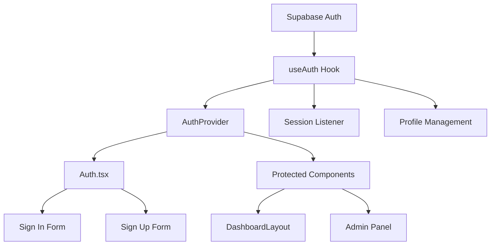
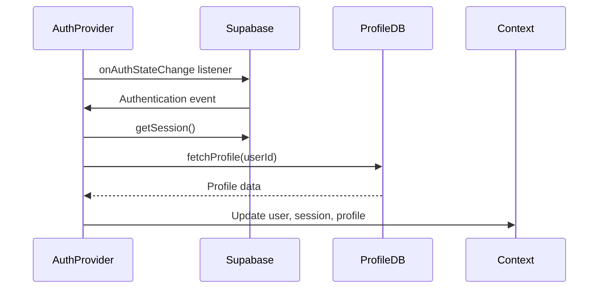
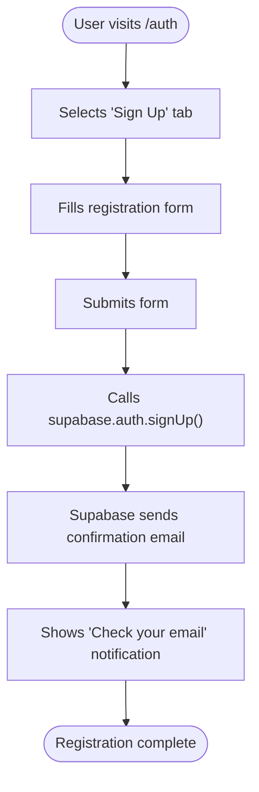
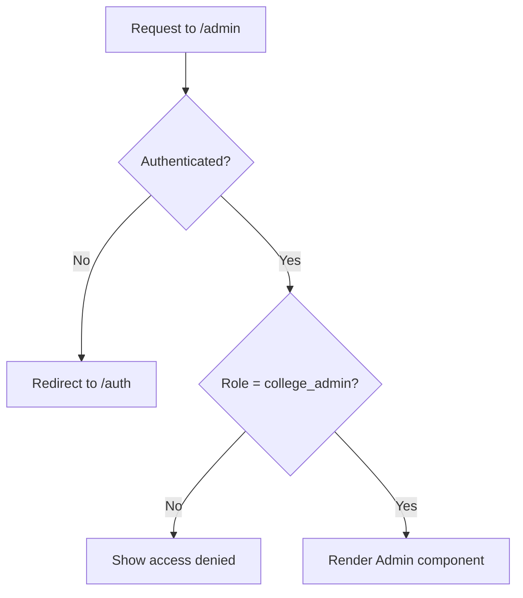

# Authentication System

<cite>
**Referenced Files in This Document**   
- [Auth.tsx](file://src/pages/Auth.tsx)
- [useAuth.tsx](file://src/hooks/useAuth.tsx)
- [client.ts](file://src/integrations/supabase/client.ts)
- [App.tsx](file://src/App.tsx)
- [Admin.tsx](file://src/pages/Admin.tsx)
- [DashboardLayout.tsx](file://src/components/Layout/DashboardLayout.tsx)
</cite>

## Table of Contents
1. [Introduction](#introduction)
2. [Authentication Architecture](#authentication-architecture)
3. [Core Components](#core-components)
4. [User Workflows](#user-workflows)
5. [Form Implementation and Validation](#form-implementation-and-validation)
6. [Session Management and State Propagation](#session-management-and-state-propagation)
7. [Role-Based Access Control](#role-based-access-control)
8. [Security Practices](#security-practices)
9. [Error Handling and User Feedback](#error-handling-and-user-feedback)
10. [Common Issues and Solutions](#common-issues-and-solutions)

## Introduction

The Authentication System in CampusConnect provides a secure and user-friendly way for students, club administrators, and college administrators to access the platform. Built on Supabase Authentication, the system handles user sign-in, sign-up, profile management, and role-based access control. This document details the implementation of authentication flows, integration between components, and security considerations.

**Section sources**
- [README.md](file://README.md#L1-L334)

## Authentication Architecture

The authentication system follows a React Context-based architecture with Supabase as the backend authentication provider. The system is designed with separation of concerns, where authentication logic is encapsulated in a custom hook and consumed throughout the application via context.



**Diagram sources**
- [useAuth.tsx](file://src/hooks/useAuth.tsx#L1-L197)
- [App.tsx](file://src/App.tsx#L1-L38)

## Core Components

### useAuth Hook Implementation

The `useAuth` hook provides a centralized interface for authentication operations, including sign-in, sign-up, sign-out, and profile retrieval. It manages authentication state and exposes it to the application through React Context.

The hook establishes a real-time listener for authentication state changes using `supabase.auth.onAuthStateChange`, ensuring the application responds immediately to authentication events. When a session is detected, the hook automatically fetches the user's profile from the database.



**Section sources**
- [useAuth.tsx](file://src/hooks/useAuth.tsx#L1-L197)

### Auth.tsx Component

The Auth component provides the user interface for authentication, featuring a tabbed interface for sign-in and sign-up. It consumes the `useAuth` hook to perform authentication operations and handles form submission with proper loading states.

When a user is already authenticated, the component redirects to the dashboard using React Router's Navigate component. During authentication operations, the component displays appropriate loading states to provide user feedback.

**Section sources**
- [Auth.tsx](file://src/pages/Auth.tsx#L1-L237)

## User Workflows

### New User Sign-Up Flow

1. User navigates to `/auth` and selects the "Sign Up" tab
2. User fills in required information: name, USN, branch, email, and password
3. User submits the form, triggering the `signUp` function
4. Supabase creates the user account and sends a confirmation email
5. User receives toast notification to check their email
6. After email confirmation, user can sign in

The sign-up process includes additional user metadata (name, USN, branch) that is stored in the Supabase auth system and later used to create a profile record.



**Diagram sources**
- [useAuth.tsx](file://src/hooks/useAuth.tsx#L87-L144)
- [Auth.tsx](file://src/pages/Auth.tsx#L1-L237)

### Returning User Sign-In Flow

1. User navigates to `/auth` and selects the "Sign In" tab
2. User enters their email and password
3. User submits the form, triggering the `signIn` function
4. Supabase authenticates the credentials
5. On successful authentication, the user is redirected to the dashboard
6. The user's profile is automatically fetched and made available to the application

**Section sources**
- [useAuth.tsx](file://src/hooks/useAuth.tsx#L87-L144)
- [Auth.tsx](file://src/pages/Auth.tsx#L1-L237)

## Form Implementation and Validation

The authentication forms in Auth.tsx implement client-side validation to ensure data quality before submission. The forms use controlled components to manage input state and provide real-time feedback.

### Sign-In Form
- Email field with email type validation
- Password field with required validation
- Form submission handled by `handleSignIn` function
- Loading state during authentication process

### Sign-Up Form
- Name field with required validation
- USN field with required validation and placeholder
- Branch selection with dropdown and required validation
- Email field with email type validation
- Password field with required validation
- Form submission handled by `handleSignUp` function
- Loading state during registration process

Both forms display appropriate loading text during authentication operations to provide clear user feedback.

**Section sources**
- [Auth.tsx](file://src/pages/Auth.tsx#L1-L237)

## Session Management and State Propagation

### Authentication State Management

The authentication system uses React Context to propagate authentication state throughout the application. The `AuthProvider` component wraps the entire application and provides authentication state to all components via the `useAuth` hook.

The state includes:
- `user`: The Supabase user object
- `session`: The current authentication session
- `profile`: The user's extended profile information
- `loading`: A boolean indicating if authentication state is being loaded
- Authentication functions: `signIn`, `signUp`, `signOut`

```mermaid
classDiagram
class AuthContextType {
+user : User | null
+session : Session | null
+profile : Profile | null
+signIn(email : string, password : string) : Promise{error : any}
+signUp(email : string, password : string, name : string, usn : string, branch : string) : Promise{error : any}
+signOut() : Promisevoid
+loading : boolean
}
class Profile {
+user_id : string
+name : string
+usn : string
+branch : string
+role : 'student' | 'club_admin' | 'college_admin'
+created_at : string
+updated_at : string
}
AuthContextType --> Profile : "contains"
```

**Diagram sources**
- [useAuth.tsx](file://src/hooks/useAuth.tsx#L1-L197)

### Session Persistence

The system implements session persistence through Supabase's built-in session management. The Supabase client is configured with:

- `localStorage` for token storage
- `persistSession: true` to maintain sessions across browser restarts
- `autoRefreshToken: true` to automatically refresh expired sessions

This configuration ensures that users remain authenticated during normal usage patterns while maintaining security through token expiration and refresh mechanisms.

**Section sources**
- [client.ts](file://src/integrations/supabase/client.ts#L1-L17)

## Role-Based Access Control

The authentication system implements role-based access control to restrict access to certain features based on user roles. The roles are defined as:
- `student`: Regular students with basic access
- `club_admin`: Club administrators with event management capabilities
- `college_admin`: College administrators with full system access

### Route Protection

Protected routes check both authentication status and user role before rendering content. For example, the Admin component verifies that the user has the `college_admin` role:



**Diagram sources**
- [Admin.tsx](file://src/pages/Admin.tsx#L37-L80)
- [DashboardLayout.tsx](file://src/components/Layout/DashboardLayout.tsx#L1-L75)

### Dynamic Navigation

The navigation menu in DashboardLayout.tsx dynamically adjusts based on the user's role, showing only relevant menu items. College administrators see additional menu items for user and club management, while regular students see only basic navigation options.

**Section sources**
- [DashboardLayout.tsx](file://src/components/Layout/DashboardLayout.tsx#L1-L75)

## Security Practices

### Secure Token Storage

Authentication tokens are securely stored in localStorage with Supabase's built-in security measures. The tokens are automatically refreshed and invalidated according to Supabase's security policies.

### Input Sanitization

While the current implementation relies on Supabase's input validation, additional input sanitization could be implemented for enhanced security, particularly for user-provided data like names and USN numbers.

### Email Confirmation

The system requires email confirmation for new accounts, preventing unauthorized account creation and ensuring users have access to the email address they provided.

**Section sources**
- [useAuth.tsx](file://src/hooks/useAuth.tsx#L87-L144)
- [client.ts](file://src/integrations/supabase/client.ts#L1-L17)

## Error Handling and User Feedback

The authentication system implements comprehensive error handling with user-friendly feedback. All authentication operations are wrapped in try-catch blocks to handle unexpected errors.

For user-facing errors, the system uses toast notifications to communicate the outcome of authentication operations:
- Success messages for successful sign-in and account creation
- Error messages for failed authentication attempts
- Specific error messages from Supabase when available

The toast notifications use different variants (destructive for errors, default for success) to provide visual feedback about the operation outcome.

**Section sources**
- [useAuth.tsx](file://src/hooks/useAuth.tsx#L87-L144)

## Common Issues and Solutions

### Session Persistence Issues

If users are unexpectedly logged out, ensure that:
- The Supabase client is properly configured with `persistSession: true`
- The user's browser allows localStorage usage
- The application is served over HTTPS in production

### Password Reset Flows

The current implementation does not include a dedicated password reset interface. Users can use Supabase's built-in password recovery flow by:
1. Using the "Forgot password?" feature in the Supabase Auth UI
2. Receiving a password reset email
3. Following the reset link to create a new password

### Social Login Considerations

While the current implementation focuses on email/password authentication, Supabase supports social logins (Google, GitHub, etc.). To implement social logins:
1. Configure the desired providers in the Supabase dashboard
2. Add social login buttons to the Auth component
3. Use Supabase's `signInWithOAuth` method for social authentication

**Section sources**
- [useAuth.tsx](file://src/hooks/useAuth.tsx#L1-L197)
- [client.ts](file://src/integrations/supabase/client.ts#L1-L17)