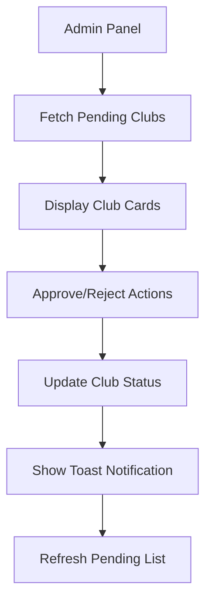
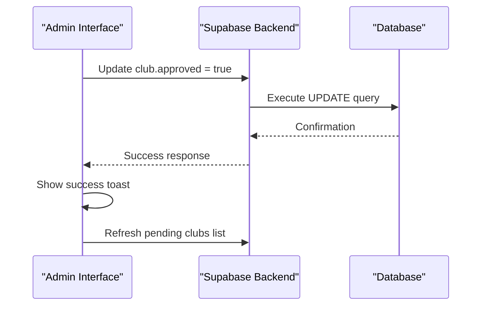
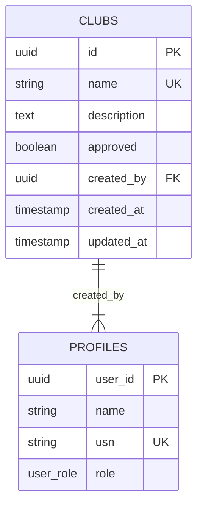
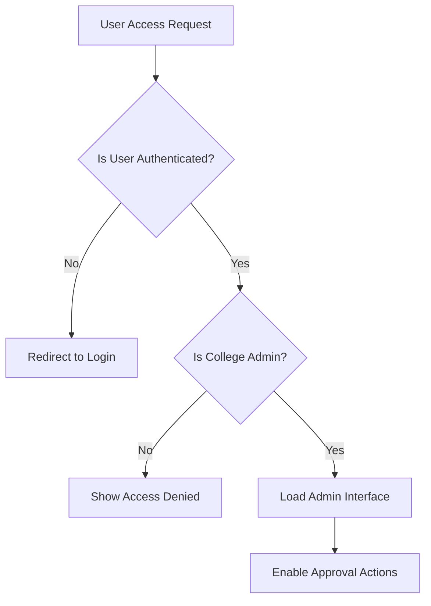
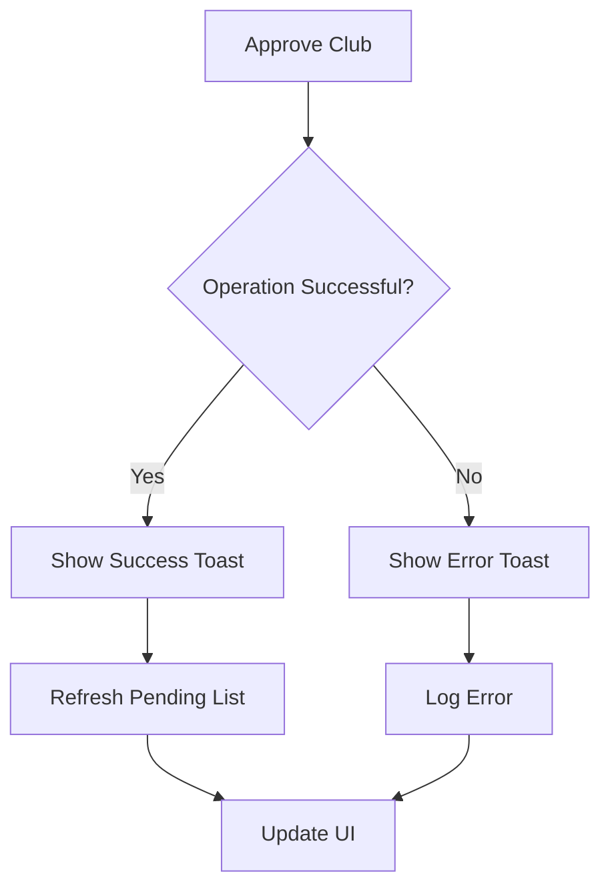

# Approval Workflow

<cite>
**Referenced Files in This Document**   
- [Admin.tsx](file://src/pages/Admin.tsx)
- [00_complete_schema.sql](file://supabase/migrations/00_complete_schema.sql)
- [types.ts](file://src/integrations/supabase/types.ts)
</cite>

## Table of Contents
1. [Introduction](#introduction)
2. [Club Lifecycle and Pending State](#club-lifecycle-and-pending-state)
3. [Admin Interface for Club Approval](#admin-interface-for-club-approval)
4. [Backend Logic and Supabase Integration](#backend-logic-and-supabase-integration)
5. [Database Schema and Migrations](#database-schema-and-migrations)
6. [Security and Authorization](#security-and-authorization)
7. [Audit Logging and Notification System](#audit-logging-and-notification-system)
8. [Error Handling and User Feedback](#error-handling-and-user-feedback)
9. [Scalability Considerations](#scalability-considerations)
10. [Potential Extensions](#potential-extensions)

## Introduction
The Club Approval Workflow governs how newly created clubs enter the Campus Connect platform. This document details the complete workflow from club creation to activation, focusing on the moderation process that requires college administrator approval. The system ensures proper governance while providing a transparent and efficient review process for new club proposals.

## Club Lifecycle and Pending State
When a new club is created in the Campus Connect system, it automatically enters a 'pending' state where it is not visible to regular users. This state is controlled by the `approved` boolean field in the clubs table, which defaults to `false`. Clubs remain in this pending state until reviewed and approved by a college administrator. During this period, the club creator can view their submission in a pending status, but the club does not appear in public listings or gain access to event creation features.

**Section sources**
- [00_complete_schema.sql](file://supabase/migrations/00_complete_schema.sql#L75-L85)
- [types.ts](file://src/integrations/supabase/types.ts#L250-L260)

## Admin Interface for Club Approval
The Admin.tsx interface provides college administrators with a dedicated panel to review and manage pending club requests. The interface displays a list of all pending clubs with relevant details including the club name, description, creator information, and request date. Administrators can take immediate action through prominent approve and reject buttons for each pending club.

**Diagram sources**
- [Admin.tsx](file://src/pages/Admin.tsx#L166-L226)

**Section sources**
- [Admin.tsx](file://src/pages/Admin.tsx#L1-L314)

## Backend Logic and Supabase Integration
The approval workflow is powered by Supabase as the backend service. When an administrator approves or rejects a club, the frontend sends an update request to the Supabase database to modify the club's `approved` status. The system uses Supabase's real-time capabilities to ensure immediate synchronization across all clients. The backend logic includes proper error handling and transaction management to maintain data consistency during the approval process.

**Diagram sources**
- [Admin.tsx](file://src/pages/Admin.tsx#L130-L165)
- [00_complete_schema.sql](file://supabase/migrations/00_complete_schema.sql#L75-L85)

## Database Schema and Migrations
The club approval system is supported by a well-defined database schema implemented through Supabase migrations. The primary clubs table includes the `approved` boolean column that controls the club's visibility and functionality. The schema also includes proper indexing on the approved status for efficient querying. The complete schema is established in the 00_complete_schema.sql migration file, which sets up all necessary tables, relationships, and constraints for the approval workflow.

**Diagram sources**
- [00_complete_schema.sql](file://supabase/migrations/00_complete_schema.sql#L75-L85)
- [types.ts](file://src/integrations/supabase/types.ts#L250-L260)

## Security and Authorization
The approval system implements strict security measures to ensure only authorized college administrators can modify club status. Row Level Security (RLS) policies in Supabase restrict access to club records based on user roles. The Admin.tsx component includes client-side authorization checks that prevent non-administrators from accessing the approval interface. Additionally, the backend enforces role verification through database policies that require the `college_admin` role for updating club approval status.

**Diagram sources**
- [Admin.tsx](file://src/pages/Admin.tsx#L35-L60)
- [00_complete_schema.sql](file://supabase/migrations/00_complete_schema.sql#L450-L465)

**Section sources**
- [Admin.tsx](file://src/pages/Admin.tsx#L35-L60)
- [00_complete_schema.sql](file://supabase/migrations/00_complete_schema.sql#L450-L465)

## Audit Logging and Notification System
While the current implementation focuses on the core approval workflow, the system is designed with extensibility for audit logging and notifications. The database schema includes timestamps for tracking when clubs are created and updated, providing basic audit capabilities. The frontend uses toast notifications to provide immediate feedback to administrators about the success or failure of approval actions. Future enhancements could include detailed audit logs of all approval decisions and automated notifications to club creators when their requests are processed.

**Section sources**
- [Admin.tsx](file://src/pages/Admin.tsx#L145-L165)
- [00_complete_schema.sql](file://supabase/migrations/00_complete_schema.sql#L75-L85)

## Error Handling and User Feedback
The approval workflow includes comprehensive error handling to ensure a smooth user experience. The frontend implements try-catch blocks around all database operations, with specific error messages displayed to administrators when approval actions fail. Loading states are shown during processing to prevent duplicate submissions. Success and error notifications provide clear feedback about the outcome of each approval action, and the interface automatically refreshes to reflect the current state of pending clubs after each operation.

**Diagram sources**
- [Admin.tsx](file://src/pages/Admin.tsx#L130-L165)

**Section sources**
- [Admin.tsx](file://src/pages/Admin.tsx#L130-L165)

## Scalability Considerations
The approval system is designed to handle high-volume club creation scenarios. The database schema includes proper indexing on the approved status and creation date fields to ensure fast querying of pending clubs. The frontend implements efficient data fetching with pagination capabilities to prevent performance issues when many clubs are pending approval. The Supabase backend provides horizontal scalability to accommodate growing numbers of clubs and administrators. For very large institutions, additional optimizations like department-based routing or batch approval capabilities could be implemented.

**Section sources**
- [00_complete_schema.sql](file://supabase/migrations/00_complete_schema.sql#L120-L130)
- [Admin.tsx](file://src/pages/Admin.tsx#L90-L120)

## Potential Extensions
The current approval workflow can be extended with several advanced features. Automated approval rules could be implemented based on club category or creator reputation. Department-based routing could direct club requests to specific administrators based on academic discipline. Batch approval functionality would allow administrators to process multiple club requests simultaneously. Integration with institutional systems could verify club legitimacy against official student organization databases. These extensions would enhance efficiency while maintaining the necessary governance controls.