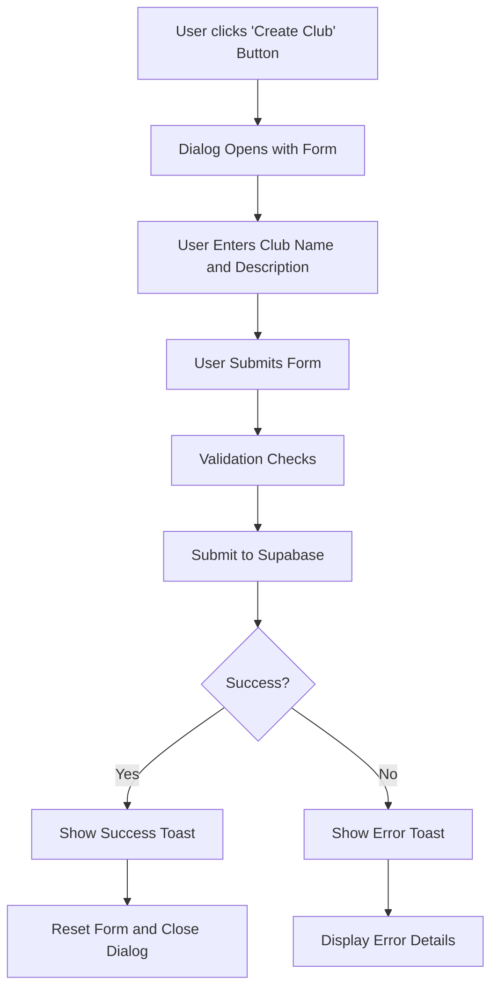
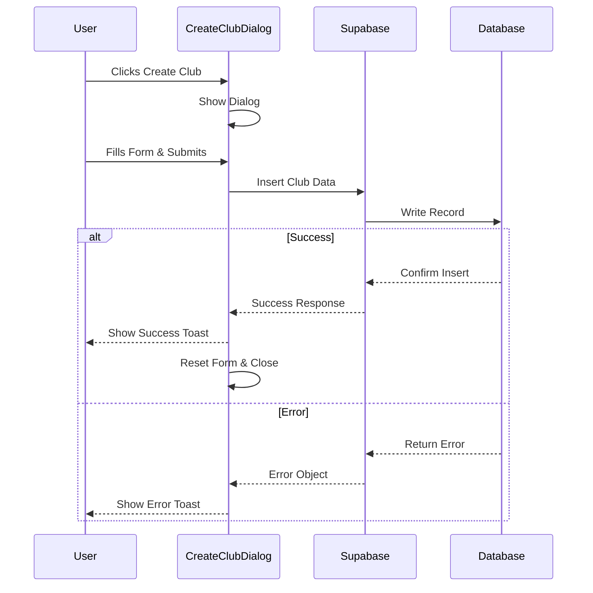
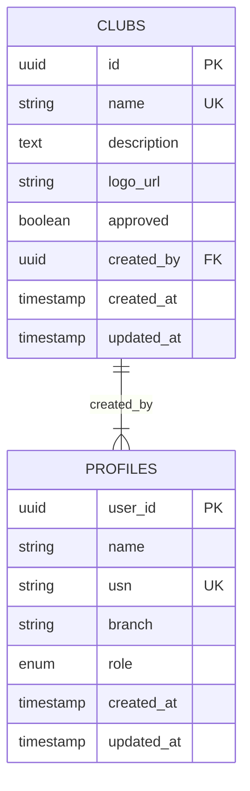

# Club Creation

<cite>
**Referenced Files in This Document**   
- [CreateClubDialog.tsx](file://src/components/Clubs/CreateClubDialog.tsx)
- [useAuth.tsx](file://src/hooks/useAuth.tsx)
- [client.ts](file://src/integrations/supabase/client.ts)
- [types.ts](file://src/integrations/supabase/types.ts)
- [00_complete_schema.sql](file://supabase/migrations/00_complete_schema.sql)
- [config.ts](file://src/lib/config.ts)
- [admin-setup.ts](file://src/lib/admin-setup.ts)
</cite>

## Table of Contents
1. [Introduction](#introduction)
2. [UI and Workflow of CreateClubDialog](#ui-and-workflow-of-createclubdialog)
3. [Form Fields and Validation Rules](#form-fields-and-validation-rules)
4. [Submission Handling and Supabase Integration](#submission-handling-and-supabase-integration)
5. [Role-Based Access Control](#role-based-access-control)
6. [Database Schema for Clubs](#database-schema-for-clubs)
7. [Common Issues and Error Handling](#common-issues-and-error-handling)
8. [Potential Enhancements](#potential-enhancements)
9. [Conclusion](#conclusion)

## Introduction
The Club Creation feature enables authenticated college administrators to create new clubs within the Campus Connect application. This document details the implementation of the `CreateClubDialog` component, its integration with Supabase, and the underlying database schema. The process involves form rendering, validation, role-based access control, secure data insertion, and feedback mechanisms for users.

**Section sources**
- [CreateClubDialog.tsx](file://src/components/Clubs/CreateClubDialog.tsx#L1-L125)

## UI and Workflow of CreateClubDialog
The `CreateClubDialog` component provides a modal interface for creating new clubs. It is triggered by a "Create Club" button that opens a dialog containing a form with fields for club name and description. The workflow begins when a user clicks the trigger button, which displays the dialog. Users fill out the required information and submit the form. Upon submission, the system validates input, sends data to Supabase, and provides visual feedback via toast notifications. On success, the form resets and closes; on failure, error messages are displayed.

**Diagram sources**
- [CreateClubDialog.tsx](file://src/components/Clubs/CreateClubDialog.tsx#L1-L125)

**Section sources**
- [CreateClubDialog.tsx](file://src/components/Clubs/CreateClubDialog.tsx#L1-L125)

## Form Fields and Validation Rules
The form includes two primary fields: **Club Name** (required) and **Description** (optional). The Club Name field uses HTML5 required attribute validation and is bound to the `formData.name` state variable. The Description field supports multi-line input through a textarea component. Both fields use controlled components with React state management via `useState`, updating in real-time as users type. Client-side validation ensures the name is not empty before submission, while uniqueness and other constraints are enforced at the database level.

**Section sources**
- [CreateClubDialog.tsx](file://src/components/Clubs/CreateClubDialog.tsx#L1-L125)

## Submission Handling and Supabase Integration
When the form is submitted, the `handleSubmit` function prevents default form behavior and initiates a Supabase insert operation into the `clubs` table. The inserted data includes the club name, description, creator ID (`created_by`), and an `approved` flag set to `true` for college admin-created clubs. The system uses Supabase's `.insert()` method with proper error handling. Success results in a confirmation toast and form reset, while failures trigger destructive toasts with error details. Loading states are managed using the `loading` state to prevent duplicate submissions.

**Diagram sources**
- [CreateClubDialog.tsx](file://src/components/Clubs/CreateClubDialog.tsx#L37-L85)
- [client.ts](file://src/integrations/supabase/client.ts)

**Section sources**
- [CreateClubDialog.tsx](file://src/components/Clubs/CreateClubDialog.tsx#L37-L85)

## Role-Based Access Control
Access to the club creation functionality is restricted to users with the `college_admin` role. This restriction is implemented in the `CreateClubDialog` component by checking the user's profile role via the `useAuth` hook. If the user does not have the appropriate role, the component returns `null`, effectively hiding the UI element. This ensures that only authorized administrators can create clubs, aligning with the application's security model defined in Supabase RLS policies.

**Section sources**
- [CreateClubDialog.tsx](file://src/components/Clubs/CreateClubDialog.tsx#L25-L35)
- [useAuth.tsx](file://src/hooks/useAuth.tsx#L1-L215)
- [admin-setup.ts](file://src/lib/admin-setup.ts#L1-L150)

## Database Schema for Clubs
The `clubs` table in the database contains essential fields: `id`, `name`, `description`, `logo_url`, `approved`, `created_by`, `created_at`, and `updated_at`. The `name` field has a unique constraint to prevent duplicate club names. The `approved` boolean field determines visibility, where only approved clubs are visible to regular users. College admin-created clubs are automatically approved (`approved = true`), while others may require moderation. Indexes on `approved`, `created_by`, and `created_at` ensure efficient querying.

**Diagram sources**
- [00_complete_schema.sql](file://supabase/migrations/00_complete_schema.sql#L29-L65)
- [types.ts](file://src/integrations/supabase/types.ts#L87-L139)

**Section sources**
- [00_complete_schema.sql](file://supabase/migrations/00_complete_schema.sql#L29-L65)

## Common Issues and Error Handling
Common issues include network errors during submission, duplicate club names, and unauthorized access attempts. The system handles these through comprehensive error handling in the `handleSubmit` function. Network or database errors trigger user-friendly toast notifications. Unique constraint violations on club names are prevented by database-level constraints. Unauthorized creation attempts are blocked both at the UI level (hiding the dialog) and database level (RLS policies). Moderation delays do not apply to college admin-created clubs, as they are automatically approved.

**Section sources**
- [CreateClubDialog.tsx](file://src/components/Clubs/CreateClubDialog.tsx#L55-L85)
- [00_complete_schema.sql](file://supabase/migrations/00_complete_schema.sql#L361-L394)

## Potential Enhancements
Future enhancements could include:
- **Image Uploads**: Add a logo upload field using Supabase Storage
- **Club Categories**: Introduce a category dropdown with predefined options
- **Draft Saving**: Implement local storage persistence for unsaved forms
- **Rich Text Description**: Replace textarea with a rich text editor
- **Moderation Workflow**: Extend for non-admin club creation with approval queues
- **Validation Feedback**: Add real-time validation indicators
- **Club Templates**: Provide starter templates for common club types

These improvements would enhance usability while maintaining security and performance.

## Conclusion
The Club Creation feature provides a secure, user-friendly interface for college administrators to create new clubs. Through tight integration between React components and Supabase, it enforces role-based access control, ensures data integrity via database constraints, and delivers a smooth user experience with proper feedback mechanisms. The current implementation efficiently handles core requirements while leaving room for valuable future enhancements.