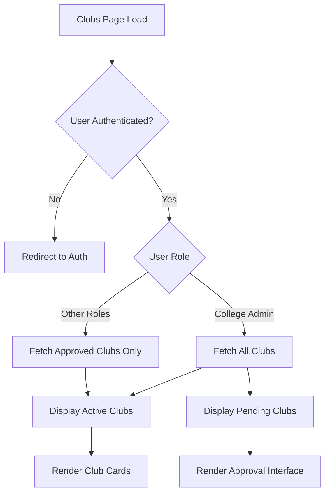
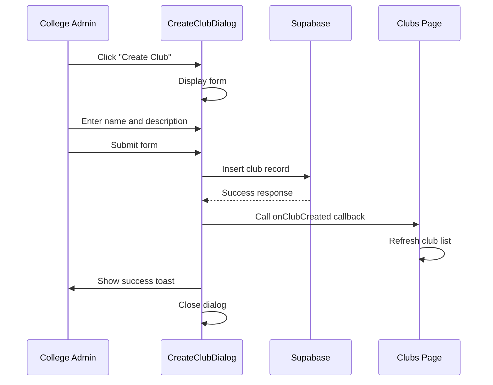
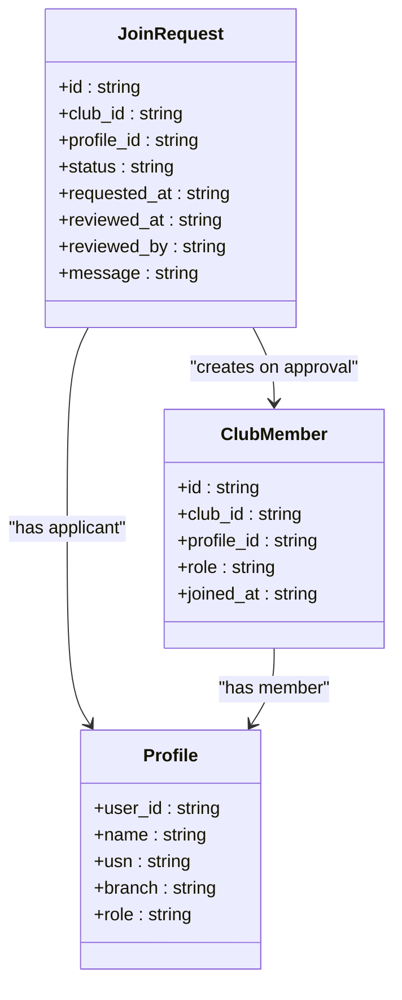

# Clubs Management

<cite>
**Referenced Files in This Document**   
- [Clubs.tsx](file://src/pages/Clubs.tsx)
- [CreateClubDialog.tsx](file://src/components/Clubs/CreateClubDialog.tsx)
- [JoinRequestsDialog.tsx](file://src/components/Clubs/JoinRequestsDialog.tsx)
- [20250908005627_511ef022-3222-4458-b7de-e0063ed13e63.sql](file://supabase/migrations/20250908005627_511ef022-3222-4458-b7de-e0063ed13e63.sql)
- [20250909010744_baf630ed-00b1-48e7-add2-b4e5703f0a84.sql](file://supabase/migrations/20250909010744_baf630ed-00b1-48e7-add2-b4e5703f0a84.sql)
- [types.ts](file://src/integrations/supabase/types.ts)
</cite>

## Table of Contents
1. [Introduction](#introduction)
2. [Club Lifecycle and Approval Workflow](#club-lifecycle-and-approval-workflow)
3. [Club Listing Interface](#club-listing-interface)
4. [Club Creation Workflow](#club-creation-workflow)
5. [Join Request Handling](#join-request-handling)
6. [User Roles and Permissions](#user-roles-and-permissions)
7. [Business Rules and Constraints](#business-rules-and-constraints)
8. [Potential Enhancements](#potential-enhancements)

## Introduction
The Clubs Management feature enables users to create, join, and manage student clubs within the campus ecosystem. This system supports a structured workflow for club creation, membership requests, and administrative oversight. The implementation includes role-based access control, real-time updates, and approval workflows to ensure proper governance of club activities. This documentation details the implementation of key components including the club listing interface, club creation workflow, and join request handling mechanisms.

## Club Lifecycle and Approval Workflow
The club lifecycle consists of three distinct states: creation, pending approval, and active status. When a college administrator creates a club through the CreateClubDialog, it is automatically approved and becomes active immediately. For other users, the club creation process would involve a pending state, though the current implementation restricts club creation to college administrators only.

Clubs transition through the following states:
1. **Creation**: Initiated by college administrators via the CreateClubDialog
2. **Pending Approval**: Clubs created by non-administrators would enter this state (not currently implemented)
3. **Active**: Approved clubs visible to all users for joining

The approval workflow is managed through database-level policies and UI components that display pending clubs to college administrators. The system uses a boolean `approved` field in the clubs table to track club status, with RLS (Row Level Security) policies ensuring that only approved clubs are visible to regular users.

**Section sources**
- [Clubs.tsx](file://src/pages/Clubs.tsx#L196-L228)
- [20250908005627_511ef022-3222-4458-b7de-e0063ed13e63.sql#L1-L32)

## Club Listing Interface
The club listing interface displays all active clubs in a responsive grid layout, with each club represented as a card containing key information. The interface is implemented in the Clubs.tsx page component and features:

- **Active Clubs Section**: Displays all approved clubs with club name, description, member count, and event count
- **Pending Clubs Section**: Visible only to college administrators, showing clubs awaiting approval
- **Role-Based Actions**: Different action buttons based on user role and membership status
- **Real-Time Updates**: Automatic refresh after club creation or membership changes

Each club card includes contextual actions based on the user's relationship to the club:
- **Non-members**: "Request to Join" button
- **Members**: "View Details" and "Leave Club" options
- **Club Administrators**: "Create Event" and "Manage Join Requests" capabilities
- **College Administrators**: "Assign Admin" and "View Details" options

The interface uses conditional rendering to show appropriate actions and club status indicators, with visual cues like badges and icons to enhance usability.

**Diagram sources**
- [Clubs.tsx](file://src/pages/Clubs.tsx#L0-L368)

**Section sources**
- [Clubs.tsx](file://src/pages/Clubs.tsx#L0-L368)

## Club Creation Workflow
The club creation workflow is implemented through the CreateClubDialog component, which provides a form interface for college administrators to create new clubs. The workflow includes:

1. **Access Control**: Only users with the 'college_admin' role can access the dialog
2. **Form Input**: Club name (required) and description (optional) fields
3. **Submission Logic**: Form submission triggers a Supabase insert operation
4. **Real-Time Updates**: Parent component refreshes club list upon successful creation

The CreateClubDialog component enforces business rules at the UI level:
- **Role Restriction**: The component returns null if the user is not a college administrator
- **Required Fields**: Club name field is marked as required in the form
- **Unique Name Constraint**: Database-level unique constraint prevents duplicate club names

Upon successful submission, the system:
- Inserts a new record into the clubs table with `approved: true`
- Sets the creating user as the `created_by` field
- Displays a success toast notification
- Closes the dialog and clears form fields
- Triggers a refresh of the club list

**Diagram sources**
- [CreateClubDialog.tsx](file://src/components/Clubs/CreateClubDialog.tsx#L0-L125)

**Section sources**
- [CreateClubDialog.tsx](file://src/components/Clubs/CreateClubDialog.tsx#L0-L125)
- [20250908005627_511ef022-3222-4458-b7de-e0063ed13e63.sql#L1-L32)

## Join Request Handling
The join request handling system enables users to request membership in clubs and allows club administrators to approve or reject these requests. The implementation centers around the JoinRequestsDialog component and the join_requests database table.

### Join Request Workflow
1. **Request Initiation**: Users click "Request to Join" on a club card
2. **Database Insert**: A new record is created in the join_requests table with status 'pending'
3. **Notification**: Club administrators see a badge indicating pending requests
4. **Review**: Administrators open JoinRequestsDialog to review pending requests
5. **Decision**: Administrators approve or reject requests
6. **Membership Update**: Approved requests result in a record being added to club_members

The JoinRequestsDialog component provides:
- **Pending Request Display**: Shows all pending requests with applicant details
- **Action Buttons**: Approve and Reject buttons for each request
- **Request Details**: Applicant name, USN, branch, and request message
- **Real-Time Updates**: Automatically refreshes when requests are processed

When a request is approved:
- The join_request status is updated to 'approved'
- A new record is created in club_members with role 'member'
- The requesting user gains access to club-specific features
- The request count is updated in real-time

The system prevents duplicate requests through a database-level unique constraint on (club_id, profile_id).

**Diagram sources**
- [JoinRequestsDialog.tsx](file://src/components/Clubs/JoinRequestsDialog.tsx#L0-L228)
- [20250909010744_baf630ed-00b1-48e7-add2-b4e5703f0a84.sql#L0-L35)

**Section sources**
- [JoinRequestsDialog.tsx](file://src/components/Clubs/JoinRequestsDialog.tsx#L0-L228)
- [Clubs.tsx](file://src/pages/Clubs.tsx#L0-L368)
- [20250909010744_baf630ed-00b1-48e7-add2-b4e5703f0a84.sql#L0-L35)

## User Roles and Permissions
The system implements a role-based access control system with three distinct user roles that determine club management capabilities:

### User Roles
- **Student**: Regular users who can view clubs and request membership
- **Club Admin**: Users with administrative privileges for specific clubs
- **College Admin**: System administrators with oversight of all clubs

### Role-Based Capabilities
| Role | Create Clubs | View All Clubs | Approve Clubs | Manage Join Requests | Assign Club Admins |
|------|--------------|----------------|---------------|---------------------|-------------------|
| Student | No | Only approved clubs | No | No | No |
| Club Admin | No | Only their clubs | No | Yes | No |
| College Admin | Yes | All clubs | Yes | Yes | Yes |

The role system is implemented through:
- **Database Schema**: user_role enum type in the profiles table
- **UI Logic**: Conditional rendering based on profile.role
- **Database Policies**: RLS policies that enforce data access rules
- **Component Logic**: Role checks in components like CreateClubDialog

College administrators have the additional capability to assign club administrators through the ClubAdminAssignmentDialog, which promotes users to the 'club_admin' role when they are assigned as administrators of any club.

**Section sources**
- [types.ts](file://src/integrations/supabase/types.ts#L87-L139)
- [20250908005627_511ef022-3222-4458-b7de-e0063ed13e63.sql#L1-L32)
- [Clubs.tsx](file://src/pages/Clubs.tsx#L0-L368)

## Business Rules and Constraints
The Clubs Management system enforces several business rules to maintain data integrity and proper governance:

### Data Constraints
- **Unique Club Names**: Database-level unique constraint on the clubs.name column prevents duplicate club names
- **Single Pending Request**: Unique constraint on (club_id, profile_id) in join_requests table prevents multiple pending requests
- **Required Fields**: Club name is required for creation; description is optional
- **Role Constraints**: Only college administrators can create clubs

### Workflow Rules
- **Automatic Approval**: Clubs created by college administrators are automatically approved
- **Pending State**: Non-admin club creation would require approval (currently restricted)
- **Membership Limits**: No explicit limits implemented, but constrained by database relationships
- **Request Uniqueness**: Users can only have one pending request per club

### Database-Level Enforcement
The system uses PostgreSQL constraints and RLS policies to enforce business rules:
- **Check Constraints**: Status field in join_requests limited to 'pending', 'approved', 'rejected'
- **Foreign Key Constraints**: All relationships enforced through foreign keys
- **Row Level Security**: Data access controlled through RLS policies based on user roles
- **Unique Constraints**: Prevent duplicate entries in critical relationships

These rules ensure data consistency and prevent unauthorized actions while maintaining a smooth user experience.

**Section sources**
- [20250908005627_511ef022-3222-4458-b7de-e0063ed13e63.sql#L1-L32)
- [20250909010744_baf630ed-00b1-48e7-add2-b4e5703f0a84.sql#L0-L35)
- [types.ts](file://src/integrations/supabase/types.ts#L87-L139)

## Potential Enhancements
The current Clubs Management system could be extended with several enhancements to improve functionality and user experience:

### Club Categories
Implementing club categories would allow for better organization and discovery:
- Add a categories table with predefined types (Academic, Cultural, Sports, etc.)
- Include category selection in club creation form
- Add filtering and sorting options on the clubs page
- Display category badges on club cards

### Leadership Roles
Expanding the role system to include more granular leadership positions:
- Add roles like President, Vice President, Treasurer, Secretary
- Implement role-specific permissions within clubs
- Display leadership roles in member lists
- Add leadership assignment interface

### Activity Tracking
Enhancing club engagement through activity tracking:
- Add club activity feed showing recent events and announcements
- Implement club statistics dashboard (members, events, attendance)
- Add achievement system for active clubs and members
- Implement club ranking based on activity level

### Additional Features
- **Club Applications**: Allow users to submit application forms with questions
- **Membership Approval Workflows**: Multi-stage approval processes for selective clubs
- **Club Resources**: Document sharing and resource management
- **Analytics**: Club performance metrics and engagement reports
- **Integration with Events**: Enhanced coordination between club activities and events

These enhancements would build upon the existing foundation while maintaining the core principles of role-based access control and approval workflows.