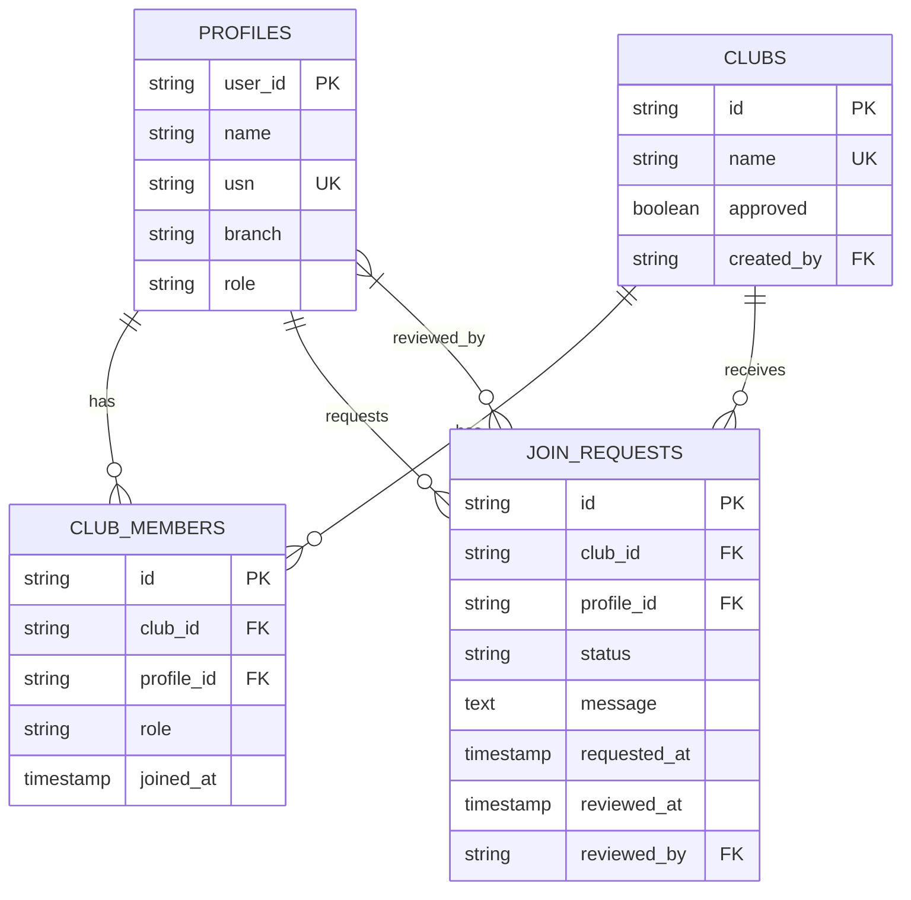
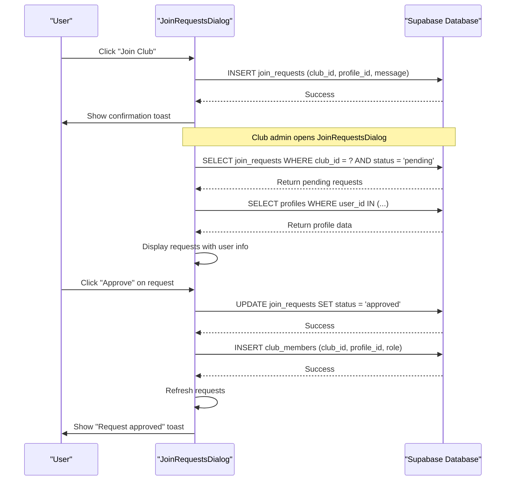
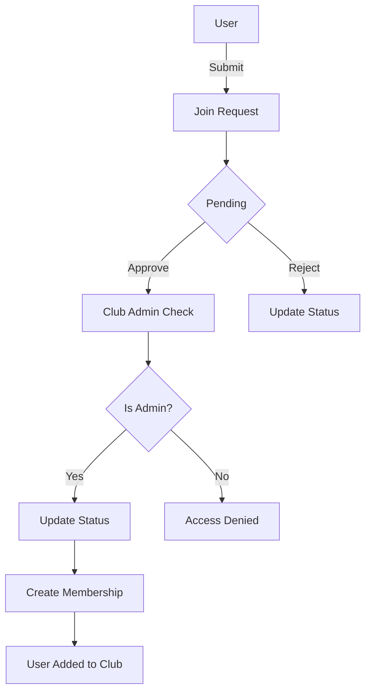

# Membership Management

<cite>
**Referenced Files in This Document**   
- [JoinRequestsDialog.tsx](file://src/components/Clubs/JoinRequestsDialog.tsx)
- [00_complete_schema.sql](file://supabase/migrations/00_complete_schema.sql)
- [useAuth.tsx](file://src/hooks/useAuth.tsx)
</cite>

## Table of Contents
1. [Introduction](#introduction)
2. [Core Components](#core-components)
3. [Database Schema](#database-schema)
4. [Join Request Workflow](#join-request-workflow)
5. [Access Control and Security](#access-control-and-security)
6. [State Management and UI Updates](#state-management-and-ui-updates)
7. [Edge Cases and Error Handling](#edge-cases-and-error-handling)
8. [Performance Considerations](#performance-considerations)

## Introduction
The Membership Management system enables users to request membership in clubs and allows club administrators to review and approve these requests through the JoinRequestsDialog component. This document details the implementation of the membership workflow, including user interface components, database schema, access control rules, and real-time data synchronization. The system supports role-based access control, handles edge cases such as duplicate requests, and provides feedback through toast notifications. The architecture leverages React Query patterns for data fetching and updating, ensuring consistent state management across the application.

## Core Components

The JoinRequestsDialog component serves as the primary interface for managing club membership requests. It displays pending requests with user information including name, USN (University Seat Number), branch, and any message the user included with their request. The dialog is triggered by a button that shows a badge with the count of pending requests. When opened, it fetches pending join requests for the specified club and displays them in a card-based layout with approve and reject buttons for each request.

The component uses React's useState and useEffect hooks for managing local state and side effects. It integrates with Supabase for database operations and uses the useAuth hook to access the current user's authentication state. Toast notifications provide feedback for successful or failed operations. The UI is built using standardized components from the UI library, ensuring consistency across the application.

**Section sources**
- [JoinRequestsDialog.tsx](file://src/components/Clubs/JoinRequestsDialog.tsx#L1-L229)

## Database Schema

**Diagram sources**
- [00_complete_schema.sql](file://supabase/migrations/00_complete_schema.sql#L29-L65)

The database schema consists of four main tables that manage the membership workflow. The profiles table stores user information with a role field that can be 'student', 'club_admin', or 'college_admin'. The clubs table contains club information with an approved status that determines visibility. The club_members table establishes the many-to-many relationship between users and clubs, with a role field that can be 'member' or 'admin'. The join_requests table manages membership applications with a status field that can be 'pending', 'approved', or 'rejected'.

The schema includes appropriate foreign key constraints and unique indexes to maintain data integrity. Indexes on frequently queried columns such as club_id, profile_id, and status ensure efficient database operations. The join_requests table has a composite unique constraint on club_id and profile_id to prevent duplicate requests from the same user for the same club.

**Section sources**
- [00_complete_schema.sql](file://supabase/migrations/00_complete_schema.sql#L29-L65)

## Join Request Workflow

**Diagram sources**
- [JoinRequestsDialog.tsx](file://src/components/Clubs/JoinRequestsDialog.tsx#L36-L87)
- [JoinRequestsDialog.tsx](file://src/components/Clubs/JoinRequestsDialog.tsx#L78-L132)

The join request workflow begins when a user submits a request to join a club. This creates a record in the join_requests table with status 'pending'. Club administrators can then review these requests through the JoinRequestsDialog. When the dialog opens, it fetches all pending requests for the club and enriches them with profile data from the profiles table.

When an administrator approves a request, the system updates the join_request status to 'approved' and inserts a record into the club_members table with role 'member'. This grants the user membership in the club. The reviewed_at and reviewed_by fields are updated to track who approved the request and when. If a request is rejected, only the status is updated to 'rejected' without creating a membership record.

The component handles the entire workflow transactionally, ensuring that both the join request update and membership creation succeed or fail together. After handling a request, the dialog refreshes the list to reflect the updated status and triggers the onRequestHandled callback to notify the parent component of the change.

**Section sources**
- [JoinRequestsDialog.tsx](file://src/components/Clubs/JoinRequestsDialog.tsx#L36-L132)

## Access Control and Security

The system implements robust access control through Supabase Row Level Security (RLS) policies. Users can only create join requests for themselves, ensuring that no one can submit requests on behalf of others. Users can view their own join requests, while club administrators can view and manage all pending requests for clubs they administer.

The RLS policy for join_requests uses a subquery to verify that the user is an admin of the club associated with the request. College administrators have elevated privileges and can manage all join requests across the system. This hierarchical access control ensures that only authorized users can approve or reject membership applications.

The club_members table has its own RLS policies that control membership management. Users can join clubs by inserting records into this table, but only club administrators or college administrators can add members directly. This prevents regular members from adding others to the club without approval.

**Diagram sources**
- [00_complete_schema.sql](file://supabase/migrations/00_complete_schema.sql#L413-L441)

**Section sources**
- [00_complete_schema.sql](file://supabase/migrations/00_complete_schema.sql#L413-L441)

## State Management and UI Updates

The JoinRequestsDialog manages its state using React's useState hook with three primary state variables: open (dialog visibility), requests (fetched join requests), and loading (fetch status). The component uses useEffect to fetch requests when the dialog opens, ensuring fresh data is always displayed.

When a request is approved or rejected, the component updates the database and then calls fetchRequests again to refresh the list. This approach ensures the UI reflects the current state of the database. The onRequestHandled callback allows parent components to respond to request handling, such as updating a badge counter or refreshing other UI elements.

The component handles data fetching in two steps: first retrieving join request data, then fetching profile information in a separate query. This separation allows for more efficient database operations and handles the one-to-many relationship between join requests and user profiles. The profile data is mapped to a Map for O(1) lookup when enriching the request data.

**Section sources**
- [JoinRequestsDialog.tsx](file://src/components/Clubs/JoinRequestsDialog.tsx#L1-L229)

## Edge Cases and Error Handling

The system handles several edge cases to ensure robust operation. The unique constraint on club_id and profile_id in the join_requests table prevents users from submitting multiple requests for the same club. If a user attempts to join a club they are already a member of, the database constraint will prevent the insertion.

When approving a request, the system checks if the corresponding profile data exists before creating a membership record. Error handling is implemented with try-catch blocks and Supabase error checking. If an error occurs during request handling, appropriate toast notifications inform the user of the failure.

Rejected applications remain in the database with status 'rejected', providing an audit trail of membership decisions. Users who leave a club can submit a new join request, which creates a new record in the join_requests table rather than reactivating a previous request.

The component handles authentication state through the useAuth hook, ensuring that operations only proceed when a user is authenticated. Loading states are displayed during data fetching, and empty states are shown when no pending requests exist, providing clear feedback to administrators.

**Section sources**
- [JoinRequestsDialog.tsx](file://src/components/Clubs/JoinRequestsDialog.tsx#L78-L132)

## Performance Considerations

The system includes several performance optimizations to handle large numbers of requests efficiently. Database indexes on club_id, profile_id, and status columns ensure fast querying of join requests. The component fetches only pending requests, reducing the data payload and improving response times.

For clubs with many pending requests, the current implementation could be enhanced with pagination or infinite scrolling to improve rendering performance. Additional improvements could include bulk action capabilities, allowing administrators to approve or reject multiple requests simultaneously.

Role assignment during approval could be enhanced to allow administrators to assign specific roles (e.g., officer, committee member) rather than defaulting to 'member'. This would require UI modifications to the approval interface but would provide greater flexibility in membership management.

Caching strategies could be implemented to reduce database load, particularly for frequently accessed profile data. The current two-query approach (join requests then profiles) could be optimized with a single joined query, though this would need to be balanced against data transfer size.

**Section sources**
- [00_complete_schema.sql](file://supabase/migrations/00_complete_schema.sql#L161-L193)
- [JoinRequestsDialog.tsx](file://src/components/Clubs/JoinRequestsDialog.tsx#L36-L87)