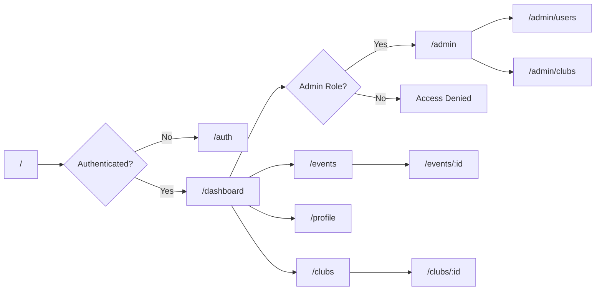
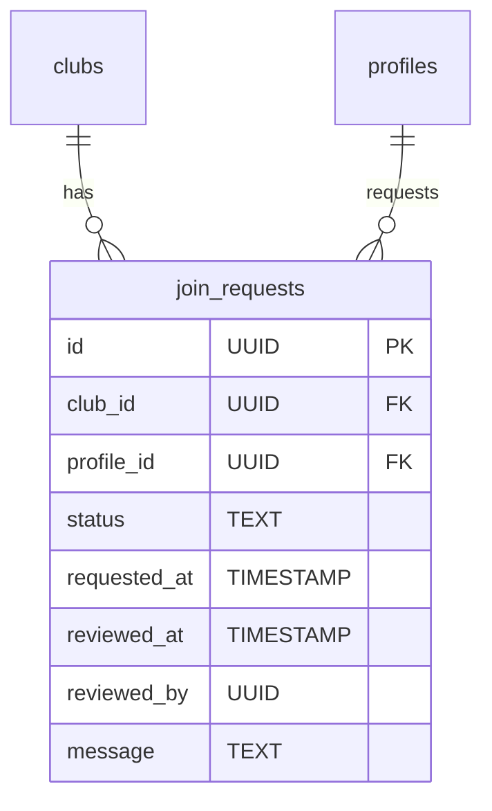

# Core Features

<cite>
**Referenced Files in This Document**   
- [useAuth.tsx](file://src/hooks/useAuth.tsx)
- [Auth.tsx](file://src/pages/Auth.tsx)
- [Events.tsx](file://src/pages/Events.tsx)
- [CreateEventDialog.tsx](file://src/components/Events/CreateEventDialog.tsx)
- [Clubs.tsx](file://src/pages/Clubs.tsx)
- [CreateClubDialog.tsx](file://src/components/Clubs/CreateClubDialog.tsx)
- [JoinRequestsDialog.tsx](file://src/components/Clubs/JoinRequestsDialog.tsx)
- [Admin.tsx](file://src/pages/Admin.tsx)
- [UserRoleDialog.tsx](file://src/components/Admin/UserRoleDialog.tsx)
- [20250909010744_baf630ed-00b1-48e7-add2-b4e5703f0a84.sql](file://supabase/migrations/20250909010744_baf630ed-00b1-48e7-add2-b4e5703f0a84.sql)
- [tasks.md](file://tasks.md)
</cite>

## Table of Contents
1. [Authentication System](#authentication-system)
2. [Events Management](#events-management)
3. [Clubs Management](#clubs-management)
4. [Admin Panel](#admin-panel)

## Authentication System

The Authentication System provides secure user registration, login, and role-based access control for the CampusConnect platform. It leverages Supabase Auth for identity management and maintains user profiles with role assignments that determine access privileges across the application.

Users can sign up with their institutional email, USN (University Seat Number), name, branch of study, and password. Upon registration, users receive a confirmation email. The system supports three distinct roles: **student**, **club_admin**, and **college_admin**, each with different permissions and access levels throughout the application.

The authentication flow is implemented using React Context through the `AuthProvider` and `useAuth` hook, which maintains the current user session and profile data across the application. Protected routes ensure that only authenticated users can access the dashboard and feature pages, while unauthenticated users are redirected to the login page.

**Diagram sources**
- [tasks.md](file://tasks.md#L233-L256)

**Section sources**
- [useAuth.tsx](file://src/hooks/useAuth.tsx#L0-L197)
- [Auth.tsx](file://src/pages/Auth.tsx#L0-L236)

## Events Management

The Events Management system enables club administrators to create, manage, and track participation in campus events. Students can browse upcoming events, register individually or as teams, and check in during active events.

Event creation is restricted to users with the **club_admin** role. When creating an event, administrators specify details including title, description, location, date/time, capacity, and whether the event requires team registration. Events are always associated with a specific club, and the creating admin must be an admin of that club.

A key feature is the support for both individual and team-based events. For team events, registrants must first create a team through the TeamCreationDialog before registering for the event. This ensures proper team management and coordination for competitive or collaborative activities.

Event cards display essential information including availability status (color-coded based on registration percentage), event type (individual or team), and relevant actions based on user status and permissions. Registered users can check in during active events, while admins can access attendance dashboards to monitor participation.

**Section sources**
- [Events.tsx](file://src/pages/Events.tsx#L0-L342)
- [CreateEventDialog.tsx](file://src/components/Events/CreateEventDialog.tsx#L0-L262)

## Clubs Management

The Clubs Management system facilitates the creation, membership management, and lifecycle of student clubs within the institution. Students can browse approved clubs and request to join, while club administrators manage membership requests and organize events.

Any student can initiate the creation of a new club by submitting a club name and description through the CreateClubDialog. New clubs enter a "pending approval" state and require authorization from a college administrator before becoming active. This approval process ensures institutional oversight while encouraging student initiative.

Membership in clubs is managed through a request-approval workflow. Students click "Request to Join" on a club card, which creates a record in the join_requests table. Club administrators can view and manage pending requests through the JoinRequestsDialog component, which displays requester information and allows approval or rejection with appropriate feedback.

For club admins, the interface provides additional controls including creating events for their club and managing membership requests. The system displays key metrics such as member count and number of events organized by each club, providing visibility into club activity and engagement.

**Diagram sources**
- [20250909010744_baf630ed-00b1-48e7-add2-b4e5703f0a84.sql](file://supabase/migrations/20250909010744_baf630ed-00b1-48e7-add2-b4e5703f0a84.sql#L0-L35)

**Section sources**
- [Clubs.tsx](file://src/pages/Clubs.tsx#L0-L351)
- [CreateClubDialog.tsx](file://src/components/Clubs/CreateClubDialog.tsx#L0-L119)
- [JoinRequestsDialog.tsx](file://src/components/Clubs/JoinRequestsDialog.tsx#L0-L41)

## Admin Panel

The Admin Panel provides college administrators with oversight and management capabilities across the entire CampusConnect platform. Access is restricted to users with the **college_admin** role, ensuring that sensitive administrative functions are properly secured.

The dashboard presents key metrics including total users, active clubs, upcoming events, and attendance statistics. A central feature is the management of pending club approvals, where administrators review club creation requests and approve or reject them based on institutional guidelines. Each pending club card displays the club name, description, creator information, and request date to facilitate informed decisions.

The panel implements proper error handling and loading states to ensure a smooth administrative experience. When processing club approvals, the interface provides visual feedback during the operation and displays appropriate toast notifications upon completion. The system also includes safeguards against duplicate actions through loading state management on approval buttons.

Administrative controls are designed with data integrity in mind, using database transactions and proper error handling to maintain consistency. The interface follows accessibility guidelines with proper labeling, keyboard navigation support, and clear visual hierarchy to support efficient administrative workflows.

**Section sources**
- [Admin.tsx](file://src/pages/Admin.tsx#L0-L263)
- [UserRoleDialog.tsx](file://src/components/Admin/UserRoleDialog.tsx)