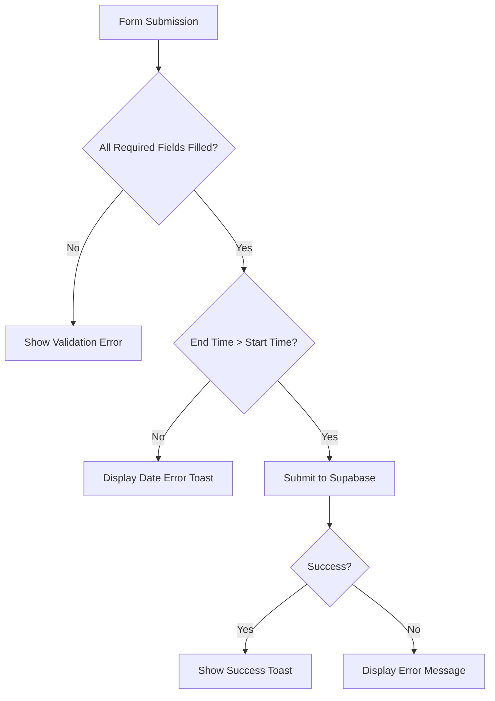
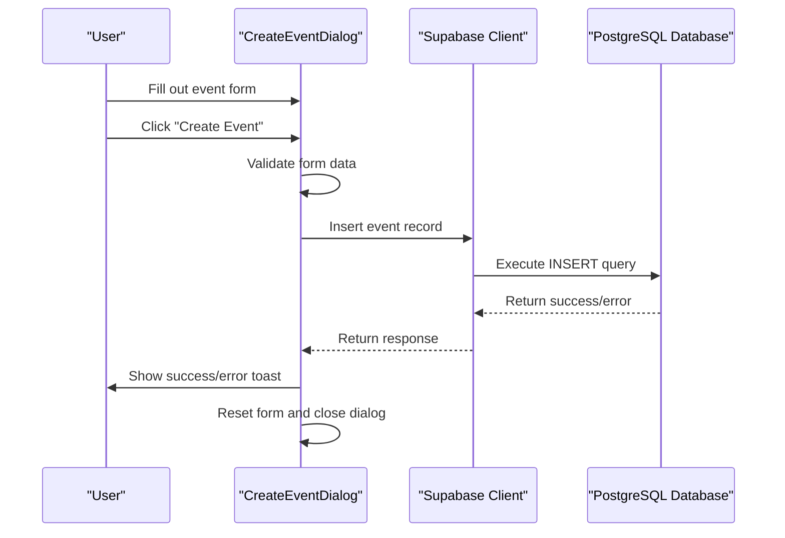

# Event Creation

<cite>
**Referenced Files in This Document**   
- [CreateEventDialog.tsx](file://src/components/Events/CreateEventDialog.tsx)
- [types.ts](file://src/integrations/supabase/types.ts)
- [client.ts](file://src/integrations/supabase/client.ts)
- [useAuth.tsx](file://src/hooks/useAuth.tsx)
- [admin-setup.ts](file://src/lib/admin-setup.ts)
- [config.ts](file://src/lib/config.ts)
</cite>

## Table of Contents
1. [Introduction](#introduction)
2. [Form Layout and Fields](#form-layout-and-fields)
3. [Input Validation and Business Rules](#input-validation-and-business-rules)
4. [Role-Based Access Control](#role-based-access-control)
5. [Supabase Integration and Event Submission](#supabase-integration-and-event-submission)
6. [Form State Management](#form-state-management)
7. [Extensibility and Feature Enhancement](#extensibility-and-feature-enhancement)
8. [Troubleshooting Common Issues](#troubleshooting-common-issues)

## Introduction
The Event Creation feature enables authorized club administrators to create new events within the Campus Connect platform. This functionality is implemented through the `CreateEventDialog` component, which provides a structured form interface for capturing event details and submitting them to the Supabase backend. The system enforces role-based access control, ensuring that only users with appropriate permissions can create events. This document details the implementation of the event creation workflow, including form design, validation logic, authorization mechanisms, and database integration.

## Form Layout and Fields
The `CreateEventDialog` component presents a modal dialog with a structured form layout for event creation. The form includes the following fields:

- **Club Selection**: Dropdown menu listing clubs where the user has administrative privileges
- **Event Title**: Text input for the event name (required)
- **Description**: Multi-line text area for event details
- **Location**: Text input for the physical or virtual event location (required)
- **Start Time and End Time**: DateTime-local inputs for scheduling (both required)
- **Capacity**: Numeric input for maximum attendees (required, minimum value 1)
- **Team Event**: Toggle switch to designate the event as requiring team registration

The form is organized using a responsive grid layout with proper spacing and labeling, ensuring accessibility and usability across device sizes.

**Section sources**
- [CreateEventDialog.tsx](file://src/components/Events/CreateEventDialog.tsx#L164-L235)

## Input Validation and Business Rules
The event creation process enforces several validation rules and business constraints:

1. **Mandatory Fields**: Title, location, start time, end time, and capacity are required
2. **Date Validation**: End time must be after start time (enforced client-side)
3. **Capacity Constraints**: Minimum capacity of 1 person (enforced via HTML5 input validation and database constraint)
4. **Future Date Enforcement**: While not explicitly validated in the current implementation, the business logic assumes events are scheduled in the future
5. **Club Ownership**: Users must select a club they administer or have college-wide administrative privileges

The validation occurs both at the form level (required attributes) and through programmatic checks in the submission handler.



**Diagram sources**
- [CreateEventDialog.tsx](file://src/components/Events/CreateEventDialog.tsx#L74-L125)

**Section sources**
- [CreateEventDialog.tsx](file://src/components/Events/CreateEventDialog.tsx#L74-L125)

## Role-Based Access Control
The system implements a hierarchical role-based access control (RBAC) model for event creation:

- **College Administrators**: Can create events for any approved club
- **Club Administrators**: Can create events only for clubs where they have admin privileges
- **Regular Members**: Cannot create events

The access control is enforced through multiple mechanisms:

1. **UI-Level Filtering**: The component fetches only clubs where the user has administrative rights
2. **Backend Policy Enforcement**: Supabase Row Level Security (RLS) policies restrict event creation to authorized users
3. **Role Verification**: The `useAuth` hook provides user profile information including role

When the dialog opens, it automatically fetches the user's club affiliations based on their role, ensuring that only authorized clubs appear in the selection dropdown.

```mermaid
graph TD
A[User Attempts to Create Event] --> B{User Role?}
B --> |College Admin| C[Show All Approved Clubs]
B --> |Club Admin| D[Show Only Administered Clubs]
B --> |Regular Member| E[Display "Not Authorized" Message]
C --> F[Allow Event Creation]
D --> F
E --> G[Disable Form]
```

**Diagram sources**
- [CreateEventDialog.tsx](file://src/components/Events/CreateEventDialog.tsx#L25-L72)
- [admin-setup.ts](file://src/lib/admin-setup.ts#L50-L80)

**Section sources**
- [CreateEventDialog.tsx](file://src/components/Events/CreateEventDialog.tsx#L25-L72)
- [admin-setup.ts](file://src/lib/admin-setup.ts#L50-L80)

## Supabase Integration and Event Submission
The event creation process integrates with Supabase for data persistence and real-time updates:

1. **Client Initialization**: The Supabase client is configured with the project URL and publishable key
2. **Data Insertion**: Events are inserted into the `events` table using the Supabase client's `insert` method
3. **Error Handling**: API responses are checked for errors, with appropriate user feedback
4. **Success Feedback**: Toast notifications confirm successful creation or report failures

The database schema defines the `events` table with required fields including title, location, start/end times, capacity, and club association. The insertion operation includes client-side validation before the database write.



**Diagram sources**
- [CreateEventDialog.tsx](file://src/components/Events/CreateEventDialog.tsx#L74-L125)
- [client.ts](file://src/integrations/supabase/client.ts#L1-L17)
- [types.ts](file://src/integrations/supabase/types.ts#L87-L139)

**Section sources**
- [CreateEventDialog.tsx](file://src/components/Events/CreateEventDialog.tsx#L74-L125)
- [client.ts](file://src/integrations/supabase/client.ts#L1-L17)
- [types.ts](file://src/integrations/supabase/types.ts#L87-L139)

## Form State Management
The `CreateEventDialog` component uses React's `useState` and `useEffect` hooks for state management:

- **Form Data State**: Managed by `formData` state variable with initial default values
- **Loading State**: Tracks submission progress to disable the submit button during processing
- **Club Selection State**: Maintains the currently selected club ID
- **User Clubs State**: Stores the list of clubs the user can administer

The component resets the form state upon successful submission and closes the dialog. The `useEffect` hook ensures that club data is fetched whenever the dialog opens and the user profile is available.

**Section sources**
- [CreateEventDialog.tsx](file://src/components/Events/CreateEventDialog.tsx#L15-L24)

## Extensibility and Feature Enhancement
The current implementation can be extended with additional features:

1. **Image Uploads**: Integrate with Supabase Storage to allow event cover images
2. **Recurring Events**: Add options for repeating events with configurable patterns
3. **Registration Deadlines**: Implement time limits for event registration
4. **Event Categories**: Add classification system for better event discovery
5. **Rich Text Description**: Enhance the description field with formatting capabilities

These enhancements would require corresponding updates to the database schema, Supabase policies, and form validation logic.

## Troubleshooting Common Issues
### Failed Submissions
- **Check Internet Connection**: Ensure network connectivity
- **Verify Required Fields**: Confirm all mandatory fields are filled
- **Validate Date Order**: Ensure end time is after start time
- **Check Capacity**: Confirm capacity is a positive number

### Unauthorized Access Errors
- **Verify Role Assignment**: Ensure user has club_admin or college_admin role
- **Check Club Approval**: College admins can only create events for approved clubs
- **Confirm Club Membership**: Club admins must be explicitly assigned as admins in the club_members table

### Data Validation Issues
- **Date Format**: Use the browser's datetime-local picker to ensure correct formatting
- **Special Characters**: The system accepts standard text characters in all fields
- **Capacity Limits**: Extremely high capacity values may be restricted by system administrators

**Section sources**
- [CreateEventDialog.tsx](file://src/components/Events/CreateEventDialog.tsx#L74-L125)
- [types.ts](file://src/integrations/supabase/types.ts#L87-L139)
- [admin-setup.ts](file://src/lib/admin-setup.ts#L50-L80)