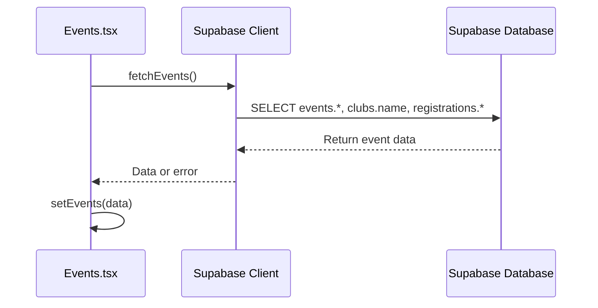
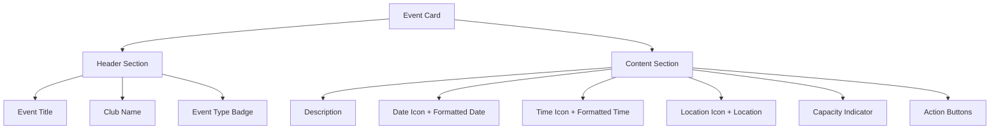

# Event Listing

<cite>
**Referenced Files in This Document**   
- [Events.tsx](file://src/pages/Events.tsx)
- [EventDetailsDialog.tsx](file://src/components/Events/EventDetailsDialog.tsx)
- [client.ts](file://src/integrations/supabase/client.ts)
- [types.ts](file://src/integrations/supabase/types.ts)
</cite>

## Table of Contents
1. [Introduction](#introduction)
2. [Event Data Fetching and Supabase Integration](#event-data-fetching-and-supabase-integration)
3. [Event Display and Responsive Layout](#event-display-and-responsive-layout)
4. [Event Filtering and Search](#event-filtering-and-search)
5. [Real-Time Updates and State Management](#real-time-updates-and-state-management)
6. [Performance Considerations](#performance-considerations)
7. [Troubleshooting Common Issues](#troubleshooting-common-issues)
8. [Conclusion](#conclusion)

## Introduction
The Event Listing feature in Campus Connect enables users to discover, register for, and manage college events. Built with React and integrated with Supabase, the feature provides a responsive interface for browsing events, viewing detailed information, and interacting with event registration and attendance systems. This document details the implementation of the event listing functionality, focusing on data fetching, UI rendering, user interaction flows, and integration with the Supabase backend.

## Event Data Fetching and Supabase Integration

The Events page fetches event data from Supabase using direct client queries rather than React Query. The integration is established through the Supabase client singleton, which is imported and configured with the project's URL and publishable key.



**Diagram sources**
- [Events.tsx](file://src/pages/Events.tsx#L60-L72)
- [client.ts](file://src/integrations/supabase/client.ts#L10-L16)

The `fetchEvents` function executes a Supabase query that retrieves all events with related club names and registration records. The query uses the following structure:

```sql
SELECT 
  *,
  clubs(name),
  registrations(id, profile_id)
FROM events
ORDER BY start_time ASC
```

This query leverages Supabase's automatic join capabilities to fetch nested data from related tables. The response is typed using the generated `types.ts` file, which provides TypeScript interfaces for all database tables and relationships.

Error handling is implemented with a try-catch block that logs errors to the console but does not display them to users, potentially hiding important failure information. The loading state is managed with the `isLoading` state variable, which controls the display of a loading spinner during data retrieval.

**Section sources**
- [Events.tsx](file://src/pages/Events.tsx#L60-L72)
- [types.ts](file://src/integrations/supabase/types.ts#L139-L181)

## Event Display and Responsive Layout

Events are displayed in a responsive grid layout that adapts to different screen sizes. The layout uses CSS Grid with breakpoints to show one column on mobile, two on medium screens, and three on large screens.



**Diagram sources**
- [Events.tsx](file://src/pages/Events.tsx#L140-L270)

Each event card displays key information including:
- **Title**: The event name, prominently displayed
- **Date**: Formatted start date using `formatDate()` utility
- **Time**: Start and end times using `formatTime()` utility
- **Location**: Physical venue of the event
- **Club**: Organizing club name from the joined `clubs` table
- **Capacity**: Registration count with color-coded availability indicator

The capacity indicator uses a dynamic color system:
- Green: Less than 70% capacity
- Orange: 70-89% capacity
- Red: 90% or more capacity

Users can interact with event cards through multiple action buttons:
- **Register**: Initiates registration process
- **Details**: Opens EventDetailsDialog
- **Check-in**: Appears during active events for registered users
- **Dashboard**: Available to event managers for attendance tracking

For team events, registration opens the TeamCreationDialog, while individual events proceed directly to registration.

**Section sources**
- [Events.tsx](file://src/pages/Events.tsx#L140-L270)

## Event Filtering and Search

The current implementation does not include explicit filtering or search functionality. All events are fetched and displayed without client-side filtering options. However, the data structure supports potential filtering capabilities:

- Events are ordered by start time (ascending)
- The `is_team_event` boolean field enables team/individual filtering
- Club affiliation data is available for club-based filtering
- Date/time fields support chronological filtering

Future enhancements could implement filtering controls to allow users to:
- Filter by event type (team vs individual)
- Filter by club
- Filter by date range
- Search by event title or description

The absence of search functionality may impact usability as the number of events grows.

## Real-Time Updates and State Management

The application uses React's built-in useState and useEffect hooks for state management rather than a dedicated state management library. The Events page maintains several state variables:

```mermaid
classDiagram
class EventsState {
+events : Event[]
+selectedEvent : Event | null
+isCreateDialogOpen : boolean
+isDetailsDialogOpen : boolean
+isTeamDialogOpen : boolean
+isAttendanceDashboardOpen : boolean
+isCheckInOpen : boolean
+isLoading : boolean
}
class Event {
+id : string
+title : string
+description : string | null
+location : string
+start_time : string
+end_time : string
+capacity : number
+is_team_event : boolean
+club_id : string
+clubs : { name : string }
+registrations : Array<{ id : string, profile_id : string }>
}
EventsState --> Event : contains
```

**Diagram sources**
- [Events.tsx](file://src/pages/Events.tsx#L32-L40)
- [Events.tsx](file://src/pages/Events.tsx#L10-L30)

Real-time updates are not currently implemented. The application relies on manual data refresh through:
- Initial fetch on component mount
- Refresh after event creation (`handleEventCreated`)
- Refresh after registration (`handleRegister`)

The Supabase client is configured with `autoRefreshToken: true`, which maintains authentication session validity but does not provide real-time data synchronization for events.

## Performance Considerations

The current implementation has several performance characteristics and potential optimization opportunities:

### Current Implementation
- **Data Fetching**: All events are fetched in a single query without pagination
- **Caching**: No explicit caching strategy; data is stored only in component state
- **Loading States**: Skeleton loading state during initial authentication and event fetching
- **Memory Usage**: All event data is held in memory as long as the component is mounted

### Optimization Opportunities
1. **Pagination**: Implement offset/limit queries to handle large numbers of events
2. **Infinite Scrolling**: Load additional events as users scroll through the list
3. **Caching**: Implement React Query or similar library for data caching and background updates
4. **Selective Fetching**: Fetch only necessary fields for the list view, then retrieve full details on demand

The lack of pagination could lead to performance degradation as the number of events increases. The current approach of fetching all events at once may become problematic with hundreds of events.

## Troubleshooting Common Issues

### Failed Data Loading
**Symptoms**: Blank screen, loading spinner persists indefinitely
**Potential Causes**:
- Network connectivity issues
- Supabase service outage
- Authentication token expiration
- CORS policy violations

**Solutions**:
1. Verify network connection
2. Check Supabase dashboard for service status
3. Clear localStorage and re-authenticate
4. Verify Supabase project URL and API keys

### Stale Event Displays
**Symptoms**: New events not appearing, registration counts not updating
**Potential Causes**:
- Missing data refresh after mutations
- Cache invalidation issues
- Real-time subscription failures

**Solutions**:
1. Manually refresh the page
2. Ensure `fetchEvents()` is called after all event modifications
3. Implement proper cache invalidation strategy
4. Consider adding real-time subscriptions for event changes

### Registration Issues
**Symptoms**: Unable to register for events, registration button unresponsive
**Potential Causes**:
- User not authenticated
- Event capacity reached
- Database constraint violations
- Row Level Security policies blocking insertion

**Solutions**:
1. Verify user authentication status
2. Check event capacity and registration deadline
3. Review browser console for error messages
4. Verify Supabase RLS policies for the registrations table

## Conclusion
The Event Listing feature provides a functional interface for discovering and interacting with campus events. While the current implementation successfully integrates with Supabase and provides core functionality, there are opportunities for improvement in areas such as performance optimization, real-time updates, and user experience enhancements. Future development should focus on implementing pagination, adding search and filtering capabilities, and improving error handling and feedback mechanisms.