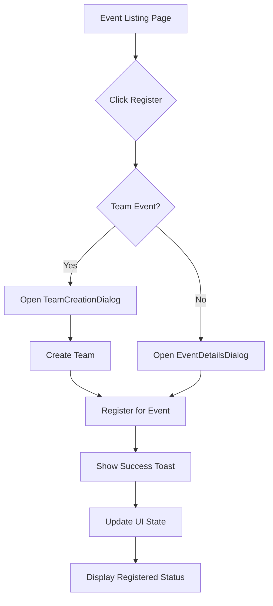
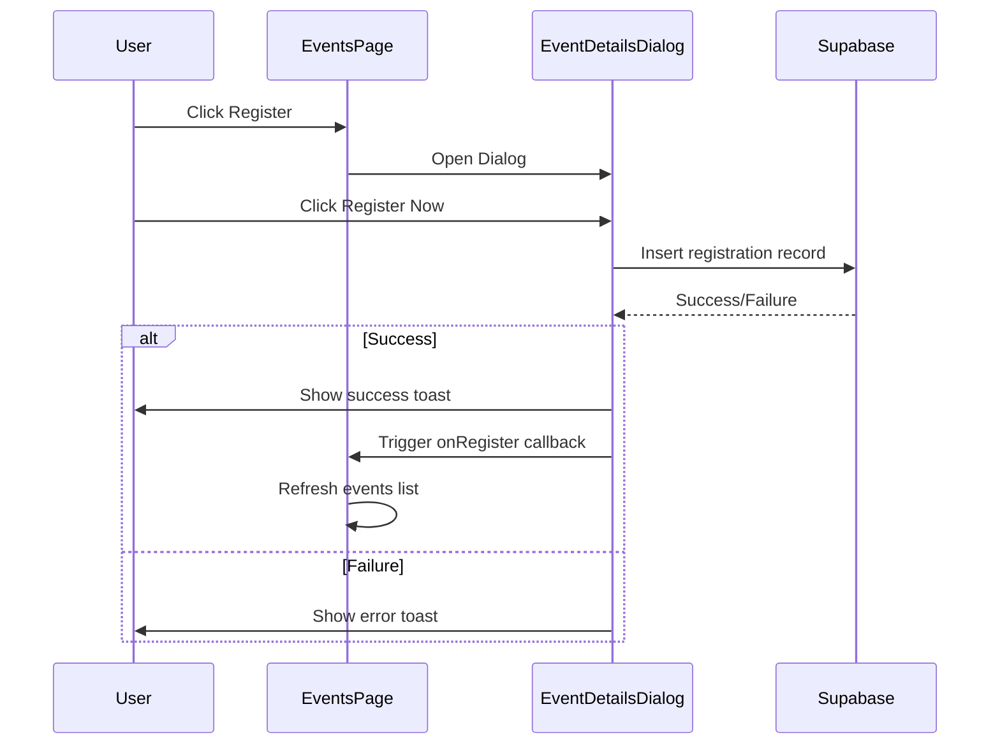
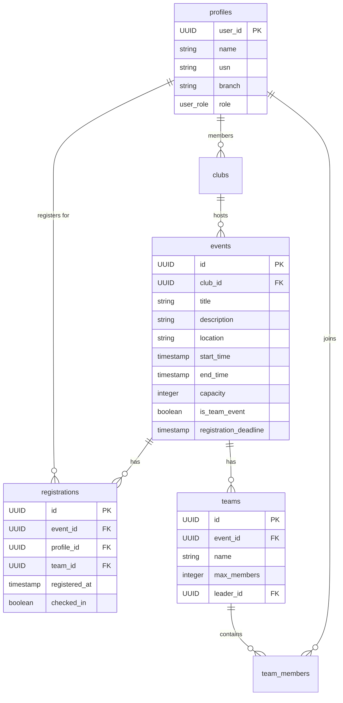

# Event Registration

<cite>
**Referenced Files in This Document**   
- [Events.tsx](file://src/pages/Events.tsx)
- [EventDetailsDialog.tsx](file://src/components/Events/EventDetailsDialog.tsx)
- [00_complete_schema.sql](file://supabase/migrations/00_complete_schema.sql)
</cite>

## Table of Contents
1. [Introduction](#introduction)
2. [UI Flow and User Experience](#ui-flow-and-user-experience)
3. [Registration Logic Implementation](#registration-logic-implementation)
4. [Data Model and Supabase Schema](#data-model-and-supabase-schema)
5. [Business Rules and Validation](#business-rules-and-validation)
6. [Real-Time Status Display](#real-time-status-display)
7. [Edge Cases and Error Handling](#edge-cases-and-error-handling)
8. [Troubleshooting Common Issues](#troubleshooting-common-issues)
9. [Suggested Enhancements](#suggested-enhancements)

## Introduction
The Event Registration feature enables students to register for campus events either individually or as part of a team. The system supports role-based access, capacity limits, and real-time status updates. Users can view event details, check availability, and register directly from the event listing page. The implementation leverages Supabase for data persistence and real-time synchronization, ensuring consistent state across clients.

**Section sources**
- [Events.tsx](file://src/pages/Events.tsx#L1-L353)
- [00_complete_schema.sql](file://supabase/migrations/00_complete_schema.sql#L1-L644)

## UI Flow and User Experience
The registration process begins on the Events listing page, where users see a grid of upcoming events. Each event card displays key information including title, club name, date, time, location, and registration status. Users can register by clicking the "Register" button, which opens a dialog with full event details. For team events, a separate team creation dialog is triggered. After successful registration, the UI updates to show "Registered" status, and a check-in button appears if the event is currently active.

**Diagram sources**
- [Events.tsx](file://src/pages/Events.tsx#L150-L200)
- [EventDetailsDialog.tsx](file://src/components/Events/EventDetailsDialog.tsx#L50-L100)

## Registration Logic Implementation
The registration logic is implemented across two main components: `Events.tsx` and `EventDetailsDialog.tsx`. The `Events.tsx` component manages the event list and handles registration state updates, while `EventDetailsDialog.tsx` handles the actual registration submission. The system uses Supabase to insert records into the `registrations` table, with client-side validation to prevent duplicate entries.

Button states are dynamically determined based on three conditions:
- **Registered**: User has already registered (disabled button with "Registered" text)
- **Full**: Event capacity reached (disabled destructive button with "Event Full")
- **Available**: User can register (active "Register Now" button)

**Diagram sources**
- [Events.tsx](file://src/pages/Events.tsx#L250-L300)
- [EventDetailsDialog.tsx](file://src/components/Events/EventDetailsDialog.tsx#L80-L150)

**Section sources**
- [Events.tsx](file://src/pages/Events.tsx#L100-L200)
- [EventDetailsDialog.tsx](file://src/components/Events/EventDetailsDialog.tsx#L60-L140)

## Data Model and Supabase Schema
The event registration system relies on a relational data model with three core tables: `events`, `profiles`, and `registrations`. Events are created by club or college administrators and can be either individual or team-based. The `registrations` table establishes the many-to-many relationship between users and events, with additional support for team associations.

**Diagram sources**
- [00_complete_schema.sql](file://supabase/migrations/00_complete_schema.sql#L150-L200)

**Section sources**
- [00_complete_schema.sql](file://supabase/migrations/00_complete_schema.sql#L100-L300)

## Business Rules and Validation
The system enforces several business rules to maintain data integrity and fairness:

- **Registration Deadline**: Events have an optional `registration_deadline` field; registrations are blocked after this time
- **Capacity Limits**: The `capacity` field in events table prevents over-registration
- **Duplicate Prevention**: Unique constraint on `(event_id, profile_id)` in registrations table
- **Role-Based Eligibility**: All users can register; only club/college admins can create events
- **Team Size Limits**: Maximum team size is configurable via system settings (default: 10)

These rules are enforced through database constraints, RLS policies, and application-level validation. The system also prevents registration for events that have already started or ended.

**Section sources**
- [00_complete_schema.sql](file://supabase/migrations/00_complete_schema.sql#L180-L190)
- [EventDetailsDialog.tsx](file://src/components/Events/EventDetailsDialog.tsx#L100-L120)

## Real-Time Status Display
The UI provides real-time feedback on registration status through multiple mechanisms:

- **Color-Coded Availability**: Green (0-70%), Orange (70-90%), Red (90-100%) based on registration percentage
- **Dynamic Button States**: Automatically updates to "Registered", "Event Full", or "Register Now"
- **Immediate Visual Feedback**: Success/error toasts after registration attempts
- **Auto-Refresh**: Event list refreshes after successful registration

The system uses React state and Supabase queries to ensure the displayed information is always current. The `isRegistered` function checks the registrations array to determine button state, while `getAvailabilityColor` calculates the visual indicator based on current registration count.

**Section sources**
- [Events.tsx](file://src/pages/Events.tsx#L120-L140)
- [EventDetailsDialog.tsx](file://src/components/Events/EventDetailsDialog.tsx#L40-L60)

## Edge Cases and Error Handling
The system handles several edge cases:

- **Full Events**: Users see "Event Full" message and cannot register
- **Late Registrations**: Blocked if registration deadline has passed or event has started
- **Network Failures**: Registration attempts show loading state and error messages on failure
- **Concurrent Registration**: Database unique constraints prevent duplicate entries
- **Cancellation Policy**: No explicit cancellation UI, but records can be deleted by admins

Error handling is implemented through try-catch blocks and Supabase error responses. The system provides user-friendly error messages via toast notifications, while logging technical details for debugging.

**Section sources**
- [EventDetailsDialog.tsx](file://src/components/Events/EventDetailsDialog.tsx#L110-L140)
- [00_complete_schema.sql](file://supabase/migrations/00_complete_schema.sql#L500-L520)

## Troubleshooting Common Issues
**Failed Registrations**
- Ensure internet connection is stable
- Verify event is not full or past registration deadline
- Check that user profile is complete
- Refresh the page and try again

**Inconsistent State Displays**
- Force refresh the events list by navigating away and back
- Clear browser cache if issues persist
- Check Supabase console for RLS policy violations
- Verify that the `registrations` table has proper RLS policies

**Registration Not Reflecting**
- Confirm successful toast message was displayed
- Check that `onRegister` callback is properly passed and executed
- Verify Supabase query returns updated data
- Ensure no client-side caching is interfering

**Section sources**
- [Events.tsx](file://src/pages/Events.tsx#L200-L250)
- [EventDetailsDialog.tsx](file://src/components/Events/EventDetailsDialog.tsx#L130-L150)

## Suggested Enhancements
Several improvements could enhance the registration experience:

- **Waitlists**: Automatically add users to waitlist when event is full, with notifications if spots open
- **Registration Approvals**: Require admin approval for certain events, with status tracking
- **Cancellation Interface**: Allow users to cancel their registration with policy enforcement
- **Reminder Notifications**: Send automated reminders before event start time
- **QR Code Check-in**: Enhance check-in process with QR code scanning
- **Analytics Dashboard**: Provide organizers with registration trends and demographics

These enhancements would improve user experience and provide better tools for event organizers while maintaining the robust foundation of the current system.

**Section sources**
- [00_complete_schema.sql](file://supabase/migrations/00_complete_schema.sql#L600-L620)
- [Events.tsx](file://src/pages/Events.tsx#L300-L350)