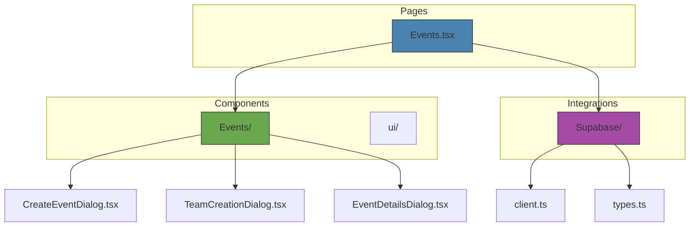
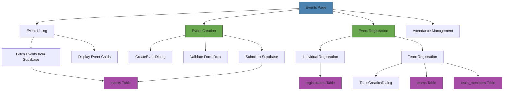
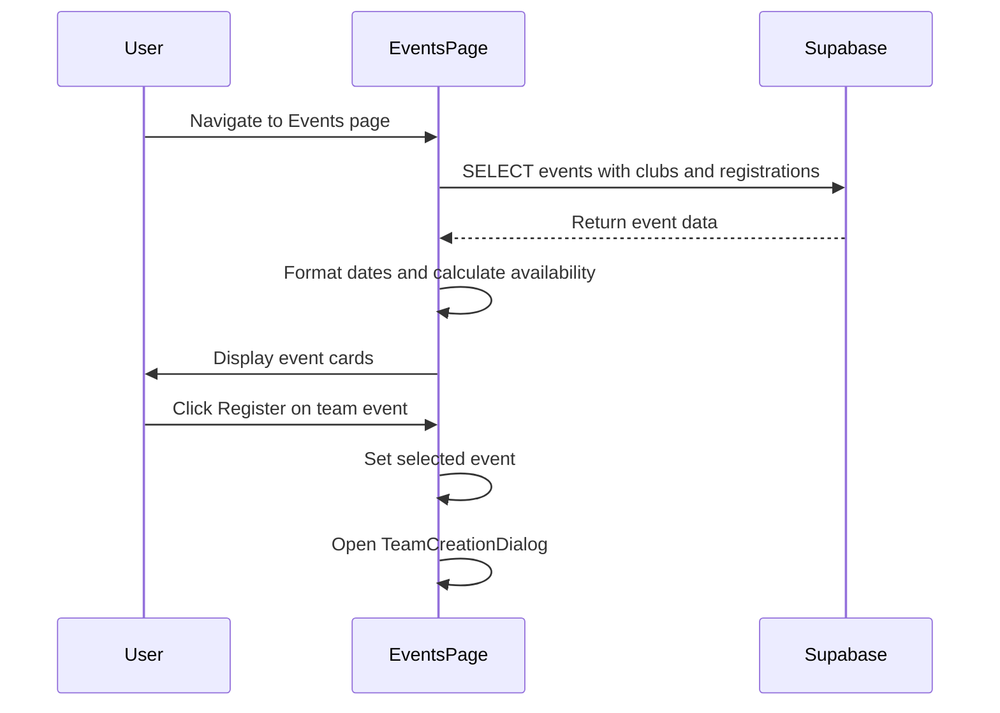
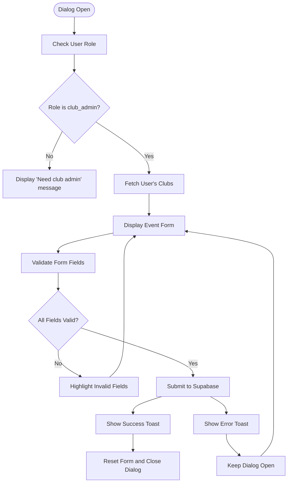
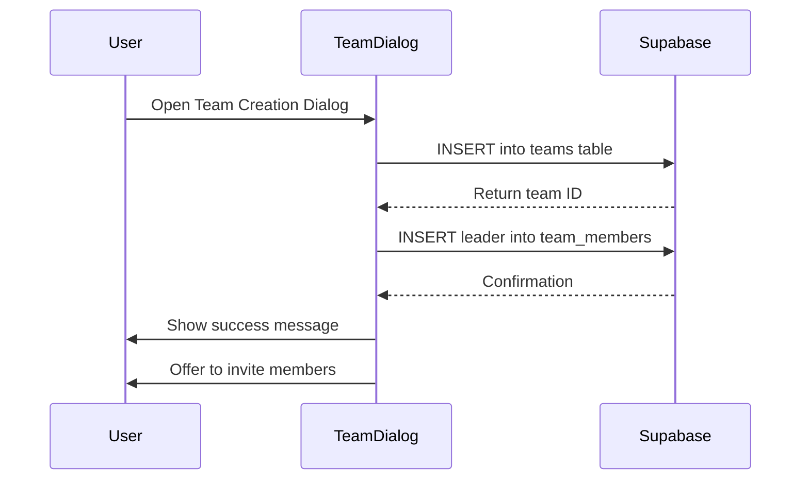
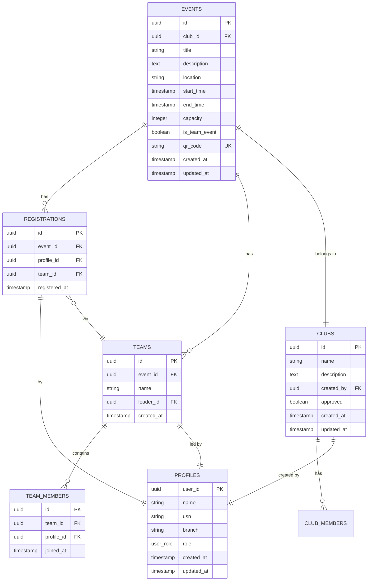

# Events Management

<cite>
**Referenced Files in This Document**   
- [Events.tsx](file://src/pages/Events.tsx)
- [CreateEventDialog.tsx](file://src/components/Events/CreateEventDialog.tsx)
- [TeamCreationDialog.tsx](file://src/components/Events/TeamCreationDialog.tsx)
- [EventDetailsDialog.tsx](file://src/components/Events/EventDetailsDialog.tsx)
- [20250908005627_511ef022-3222-4458-b7de-e0063ed13e63.sql](file://supabase/migrations/20250908005627_511ef022-3222-4458-b7de-e0063ed13e63.sql)
- [types.ts](file://src/integrations/supabase/types.ts)
</cite>

## Table of Contents
1. [Introduction](#introduction)
2. [Project Structure](#project-structure)
3. [Core Components](#core-components)
4. [Architecture Overview](#architecture-overview)
5. [Detailed Component Analysis](#detailed-component-analysis)
6. [Dependency Analysis](#dependency-analysis)
7. [Performance Considerations](#performance-considerations)
8. [Troubleshooting Guide](#troubleshooting-guide)
9. [Conclusion](#conclusion)

## Introduction
The Events Management system enables users to discover, create, register for, and manage college events. It supports both individual and team-based events with comprehensive registration workflows. The system is built on a Supabase backend with React frontend components, featuring role-based access control and real-time data synchronization. Key functionality includes event listing, creation, registration management, team formation, and attendance tracking.

## Project Structure



**Diagram sources**
- [Events.tsx](file://src/pages/Events.tsx)
- [CreateEventDialog.tsx](file://src/components/Events/CreateEventDialog.tsx)
- [supabase](file://src/integrations/supabase)

**Section sources**
- [Events.tsx](file://src/pages/Events.tsx)
- [components](file://src/components)

## Core Components

The Events Management system consists of several key components that work together to provide a complete event lifecycle management solution. The main page component (Events.tsx) orchestrates the display and interaction with events, while dialog components handle specific user actions like event creation and registration. The system leverages Supabase for data persistence and authentication, with a well-defined data model that supports complex relationships between events, users, teams, and registrations.

**Section sources**
- [Events.tsx](file://src/pages/Events.tsx)
- [CreateEventDialog.tsx](file://src/components/Events/CreateEventDialog.tsx)
- [TeamCreationDialog.tsx](file://src/components/Events/TeamCreationDialog.tsx)

## Architecture Overview



**Diagram sources**
- [Events.tsx](file://src/pages/Events.tsx)
- [CreateEventDialog.tsx](file://src/components/Events/CreateEventDialog.tsx)
- [20250908005627_511ef022-3222-4458-b7de-e0063ed13e63.sql](file://supabase/migrations/20250908005627_511ef022-3222-4458-b7de-e0063ed13e63.sql)

## Detailed Component Analysis

### Event Listing and Display

The Events.tsx component is responsible for fetching and displaying all available events in a card-based layout. It uses Supabase to retrieve event data along with related club information and registration counts. The component implements real-time updates through React's useEffect hook, ensuring the event list stays current. Each event card displays key information including title, location, time, capacity status, and action buttons for registration and details viewing.



**Diagram sources**
- [Events.tsx](file://src/pages/Events.tsx#L1-L353)

**Section sources**
- [Events.tsx](file://src/pages/Events.tsx#L1-L353)

### CreateEventDialog Implementation

The CreateEventDialog component provides a form interface for club administrators to create new events. The dialog validates user permissions by checking if the current user has club_admin role and fetches the clubs they administer. The form includes fields for event title, description, location, start and end times, capacity, and a toggle for team events. Client-side validation ensures date integrity and required fields are completed before submission to Supabase.



**Diagram sources**
- [CreateEventDialog.tsx](file://src/components/Events/CreateEventDialog.tsx#L1-L262)

**Section sources**
- [CreateEventDialog.tsx](file://src/components/Events/CreateEventDialog.tsx#L1-L262)

### TeamCreationDialog Implementation

The TeamCreationDialog component handles the creation of teams for team-based events. When a user registers for a team event, this dialog allows them to create a new team with a specified name, becoming the team leader. The component first creates the team record in the teams table, then automatically adds the creator as a team member in the team_members table. After successful creation, users can invite additional members through the TeamInviteDialog component.



**Diagram sources**
- [TeamCreationDialog.tsx](file://src/components/Events/TeamCreationDialog.tsx#L1-L165)

**Section sources**
- [TeamCreationDialog.tsx](file://src/components/Events/TeamCreationDialog.tsx#L1-L165)

### Event Details and Registration Flow

The EventDetailsDialog component provides comprehensive information about a specific event and handles individual registration. The dialog displays event details including description, date/time, location, and capacity status. It implements business logic to determine registration eligibility based on event capacity and user registration status. For individual events, users can register directly through this dialog, which creates a record in the registrations table.

```mermaid
flowchart TD
A[Open EventDetailsDialog] --> B{Is Registered?}
B --> |Yes| C[Show "Already Registered"]
B --> |No| D{Is Event Full?}
D --> |Yes| E[Show "Event Full"]
D --> |No| F[Show Register Button]
F --> G[User Clicks Register]
G --> H[Call Supabase INSERT]
H --> I{Success?}
I --> |Yes| J[Show Success Toast]
I --> |No| K[Show Error Toast]
J --> L[Close Dialog and Refresh]
K --> M[Keep Dialog Open]
```

**Diagram sources**
- [EventDetailsDialog.tsx](file://src/components/Events/EventDetailsDialog.tsx#L1-L183)

**Section sources**
- [EventDetailsDialog.tsx](file://src/components/Events/EventDetailsDialog.tsx#L1-L183)

## Dependency Analysis



**Diagram sources**
- [20250908005627_511ef022-3222-4458-b7de-e0063ed13e63.sql](file://supabase/migrations/20250908005627_511ef022-3222-4458-b7de-e0063ed13e63.sql)
- [types.ts](file://src/integrations/supabase/types.ts)

**Section sources**
- [20250908005627_511ef022-3222-4458-b7de-e0063ed13e63.sql](file://supabase/migrations/20250908005627_511ef022-3222-4458-b7de-e0063ed13e63.sql)
- [types.ts](file://src/integrations/supabase/types.ts)

## Performance Considerations

The Events Management system implements several performance optimizations to ensure responsive user experiences. The Events.tsx component uses efficient data fetching patterns with Supabase, retrieving only necessary fields and related data in a single query. Client-side state management minimizes unnecessary re-renders through proper useState and useEffect usage. Form validation is performed client-side to reduce server round trips, while toast notifications provide immediate user feedback without blocking the UI. The system also implements proper loading states to maintain perceived performance during data operations.

## Troubleshooting Guide

Common issues in the Events Management system typically relate to permission errors, validation failures, and data consistency. For event creation, ensure the user has club_admin role and is a member of at least one club. Registration issues may occur when events are full or when duplicate registrations are attempted (prevented by the UNIQUE constraint on event_id and profile_id). Team creation requires careful handling of transactional integrity - both team and team_member records must be created successfully. Database constraints and RLS policies should be verified when encountering unexpected permission denials.

**Section sources**
- [CreateEventDialog.tsx](file://src/components/Events/CreateEventDialog.tsx#L1-L262)
- [EventDetailsDialog.tsx](file://src/components/Events/EventDetailsDialog.tsx#L1-L183)
- [20250908005627_511ef022-3222-4458-b7de-e0063ed13e63.sql](file://supabase/migrations/20250908005627_511ef022-3222-4458-b7de-e0063ed13e63.sql)

## Conclusion

The Events Management system provides a comprehensive solution for college event lifecycle management, from creation to attendance tracking. Its well-structured component architecture and robust data model support both individual and team-based events with proper role-based access control. The integration with Supabase ensures data consistency and security through RLS policies and database constraints. Future enhancements could include waitlist functionality for full events, recurring event patterns, and improved team management features like member removal and leadership transfer.