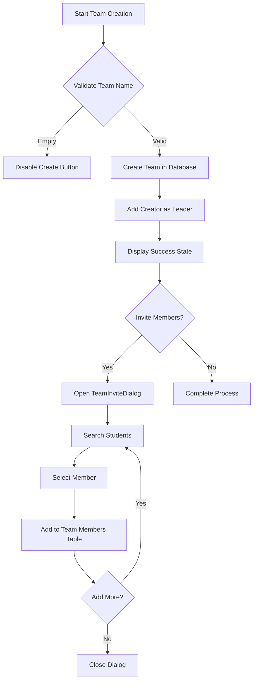
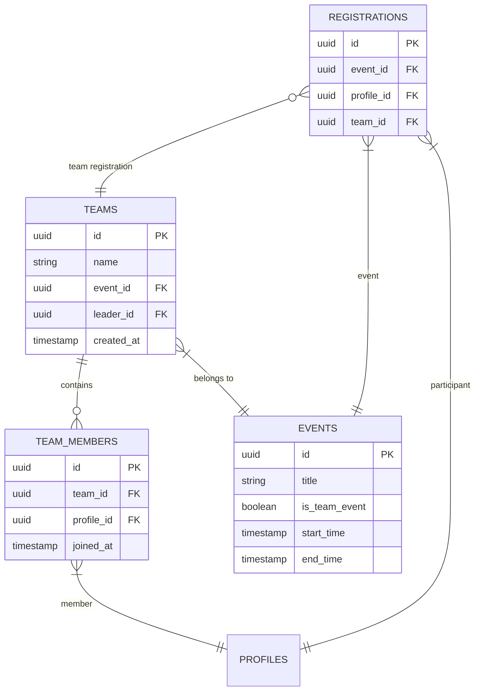
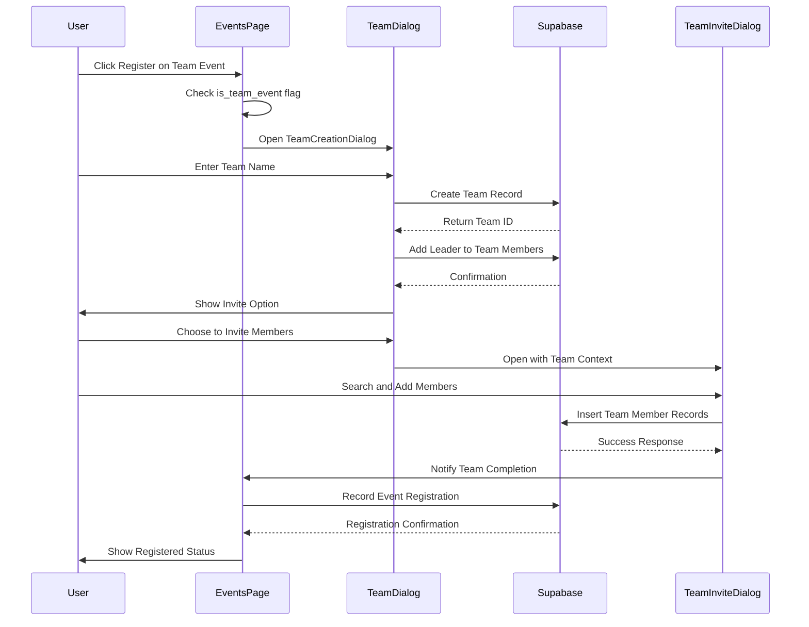

# Team Management

<cite>
**Referenced Files in This Document**   
- [TeamCreationDialog.tsx](file://src/components/Events/TeamCreationDialog.tsx)
- [TeamInviteDialog.tsx](file://src/components/Teams/TeamInviteDialog.tsx)
- [Events.tsx](file://src/pages/Events.tsx)
- [00_complete_schema.sql](file://supabase/migrations/00_complete_schema.sql)
- [types.ts](file://src/integrations/supabase/types.ts)
</cite>

## Table of Contents
1. [Introduction](#introduction)
2. [Core Components](#core-components)
3. [Team Creation Flow](#team-creation-flow)
4. [Database Schema](#database-schema)
5. [Event Integration](#event-integration)
6. [Business Rules](#business-rules)
7. [Edge Cases and Error Handling](#edge-cases-and-error-handling)
8. [Troubleshooting Guide](#troubleshooting-guide)
9. [Possible Extensions](#possible-extensions)

## Introduction
The Team Management feature enables users to create and manage teams for team-based events within the Campus Connect platform. This system allows students to form teams, designate leaders, and register collectively for events that require group participation. The implementation centers around the TeamCreationDialog component, which guides users through team formation, while integrating with Supabase for persistent storage and relationship management. The feature supports team-based event registration by linking teams to specific events and managing membership through a dedicated invitation workflow.

## Core Components

The team management system consists of two primary components that work together to enable team creation and member management:

- **TeamCreationDialog**: Handles the initial team creation process, allowing users to define team names and establish leadership
- **TeamInviteDialog**: Manages the addition of members to existing teams through a search and selection interface

These components are integrated within the Events page to provide a seamless team registration experience for team-based events.

**Section sources**
- [TeamCreationDialog.tsx](file://src/components/Events/TeamCreationDialog.tsx#L1-L165)
- [TeamInviteDialog.tsx](file://src/components/Teams/TeamInviteDialog.tsx#L1-L299)

## Team Creation Flow

The team creation process follows a two-step workflow that separates team formation from member invitation:

**Diagram sources**
- [TeamCreationDialog.tsx](file://src/components/Events/TeamCreationDialog.tsx#L30-L81)
- [TeamInviteDialog.tsx](file://src/components/Teams/TeamInviteDialog.tsx#L80-L127)

The process begins when a user clicks "Register" on a team event, triggering the TeamCreationDialog. Users must enter a team name, which is validated for non-emptiness before submission. Upon successful creation, the dialog transitions to a success state where the user can immediately invite members or close the dialog. The team leader is automatically added as a member during creation, establishing their role in the team_members table.

**Section sources**
- [TeamCreationDialog.tsx](file://src/components/Events/TeamCreationDialog.tsx#L75-L115)

## Database Schema

The team management functionality relies on a relational database schema with three key tables that maintain team, member, and event relationships:

**Diagram sources**
- [00_complete_schema.sql](file://supabase/migrations/00_complete_schema.sql#L96-L129)
- [types.ts](file://src/integrations/supabase/types.ts#L319-L373)

The **teams** table stores core team information including name, associated event, and leader designation. Each team must be linked to a specific event through the event_id foreign key. The **team_members** table implements a many-to-many relationship between teams and users, with each record representing a member's participation in a team. The **registrations** table connects team-based event participation, allowing teams to register for events while maintaining individual member attendance tracking.

## Event Integration

The Events page integrates team management functionality through conditional registration handling based on event type:

**Diagram sources**
- [Events.tsx](file://src/pages/Events.tsx#L150-L170)
- [TeamCreationDialog.tsx](file://src/components/Events/TeamCreationDialog.tsx#L30-L81)

When users attempt to register for a team event, the Events component checks the event's is_team_event property and conditionally renders the TeamCreationDialog instead of individual registration. After team creation, the onTeamCreated callback triggers a refresh of event data and closes the dialog, effectively completing the registration process by associating the team with the event through the registrations table.

**Section sources**
- [Events.tsx](file://src/pages/Events.tsx#L150-L170)

## Business Rules

The team management system enforces several business rules to maintain data integrity and ensure proper team formation:

| Rule | Implementation | Constraint |
|------|---------------|------------|
| **Team Name Requirement** | Validation checks for non-empty team name before submission | Frontend validation in TeamCreationDialog |
| **Unique Team Names per Event** | Database enforces unique constraint on event_id + name combination | UNIQUE(event_id, name) in teams table |
| **Single Team Membership** | Users can only belong to one team per event | Application-level validation during member addition |
| **Leader Designation** | Team creator automatically becomes leader with management privileges | leader_id field in teams table |
| **Member Uniqueness** | Prevents duplicate members within the same team | UNIQUE(team_id, profile_id) constraint |
| **Team Size Limits** | Maximum of 10 members per team (default) | max_members INTEGER NOT NULL DEFAULT 10 in teams table |

The system also implements role-based access control through Row Level Security (RLS) policies, ensuring that only team leaders, club administrators, or college administrators can modify team membership. This prevents unauthorized users from joining or removing members from teams they don't lead.

**Section sources**
- [00_complete_schema.sql](file://supabase/migrations/00_complete_schema.sql#L496-L527)
- [TeamInviteDialog.tsx](file://src/components/Teams/TeamInviteDialog.tsx#L80-L127)

## Edge Cases and Error Handling

The implementation addresses several edge cases and potential failure scenarios:

- **Partial Team Submissions**: If team creation succeeds but member addition fails, the system maintains the team record and allows users to add members later through the TeamInviteDialog
- **Member Removal**: While not directly implemented in the current dialogs, the RLS policies support member removal by team leaders through direct database operations
- **Team Dissolution**: Teams can be effectively dissolved by removing all members, though the team record remains for historical tracking of event participation
- **Network Failures**: All database operations include proper error handling with user-friendly toast notifications
- **Concurrent Modifications**: Database constraints and RLS policies prevent conflicting modifications from multiple users

The system handles validation failures by disabling the create button until a valid team name is entered, providing immediate feedback to users. For server-side errors, descriptive messages are displayed through the toast notification system, helping users understand what went wrong during team creation or member invitation.

**Section sources**
- [TeamCreationDialog.tsx](file://src/components/Events/TeamCreationDialog.tsx#L30-L81)
- [TeamInviteDialog.tsx](file://src/components/Teams/TeamInviteDialog.tsx#L123-L169)

## Troubleshooting Guide

Common issues and their solutions:

| Issue | Possible Cause | Solution |
|------|---------------|----------|
| **"Failed to create team" error** | Network connectivity issues or database constraints | Check internet connection, verify team name isn't already used for this event |
| **Unable to invite members** | Team creation not fully completed or session issues | Refresh the page and reopen the invitation dialog from the Events page |
| **Duplicate member entries** | UI allowing multiple rapid clicks on add button | Implement button disabling during submission and add client-side duplicate checking |
| **Search not returning expected students** | Search term too short or database indexing issues | Use at least 2 characters in search, verify student profiles exist in the database |
| **Team not appearing in event registration** | Asynchronous data refresh issues | Manually refresh the Events page to ensure latest team data is loaded |

For persistent issues, administrators should verify the integrity of the foreign key relationships between teams, team_members, and events tables, and ensure that RLS policies are properly configured to allow appropriate access.

**Section sources**
- [TeamCreationDialog.tsx](file://src/components/Events/TeamCreationDialog.tsx#L30-L81)
- [TeamInviteDialog.tsx](file://src/components/Teams/TeamInviteDialog.tsx#L80-L127)

## Possible Extensions

Several enhancements could improve the team management functionality:

1. **Team Editing After Submission**: Allow team leaders to modify team names or transfer leadership to another member
2. **Team Chat Integration**: Implement a communication channel for team members to coordinate event participation
3. **Invitation Workflow**: Replace direct member addition with a request/acceptance system for better consent management
4. **Team Analytics**: Provide insights into team formation patterns and participation rates for event organizers
5. **Team Templates**: Allow saving of team configurations for recurring events or competitions
6. **Role-Based Permissions**: Implement additional roles within teams (e.g., co-leader, officer) with varying permission levels
7. **Team Validation**: Add minimum team size requirements and automated validation before event registration
8. **Team Transfer**: Enable movement of teams between similar events if scheduling conflicts arise

These extensions would enhance the collaborative aspects of team-based events while maintaining the robust data integrity established by the current implementation.

**Section sources**
- [TeamCreationDialog.tsx](file://src/components/Events/TeamCreationDialog.tsx#L1-L165)
- [TeamInviteDialog.tsx](file://src/components/Teams/TeamInviteDialog.tsx#L1-L299)