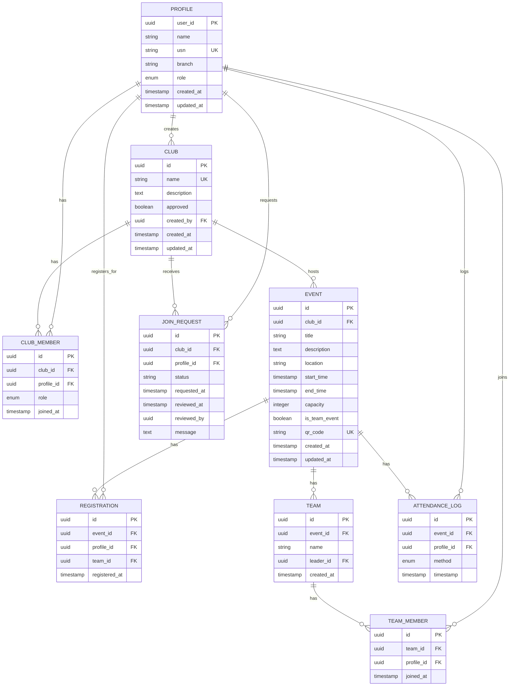
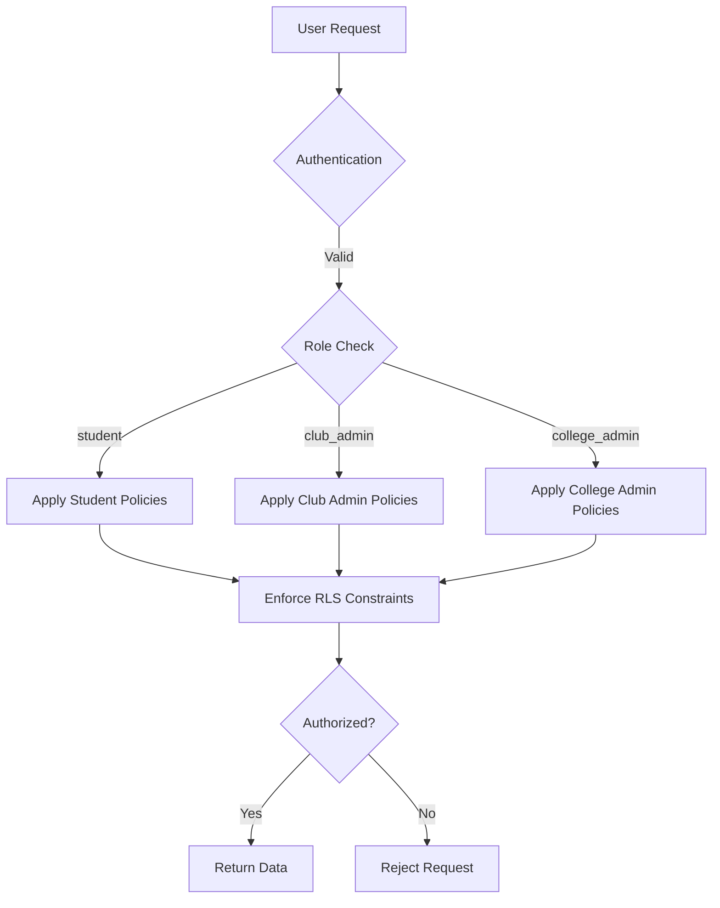

# Database Schema Design

<cite>
**Referenced Files in This Document**  
- [20250908005627_511ef022-3222-4458-b7de-e0063ed13e63.sql](file://supabase/migrations/20250908005627_511ef022-3222-4458-b7de-e0063ed13e63.sql)
- [20250909010718_5336955c-8e01-4c24-9b07-3f5a1082d666.sql](file://supabase/migrations/20250909010718_5336955c-8e01-4c24-9b07-3f5a1082d666.sql)
- [types.ts](file://src/integrations/supabase/types.ts)
</cite>

## Table of Contents
1. [Introduction](#introduction)
2. [Entity Relationship Model](#entity-relationship-model)
3. [Core Entity Definitions](#core-entity-definitions)
4. [Role-Based Access Control](#role-based-access-control)
5. [Schema Evolution History](#schema-evolution-history)
6. [Data Integrity and Constraints](#data-integrity-and-constraints)
7. [Performance Considerations](#performance-considerations)
8. [Sample Queries](#sample-queries)
9. [Conclusion](#conclusion)

## Introduction

The campus-connect application utilizes a Supabase PostgreSQL database to manage campus activities, clubs, events, and user profiles. The database schema is designed to support a role-based system with three primary user roles: students, club administrators, and college administrators. The core entities include Profile, Club, Event, Registration, Team, and related supporting tables that manage membership requests and attendance.

The schema implements Row Level Security (RLS) policies to enforce data access controls at the database level, ensuring users can only access data appropriate to their roles. The design follows normalization principles while optimizing for common access patterns in a campus activity management system.

**Section sources**
- [20250908005627_511ef022-3222-4458-b7de-e0063ed13e63.sql](file://supabase/migrations/20250908005627_511ef022-3222-4458-b7de-e0063ed13e63.sql#L1-L20)
- [types.ts](file://src/integrations/supabase/types.ts#L1-L50)

## Entity Relationship Model

The database schema consists of several interconnected entities that represent the core domain model of the campus-connect application. The primary entities and their relationships are visualized in the entity-relationship diagram below.



**Diagram sources**
- [20250908005627_511ef022-3222-4458-b7de-e0063ed13e63.sql](file://supabase/migrations/20250908005627_511ef022-3222-4458-b7de-e0063ed13e63.sql#L1-L229)
- [20250909010718_5336955c-8e01-4c24-9b07-3f5a1082d666.sql](file://supabase/migrations/20250909010718_5336955c-8e01-4c24-9b07-3f5a1082d666.sql#L1-L46)

## Core Entity Definitions

### Profile Entity

The Profile entity represents users in the system and is linked to Supabase authentication. Each profile is associated with an authentication user and contains academic information.

**Field Definitions**
- `user_id`: UUID primary key, references auth.users(id)
- `name`: User's full name (text, not null)
- `usn`: Unique Student Number (text, unique, not null)
- `branch`: Academic branch/department (text, not null)
- `role`: User role (enum: student, club_admin, college_admin, default: student)
- `created_at`: Timestamp of profile creation
- `updated_at`: Timestamp of last update

The profile is automatically created when a user signs up through the `handle_new_user()` trigger function, which extracts user metadata from the authentication system.

**Section sources**
- [20250908005627_511ef022-3222-4458-b7de-e0063ed13e63.sql](file://supabase/migrations/20250908005627_511ef022-3222-4458-b7de-e0063ed13e63.sql#L7-L15)
- [types.ts](file://src/integrations/supabase/types.ts#L100-L115)

### Club Entity

The Club entity represents student organizations within the college. Clubs must be approved by college administrators before they become active.

**Field Definitions**
- `id`: UUID primary key, auto-generated
- `name`: Club name (text, unique, not null)
- `description`: Club description (text, nullable)
- `approved`: Approval status (boolean, default: false)
- `created_by`: Reference to the profile of the creator
- `created_at`: Timestamp of club creation
- `updated_at`: Timestamp of last update

Clubs are created by users and require approval from college administrators before they can host events.

**Section sources**
- [20250908005627_511ef022-3222-4458-b7de-e0063ed13e63.sql](file://supabase/migrations/20250908005627_511ef022-3222-4458-b7de-e0063ed13e63.sql#L17-L25)
- [types.ts](file://src/integrations/supabase/types.ts#L117-L132)

### Event Entity

The Event entity represents activities hosted by clubs. Events can be individual or team-based and have capacity limits.

**Field Definitions**
- `id`: UUID primary key, auto-generated
- `club_id`: Reference to the hosting club
- `title`: Event title (text, not null)
- `description`: Event description (text, nullable)
- `location`: Physical location (text, not null)
- `start_time`, `end_time`: Event scheduling
- `capacity`: Maximum number of participants (integer > 0)
- `is_team_event`: Flag indicating team-based participation
- `qr_code`: Unique QR code for attendance (text, unique, auto-generated)
- `created_at`, `updated_at`: Timestamps

**Section sources**
- [20250908005627_511ef022-3222-4458-b7de-e0063ed13e63.sql](file://supabase/migrations/20250908005627_511ef022-3222-4458-b7de-e0063ed13e63.sql#L38-L52)
- [types.ts](file://src/integrations/supabase/types.ts#L134-L153)

### Registration Entity

The Registration entity tracks user participation in events. For team events, registrations are associated with teams.

**Field Definitions**
- `id`: UUID primary key, auto-generated
- `event_id`: Reference to the event
- `profile_id`: Reference to the participant
- `team_id`: Optional reference to team (for team events)
- `registered_at`: Timestamp of registration

Each user can register for an event only once, enforced by the UNIQUE constraint on (event_id, profile_id).

**Section sources**
- [20250908005627_511ef022-3222-4458-b7de-e0063ed13e63.sql](file://supabase/migrations/20250908005627_511ef022-3222-4458-b7de-e0063ed13e63.sql#L78-L86)
- [types.ts](file://src/integrations/supabase/types.ts#L186-L201)

### Team Entity

The Team entity supports team-based events, allowing groups of students to participate together.

**Field Definitions**
- `id`: UUID primary key, auto-generated
- `event_id`: Reference to the associated event
- `name`: Team name (text, not null)
- `leader_id`: Reference to the team leader's profile
- `created_at`: Timestamp of team creation

Teams must have unique names within each event, enforced by the UNIQUE constraint on (event_id, name).

**Section sources**
- [20250908005627_511ef022-3222-4458-b7de-e0063ed13e63.sql](file://supabase/migrations/20250908005627_511ef022-3222-4458-b7de-e0063ed13e63.sql#L63-L71)
- [types.ts](file://src/integrations/supabase/types.ts#L238-L253)

## Role-Based Access Control

The database implements a comprehensive Row Level Security (RLS) system to enforce role-based access control across all tables.

### User Roles

Three distinct roles are defined in the system:

**user_role Enum**
- `student`: Regular users who can join clubs and events
- `club_admin`: Club administrators who can manage their club's events
- `college_admin`: College administrators with elevated privileges

**club_member_role Enum**
- `member`: Regular club members
- `admin`: Club administrators with management privileges

These roles are implemented as PostgreSQL ENUM types and are used throughout the schema to control access and permissions.

**Section sources**
- [20250908005627_511ef022-3222-4458-b7de-e0063ed13e63.sql](file://supabase/migrations/20250908005627_511ef022-3222-4458-b7de-e0063ed13e63.sql#L1-L6)
- [types.ts](file://src/integrations/supabase/types.ts#L368-L370)

### RLS Policies

The RLS policies implement fine-grained access control for each table:

**Profiles Table Policies**
- All users can view all profiles
- Users can create their own profile
- Users can update their own profile
- College admins can update any profile

**Clubs Table Policies**
- Users can view approved clubs
- College admins can view all clubs (including unapproved)
- Users can create clubs
- Club creators and college admins can update clubs

**Club Members Table Policies**
- Users can view members of clubs they belong to
- Club admins can manage members of their clubs
- Users can join clubs by inserting into this table

**Events Table Policies**
- Users can view events of approved clubs
- Club admins can manage events for their clubs

**Registrations Table Policies**
- Users can view their own registrations
- Users can register for events
- Club admins can view registrations for events in their clubs

The RLS system ensures data isolation and security by enforcing these policies at the database level, preventing unauthorized access even if application-level security is compromised.



**Diagram sources**
- [20250908005627_511ef022-3222-4458-b7de-e0063ed13e63.sql](file://supabase/migrations/20250908005627_511ef022-3222-4458-b7de-e0063ed13e63.sql#L94-L200)
- [types.ts](file://src/integrations/supabase/types.ts#L368-L370)

## Schema Evolution History

The database schema has evolved through multiple migration files that track the development of the data model.

### Initial Schema (20250908005627)

The initial migration file established the core schema with the following components:
- Creation of ENUM types for user roles, club member roles, and attendance methods
- Definition of all core tables: profiles, clubs, club_members, events, teams, team_members, registrations, and attendance_logs
- Implementation of primary and foreign key constraints
- Setup of Row Level Security (RLS) policies for all tables
- Creation of trigger functions for automatic profile creation and timestamp updates

This migration established the foundational data model for the campus-connect application.

**Section sources**
- [20250908005627_511ef022-3222-4458-b7de-e0063ed13e63.sql](file://supabase/migrations/20250908005627_511ef022-3222-4458-b7de-e0063ed13e63.sql#L1-L229)

### Membership Requests (20250909010718)

The second migration introduced the join_requests table to manage club membership applications:

**join_requests Table**
- `id`: UUID primary key
- `club_id`: Reference to the target club
- `profile_id`: Reference to the requesting user
- `status`: Text field with CHECK constraint for 'pending', 'approved', 'rejected'
- `requested_at`: Timestamp of request
- `reviewed_at`: Timestamp when reviewed
- `reviewed_by`: Reference to the reviewer
- `message`: Optional message from requester

This migration also added RLS policies to ensure:
- Users can create their own join requests
- Users can view their own requests
- Club admins can manage requests for their clubs

The join_requests table enables a controlled membership process where club administrators can approve or reject new members.

**Section sources**
- [20250909010718_5336955c-8e01-4c24-9b07-3f5a1082d666.sql](file://supabase/migrations/20250909010718_5336955c-8e01-4c24-9b07-3f5a1082d666.sql#L1-L46)

### Duplicate Migration (20250909010744)

A third migration file appears to be a duplicate of the second migration, containing identical SQL statements for creating the join_requests table and its RLS policies. This suggests a potential error in the migration process where the same migration was applied twice.

**Section sources**
- [20250909010744_baf630ed-00b1-48e7-add2-b4e5703f0a84.sql](file://supabase/migrations/20250909010744_baf630ed-00b1-48e7-add2-b4e5703f0a84.sql#L1-L35)

## Data Integrity and Constraints

The schema implements multiple constraints to ensure data integrity and consistency.

### Primary Keys

All tables use UUID primary keys with auto-generation:
- `gen_random_uuid()` function ensures globally unique identifiers
- Prevents ID prediction and enumeration attacks
- Facilitates distributed systems and data merging

### Foreign Key Constraints

Comprehensive foreign key relationships maintain referential integrity:
- CASCADE deletion ensures cleanup of dependent records
- All relationships are explicitly defined and enforced by the database

### Unique Constraints

Critical uniqueness constraints prevent data duplication:
- `profiles.usn`: Ensures unique student numbers
- `clubs.name`: Prevents duplicate club names
- `events.qr_code`: Ensures unique QR codes for attendance
- Composite UNIQUE constraints on association tables prevent duplicate relationships

### Check Constraints

Domain integrity is enforced through check constraints:
- `events.capacity > 0`: Ensures positive capacity values
- `join_requests.status IN ('pending', 'approved', 'rejected')`: Restricts status values

### Enum Types

PostgreSQL ENUM types provide type safety:
- `user_role`: student, club_admin, college_admin
- `club_member_role`: member, admin
- `attendance_method`: self-scan, staff-scan, manual

These enums prevent invalid data entry and provide clear documentation of allowed values.

**Section sources**
- [20250908005627_511ef022-3222-4458-b7de-e0063ed13e63.sql](file://supabase/migrations/20250908005627_511ef022-3222-4458-b7de-e0063ed13e63.sql#L1-L229)
- [20250909010718_5336955c-8e01-4c24-9b07-3f5a1082d666.sql](file://supabase/migrations/20250909010718_5336955c-8e01-4c24-9b07-3f5a1082d666.sql#L1-L46)

## Performance Considerations

While the current schema does not include explicit index definitions, several performance considerations should be addressed.

### Missing Indexes

Analysis of the migration files reveals no CREATE INDEX statements, suggesting that indexes may be missing or created outside of migration files. Critical indexes that should exist include:

**Recommended Indexes**
- `profiles(usn)`: For lookups by student number
- `profiles(role)`: For role-based queries
- `clubs(approved)`: For filtering approved clubs
- `events(club_id)`: For retrieving club events
- `events(start_time, end_time)`: For time-based event queries
- `registrations(event_id)`: For event registration lists
- `team_members(team_id)`: For team membership queries

These indexes would significantly improve query performance for common access patterns.

### Query Optimization

The schema design supports efficient querying through:
- Proper normalization reducing data redundancy
- Appropriate foreign key relationships
- UUID primary keys that distribute inserts well

However, the lack of visible indexes in migration files suggests potential performance issues in production usage.

### Trigger Efficiency

The schema includes efficient trigger functions:
- `handle_new_user()`: Automatically creates profiles on user signup
- `update_updated_at_column()`: Maintains updated_at timestamps
- Both triggers are written in PL/pgSQL for optimal performance

**Section sources**
- [20250908005627_511ef022-3222-4458-b7de-e0063ed13e63.sql](file://supabase/migrations/20250908005627_511ef022-3222-4458-b7de-e0063ed13e63.sql#L202-L229)
- [grep_code results for CREATE INDEX](file://*.sql)

## Sample Queries

The following sample queries demonstrate common operations in the campus-connect system.

### Create a New Club

```sql
INSERT INTO public.clubs (name, description, created_by)
VALUES ('Computer Science Club', 'For CS students and enthusiasts', 'user-uuid-here');
```

### Register for an Event

```sql
INSERT INTO public.registrations (event_id, profile_id)
VALUES ('event-uuid', 'user-uuid');
```

### Create a Team for a Team Event

```sql
WITH new_team AS (
  INSERT INTO public.teams (event_id, name, leader_id)
  VALUES ('event-uuid', 'Team Alpha', 'user-uuid')
  RETURNING id
)
INSERT INTO public.team_members (team_id, profile_id)
SELECT id, 'user-uuid' FROM new_team;
```

### Get All Events for a Club

```sql
SELECT * FROM public.events
WHERE club_id = 'club-uuid'
ORDER BY start_time;
```

### Get All Members of a Club

```sql
SELECT p.name, p.usn, cm.role 
FROM public.club_members cm
JOIN public.profiles p ON cm.profile_id = p.user_id
WHERE cm.club_id = 'club-uuid';
```

### Record Attendance

```sql
INSERT INTO public.attendance_logs (event_id, profile_id, method)
VALUES ('event-uuid', 'user-uuid', 'self-scan');
```

### Process Club Join Request

```sql
UPDATE public.join_requests
SET status = 'approved', reviewed_at = NOW(), reviewed_by = 'admin-uuid'
WHERE id = 'request-uuid';
```

**Section sources**
- [20250908005627_511ef022-3222-4458-b7de-e0063ed13e63.sql](file://supabase/migrations/20250908005627_511ef022-3222-4458-b7de-e0063ed13e63.sql#L1-L229)
- [20250909010718_5336955c-8e01-4c24-9b07-3f5a1082d666.sql](file://supabase/migrations/20250909010718_5336955c-8e01-4c24-9b07-3f5a1082d666.sql#L1-L46)

## Conclusion

The campus-connect database schema provides a robust foundation for managing campus activities with a well-structured entity relationship model. The design effectively supports the core requirements of club management, event registration, team formation, and attendance tracking.

Key strengths of the schema include:
- Comprehensive role-based access control through RLS policies
- Proper normalization with appropriate relationships
- Use of ENUM types for data integrity
- Automatic profile creation and timestamp management
- Support for both individual and team-based events

Areas for improvement include:
- Adding proper indexes to optimize query performance
- Resolving the duplicate migration issue
- Potentially adding more granular indexes based on query patterns

The schema demonstrates a thoughtful approach to data modeling with security and data integrity as primary concerns. By leveraging Supabase's RLS capabilities, the design ensures that data access is properly controlled at the database level, providing an additional layer of security beyond application-level controls.