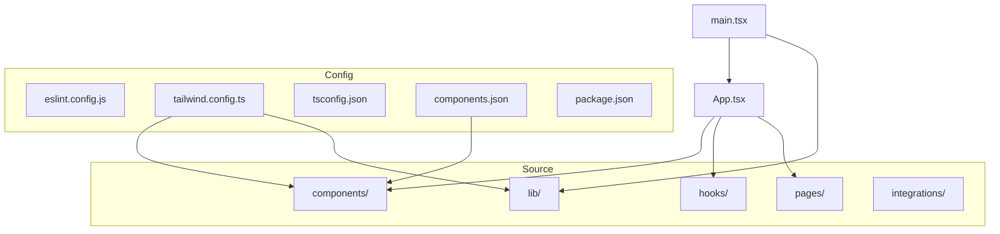

# Developer Guide

<cite>
**Referenced Files in This Document**   
- [README.md](file://README.md)
- [package.json](file://package.json)
- [eslint.config.js](file://eslint.config.js)
- [tailwind.config.ts](file://tailwind.config.ts)
- [components.json](file://components.json)
- [tsconfig.json](file://tsconfig.json)
- [App.tsx](file://src/App.tsx)
- [main.tsx](file://src/main.tsx)
- [utils.ts](file://src/lib/utils.ts)
- [useAuth.tsx](file://src/hooks/useAuth.tsx)
</cite>

## Table of Contents
1. [Introduction](#introduction)
2. [Project Structure and File Organization](#project-structure-and-file-organization)
3. [Codebase Conventions](#codebase-conventions)
4. [TypeScript Typing Patterns](#typescript-typing-patterns)
5. [Component Structure and UI Patterns](#component-structure-and-ui-patterns)
6. [Linting and Formatting Rules](#linting-and-formatting-rules)
7. [Development Environment Setup](#development-environment-setup)
8. [Component Generation with ShadCN UI](#component-generation-with-shadcn-ui)
9. [Creating New Pages, Components, and Hooks](#creating-new-pages-components-and-hooks)
10. [Testing Recommendations](#testing-recommendations)
11. [Debugging Strategies](#debugging-strategies)
12. [Performance Monitoring Practices](#performance-monitoring-practices)
13. [Contribution Workflows and Branch Management](#contribution-workflows-and-branch-management)
14. [Pull Request Requirements](#pull-request-requirements)

## Introduction
This guide provides comprehensive documentation for developers contributing to the campus-connect application. It covers coding standards, development setup, component architecture, and contribution processes to ensure consistency and maintainability across the codebase. The application is built using modern web technologies including React, TypeScript, Vite, Tailwind CSS, and shadcn-ui, with Supabase for backend services.

## Project Structure and File Organization

The project follows a modular structure with clear separation of concerns. Key directories include:

- `src/components`: Contains all UI components, organized by feature (Admin, Clubs, Events) and reusable UI primitives (ui)
- `src/hooks`: Custom React hooks for state and side-effect management
- `src/lib`: Utility functions and shared logic
- `src/pages`: Page-level components mapped to routes
- `src/integrations/supabase`: Supabase client and type definitions
- `public`: Static assets
- Root-level configuration files for TypeScript, ESLint, Tailwind, and Vite

**Diagram sources**
- [components.json](file://components.json)
- [tailwind.config.ts](file://tailwind.config.ts)
- [App.tsx](file://src/App.tsx)
- [main.tsx](file://src/main.tsx)

**Section sources**
- [README.md](file://README.md)
- [package.json](file://package.json)

## Codebase Conventions

The codebase adheres to consistent patterns for maintainability and readability. All components use TypeScript with strict typing where applicable. File naming follows PascalCase for components (e.g., `CreateEventDialog.tsx`) and camelCase for utilities and hooks. Directory structure is feature-based, grouping related components together. The codebase uses absolute imports via the `@/` alias configured in `tsconfig.json`.

**Section sources**
- [tsconfig.json](file://tsconfig.json)
- [components.json](file://components.json)

## TypeScript Typing Patterns

TypeScript is used throughout the codebase with interfaces for complex objects and type aliases for simpler unions or primitives. The project configures TypeScript with relaxed strictness options in `tsconfig.json` to balance type safety with development velocity. Key typing patterns include:

- Interface-based typing for data models (e.g., Profile interface in useAuth.tsx)
- Type imports from external libraries (e.g., User, Session from supabase-js)
- Union types for role-based permissions
- Generic typing for reusable components and hooks

The codebase disables certain TypeScript rules like `noImplicitAny` and `strictNullChecks` to accommodate rapid development while maintaining core type safety.

**Section sources**
- [tsconfig.json](file://tsconfig.json)
- [useAuth.tsx](file://src/hooks/useAuth.tsx)

## Component Structure and UI Patterns

Components follow a consistent structure with clear separation between container and presentational components. All UI components are built using shadcn-ui primitives that wrap Radix UI components with Tailwind CSS styling. The `cn()` utility from `utils.ts` is used for conditional className merging. Components are organized in a nested directory structure by feature, with shared UI components in the `ui` directory.

Dialog components follow a consistent pattern with open state management and form integration. Layout components like `DashboardLayout.tsx` provide consistent page structure. The codebase uses React Context (AuthContext) for global state management.

**Section sources**
- [utils.ts](file://src/lib/utils.ts)
- [useAuth.tsx](file://src/hooks/useAuth.tsx)
- [App.tsx](file://src/App.tsx)

## Linting and Formatting Rules

The project uses ESLint with TypeScript support for code quality enforcement. The configuration in `eslint.config.js` extends recommended rules from both JavaScript and TypeScript ecosystems. Key rules include:

- React Hooks rules for proper hook usage
- React Refresh plugin for Fast Refresh support
- Disabled `@typescript-eslint/no-unused-vars` to accommodate development workflow
- Global browser environment configuration
- File-specific rule application for `.ts` and `.tsx` files

The linting script is available via `npm run lint` and runs ESLint across all TypeScript files. The configuration ignores the `dist` directory.

**Section sources**
- [eslint.config.js](file://eslint.config.js)
- [package.json](file://package.json)

## Development Environment Setup

To set up the development environment:

1. Install Node.js and npm (using nvm recommended)
2. Clone the repository
3. Run `npm i` to install dependencies
4. Start the development server with `npm run dev`

The project uses Vite for fast development builds with hot module replacement. Editor configurations should support TypeScript, ESLint, and Tailwind CSS IntelliSense. The `components.json` file enables shadcn-ui component generation with proper path aliases.

**Section sources**
- [README.md](file://README.md)
- [package.json](file://package.json)

## Component Generation with ShadCN UI

The `components.json` file configures the shadcn-ui CLI for component generation. Key settings include:

- Default style with CSS variables
- TypeScript support enabled
- Tailwind configuration linked to `tailwind.config.ts`
- CSS file set to `src/index.css`
- Path aliases for components, utils, ui, lib, and hooks

When generating new components using `npx shadcn-ui@latest add [component]`, the CLI will:
- Create components in the appropriate directory
- Use the configured aliases for imports
- Apply the default styling system
- Generate TypeScript files with proper typing

The alias configuration enables clean imports like `import { Button } from "@/components/ui/button"`.

**Section sources**
- [components.json](file://components.json)
- [tailwind.config.ts](file://tailwind.config.ts)

## Creating New Pages, Components, and Hooks

### Pages
New pages should be created in the `src/pages` directory with PascalCase naming. Pages should be registered in the `App.tsx` Routes configuration above the catch-all route. Pages should use the `DashboardLayout` component for consistent structure.

### Components
New components should be placed in appropriate feature directories (Admin, Clubs, Events) or in `components/ui` for reusable primitives. Dialog components should follow the existing pattern with controlled open state and form integration.

### Hooks
Custom hooks should be created in the `src/hooks` directory. Hooks should follow the `use` prefix convention and handle their own error states. New hooks should leverage existing utilities like `useToast` for consistent UX.

All new files should use TypeScript and follow existing typing patterns.

**Section sources**
- [App.tsx](file://src/App.tsx)
- [useAuth.tsx](file://src/hooks/useAuth.tsx)
- [components.json](file://components.json)

## Testing Recommendations

While the current codebase does not include explicit test configuration, recommended testing practices include:

- Unit testing hooks using React Testing Library
- Component testing with Jest and Testing Library
- Integration testing critical user flows
- Mocking Supabase calls in tests
- Testing authentication state transitions

Future implementation should add testing libraries and configuration to `package.json` and create a `__tests__` directory structure.

## Debugging Strategies

Key debugging approaches for this codebase include:

- Using the Supabase console to inspect database state and authentication
- Leveraging React DevTools to inspect component state and props
- Using the `useAuth` hook's toast notifications for authentication flow feedback
- Checking network requests for API interactions
- Using console.error with descriptive messages for error tracking

The authentication flow includes comprehensive error handling with user-facing toast notifications for sign-in, sign-up, and sign-out operations.

**Section sources**
- [useAuth.tsx](file://src/hooks/useAuth.tsx)

## Performance Monitoring Practices

Performance considerations in the codebase include:

- Code splitting via React Router (potential future enhancement)
- Efficient state management with React Query (via @tanstack/react-query)
- Lazy loading of components (potential future enhancement)
- PWA initialization in main.tsx for offline capabilities
- Push notification management

The use of React Query provides built-in caching and background data synchronization. The PWA features enable offline access and push notifications.

**Section sources**
- [main.tsx](file://src/main.tsx)
- [App.tsx](file://src/App.tsx)

## Contribution Workflows and Branch Management

Recommended contribution workflow:

1. Create a feature branch from main
2. Implement changes with appropriate commits
3. Ensure code adheres to linting rules
4. Test changes locally using `npm run dev`
5. Push branch and create pull request

Branch naming should follow the convention `feature/descriptive-name` or `fix/descriptive-name`. Regular synchronization with main branch is recommended to avoid merge conflicts.

## Pull Request Requirements

Pull requests should include:

- Clear description of changes and motivation
- Reference to related issues or features
- Demonstration of functionality
- Confirmation that linting passes (`npm run lint`)
- Verification that build succeeds (`npm run build`)
- Testing of affected functionality
- Updates to documentation if applicable

All code changes should maintain consistency with existing patterns in component structure, typing, and UI design.