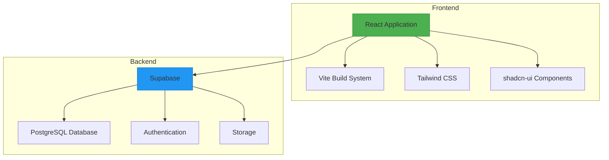
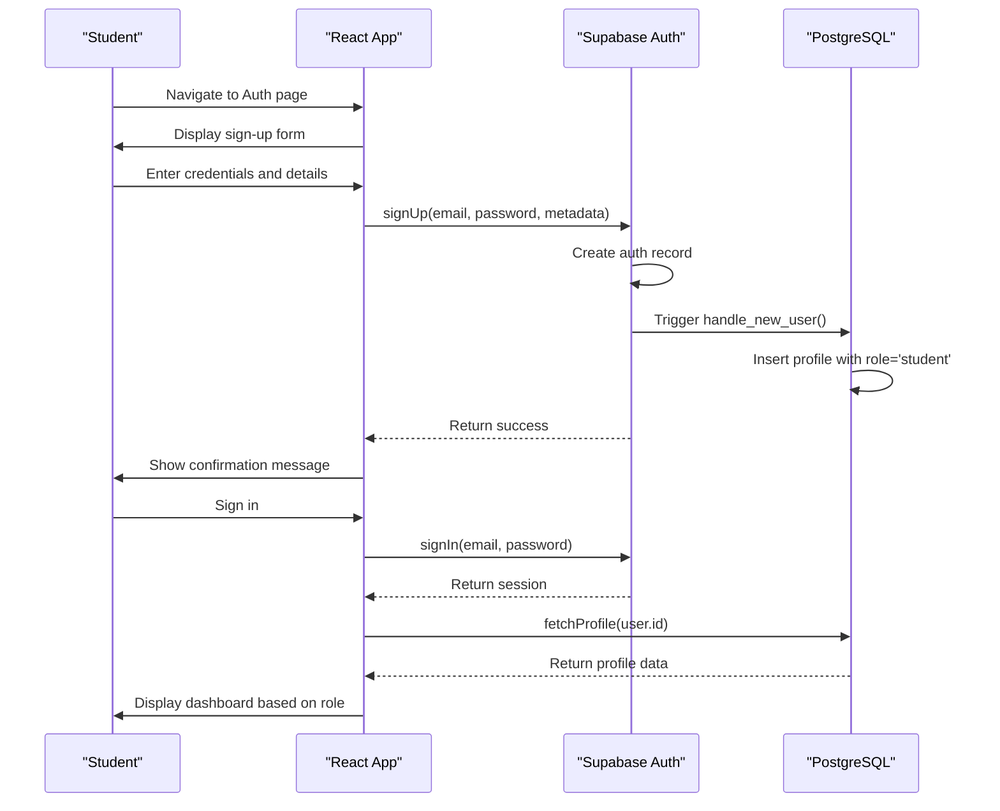
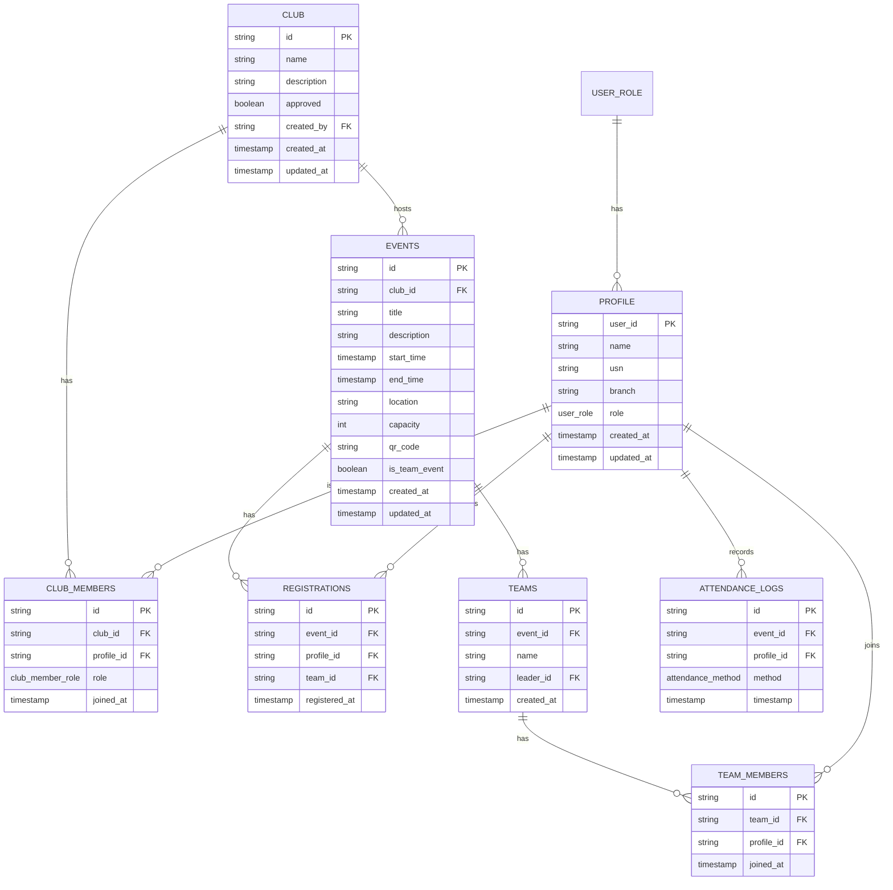
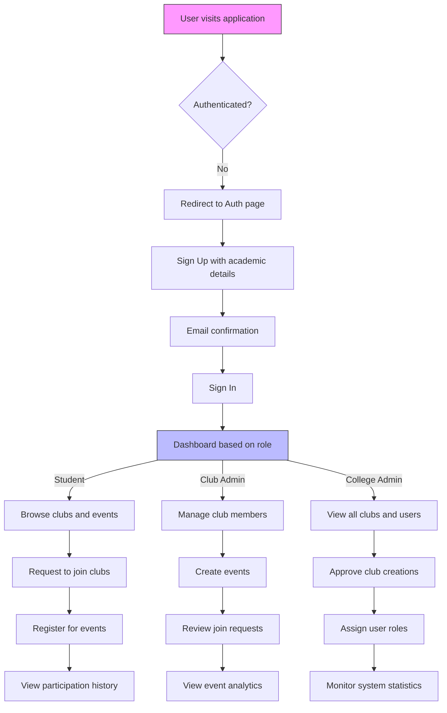

# Project Overview

<cite>
**Referenced Files in This Document**   
- [README.md](file://README.md)
- [client.ts](file://src/integrations/supabase/client.ts)
- [types.ts](file://src/integrations/supabase/types.ts)
- [useAuth.tsx](file://src/hooks/useAuth.tsx)
- [Auth.tsx](file://src/pages/Auth.tsx)
- [Admin.tsx](file://src/pages/Admin.tsx)
- [UserRoleDialog.tsx](file://src/components/Admin/UserRoleDialog.tsx)
- [20250908005627_511ef022-3222-4458-b7de-e0063ed13e63.sql](file://supabase/migrations/20250908005627_511ef022-3222-4458-b7de-e0063ed13e63.sql)
</cite>

## Table of Contents
1. [Introduction](#introduction)
2. [Core Features](#core-features)
3. [User Personas](#user-personas)
4. [Technical Architecture](#technical-architecture)
5. [Authentication Flow](#authentication-flow)
6. [Data Model Relationships](#data-model-relationships)
7. [Application Workflow](#application-workflow)
8. [Development Setup](#development-setup)
9. [Deployment Context](#deployment-context)

## Introduction

Campus Connect is a comprehensive college event and club management system designed to streamline student engagement, club administration, and institutional oversight. The platform enables students to discover and participate in campus activities, empowers club leaders to organize events, and provides college administrators with centralized control and monitoring capabilities. Built with modern web technologies, Campus Connect offers an intuitive interface for managing extracurricular activities while maintaining robust security and role-based access controls.

**Section sources**
- [README.md](file://README.md)

## Core Features

The Campus Connect platform delivers several key features that facilitate effective campus community management:

- **Event Registration**: Students can browse upcoming events, view details, and register for participation. Events support both individual and team-based registration, with capacity limits and QR code-based attendance tracking.
- **Club Creation**: Students can create new clubs by submitting proposals that require administrative approval, ensuring quality control and alignment with institutional policies.
- **Role-Based Access Control (RBAC)**: The system implements a three-tier permission model with distinct capabilities for students, club administrators, and college administrators.
- **Admin Oversight**: College administrators have comprehensive visibility into all platform activities, including user management, club approvals, and system statistics.

These features work together to create a structured yet flexible environment for campus engagement.

**Section sources**
- [types.ts](file://src/integrations/supabase/types.ts#L500-L510)
- [Admin.tsx](file://src/pages/Admin.tsx#L0-L39)
- [UserRoleDialog.tsx](file://src/components/Admin/UserRoleDialog.tsx#L83-L126)

## User Personas

### Students
Students form the primary user base of Campus Connect. They can:
- Create and manage their personal profiles with academic details
- Browse approved clubs and events
- Register for events individually or as team members
- Request to join clubs
- View their participation history

### Club Administrators
Club administrators are students granted elevated privileges for specific clubs. They can:
- Create and manage events for their club
- Review and approve join requests
- Manage club member roles
- View event registration and attendance data

### College Administrators
College administrators have institution-wide oversight and control. They can:
- Approve or reject new club creations
- Assign user roles (student, club admin, college admin)
- Monitor platform statistics and activity
- Access all clubs and events regardless of approval status
- Manage user profiles across the system

The role hierarchy ensures that students have autonomy within appropriate boundaries, while college administrators maintain ultimate control over the platform.

**Section sources**
- [types.ts](file://src/integrations/supabase/types.ts#L500-L510)
- [useAuth.tsx](file://src/hooks/useAuth.tsx#L10-L16)
- [Admin.tsx](file://src/pages/Admin.tsx#L37-L80)
- [UserRoleDialog.tsx](file://src/components/Admin/UserRoleDialog.tsx#L149-L173)

## Technical Architecture

Campus Connect follows a modern frontend-backend architecture with clear separation of concerns:



**Diagram sources**
- [README.md](file://README.md)
- [client.ts](file://src/integrations/supabase/client.ts)

The frontend is built with React and TypeScript, leveraging Vite for fast development builds and hot module replacement. The UI components are implemented using shadcn/ui, which provides accessible, customizable components built on Radix UI and styled with Tailwind CSS. The entire application is structured around a component-based architecture with clear separation between atomic UI elements and complex page-level components.

The backend leverages Supabase, an open-source Firebase alternative, which provides a PostgreSQL database, authentication, real-time subscriptions, and storage. This eliminates the need for a custom backend API while offering enterprise-grade features and scalability.

## Authentication Flow

The authentication system is implemented using Supabase Auth with a custom profile management layer:



**Diagram sources**
- [useAuth.tsx](file://src/hooks/useAuth.tsx#L80-L150)
- [Auth.tsx](file://src/pages/Auth.tsx#L211-L236)
- [20250908005627_511ef022-3222-4458-b7de-e0063ed13e63.sql#L184-L195)

When a user signs up, Supabase creates an authentication record and triggers a database function that automatically creates a corresponding profile with default role 'student'. During sign-in, the application fetches the user's profile to determine their role and permissions. The useAuth hook provides a centralized authentication context that manages user state, session persistence, and profile data across the application.

## Data Model Relationships

The data model is designed to support the core functionality of club and event management with proper relationships and constraints:



**Diagram sources**
- [types.ts](file://src/integrations/supabase/types.ts)
- [20250908005627_511ef022-3222-4458-b7de-e0063ed13e63.sql)

The data model features several key entities:
- **Profiles**: Store user information with role-based permissions
- **Clubs**: Represent student organizations with approval workflow
- **Club Members**: Many-to-many relationship between users and clubs with role differentiation
- **Events**: Activities hosted by clubs with registration and attendance tracking
- **Teams**: Groups of students registering together for team events
- **Registrations**: Individual or team participation in events
- **Attendance Logs**: Records of event attendance through various methods

Row Level Security (RLS) policies enforce access control at the database level, ensuring users can only access data according to their roles and permissions.

## Application Workflow

The typical user journey through Campus Connect follows a structured workflow:



**Diagram sources**
- [Auth.tsx](file://src/pages/Auth.tsx)
- [useAuth.tsx](file://src/hooks/useAuth.tsx)
- [Admin.tsx](file://src/pages/Admin.tsx)

New users begin by signing up with their academic email, name, university roll number (USN), and branch of study. Upon email confirmation, they can sign in to access the dashboard. The dashboard content and available actions are determined by the user's role, which is stored in their profile. Students can explore approved clubs and events, while administrators have access to management interfaces for their respective domains.

## Development Setup

To set up the development environment for Campus Connect:

1. **Prerequisites**:
   - Node.js (version 18 or higher)
   - npm (included with Node.js)
   - Git for version control

2. **Installation**:
```bash
# Clone the repository
git clone <repository-url>

# Navigate to project directory
cd campus-connect

# Install dependencies
npm install

# Start development server
npm run dev
```

The application will be available at `http://localhost:5173` with hot reloading enabled. The Vite development server provides fast build times and instant feedback during development.

**Section sources**
- [README.md](file://README.md)

## Deployment Context

Campus Connect is designed for deployment on the Lovable platform, which provides a streamlined publishing workflow:

1. **Development**: Code can be edited locally, in GitHub, or directly in Lovable's web interface
2. **Testing**: The `npm run dev` command starts a local development server with auto-reloading
3. **Deployment**: From the Lovable dashboard, click "Share" → "Publish" to deploy the application
4. **Custom Domain**: Custom domains can be connected through the Lovable project settings

The application is built with Vite, which optimizes assets for production deployment, including code splitting, minification, and tree-shaking. Supabase handles backend services, eliminating the need for custom server deployment. This architecture enables rapid iteration and deployment while maintaining high performance and reliability.

**Section sources**
- [README.md](file://README.md)