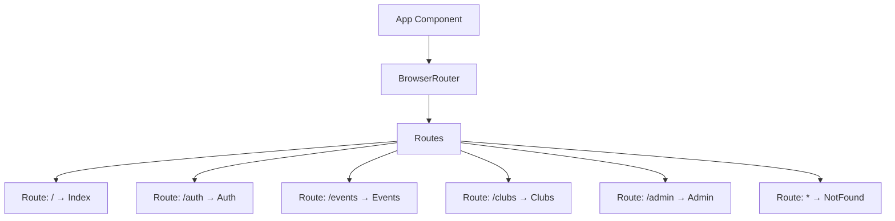
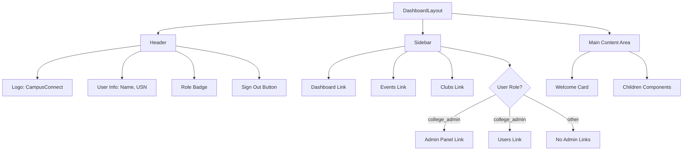
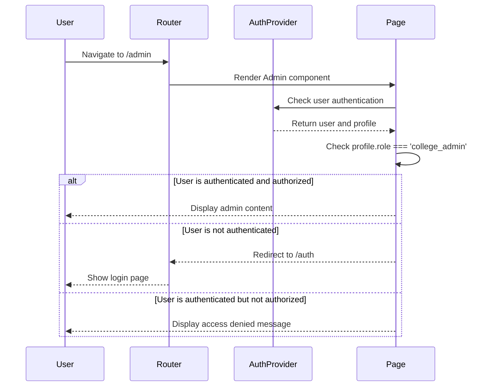
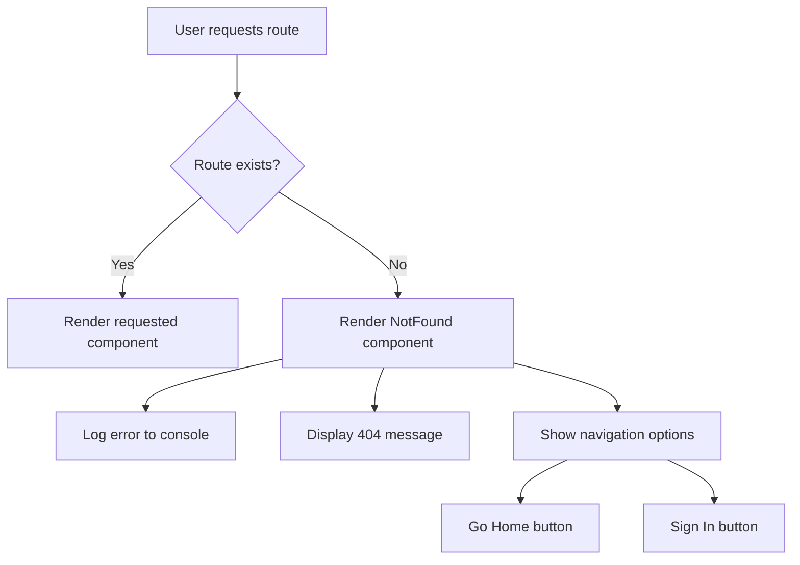

# Routing & Navigation

<cite>
**Referenced Files in This Document**   
- [App.tsx](file://src/App.tsx)
- [NotFound.tsx](file://src/pages/NotFound.tsx)
- [DashboardLayout.tsx](file://src/components/Layout/DashboardLayout.tsx)
- [useAuth.tsx](file://src/hooks/useAuth.tsx)
</cite>

## Table of Contents
1. [Introduction](#introduction)
2. [Page-Level Routing in App.tsx](#page-level-routing-in-apptsx)
3. [Navigation Structure in DashboardLayout.tsx](#navigation-structure-in-dashboardlayouttsx)
4. [Authentication and Authorization Logic](#authentication-and-authorization-logic)
5. [Error Handling and 404 Routing](#error-handling-and-404-routing)
6. [Accessibility and Responsive Design](#accessibility-and-responsive-design)
7. [Extending the Routing System](#extending-the-routing-system)

## Introduction
The CampusConnect application implements a comprehensive routing and navigation system using React Router to manage page-level navigation and user access. The system supports role-based access control, dynamic menu rendering, and protected routes to ensure users only access authorized content. This document details the implementation of routing across the application, focusing on the integration between React Router, authentication state, and UI components.

## Page-Level Routing in App.tsx

The main routing configuration is defined in `App.tsx`, where React Router's `BrowserRouter`, `Routes`, and `Route` components are used to establish the application's top-level navigation structure. The router is wrapped within the `QueryClientProvider` and `AuthProvider` to ensure data fetching and authentication state are available throughout the application.

The route definitions include:
- Root path `/` for the Index page
- `/auth` for authentication flows
- `/events` for event management
- `/clubs` for club-related functionality
- `/admin` for administrative functions
- Catch-all `*` route that redirects to the NotFound component



**Diagram sources**
- [App.tsx](file://src/App.tsx#L15-L35)

**Section sources**
- [App.tsx](file://src/App.tsx#L1-L38)

## Navigation Structure in DashboardLayout.tsx

The `DashboardLayout.tsx` component implements the primary navigation interface for authenticated users, featuring a persistent header and sidebar navigation. The layout uses React Router's `Link` component for navigation and dynamically renders menu items based on the user's role.

The navigation structure is defined as an array of objects, each containing:
- `name`: Display name of the navigation item
- `href`: Route path
- `icon`: Lucide React icon component

Role-based visibility is implemented using conditional array spreading, where admin-specific routes are only included when the user's profile role is 'college_admin'. This approach ensures that unauthorized users cannot access restricted routes through the UI.



**Diagram sources**
- [DashboardLayout.tsx](file://src/components/Layout/DashboardLayout.tsx#L25-L50)

**Section sources**
- [DashboardLayout.tsx](file://src/components/Layout/DashboardLayout.tsx#L0-L137)

## Authentication and Authorization Logic

The routing system integrates with the authentication context to implement protected routes and role-based access control. The `useAuth` hook provides access to the user's session and profile data, which is used to determine navigation options and enforce access restrictions.

In protected pages like `Admin.tsx`, authorization checks are implemented at the component level:
1. If no user is authenticated, redirect to `/auth`
2. If the user lacks the required role (e.g., 'college_admin'), display an access denied message

The `AuthProvider` in `useAuth.tsx` listens for authentication state changes and automatically updates the user and profile state, ensuring the navigation system reflects the current authentication status.



**Diagram sources**
- [useAuth.tsx](file://src/hooks/useAuth.tsx#L45-L197)
- [Admin.tsx](file://src/pages/Admin.tsx#L37-L80)

**Section sources**
- [useAuth.tsx](file://src/hooks/useAuth.tsx#L0-L197)
- [Admin.tsx](file://src/pages/Admin.tsx#L37-L80)

## Error Handling and 404 Routing

The application implements robust error handling for invalid routes through the `NotFound.tsx` component. When a user attempts to access a non-existent route, React Router directs them to this component, which provides both user-friendly messaging and technical logging.

Key features of the 404 handling:
- Console logging of attempted invalid routes for debugging
- Clear user interface with 404 status code and descriptive message
- Navigation options to return to the home page or sign in
- Responsive design that works across device sizes

The catch-all route (`*`) in `App.tsx` ensures that any undefined path renders the NotFound component, preventing broken experiences for users who mistype URLs or follow invalid links.



**Diagram sources**
- [App.tsx](file://src/App.tsx#L33-L35)
- [NotFound.tsx](file://src/pages/NotFound.tsx#L0-L40)

**Section sources**
- [NotFound.tsx](file://src/pages/NotFound.tsx#L0-L40)

## Accessibility and Responsive Design

The navigation system incorporates several accessibility and responsive design features to ensure usability across devices and for users with different needs.

Accessibility considerations:
- Semantic HTML structure with proper heading hierarchy
- Keyboard navigation support through focusable links and buttons
- ARIA attributes for interactive elements
- Sufficient color contrast for text and interactive elements
- Descriptive link text for screen readers

Responsive design features:
- Mobile-first approach with responsive breakpoints
- Flexible layout that adapts to different screen sizes
- Touch-friendly button sizes in navigation
- Collapsible navigation patterns for small screens

The `useIsMobile` hook (referenced in the codebase) supports responsive behavior by detecting screen size and enabling component adaptation to mobile contexts.

**Section sources**
- [DashboardLayout.tsx](file://src/components/Layout/DashboardLayout.tsx#L76-L113)
- [use-mobile.tsx](file://src/hooks/use-mobile.tsx#L0-L18)

## Extending the Routing System

To add new routes to the CampusConnect application, follow these steps:

1. **Define the route in App.tsx**: Add a new Route component within the Routes container with the path and corresponding page component.

2. **Create the page component**: Implement the new page in the `src/pages` directory, ensuring it follows the same pattern as existing pages.

3. **Add navigation entry**: If the page should appear in the main navigation, add it to the `navigation` array in `DashboardLayout.tsx`. Include conditional logic if role-based access is required.

4. **Implement authorization checks**: For protected routes, include authentication and role checks at the component level, similar to the Admin page implementation.

5. **Update type definitions**: If using TypeScript, ensure any new route parameters are properly typed.

Example of adding a new route:
```tsx
// In App.tsx
<Route path="/profile" element={<Profile />} />

// In DashboardLayout.tsx navigation array
{ name: 'Profile', href: '/profile', icon: User }
```

When integrating new routes, maintain consistency with existing patterns for authentication checks, error handling, and responsive behavior.

**Section sources**
- [App.tsx](file://src/App.tsx#L15-L35)
- [DashboardLayout.tsx](file://src/components/Layout/DashboardLayout.tsx#L25-L50)