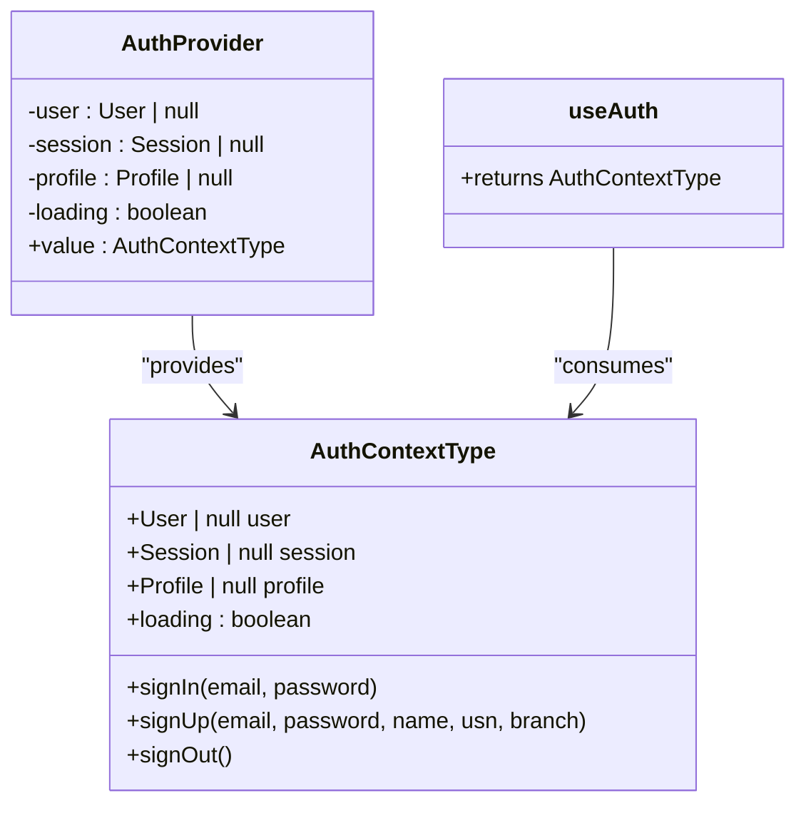
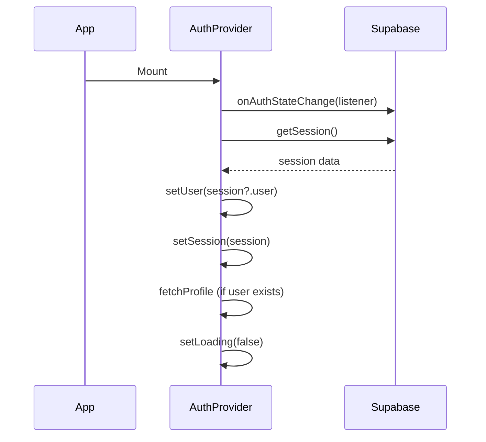
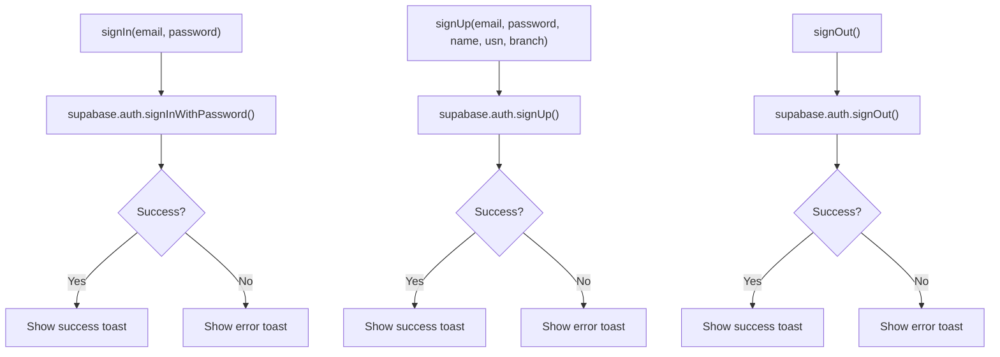
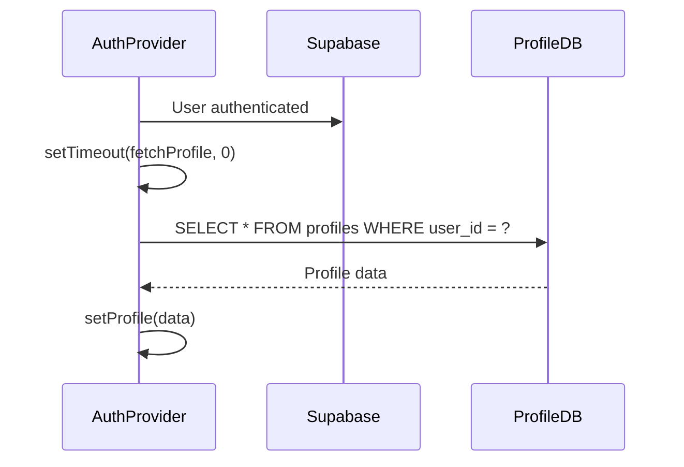
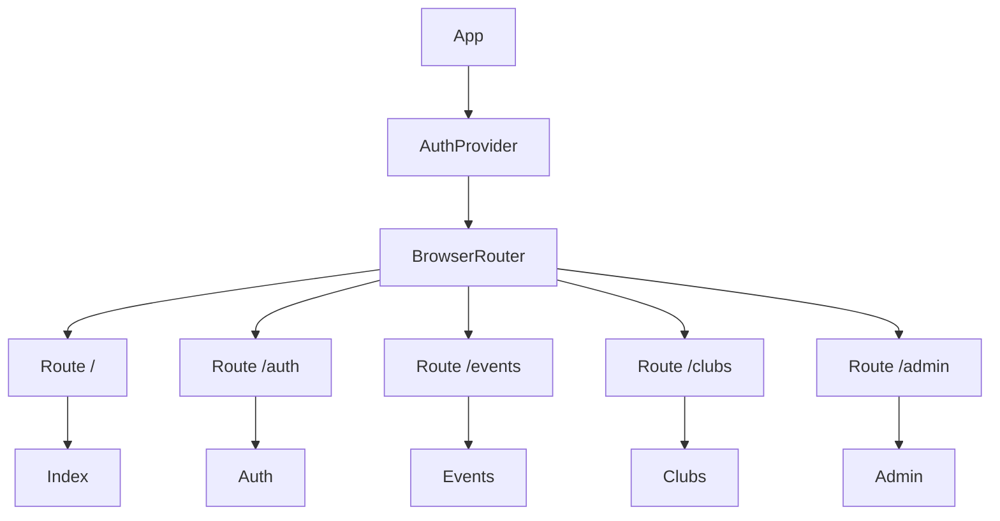

# Authentication Context

<cite>
**Referenced Files in This Document**   
- [useAuth.tsx](file://src/hooks/useAuth.tsx)
- [App.tsx](file://src/App.tsx)
- [client.ts](file://src/integrations/supabase/client.ts)
</cite>

## Table of Contents
1. [Introduction](#introduction)
2. [Core Components](#core-components)
3. [State Management and Lifecycle](#state-management-and-lifecycle)
4. [Authentication Methods](#authentication-methods)
5. [Profile Data Handling](#profile-data-handling)
6. [Error Handling and User Feedback](#error-handling-and-user-feedback)
7. [Usage in Components](#usage-in-components)
8. [Route Protection and Access Control](#route-protection-and-access-control)
9. [Performance Considerations](#performance-considerations)
10. [Common Issues and Best Practices](#common-issues-and-best-practices)

## Introduction
The authentication system in campus-connect is built using React Context API and Supabase for backend authentication and user management. The `AuthProvider` component wraps the entire application, providing a centralized authentication context that manages user session, profile data, and authentication state. This document details the implementation, usage, and best practices for the `useAuth` hook and its surrounding infrastructure.

**Section sources**
- [useAuth.tsx](file://src/hooks/useAuth.tsx#L1-L197)
- [App.tsx](file://src/App.tsx#L1-L39)

## Core Components

The authentication system consists of three main components: the `AuthContext`, the `AuthProvider` component, and the `useAuth` hook. The context is created using React's `createContext` and is consumed via the custom `useAuth` hook, which includes safety checks to ensure it is used within the provider.

**Diagram sources**
- [useAuth.tsx](file://src/hooks/useAuth.tsx#L10-L42)

**Section sources**
- [useAuth.tsx](file://src/hooks/useAuth.tsx#L1-L42)

## State Management and Lifecycle

The `AuthProvider` manages four key state variables: `user`, `session`, `profile`, and `loading`. These are initialized using React's `useState` hook. The `loading` state is used to indicate whether the authentication state is being restored on initial load.

The lifecycle is managed through a `useEffect` hook that sets up a listener for Supabase auth state changes and checks for an existing session on mount. This ensures that the authentication state is properly restored when the app loads or when authentication events occur (sign in, sign out, etc.).

**Diagram sources**
- [useAuth.tsx](file://src/hooks/useAuth.tsx#L44-L90)

**Section sources**
- [useAuth.tsx](file://src/hooks/useAuth.tsx#L44-L90)

## Authentication Methods

The authentication context exposes three primary methods: `signIn`, `signUp`, and `signOut`. These methods interface directly with Supabase's authentication system and include error handling and user feedback via toast notifications.

- `signIn`: Uses Supabase's `signInWithPassword` method to authenticate users
- `signUp`: Creates new users with additional profile data (name, USN, branch)
- `signOut`: Ends the current session

All methods include error handling and provide user feedback through toast notifications.

**Diagram sources**
- [useAuth.tsx](file://src/hooks/useAuth.tsx#L92-L197)

**Section sources**
- [useAuth.tsx](file://src/hooks/useAuth.tsx#L92-L197)

## Profile Data Handling

Upon successful authentication, the system automatically fetches the user's profile data from the 'profiles' table in Supabase. The profile includes the user's name, USN, branch, role, and timestamps. This data is stored in the context and made available to all components.

The `fetchProfile` function is called whenever a user session is established, either through initial load or authentication. The profile data is then stored in the `profile` state variable and accessible throughout the application.

**Diagram sources**
- [useAuth.tsx](file://src/hooks/useAuth.tsx#L50-L59)

**Section sources**
- [useAuth.tsx](file://src/hooks/useAuth.tsx#L50-L59)

## Error Handling and User Feedback

The authentication system includes comprehensive error handling with user-friendly feedback. All authentication operations are wrapped in try-catch blocks, and errors are displayed using toast notifications from the `useToast` hook.

Successful operations also trigger positive feedback to inform users of the outcome. This improves the user experience by providing clear feedback for all authentication actions.

**Section sources**
- [useAuth.tsx](file://src/hooks/useAuth.tsx#L100-L197)

## Usage in Components

Components consume the authentication context using the `useAuth` hook. This allows them to access the current user, session, profile, and authentication methods. Components can conditionally render content based on authentication state and user role.

The `useAuth` hook includes a safety check that throws an error if used outside of the `AuthProvider`, preventing common usage mistakes.

**Section sources**
- [useAuth.tsx](file://src/hooks/useAuth.tsx#L35-L42)

## Route Protection and Access Control

The `AuthProvider` is wrapped around the entire application in `App.tsx`, ensuring that all routes have access to the authentication context. This enables route protection by allowing components to check authentication state before rendering sensitive content.

Role-based access control can be implemented by checking the `profile.role` value and conditionally rendering content or redirecting unauthorized users.

**Diagram sources**
- [App.tsx](file://src/App.tsx#L1-L39)

**Section sources**
- [App.tsx](file://src/App.tsx#L1-L39)

## Performance Considerations

The authentication system includes performance optimizations to prevent blocking the main thread. Profile data fetching is deferred using `setTimeout` with a 0ms delay, which schedules the operation for the next event loop cycle. This prevents the initial render from being blocked by the database query.

This approach ensures a responsive user interface while still loading necessary user data shortly after authentication.

**Section sources**
- [useAuth.tsx](file://src/hooks/useAuth.tsx#L62-L68)

## Common Issues and Best Practices

### Common Issues
- **Race conditions during session restoration**: Addressed by setting up the auth listener before checking for existing sessions
- **Unverified users**: Supabase handles email confirmation; the system should check user verification status before granting full access
- **Improper hook usage**: Prevented by the custom error in `useAuth`

### Best Practices
- Always use `useAuth` within components that are children of `AuthProvider`
- Check both `user` and `profile` states when displaying user-specific content
- Handle loading state appropriately in UI components
- Use role-based checks for access control in protected routes
- Implement proper error boundaries for authentication-related errors

**Section sources**
- [useAuth.tsx](file://src/hooks/useAuth.tsx#L35-L42)
- [useAuth.tsx](file://src/hooks/useAuth.tsx#L62-L68)