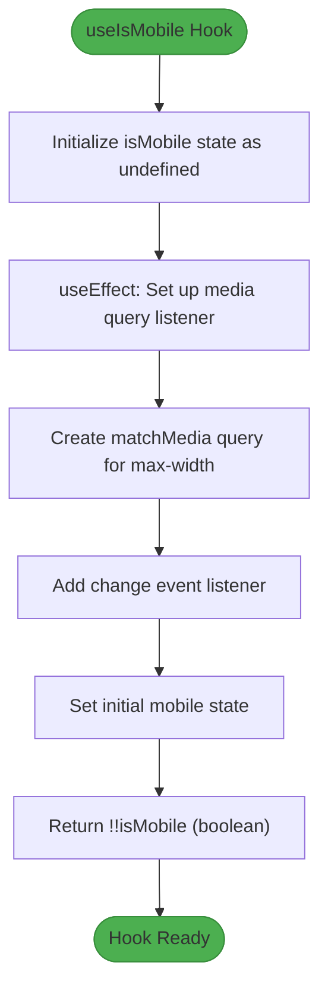
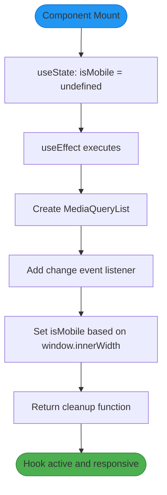
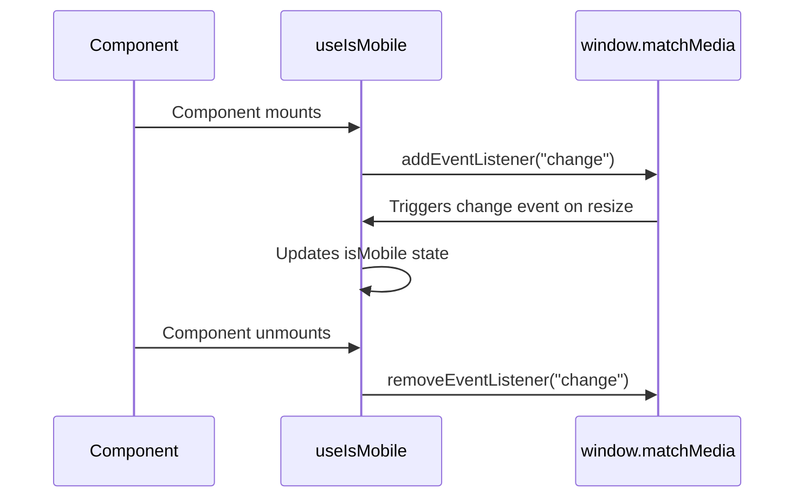
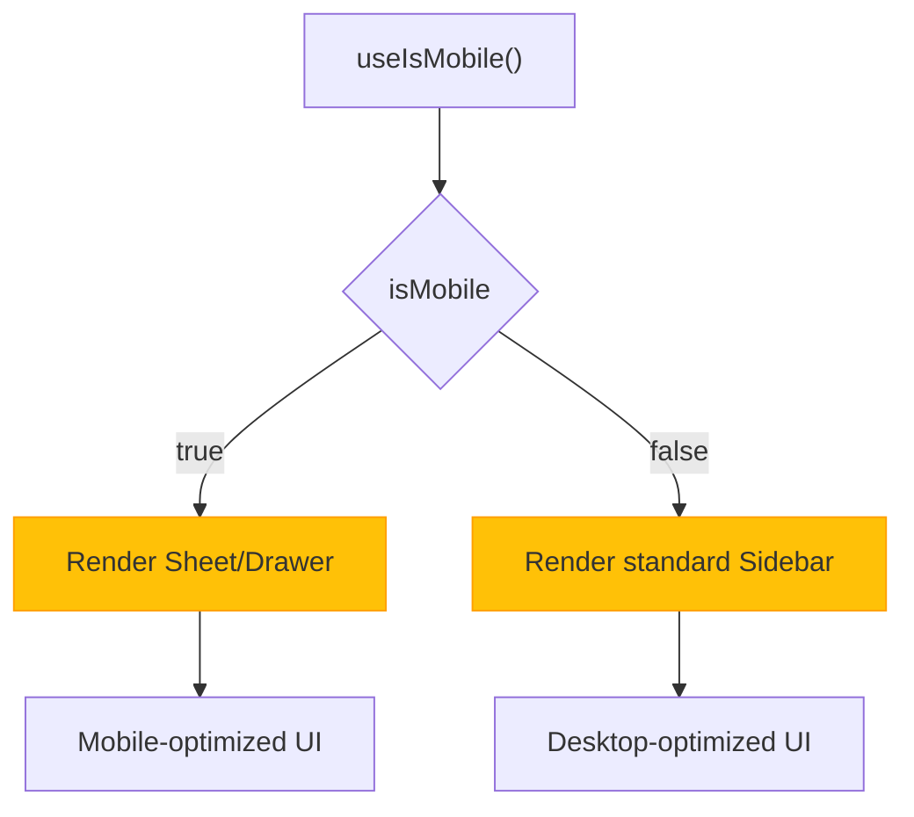

# Mobile Detection

<cite>
**Referenced Files in This Document**   
- [use-mobile.tsx](file://src/hooks/use-mobile.tsx)
- [sidebar.tsx](file://src/components/ui/sidebar.tsx)
- [dialog.tsx](file://src/components/ui/dialog.tsx)
- [drawer.tsx](file://src/components/ui/drawer.tsx)
</cite>

## Table of Contents
1. [Introduction](#introduction)
2. [Hook Implementation](#hook-implementation)
3. [Breakpoint Configuration](#breakpoint-configuration)
4. [State Management and Effects](#state-management-and-effects)
5. [Server-Side Rendering Safety](#server-side-rendering-safety)
6. [Event Listener Management](#event-listener-management)
7. [Usage in UI Components](#usage-in-ui-components)
8. [Responsive Design Patterns](#responsive-design-patterns)
9. [Performance Considerations](#performance-considerations)
10. [Extension Possibilities](#extension-possibilities)

## Introduction
The `useIsMobile` hook in campus-connect provides a reliable mechanism for detecting mobile devices based on screen width. This custom React hook enables responsive behavior across the application by allowing components to adapt their UI based on device type. It is particularly valuable for implementing mobile-first design patterns and optimizing user experience across different screen sizes.

**Section sources**
- [use-mobile.tsx](file://src/hooks/use-mobile.tsx#L1-L18)

## Hook Implementation
The `useIsMobile` hook leverages the `window.matchMedia` API to detect changes in screen size and determine whether the current viewport qualifies as a mobile device. It returns a boolean value indicating mobile state, which can be used by components to conditionally render different UI elements. The hook encapsulates the complexity of media query handling and provides a simple, reusable interface.

**Diagram sources**
- [use-mobile.tsx](file://src/hooks/use-mobile.tsx#L4-L18)

**Section sources**
- [use-mobile.tsx](file://src/hooks/use-mobile.tsx#L4-L18)

## Breakpoint Configuration
The hook uses a constant `MOBILE_BREAKPOINT` set to 768 pixels, following common responsive design conventions. Devices with a width less than this threshold are considered mobile. The media query `(max-width: ${MOBILE_BREAKPOINT - 1}px)` ensures precise detection at the boundary, avoiding ambiguity at exactly 768px width.

**Section sources**
- [use-mobile.tsx](file://src/hooks/use-mobile.tsx#L3-L3)

## State Management and Effects
The hook utilizes `useState` to maintain the mobile detection state and `useEffect` to subscribe to media query changes. The initial state is set to `undefined` to distinguish between uninitialized and determined states. During component mount, the effect sets up the media query listener and immediately determines the current device type based on `window.innerWidth`.

**Diagram sources**
- [use-mobile.tsx](file://src/hooks/use-mobile.tsx#L6-L16)

**Section sources**
- [use-mobile.tsx](file://src/hooks/use-mobile.tsx#L6-L16)

## Server-Side Rendering Safety
The hook safely handles environments where `window` may be undefined, such as during server-side rendering. While the current implementation assumes browser context, the use of `window.matchMedia` within a `useEffect` ensures that the code only executes in the browser after component mounting. This prevents runtime errors in SSR scenarios.

**Section sources**
- [use-mobile.tsx](file://src/hooks/use-mobile.tsx#L10-L14)

## Event Listener Management
The hook properly manages event listeners by adding the listener during component mount and removing it during unmount via the cleanup function returned from `useEffect`. This prevents memory leaks and ensures that event handlers are not called after components are destroyed. The `change` event listener updates the state whenever the media query match status changes.

**Diagram sources**
- [use-mobile.tsx](file://src/hooks/use-mobile.tsx#L12-L15)

**Section sources**
- [use-mobile.tsx](file://src/hooks/use-mobile.tsx#L12-L15)

## Usage in UI Components
The `useIsMobile` hook is integrated into various UI components to enable responsive behavior. A primary example is the `sidebar.tsx` component, which uses the hook to determine whether to display the sidebar as a traditional sidebar or as a Sheet (mobile drawer). This allows for optimal user experience on both desktop and mobile devices.

**Diagram sources**
- [use-mobile.tsx](file://src/hooks/use-mobile.tsx#L4-L18)
- [sidebar.tsx](file://src/components/ui/sidebar.tsx#L50-L52)

**Section sources**
- [sidebar.tsx](file://src/components/ui/sidebar.tsx#L50-L52)

## Responsive Design Patterns
The hook enables several responsive design patterns throughout the application:
- **Drawer vs Dialog**: On mobile, drawers are preferred for better touch interaction, while dialogs are used on desktop
- **Sidebar collapse**: The sidebar collapses to icons on desktop but transforms into a sliding sheet on mobile
- **Navigation patterns**: Mobile devices use bottom navigation patterns while desktop uses side navigation
- **Layout adjustments**: Components adjust their layout and spacing based on device type

These patterns ensure that the application remains usable and aesthetically pleasing across all device sizes.

**Section sources**
- [sidebar.tsx](file://src/components/ui/sidebar.tsx#L49-L55)

## Performance Considerations
The hook is optimized for performance through several mechanisms:
- The `useEffect` dependency array is empty (`[]`), ensuring the effect runs only once on mount
- Event listeners are properly cleaned up to prevent memory leaks
- State updates occur only when necessary (on media query changes)
- The final returned value uses double negation (`!!isMobile`) to ensure a boolean is always returned, preventing potential re-renders due to undefined values

The implementation avoids unnecessary re-renders and efficiently handles window resize events.

**Section sources**
- [use-mobile.tsx](file://src/hooks/use-mobile.tsx#L6-L18)

## Extension Possibilities
The hook can be extended to support more granular breakpoint detection by modifying the media query logic. Possible extensions include:
- Adding support for multiple breakpoints (mobile, tablet, desktop)
- Creating variants like `useIsTablet` or `useIsDesktop`
- Supporting orientation detection (portrait vs landscape)
- Allowing configurable breakpoints via parameters

These extensions would maintain the same core pattern while providing more detailed device information to components.

**Section sources**
- [use-mobile.tsx](file://src/hooks/use-mobile.tsx#L3-L18)