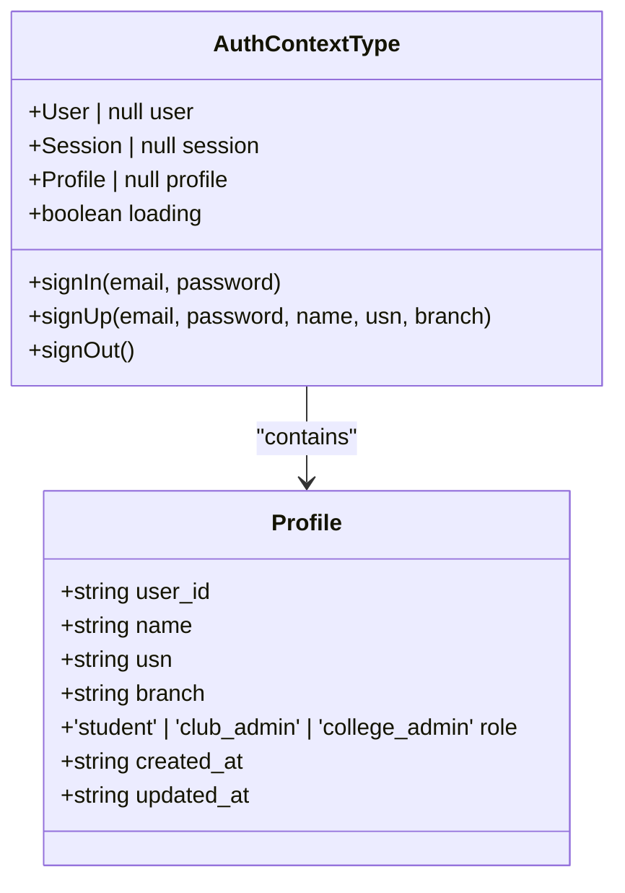
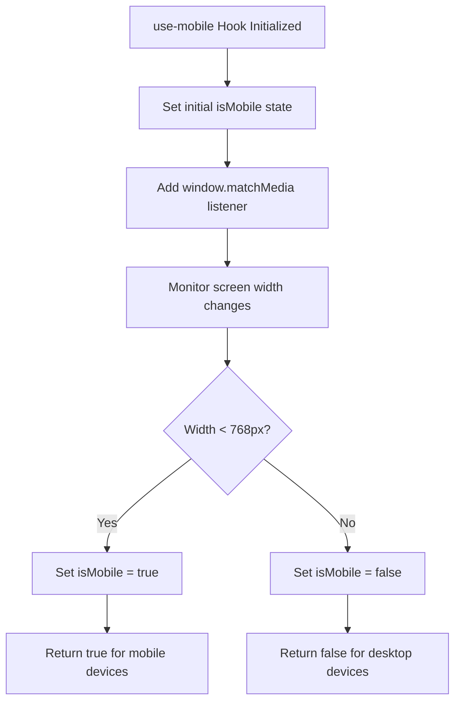
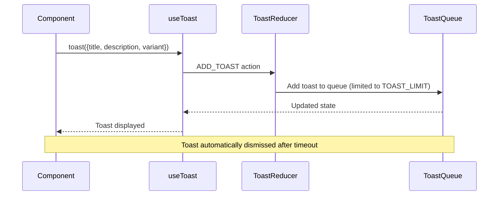
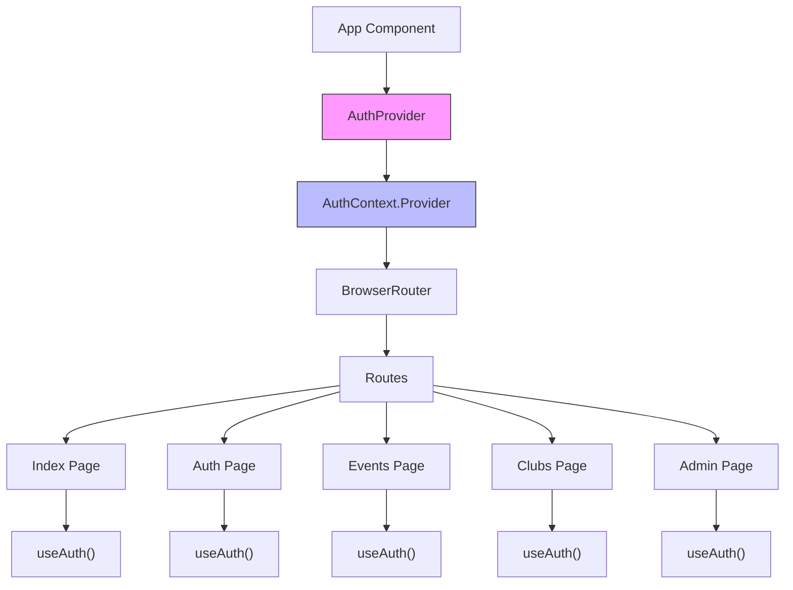
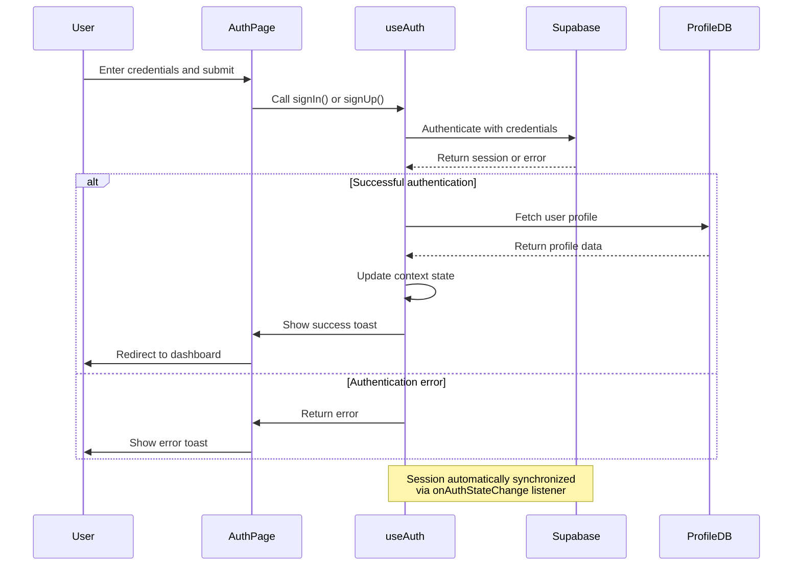
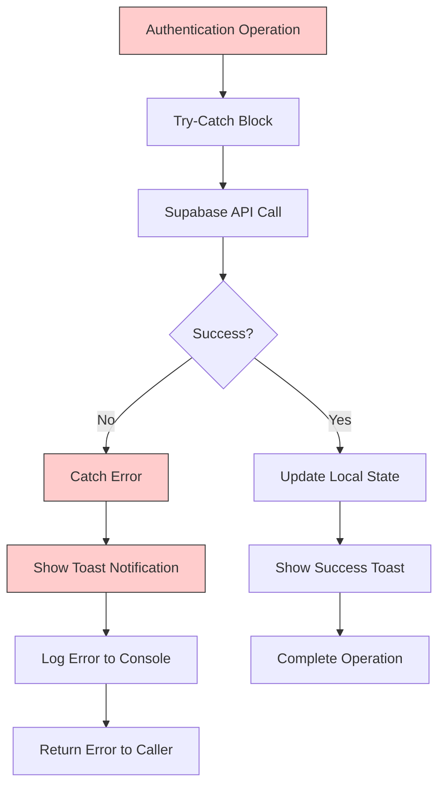
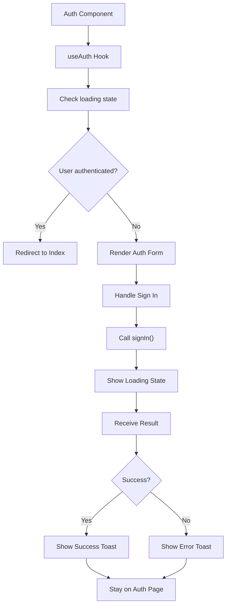
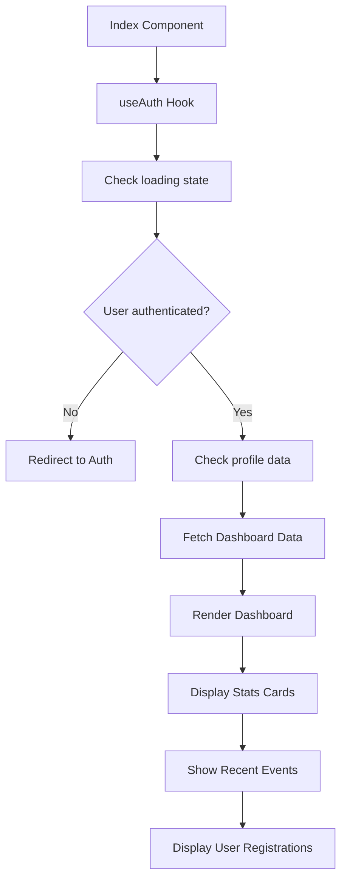

# State Management

<cite>
**Referenced Files in This Document**  
- [useAuth.tsx](file://src/hooks/useAuth.tsx)
- [use-mobile.tsx](file://src/hooks/use-mobile.tsx)
- [use-toast.ts](file://src/hooks/use-toast.ts)
- [client.ts](file://src/integrations/supabase/client.ts)
- [App.tsx](file://src/App.tsx)
- [Auth.tsx](file://src/pages/Auth.tsx)
- [Index.tsx](file://src/pages/Index.tsx)
</cite>

## Table of Contents
1. [Introduction](#introduction)
2. [Core State Management Hooks](#core-state-management-hooks)
3. [Authentication State with useAuth](#authentication-state-with-useauth)
4. [Responsive Design with use-mobile](#responsive-design-with-use-mobile)
5. [Notification System with use-toast](#notification-system-with-use-toast)
6. [React Context API Integration](#react-context-api-integration)
7. [Authentication Flow and Session Management](#authentication-flow-and-session-management)
8. [Supabase Integration and Error Handling](#supabase-integration-and-error-handling)
9. [Component Consumption Examples](#component-consumption-examples)
10. [Best Practices for State Management](#best-practices-for-state-management)

## Introduction
The CampusConnect application implements a robust state management system using React's Context API and custom hooks to manage authentication, responsive layout behavior, and user notifications. This document provides a comprehensive overview of the state management architecture, focusing on the `useAuth`, `use-mobile`, and `use-toast` hooks. The system enables global state access across components while maintaining clean separation of concerns and optimal user experience through real-time state updates, responsive design detection, and contextual notifications.

## Core State Management Hooks
The state management system in CampusConnect is built around three primary custom hooks that encapsulate specific state logic and behaviors:
- `useAuth`: Manages user authentication state, profile data, and session persistence
- `use-mobile`: Detects mobile device state for responsive layout adaptation
- `use-toast`: Handles notification display and management across the application

These hooks abstract complex state logic and provide a clean, reusable interface for components to interact with global application state.

**Section sources**
- [useAuth.tsx](file://src/hooks/useAuth.tsx#L1-L197)
- [use-mobile.tsx](file://src/hooks/use-mobile.tsx#L1-L19)
- [use-toast.ts](file://src/hooks/use-toast.ts#L1-L186)

## Authentication State with useAuth
The `useAuth` hook provides a comprehensive solution for managing user authentication state, profile information, and session lifecycle. It exposes an `AuthContext` that makes user, session, and profile data available throughout the component tree. The hook implements methods for signing in, signing up, and signing out, with integrated toast notifications for user feedback.

Key features of the `useAuth` hook include:
- Real-time authentication state synchronization via Supabase's `onAuthStateChange` listener
- Automatic profile data fetching when a user session is established
- Loading state management during authentication operations
- Role-based access control through the profile's role property

**Diagram sources**
- [useAuth.tsx](file://src/hooks/useAuth.tsx#L10-L35)

**Section sources**
- [useAuth.tsx](file://src/hooks/useAuth.tsx#L1-L197)

## Responsive Design with use-mobile
The `use-mobile` hook enables responsive design capabilities by detecting whether the current viewport meets mobile device criteria. It uses the `window.matchMedia` API to monitor screen width changes and updates state accordingly, allowing components to adapt their layout and behavior based on device type.

The hook is configured with a mobile breakpoint threshold of 768 pixels, following common responsive design conventions. Components can consume this hook to conditionally render mobile-specific interfaces or modify behavior for touch-based interactions.

**Diagram sources**
- [use-mobile.tsx](file://src/hooks/use-mobile.tsx#L1-L19)

**Section sources**
- [use-mobile.tsx](file://src/hooks/use-mobile.tsx#L1-L19)

## Notification System with use-toast
The `use-toast` hook implements a comprehensive notification system that allows components to display transient messages to users. Built on a reducer pattern, it manages a queue of toast notifications with configurable properties including title, description, variant, and optional action elements.

The system includes features such as:
- Toast stacking with a configurable limit
- Automatic toast dismissal after a timeout period
- Manual dismissal capability
- Update functionality for existing toasts
- Global toast management accessible from any component

**Diagram sources**
- [use-toast.ts](file://src/hooks/use-toast.ts#L1-L186)

**Section sources**
- [use-toast.ts](file://src/hooks/use-toast.ts#L1-L186)
- [use-toast.ts](file://src/components/ui/use-toast.ts#L1-L3)

## React Context API Integration
The state management system leverages React Context API to provide global access to authentication state across all components. The `AuthProvider` component wraps the application and maintains the authentication state, making it available to any component that uses the `useAuth` hook.

The Context API implementation follows best practices by:
- Providing a type-safe context with proper TypeScript interfaces
- Including runtime error checking to ensure proper hook usage
- Managing side effects and subscriptions appropriately in useEffect hooks
- Cleaning up event listeners when the provider unmounts

**Diagram sources**
- [App.tsx](file://src/App.tsx#L1-L38)
- [useAuth.tsx](file://src/hooks/useAuth.tsx#L1-L197)

**Section sources**
- [App.tsx](file://src/App.tsx#L1-L38)
- [useAuth.tsx](file://src/hooks/useAuth.tsx#L1-L197)

## Authentication Flow and Session Management
The authentication system implements a complete flow for user sign-in, sign-up, and session persistence using Supabase as the backend service. The flow is designed to provide a seamless user experience with appropriate feedback at each stage.

Key aspects of the authentication flow include:
- Email and password authentication with Supabase
- Profile creation during sign-up with additional user information
- Email confirmation requirement for new accounts
- Automatic session persistence using localStorage
- Real-time authentication state updates across the application

**Diagram sources**
- [useAuth.tsx](file://src/hooks/useAuth.tsx#L1-L197)
- [Auth.tsx](file://src/pages/Auth.tsx#L1-L236)

**Section sources**
- [useAuth.tsx](file://src/hooks/useAuth.tsx#L1-L197)
- [Auth.tsx](file://src/pages/Auth.tsx#L1-L236)

## Supabase Integration and Error Handling
The state management system integrates with Supabase for authentication and data persistence, implementing robust error handling and user feedback mechanisms. The integration is configured with appropriate settings for session persistence and token refresh.

Error handling features include:
- Comprehensive try-catch blocks around asynchronous operations
- User-friendly toast notifications for authentication errors
- Console logging for debugging purposes
- Proper error propagation to calling components
- Graceful degradation when Supabase services are unavailable

The Supabase client is configured with:
- Persistent session storage using localStorage
- Automatic token refresh to maintain active sessions
- Appropriate publishable key for secure client-side access

**Diagram sources**
- [useAuth.tsx](file://src/hooks/useAuth.tsx#L1-L197)
- [client.ts](file://src/integrations/supabase/client.ts#L1-L16)

**Section sources**
- [useAuth.tsx](file://src/hooks/useAuth.tsx#L1-L197)
- [client.ts](file://src/integrations/supabase/client.ts#L1-L16)

## Component Consumption Examples
Components consume the state management hooks through straightforward imports and function calls. The following examples demonstrate how different pages and components interact with the state management system.

The Auth page uses `useAuth` to handle sign-in and sign-up operations, redirecting authenticated users to the dashboard while displaying a loading state during authentication checks.

The Index page consumes `useAuth` to protect routes, ensuring only authenticated users can access the dashboard. It also uses the user profile data to conditionally render content based on the user's role.

**Diagram sources**
- [Auth.tsx](file://src/pages/Auth.tsx#L1-L236)
- [Index.tsx](file://src/pages/Index.tsx#L1-L276)

**Section sources**
- [Auth.tsx](file://src/pages/Auth.tsx#L1-L236)
- [Index.tsx](file://src/pages/Index.tsx#L1-L276)

## Best Practices for State Management
The state management implementation in CampusConnect follows several best practices for React applications:

1. **Separation of Concerns**: Each hook manages a specific aspect of application state, making the codebase more maintainable and testable.

2. **Type Safety**: Comprehensive TypeScript interfaces ensure type safety across the state management system.

3. **Performance Optimization**: The use of `useEffect` cleanup functions prevents memory leaks, and state updates are batched appropriately.

4. **User Experience**: Loading states and toast notifications provide clear feedback during asynchronous operations.

5. **Error Boundaries**: Comprehensive error handling prevents application crashes and provides meaningful error messages.

6. **Scalability**: The Context API implementation can easily accommodate additional state requirements as the application grows.

7. **Reusability**: Custom hooks can be consumed by any component without prop drilling.

8. **Real-time Updates**: The integration with Supabase's real-time capabilities ensures immediate state synchronization across clients.

These practices ensure that the state management system is robust, maintainable, and provides an excellent user experience.

**Section sources**
- [useAuth.tsx](file://src/hooks/useAuth.tsx#L1-L197)
- [use-mobile.tsx](file://src/hooks/use-mobile.tsx#L1-L19)
- [use-toast.ts](file://src/hooks/use-toast.ts#L1-L186)
- [App.tsx](file://src/App.tsx#L1-L38)