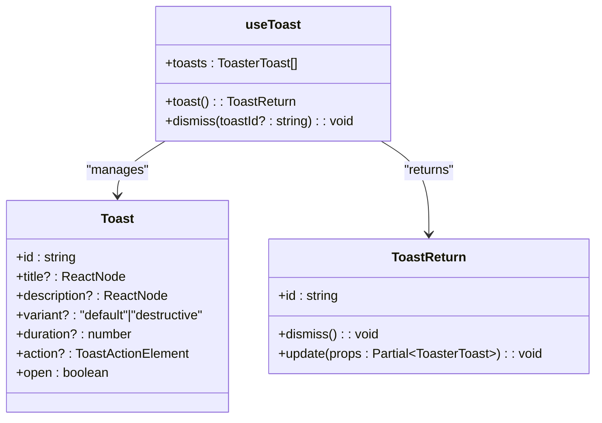
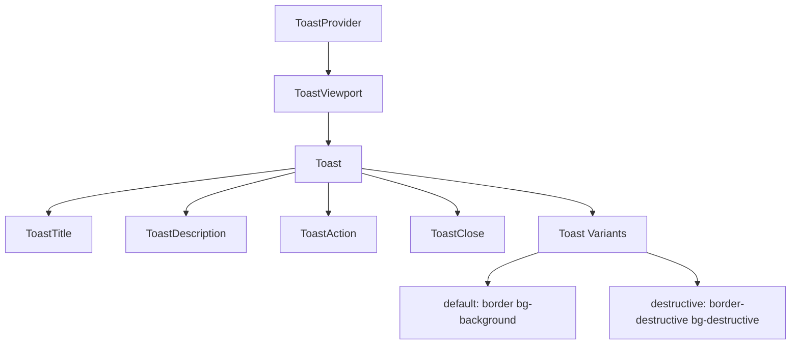
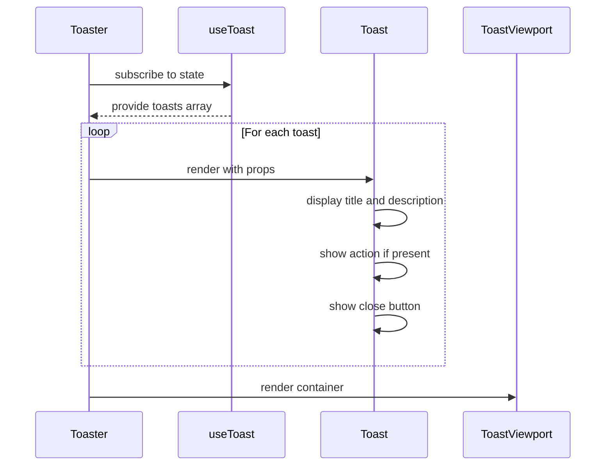
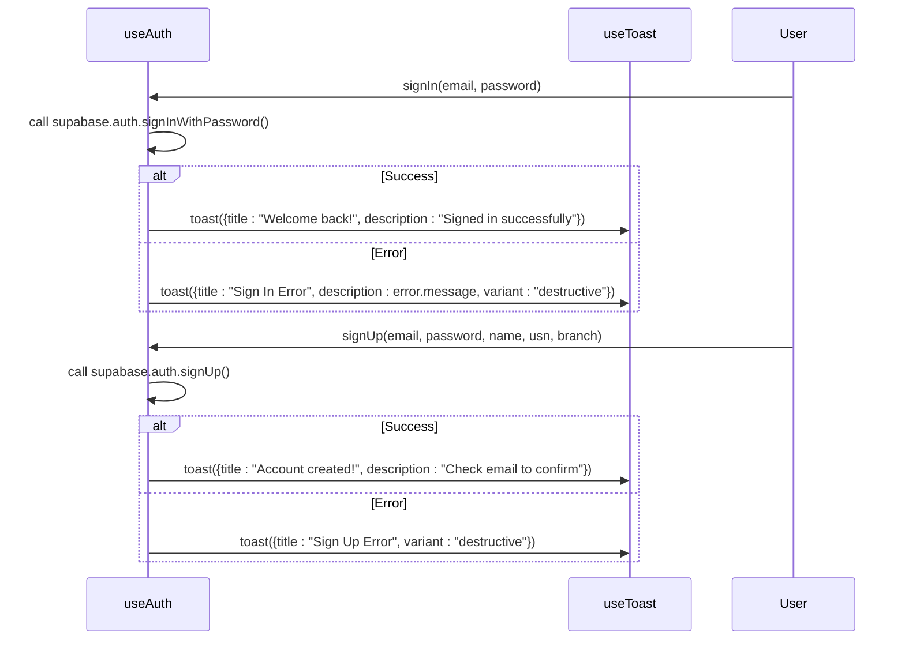

# Toast Management

<cite>
**Referenced Files in This Document**   
- [use-toast.ts](file://src/hooks/use-toast.ts)
- [toast.tsx](file://src/components/ui/toast.tsx)
- [toaster.tsx](file://src/components/ui/toaster.tsx)
- [useAuth.tsx](file://src/hooks/useAuth.tsx)
- [sonner.tsx](file://src/components/ui/sonner.tsx)
</cite>

## Table of Contents
1. [Introduction](#introduction)
2. [Core Components](#core-components)
3. [Architecture Overview](#architecture-overview)
4. [Detailed Component Analysis](#detailed-component-analysis)
5. [Integration with Authentication Flows](#integration-with-authentication-flows)
6. [Accessibility and User Experience](#accessibility-and-user-experience)
7. [Best Practices and Usage Guidelines](#best-practices-and-usage-guidelines)
8. [Conclusion](#conclusion)

## Introduction
The toast notification system in campus-connect provides a consistent, accessible, and user-friendly way to deliver transient feedback across the application. Built on top of the Sonner library and integrated with Radix UI primitives, the system abstracts low-level toast management into a declarative API through the `use-toast` hook. This document details how the system works, how it integrates with key application flows like authentication, and how it ensures accessibility and visual consistency with the ShadCN UI design system.

## Core Components

The toast system is composed of several key components that work together to manage and render notifications:

- `use-toast.ts`: Custom React hook that manages toast state and provides the `toast()` function
- `toast.tsx`: UI primitives for individual toast elements (title, description, close button, etc.)
- `toaster.tsx`: Renders active toasts by subscribing to the global toast state
- `sonner.tsx`: Configures the underlying Sonner toast library with theme-aware styling

These components form a layered architecture where the hook handles logic, the UI components handle presentation, and the Sonner integration manages cross-cutting concerns like theming.

**Section sources**
- [use-toast.ts](file://src/hooks/use-toast.ts#L1-L186)
- [toast.tsx](file://src/components/ui/toast.tsx#L1-L111)
- [toaster.tsx](file://src/components/ui/toaster.tsx#L1-L24)

## Architecture Overview

```mermaid
graph TB
A[useToast Hook] --> B[Toast State Management]
B --> C[Toast Reducer]
C --> D[ADD/UPDATE/DISMISS Actions]
A --> E[toast() Function]
E --> F[Generate Toast ID]
E --> G[Dispatch ADD_TOAST]
H[Toaster Component] --> I[Subscribe to State]
I --> J[Render Toasts]
J --> K[Toast UI Components]
K --> L[Title, Description, Close]
M[useAuth] --> N[Call toast()]
N --> E
O[sonner.tsx] --> P[Theme Integration]
P --> Q[Dark/Light Mode Support]
```

**Diagram sources**
- [use-toast.ts](file://src/hooks/use-toast.ts#L1-L186)
- [toaster.tsx](file://src/components/ui/toaster.tsx#L1-L24)
- [sonner.tsx](file://src/components/ui/sonner.tsx#L1-L27)

## Detailed Component Analysis

### use-toast Hook Implementation

The `use-toast` hook provides a centralized state management system for toast notifications using a reducer pattern. It maintains an in-memory state of active toasts and dispatches actions to add, update, dismiss, or remove them.



**Diagram sources**
- [use-toast.ts](file://src/hooks/use-toast.ts#L104-L185)

**Section sources**
- [use-toast.ts](file://src/hooks/use-toast.ts#L1-L186)

### Toast UI Components Structure

The toast UI components are built using Radix UI's `@radix-ui/react-toast` primitives, ensuring accessibility and proper behavior out of the box. The system uses `class-variance-authority` (cva) to define consistent styling variants.



**Diagram sources**
- [toast.tsx](file://src/components/ui/toast.tsx#L1-L111)

**Section sources**
- [toast.tsx](file://src/components/ui/toast.tsx#L1-L111)

### Toaster Component Rendering Logic

The `Toaster` component subscribes to the global toast state and renders all active toasts. It maps over the `toasts` array from `useToast()` and creates properly structured toast elements with title, description, action, and close button.



**Diagram sources**
- [toaster.tsx](file://src/components/ui/toaster.tsx#L1-L24)

**Section sources**
- [toaster.tsx](file://src/components/ui/toaster.tsx#L1-L24)

## Integration with Authentication Flows

The toast system is tightly integrated with the authentication system through the `useAuth` hook. Whenever sign-in, sign-up, or sign-out operations occur, appropriate toast notifications are triggered to provide user feedback.

### Authentication Success and Error States



**Diagram sources**
- [useAuth.tsx](file://src/hooks/useAuth.tsx#L129-L185)

**Section sources**
- [useAuth.tsx](file://src/hooks/useAuth.tsx#L1-L215)

### Toast Options Structure

The toast system accepts the following options when creating notifications:

<table>
  <tr>
    <th>Property</th>
    <th>Type</th>
    <th>Description</th>
    <th>Default</th>
  </tr>
  <tr>
    <td>title</td>
    <td>ReactNode</td>
    <td>Main heading of the toast notification</td>
    <td>undefined</td>
  </tr>
  <tr>
    <td>description</td>
    <td>ReactNode</td>
    <td>Detailed message explaining the event</td>
    <td>undefined</td>
  </tr>
  <tr>
    <td>variant</td>
    <td>"default" | "destructive"</td>
    <td>Visual style indicating success or error state</td>
    <td>"default"</td>
  </tr>
  <tr>
    <td>duration</td>
    <td>number</td>
    <td>Time in milliseconds before auto-dismissal</td>
    <td>5000</td>
  </tr>
  <tr>
    <td>action</td>
    <td>ToastActionElement</td>
    <td>Interactive button for user response</td>
    <td>undefined</td>
  </tr>
</table>

These options are passed directly from authentication flows to provide contextual feedback to users during sign-in and sign-up processes.

## Accessibility and User Experience

The toast system prioritizes accessibility through several key features:

- **ARIA Live Regions**: Toasts are announced by screen readers using appropriate ARIA roles and live region attributes from Radix UI
- **Keyboard Navigation**: Users can navigate and dismiss toasts using keyboard controls
- **Auto-dismiss Behavior**: Toasts automatically disappear after a set duration, but can be manually dismissed
- **Focus Management**: Proper focus handling ensures users are not trapped when toasts appear
- **Color Contrast**: Variants maintain sufficient contrast ratios for readability

The system also handles edge cases like toast stacking (limited to one toast at a time via `TOAST_LIMIT = 1`) and positioning (bottom-right on desktop, top on mobile) to ensure notifications are visible without obstructing critical UI elements.

**Section sources**
- [toast.tsx](file://src/components/ui/toast.tsx#L1-L111)
- [use-toast.ts](file://src/hooks/use-toast.ts#L1-L186)

## Best Practices and Usage Guidelines

### Appropriate Use of Toast Variants

| Variant | Use Case | Example |
|--------|--------|--------|
| default | Success operations, informational messages | "Welcome back!", "Account created!" |
| destructive | Errors, warnings, failed operations | "Sign In Error", "Network connection lost" |

### Implementation Best Practices

- **Be Specific**: Toast messages should clearly describe what happened
- **Be Timely**: Show notifications immediately after the relevant action
- **Be Concise**: Keep messages short and to the point
- **Provide Value**: Ensure the toast provides useful information the user needs
- **Don't Overwhelm**: Limit toast frequency to avoid notification fatigue

The system maintains theming consistency with the rest of the ShadCN UI components through CSS variables and class naming conventions. Toasts automatically adapt to the current theme (light/dark mode) via the `useTheme` hook in `sonner.tsx`, ensuring visual harmony across the application.

**Section sources**
- [sonner.tsx](file://src/components/ui/sonner.tsx#L1-L27)
- [use-toast.ts](file://src/hooks/use-toast.ts#L1-L186)

## Conclusion

The toast notification system in campus-connect provides a robust, accessible, and visually consistent way to deliver user feedback across the application. By abstracting the Sonner library behind a custom `use-toast` hook, the system offers a simple declarative API while maintaining flexibility for customization. Its tight integration with authentication flows ensures users receive immediate feedback during critical operations like sign-in and sign-up. The combination of Radix UI primitives, ShadCN styling, and thoughtful state management creates a notification experience that is both functional and user-friendly.