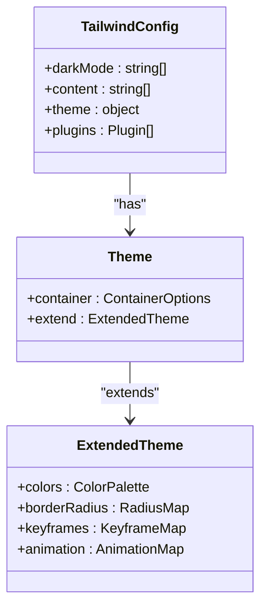
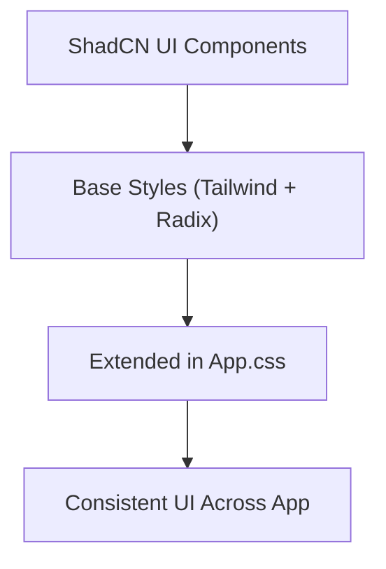
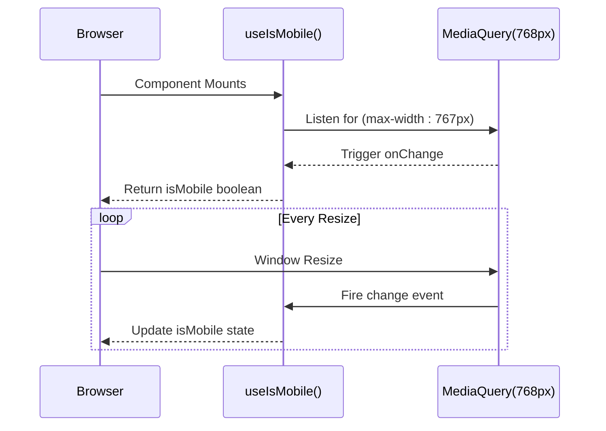

# Styling Strategy

<cite>
**Referenced Files in This Document**   
- [tailwind.config.ts](file://tailwind.config.ts)
- [src/App.css](file://src/App.css)
- [src/hooks/use-mobile.tsx](file://src/hooks/use-mobile.tsx)
- [src/components/ui/button.tsx](file://src/components/ui/button.tsx)
- [src/components/ui/card.tsx](file://src/components/ui/card.tsx)
- [src/components/ui/form.tsx](file://src/components/ui/form.tsx)
- [src/components/ui/table.tsx](file://src/components/ui/table.tsx)
- [components.json](file://components.json)
</cite>

## Table of Contents
1. [Introduction](#introduction)
2. [Utility-First Approach with Tailwind CSS](#utility-first-approach-with-tailwind-css)
3. [Tailwind Configuration and Custom Themes](#tailwind-configuration-and-custom-themes)
4. [ShadCN UI Integration and Style Extension](#shadcn-ui-integration-and-style-extension)
5. [Responsive Design Implementation](#responsive-design-implementation)
6. [Guidelines for Adding New Styles](#guidelines-for-adding-new-styles)
7. [Creating Consistent UI Patterns](#creating-consistent-ui-patterns)
8. [Common Styling Tasks Examples](#common-styling-tasks-examples)
9. [Conclusion](#conclusion)

## Introduction
The campus-connect application employs a modern, scalable styling strategy centered around Tailwind CSS's utility-first methodology, enhanced by ShadCN UI components. This document details the implementation, configuration, and best practices for maintaining a consistent and responsive design system across the application.

**Section sources**
- [tailwind.config.ts](file://tailwind.config.ts)
- [components.json](file://components.json)

## Utility-First Approach with Tailwind CSS
The project leverages Tailwind CSS’s utility-first philosophy, enabling developers to build custom designs directly in markup using atomic classes. This approach eliminates the need for writing custom CSS for most UI elements, promoting consistency and reducing CSS bloat. Utilities are used extensively across components for spacing, typography, colors, and layout, ensuring a maintainable and scalable styling system.

**Section sources**
- [tailwind.config.ts](file://tailwind.config.ts)
- [src/components/ui/button.tsx](file://src/components/ui/button.tsx)

## Tailwind Configuration and Custom Themes
Tailwind is configured through `tailwind.config.ts`, which extends the default theme with custom color variables, border radii, animations, and container settings. The configuration uses CSS variables (e.g., `hsl(var(--primary))`) to support dynamic theming, including dark mode via the `darkMode: ["class"]` setting. Custom keyframes for accordion animations and extended breakpoints (e.g., "2xl") are defined to support complex UI interactions and responsive layouts.



**Diagram sources**
- [tailwind.config.ts](file://tailwind.config.ts#L1-L91)

**Section sources**
- [tailwind.config.ts](file://tailwind.config.ts#L1-L91)

## ShadCN UI Integration and Style Extension
The application integrates ShadCN UI components, which are built on top of Radix UI and Tailwind CSS. These components are located in `src/components/ui/` and provide accessible, reusable UI elements such as buttons, cards, forms, and tables. Base styles from ShadCN are extended or overridden in `App.css` when necessary. For example, the `.card` class in `App.css` adds consistent padding across all card components, ensuring uniform spacing.



**Diagram sources**
- [src/App.css](file://src/App.css#L1-L42)
- [src/components/ui/card.tsx](file://src/components/ui/card.tsx#L1-L43)

**Section sources**
- [src/App.css](file://src/App.css#L1-L42)
- [src/components/ui/button.tsx](file://src/components/ui/button.tsx#L1-L47)
- [src/components/ui/card.tsx](file://src/components/ui/card.tsx#L1-L43)
- [src/components/ui/form.tsx](file://src/components/ui/form.tsx#L1-L129)
- [src/components/ui/table.tsx](file://src/components/ui/table.tsx#L1-L72)

## Responsive Design Implementation
The application follows mobile-first responsive design principles. A custom `useIsMobile` hook in `src/hooks/use-mobile.tsx` detects screen size using `window.matchMedia` with a breakpoint of 768px. This hook returns a boolean indicating whether the current viewport is mobile-sized, enabling conditional rendering and layout adjustments in React components.



**Diagram sources**
- [src/hooks/use-mobile.tsx](file://src/hooks/use-mobile.tsx#L1-L19)

**Section sources**
- [src/hooks/use-mobile.tsx](file://src/hooks/use-mobile.tsx#L1-L19)

## Guidelines for Adding New Styles
When adding new styles:
1. Prefer Tailwind utility classes over custom CSS.
2. For component-specific styles, extend ShadCN base components using `cn()` utility from `@/lib/utils`.
3. Avoid global CSS unless necessary for layout or theming.
4. Use CSS variables defined in `:root` for theming consistency.
5. Ensure responsive behavior by testing on mobile and desktop breakpoints.

**Section sources**
- [tailwind.config.ts](file://tailwind.config.ts#L1-L91)
- [src/App.css](file://src/App.css#L1-L42)

## Creating Consistent UI Patterns
To maintain design system coherence:
- Use ShadCN components as the foundation for all UI elements.
- Apply consistent spacing using Tailwind’s `p-`, `m-`, and `gap-` utilities.
- Leverage the `buttonVariants` pattern from `button.tsx` for variant-based styling in custom components.
- Use `Form`, `FormItem`, `FormLabel`, and `FormControl` for uniform form layouts.
- Apply `Table`, `TableHeader`, `TableRow`, and `TableCell` for standardized data presentation.

```mermaid
classDiagram
class ButtonVariants {
+default : string
+destructive : string
+outline : string
+secondary : string
+ghost : string
+link : string
+size variants
}
class FormComponents {
+FormItem : div
+FormLabel : label
+FormControl : Slot
+FormDescription : p
+FormMessage : p
}
class TableComponents {
+Table : table
+TableHeader : thead
+TableBody : tbody
+TableRow : tr
+TableHead : th
+TableCell : td
}
ButtonVariants --> "variants" : defines
FormComponents --> "composition" : creates
TableComponents --> "composition" : creates
```

**Diagram sources**
- [src/components/ui/button.tsx](file://src/components/ui/button.tsx#L1-L47)
- [src/components/ui/form.tsx](file://src/components/ui/form.tsx#L1-L129)
- [src/components/ui/table.tsx](file://src/components/ui/table.tsx#L1-L72)

**Section sources**
- [src/components/ui/button.tsx](file://src/components/ui/button.tsx#L1-L47)
- [src/components/ui/form.tsx](file://src/components/ui/form.tsx#L1-L129)
- [src/components/ui/table.tsx](file://src/components/ui/table.tsx#L1-L72)

## Common Styling Tasks Examples
### Creating Forms
Use the `Form`, `FormItem`, `FormLabel`, and `FormControl` components to build accessible, consistently styled forms. These components handle error states, labeling, and layout automatically.

### Creating Cards
Use the `Card`, `CardHeader`, `CardTitle`, `CardDescription`, and `CardContent` components to build structured content containers. Custom padding is applied globally via `App.css`.

### Creating Data Tables
Use the `Table`, `TableHeader`, `TableRow`, `TableHead`, and `TableCell` components to display tabular data with consistent styling, hover states, and responsive behavior.

**Section sources**
- [src/components/ui/form.tsx](file://src/components/ui/form.tsx#L1-L129)
- [src/components/ui/card.tsx](file://src/components/ui/card.tsx#L1-L43)
- [src/components/ui/table.tsx](file://src/components/ui/table.tsx#L1-L72)
- [src/App.css](file://src/App.css#L1-L42)

## Conclusion
The styling strategy in campus-connect combines the flexibility of Tailwind CSS with the robustness of ShadCN UI components, enabling rapid development of consistent, responsive, and accessible user interfaces. By adhering to utility-first principles, leveraging theme customization, and following established patterns, developers can maintain a cohesive design system across the entire application.