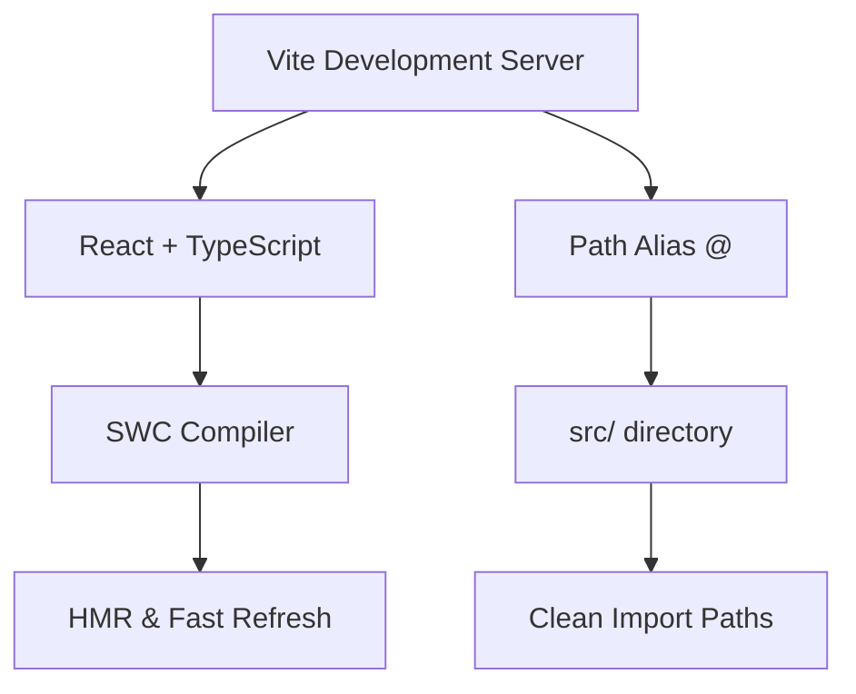
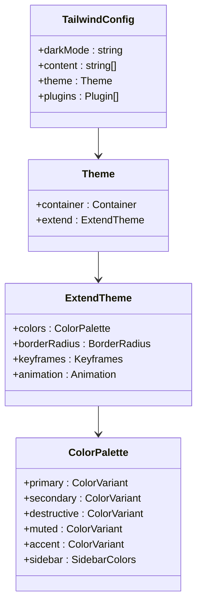
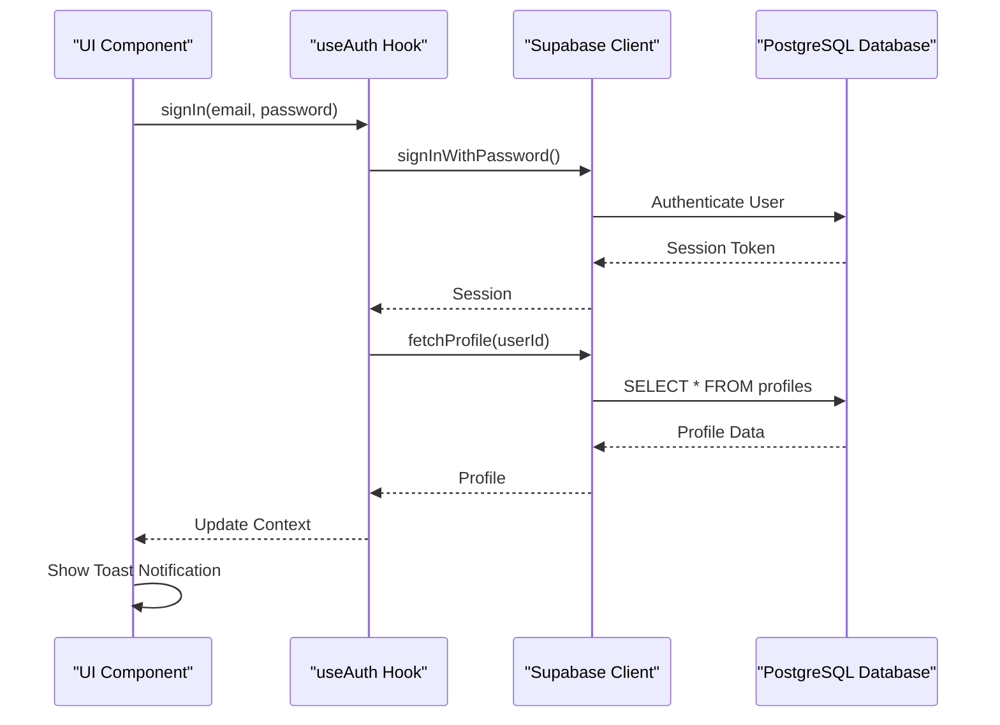
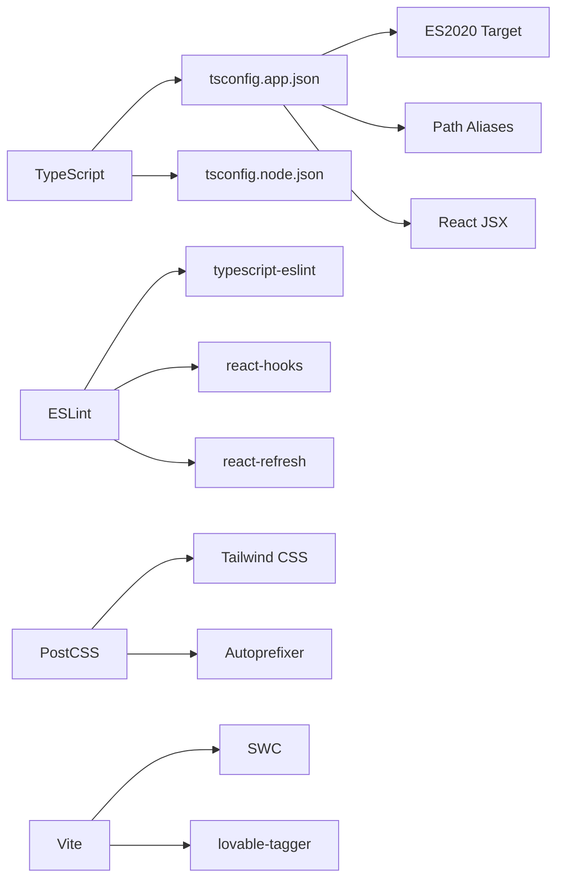

# Technology Stack & Dependencies

<cite>
**Referenced Files in This Document**  
- [package.json](file://package.json)
- [vite.config.ts](file://vite.config.ts)
- [tailwind.config.ts](file://tailwind.config.ts)
- [client.ts](file://src/integrations/supabase/client.ts)
- [useAuth.tsx](file://src/hooks/useAuth.tsx)
- [tsconfig.json](file://tsconfig.json)
- [tsconfig.app.json](file://tsconfig.app.json)
- [postcss.config.js](file://postcss.config.js)
- [eslint.config.js](file://eslint.config.js)
</cite>

## Table of Contents
1. [Frontend Framework & Build Tooling](#frontend-framework--build-tooling)
2. [UI & Styling Architecture](#ui--styling-architecture)
3. [Backend Integration & Data Management](#backend-integration--data-management)
4. [Development Tooling & Configuration](#development-tooling--configuration)
5. [Technology Rationale & Integration Patterns](#technology-rationale--integration-patterns)

## Frontend Framework & Build Tooling

The campus-connect application is built on a modern React 18 foundation with TypeScript for type safety and enhanced developer experience. React enables component-based UI development, while TypeScript provides compile-time error checking and improved code maintainability. The application leverages Vite as its build tool, offering fast development server startup, instant hot module replacement (HMR), and optimized production builds.

Vite is configured to support React with SWC (Speedy Web Compiler) for faster transpilation, eliminating the need for Babel. The configuration includes a path alias `@` pointing to the `src` directory, enabling cleaner import statements across the codebase. The development server runs on port 8080 and listens on all network interfaces (`::`), facilitating local network access during development.

**Diagram sources**  
- [vite.config.ts](file://vite.config.ts#L1-L18)

**Section sources**  
- [vite.config.ts](file://vite.config.ts#L1-L18)
- [package.json](file://package.json#L1-L84)

## UI & Styling Architecture

The UI architecture combines Tailwind CSS with ShadCN UI to deliver a consistent, accessible, and customizable user interface. Tailwind CSS provides a utility-first approach to styling, enabling rapid UI development with low-level utility classes that can be composed to build complex designs. The configuration supports dark mode via CSS variables and includes responsive container constraints up to 1400px.

ShadCN UI is implemented through Radix UI primitives, offering accessible, unstyled components that are enhanced with Tailwind classes. This combination ensures full control over styling while maintaining accessibility standards. The component library includes form controls, dialogs, navigation menus, data tables, and toast notifications, all built with React and TypeScript.

The `tailwind.config.ts` file extends the default theme with semantic color variables (e.g., `primary`, `secondary`, `destructive`) that map to CSS custom properties, enabling dynamic theme switching. Animation utilities are provided by `tailwindcss-animate`, which defines keyframes and animation classes for accordions and other animated components.

**Diagram sources**  
- [tailwind.config.ts](file://tailwind.config.ts#L1-L91)

**Section sources**  
- [tailwind.config.ts](file://tailwind.config.ts#L1-L91)
- [package.json](file://package.json#L1-L84)
- [src/components/ui](file://src/components/ui)

## Backend Integration & Data Management

Supabase serves as the backend-as-a-service platform, providing authentication, PostgreSQL database access, and real-time capabilities. The Supabase client is initialized with a publishable key and URL, configured to persist sessions in localStorage with automatic token refresh. Type safety is ensured through generated TypeScript types that reflect the database schema.

Authentication is managed through a custom `useAuth` hook that provides a React context for user session state, profile data, and authentication methods (sign in, sign up, sign out). The hook listens to Supabase auth state changes and automatically fetches the user's profile from the `profiles` table upon login. Toast notifications are integrated to provide user feedback during authentication flows.

Data fetching and caching are handled by `@tanstack/react-query`, which optimizes API calls by caching results, managing loading states, and enabling background refetching. This reduces redundant network requests and improves perceived performance. The integration with Supabase allows for efficient querying of database tables with automatic type inference from the generated types.

**Diagram sources**  
- [client.ts](file://src/integrations/supabase/client.ts#L1-L16)
- [useAuth.tsx](file://src/hooks/useAuth.tsx#L1-L197)

**Section sources**  
- [client.ts](file://src/integrations/supabase/client.ts#L1-L16)
- [useAuth.tsx](file://src/hooks/useAuth.tsx#L1-L197)
- [package.json](file://package.json#L1-L84)

## Development Tooling & Configuration

The development environment is enhanced with a comprehensive set of tools for code quality, styling, and type checking. ESLint is configured with TypeScript ESLint, React Hooks rules, and custom overrides to support modern React patterns. The configuration disables `@typescript-eslint/no-unused-vars` to accommodate React component exports while enforcing best practices for hooks usage.

TypeScript is configured with two separate configuration files: `tsconfig.app.json` for application code and `tsconfig.node.json` for build scripts. The application configuration targets ES2020, enables modern module resolution, and includes path mapping for the `@/*` alias. PostCSS is used to process Tailwind CSS with Autoprefixer, ensuring cross-browser compatibility for CSS properties.

The development dependencies include `@types` packages for React, React DOM, and Node.js, providing type definitions for better IDE support and compile-time checking. The `lovable-tagger` plugin is used in development mode to enhance component debugging by adding display names to functional components.

**Diagram sources**  
- [tsconfig.json](file://tsconfig.json#L1-L16)
- [tsconfig.app.json](file://tsconfig.app.json#L1-L30)
- [eslint.config.js](file://eslint.config.js#L1-L26)
- [postcss.config.js](file://postcss.config.js#L1-L6)

**Section sources**  
- [tsconfig.json](file://tsconfig.json#L1-L16)
- [tsconfig.app.json](file://tsconfig.app.json#L1-L30)
- [eslint.config.js](file://eslint.config.js#L1-L26)
- [postcss.config.js](file://postcss.config.js#L1-L6)
- [package.json](file://package.json#L1-L84)

## Technology Rationale & Integration Patterns

The technology stack was selected to balance developer productivity, performance, and maintainability. React with TypeScript provides a robust foundation for building complex UIs with type safety. Vite offers superior build performance compared to traditional bundlers like Webpack, reducing development iteration time.

Tailwind CSS enables rapid UI development without leaving the markup, while ShadCN UI provides accessible, customizable components that avoid the "framework look" of traditional component libraries. The combination allows for consistent design system implementation across the application.

Supabase was chosen over Firebase for its PostgreSQL backend, which provides relational data modeling capabilities essential for the application's club, event, and user relationship requirements. The real-time capabilities and authentication integration reduce backend development overhead.

The integration pattern follows a clean separation of concerns: Vite handles build and development server concerns, React manages UI rendering, Tailwind handles styling, Supabase manages data and authentication, and React Query manages client-state synchronization. This modular approach enables independent upgrades and maintenance of each technology component.

**Section sources**  
- [package.json](file://package.json#L1-L84)
- [vite.config.ts](file://vite.config.ts#L1-L18)
- [tailwind.config.ts](file://tailwind.config.ts#L1-L91)
- [client.ts](file://src/integrations/supabase/client.ts#L1-L16)
- [useAuth.tsx](file://src/hooks/useAuth.tsx#L1-L197)