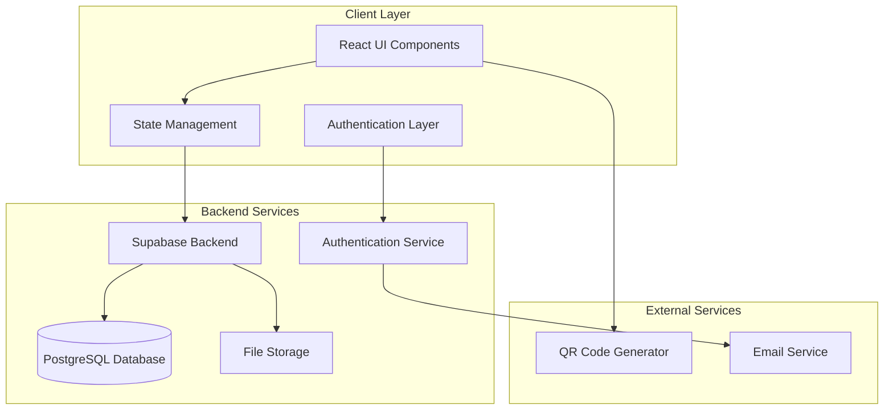
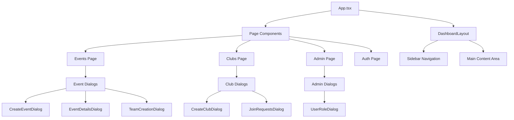
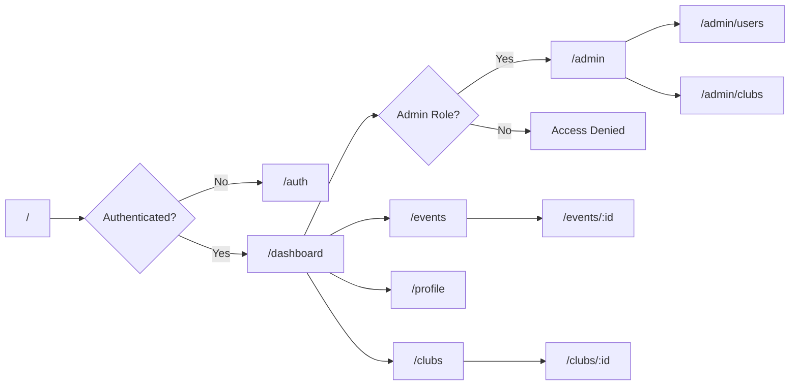
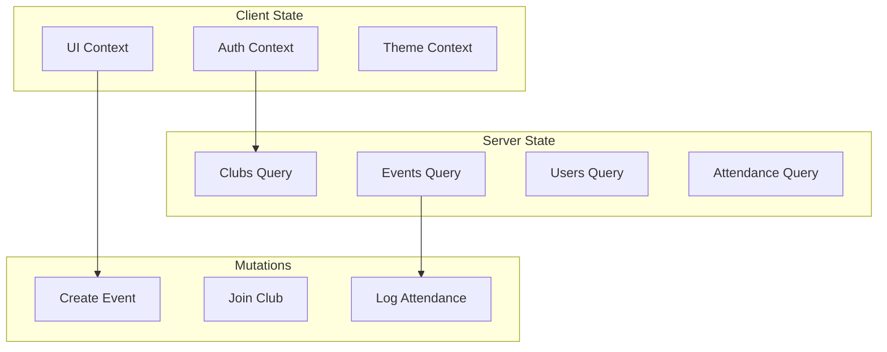
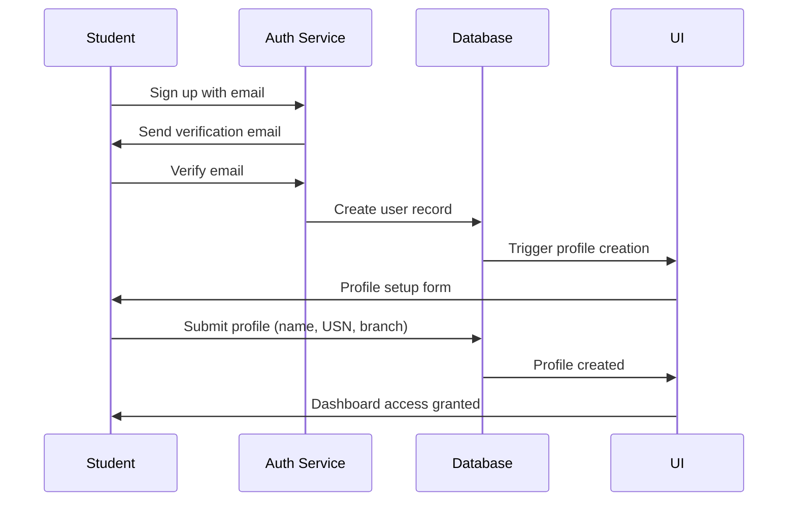
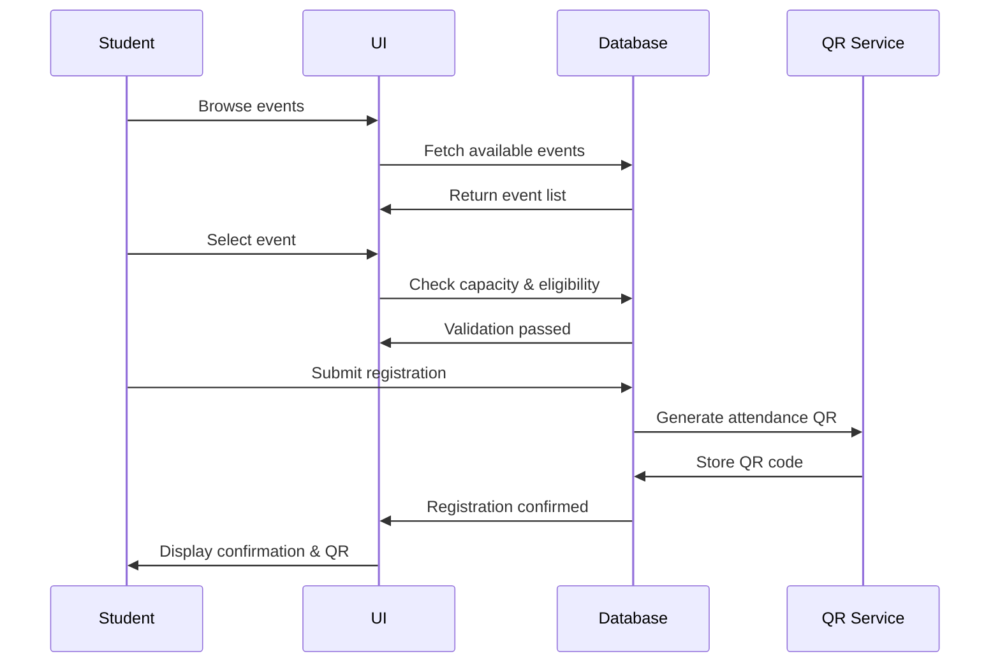
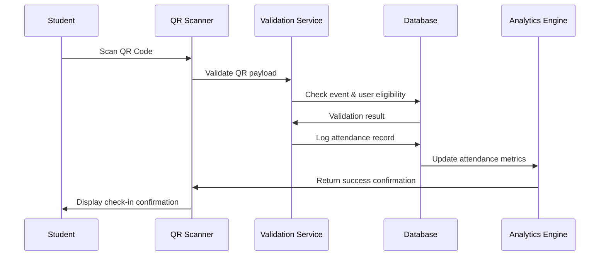
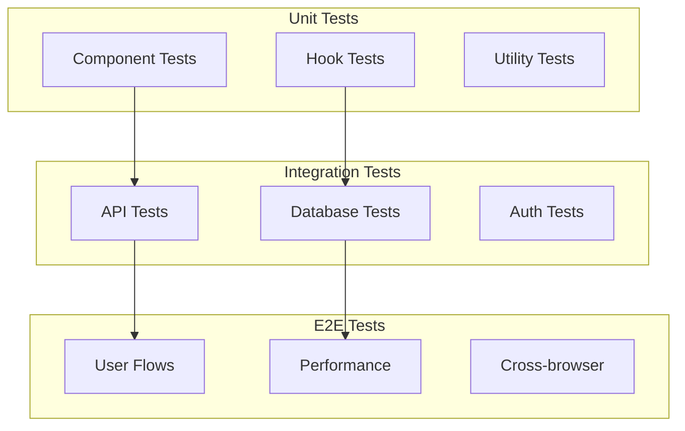

# College Event Check-in and Attendance Management System

## Overview

The College Event Check-in and Attendance Management System is a comprehensive web application designed to streamline event management, student participation, and attendance tracking within a college environment. The system facilitates seamless interaction between students, club administrators, and college administrators through role-based access control and automated QR code-based attendance logging.

### System Objectives
- **Centralized Event Management**: Enable clubs to create, manage, and track events with detailed analytics
- **Automated Attendance Tracking**: Implement QR code-based check-in system for accurate attendance logging
- **Role-based Access Control**: Provide differentiated interfaces for students, club admins, and college admins
- **Team Management**: Support both individual and team-based event participation
- **Administrative Oversight**: Enable college administrators to oversee all clubs, events, and user activities

## Technology Stack & Dependencies

### Frontend Framework
- **React 18.3.1** with TypeScript 5.8.3
- **Vite 5.4.19** for build tooling and development server
- **React Router DOM 6.30.1** for client-side routing

### UI Framework & Styling
- **shadcn/ui** components built on Radix UI primitives
- **Tailwind CSS 3.4.17** for utility-first styling
- **Lucide React** for consistent iconography
- **Tailwind CSS Animate** for smooth transitions

### Backend Integration
- **Supabase** for authentication, database, and real-time features
- **@supabase/supabase-js 2.57.2** client library

### State Management & Forms
- **@tanstack/react-query 5.83.0** for server state management
- **React Hook Form 7.61.1** with **Zod 3.25.76** for form validation
- **@hookform/resolvers** for validation integration

### Additional Libraries
- **date-fns 3.6.0** for date manipulation
- **Sonner** for toast notifications
- **class-variance-authority** and **clsx** for conditional styling

## Architecture

### System Architecture Pattern
The application follows a **Frontend-centric Single Page Application (SPA)** architecture with serverless backend integration through Supabase. This design ensures rapid development, scalability, and reduced operational overhead.



### Component Architecture

The application is structured using a **hierarchical component architecture** with clear separation of concerns:



### Data Models & ORM Mapping

The system utilizes PostgreSQL with Supabase's auto-generated TypeScript types for type-safe database operations.

#### Core Entities

**User Profile Management**
```typescript
interface Profile {
  user_id: string;          // UUID, references auth.users
  name: string;             // Full name
  usn: string;              // University Serial Number (unique)
  branch: string;           // Academic branch/department
  role: 'student' | 'club_admin' | 'college_admin';
  created_at: timestamp;
  updated_at: timestamp;
}
```

**Club Management**
```typescript
interface Club {
  id: string;               // UUID primary key
  name: string;             // Unique club name
  description: string;      // Club description
  approved: boolean;        // Approval status (default: false)
  created_by: string;       // References profiles.user_id
  created_at: timestamp;
  updated_at: timestamp;
}

interface ClubMember {
  id: string;               // UUID primary key
  club_id: string;          // References clubs.id
  profile_id: string;       // References profiles.user_id
  role: 'member' | 'admin'; // Club-level role
  joined_at: timestamp;
}
```

**Event Management**
```typescript
interface Event {
  id: string;               // UUID primary key
  club_id: string;          // References clubs.id
  title: string;            // Event title
  description: string;      // Event description
  location: string;         // Event venue
  start_time: timestamp;    // Event start time
  end_time: timestamp;      // Event end time
  capacity: number;         // Maximum participants
  is_team_event: boolean;   // Individual vs team event
  qr_code: string;          // Unique QR code for attendance
  created_at: timestamp;
  updated_at: timestamp;
}
```

**Team Management**
```typescript
interface Team {
  id: string;               // UUID primary key
  event_id: string;         // References events.id
  name: string;             // Team name (unique per event)
  leader_id: string;        // References profiles.user_id
  created_at: timestamp;
}

interface TeamMember {
  id: string;               // UUID primary key
  team_id: string;          // References teams.id
  profile_id: string;       // References profiles.user_id
  joined_at: timestamp;
}
```

**Registration & Attendance**
```typescript
interface Registration {
  id: string;               // UUID primary key
  event_id: string;         // References events.id
  profile_id: string;       // References profiles.user_id
  team_id?: string;         // Optional team reference
  registered_at: timestamp;
}

interface AttendanceLog {
  id: string;               // UUID primary key
  event_id: string;         // References events.id
  profile_id: string;       // References profiles.user_id
  method: 'self-scan' | 'staff-scan' | 'manual';
  timestamp: timestamp;
}
```

### Business Logic Layer

The business logic is organized into domain-specific modules with clear responsibilities:

#### Authentication & Authorization Module
- **User Registration Flow**: Email verification → Profile creation → Branch selection
- **Role Assignment**: Automatic student role assignment with admin upgrade capability
- **Session Management**: JWT token handling through Supabase Auth
- **Route Protection**: Role-based access control for sensitive operations

#### Club Management Module
- **Club Creation Workflow**: Student request → Admin approval → Activation
- **Membership Management**: Join requests → Admin review → Member addition
- **Role Elevation**: Member → Club Admin promotion by college administrators
- **Activity Tracking**: Event count, member count, and engagement metrics

#### Event Management Module
- **Event Lifecycle**: Creation → Registration → Execution → Attendance Tracking → Analytics
- **Capacity Management**: Real-time availability tracking with registration limits
- **QR Code Generation**: Unique code generation for each event with security validation
- **Registration Types**: Individual registration vs team-based registration with different workflows

#### Team Management Module
- **Team Formation**: Leader creation → Member invitation → Registration confirmation
- **Team Validation**: Size limits, member eligibility, and duplicate prevention
- **Cross-team Communication**: Team directory and collaboration features

#### Attendance Management Module
- **Check-in Methods**: Self-scan (student), staff-scan (organizer), manual entry (admin)
- **Validation Logic**: QR code verification, time window validation, duplicate prevention
- **Analytics Engine**: Attendance rates, engagement patterns, and reporting

## Routing & Navigation

The application implements a **role-based routing system** with protected routes and dynamic navigation:



### Route Protection Strategy
- **Public Routes**: Landing page, authentication
- **Protected Routes**: All dashboard routes require authentication
- **Role-restricted Routes**: Admin panel restricted to college_admin role
- **Dynamic Navigation**: Menu items adjust based on user role and permissions

## State Management

The application employs a **hybrid state management approach** combining React Query for server state and React Context for client state:

### Server State Management (React Query)
- **Data Fetching**: Automatic caching, background updates, and error handling
- **Mutations**: Optimistic updates for user actions with rollback capability
- **Real-time Sync**: Integration with Supabase real-time subscriptions
- **Cache Invalidation**: Smart invalidation based on data relationships

### Client State Management (React Context)
- **Authentication State**: User session, profile data, and permission flags
- **UI State**: Modal visibility, form state, and navigation context
- **Theme State**: Dark/light mode preferences and accessibility settings

### State Architecture


## API Integration Layer

The system integrates with Supabase through a **type-safe API client** with automatic query generation:

### Database Operations
- **CRUD Operations**: Type-safe database operations with automatic validation
- **Relationship Queries**: Join operations with nested data fetching
- **Real-time Subscriptions**: Live updates for collaborative features
- **Row Level Security**: Automatic permission enforcement at the database level

### Authentication Integration
- **Social Login**: Email/password authentication with optional OAuth providers
- **Session Management**: Automatic token refresh and session persistence
- **Password Recovery**: Secure password reset workflow
- **Profile Sync**: Automatic profile creation on first login

### File Storage Integration
- **QR Code Storage**: Generated QR codes stored in Supabase Storage
- **Profile Images**: Optional user avatar upload and management
- **Event Media**: Event photos and documents storage

## User Interface Architecture

### Design System Implementation
The UI follows a **consistent design system** built on shadcn/ui components:

#### Component Hierarchy
- **Atomic Components**: Button, Input, Badge, Avatar
- **Molecular Components**: Card, Dialog, Form, Table
- **Organism Components**: EventCard, ClubCard, UserRoleDialog
- **Template Components**: DashboardLayout, AuthLayout
- **Page Components**: Events, Clubs, Admin, Profile

#### Responsive Design Strategy
- **Mobile-First Approach**: Progressive enhancement for larger screens
- **Breakpoint System**: Tailwind CSS responsive utilities
- **Touch-Friendly**: Appropriate touch targets and gesture support
- **Accessibility**: WCAG 2.1 AA compliance with screen reader support

### User Experience Flows

#### Student Registration Flow


#### Event Registration Flow


## QR Code System Architecture

### QR Code Generation Strategy
- **Unique Identifiers**: Each event generates a unique QR code containing event ID and validation hash
- **Security Layer**: Time-based tokens to prevent QR code reuse
- **Format Specification**: JSON payload with event metadata and validation signature

### QR Code Content Structure
```json
{
  "eventId": "uuid-v4",
  "timestamp": "iso-8601-datetime",
  "hash": "sha256-validation-hash",
  "metadata": {
    "eventTitle": "string",
    "clubName": "string",
    "location": "string"
  }
}
```

### Attendance Scanning Workflow


## Security Architecture

### Authentication Security
- **Password Policy**: Minimum 8 characters with complexity requirements
- **Session Security**: HTTP-only cookies with secure flags
- **Multi-factor Authentication**: Optional TOTP-based 2FA
- **Rate Limiting**: Login attempt throttling and account lockout

### Authorization Framework
- **Role-Based Access Control**: Hierarchical permission system
- **Row Level Security**: Database-level data isolation
- **API Security**: Automatic permission validation on all operations
- **Data Encryption**: Sensitive data encrypted at rest and in transit

### QR Code Security
- **Time-based Validation**: QR codes expire after event time window
- **Hash Verification**: Cryptographic validation to prevent forgery
- **Single-use Enforcement**: Duplicate scan prevention
- **Audit Trail**: Complete logging of all attendance events

## Testing Strategy

### Unit Testing Framework
- **Test Runner**: Jest with React Testing Library
- **Component Testing**: Isolated component testing with mock dependencies
- **Hook Testing**: Custom hook testing with test utilities
- **Utility Testing**: Pure function testing with comprehensive coverage

### Integration Testing
- **API Testing**: Supabase client integration testing
- **Authentication Testing**: Auth flow testing with mock providers
- **Database Testing**: Database operation testing with test fixtures
- **Real-time Testing**: WebSocket and real-time feature testing

### End-to-End Testing
- **User Journey Testing**: Complete user workflow validation
- **Cross-browser Testing**: Multi-browser compatibility validation
- **Mobile Testing**: Responsive design and touch interaction testing
- **Performance Testing**: Load testing and performance benchmarking

### Testing Architecture


## Implementation Roadmap

### Phase 1: Core Infrastructure Enhancement
**Duration**: 2 weeks
**Deliverables**:
- Complete QR code generation and scanning system
- Enhanced attendance logging with multiple check-in methods
- Real-time attendance dashboard for event organizers
- College admin credentials configuration in environment variables

### Phase 2: Advanced Team Management
**Duration**: 1.5 weeks  
**Deliverables**:
- Team invitation system with email notifications
- Team registration workflow for events
- Team-based attendance tracking and analytics
- Cross-team communication features

### Phase 3: Analytics & Reporting
**Duration**: 1 week
**Deliverables**:
- Comprehensive attendance reports with export functionality
- Event analytics dashboard with participation insights
- Club performance metrics and engagement tracking
- Automated report generation and distribution

### Phase 4: Mobile Optimization & PWA
**Duration**: 1 week
**Deliverables**:
- Progressive Web App (PWA) implementation
- Native mobile app-like experience
- Offline QR code scanning capability
- Push notifications for event reminders

### Phase 5: Advanced Features
**Duration**: 1.5 weeks
**Deliverables**:
- Event waitlist management system
- Automated event reminders and notifications
- Advanced search and filtering capabilities
- Integration with college calendar systems

## Missing Implementation Components

Based on the current codebase analysis, the following components need to be implemented or enhanced:

### QR Code System
- **QR Code Generation Library**: Integration with qrcode.js or similar
- **QR Code Scanner Component**: Camera-based scanning with jsQR library
- **Attendance Logging API**: Enhanced backend endpoints for attendance tracking
- **Validation Service**: QR code security validation and time window checking

### College Admin Features
- **Environment Configuration**: College admin credentials setup
- **User Role Management**: Enhanced user role assignment interface
- **System Analytics**: Comprehensive dashboard with key metrics
- **Bulk Operations**: Mass user operations and data management

### Mobile Experience
- **Responsive Design**: Enhanced mobile interface optimization
- **Touch Interactions**: Improved touch-friendly components
- **Offline Support**: Service worker implementation for offline functionality
- **Native Features**: Camera access for QR scanning

### Notification System
- **Email Integration**: Event notifications and reminders
- **In-app Notifications**: Real-time notification system
- **Push Notifications**: Browser push notification support
- **Notification Preferences**: User notification control settings

### Enhanced Analytics
- **Attendance Reports**: Downloadable reports in multiple formats
- **Engagement Metrics**: User engagement tracking and analysis
- **Performance Dashboard**: Real-time system performance monitoring
- **Predictive Analytics**: Event attendance prediction algorithms